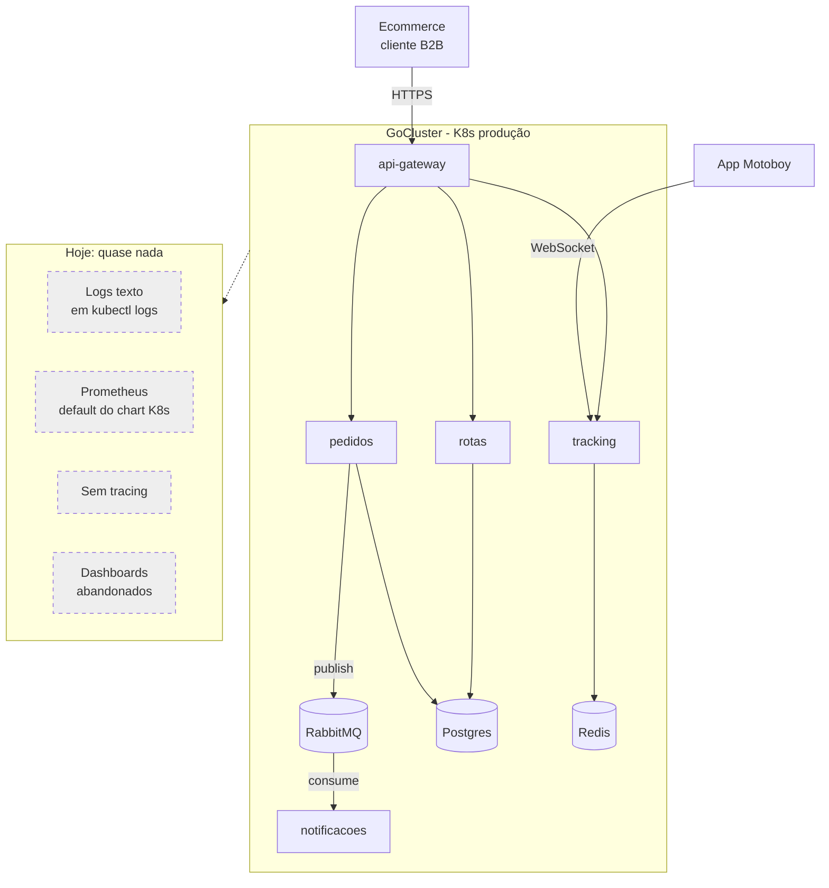

# Cenário PBL — LogisGo: um cluster verde, um negócio no escuro

> **PBL (Problem-Based Learning).** Este cenário é a linha narrativa do módulo. Você é consultor(a) de DevOps e SRE contratado(a) para uma missão específica. Os blocos teóricos e exercícios giram em torno dele.

---

## A empresa

**LogisGo** é uma startup B2B de **last-mile delivery** (entrega urbana de curta distância). Ecommerces integram a API da LogisGo para despachar pedidos; a plataforma orquestra motoboys, roteirização e rastreamento em tempo real para o consumidor final.

- **Fundada em:** 2021, em Belo Horizonte.
- **Clientes (B2B):** 180 ecommerces (nichos: moda, farmácia, alimentação).
- **Equipe:** 22 engenheiros (14 backend, 4 frontend, 4 plataforma/SRE).
- **Stack:** Python/FastAPI, Postgres 15, Redis 7, RabbitMQ, React. Rodam no cluster Kubernetes interno ("GoCluster"), provisionado no Módulo 7 (k3d em homologação, Kubernetes gerenciado em produção).

Principais serviços:

| Serviço | Responsabilidade |
|---------|------------------|
| `api-gateway` | Ponto de entrada HTTPS dos clientes B2B (autenticação, rate limit, roteamento) |
| `pedidos` | Gestão de pedidos (criação, atualização de status, webhooks) |
| `rotas` | Roteirização inteligente (algoritmo próprio) |
| `tracking` | Localização em tempo real dos entregadores |
| `notificacoes` | E-mail, SMS, push para o consumidor final |

Após o trabalho do Módulo 7, tudo está **containerizado e no cluster**, com Helm chart, HPA, PDB, Ingress e ArgoCD fazendo GitOps. O `kubectl get pods -A` vive verde. A pipeline DORA (Módulo 4) mostra **deploy frequency** ótimo — 4,2 deploys por dia.

---

## O incidente que trouxe você

Na última terça, às 14h32, o Cliente Zaffrán (uma marca de moda premium, contrato de R$ 180 mil/mês) abre chamado urgente: **"nossos pedidos estão sumindo"**. Entre 14h e 14h30, 312 pedidos foram criados pela loja, mas apenas 197 chegaram à tela de acompanhamento do consumidor final. Os outros 115 ficaram num limbo.

A equipe de plantão (três pessoas) reagiu assim:

- **14h34** – Alerta do Pingdom: "HTTP 5xx > 3%". Ignorado (já tinha disparado 40 vezes na semana).
- **14h41** – CTO vê o chamado do Zaffrán e aciona o plantão no Slack.
- **14h43** – Plantonista A roda `kubectl get pods -n logisgo-prod`. Tudo **Running**.
- **14h47** – Plantonista B faz `kubectl logs` em 17 pods diferentes, grep em arquivos de texto corrido.
- **14h58** – Acham um pod de `pedidos` com `ECONNREFUSED` para `rabbitmq`. Mas o RabbitMQ está up.
- **15h12** – Descobrem que um `NetworkPolicy` restritivo bloqueia `pedidos → rabbitmq` em um dos namespaces. A última mudança foi uma semana atrás.
- **15h20** – Aplicam hotfix no policy. Pedidos voltam a fluir. MTTR: **48 minutos**.
- **15h40** – CTO, num Slack public, pergunta: "alguém consegue me dizer quantos pedidos perdemos?". Silêncio por 11 minutos.
- **16h05** – Time entrega um número estimado **errado** para o cliente (diferente do real por 40%).

Três dias depois, o Zaffrán notifica rescisão. O CEO liga você.

---

## Os sintomas visíveis

A CTO abre uma planilha dolorosa:

| # | Sintoma | Evidência |
|---|---------|-----------|
| 1 | **MTTR alto** | Média de 90 min por incidente crítico no último trimestre |
| 2 | **Não se sabe o que está lento** | "o cliente diz que demora, mas não temos número" |
| 3 | **Logs dispersos e inconsistentes** | 3 dos 5 serviços logam JSON; os outros, texto corrido |
| 4 | **Impossível reconstruir jornada** | "cadê o pedido X?" exige ssh em 4 pods |
| 5 | **Alertas ruidosos** | 280 alertas/semana; 87% são ignorados ("fadiga de alarme") |
| 6 | **Plantão queima** | 2 pedidos de demissão no trimestre citam "PagerDuty de madrugada" |
| 7 | **SLA sem SLI** | Contratos prometem "99,5% de uptime", ninguém mede latência p95/p99 |
| 8 | **Dashboards decorativos** | 6 dashboards no Grafana antigo; ninguém olha em incidente |
| 9 | **Postmortem = caça às bruxas** | Últimos 3 incidentes terminaram em PIP para o plantonista |
| 10 | **Negócio cego** | CEO não sabe quantos pedidos/dia, quantos falham, quanto perdemos em R$ |

---

## Impacto no negócio

| Métrica | Atual | Meta em 12 semanas |
|---------|-------|--------------------|
| MTTR em incidentes P1 | 90 min | ≤ 20 min |
| MTTD (tempo até detectar) | 22 min | ≤ 3 min |
| Alertas ruidosos / semana | 280 | ≤ 25 |
| SLOs declarados e monitorados | 0 | ≥ 5 |
| Pedidos perdidos sem explicação | 115 em 1h | 0 |
| Churn atribuído a incidentes | 1 grande conta/tri | 0 |

O CEO foi claro: "**em 90 dias, se um cliente ligar reclamando, quero que a equipe saiba mais sobre o incidente do que ele**."

---

## Sua missão

Você tem 6 sprints (12 semanas) com um squad de 3 pessoas. Entregáveis esperados:

1. **Instrumentação padronizada** — toda requisição passa por serviços LogisGo deixando rastro em métricas (RED), logs estruturados com `trace_id` e spans no Tempo.
2. **Stack de observabilidade** rodando no cluster: Prometheus, Alertmanager, Grafana, Loki, Tempo — via `kube-prometheus-stack` e gráficos oficiais.
3. **SLOs formais** para as 3 jornadas críticas (criar pedido, atualizar status, buscar tracking) com SLI precisos, error budget e política de queima.
4. **Alertas SLO-based** substituindo thresholds estáticos; silêncios, inibições e agrupamentos maduros no Alertmanager.
5. **Dashboards operacionais** (não decorativos): um painel executivo, um RED por serviço, um painel de incidente (jornada do pedido).
6. **Runbooks executáveis** para os 5 alertas mais comuns, ligando alerta → ação → consulta pronta.
7. **Cultura**: blameless postmortems, rodízio on-call sustentável, retrospectiva mensal de alertas.

---

## A pergunta norteadora

> **Como transformar um cluster Kubernetes "verde" num sistema cujo comportamento é legível, mensurável e acionável — sem esmagar a equipe com alertas ruidosos nem explodir custos com cardinalidade descontrolada?**

Cada bloco deste módulo responde uma fatia dessa pergunta. Os exercícios progressivos entregam, ao final, uma plataforma observável para a LogisGo — aplicável ao seu próprio projeto de graduação.

---

## Arquitetura de partida

No Módulo 7 você construiu a camada de orquestração. Agora vai **iluminar** o que acontece dentro dela.
