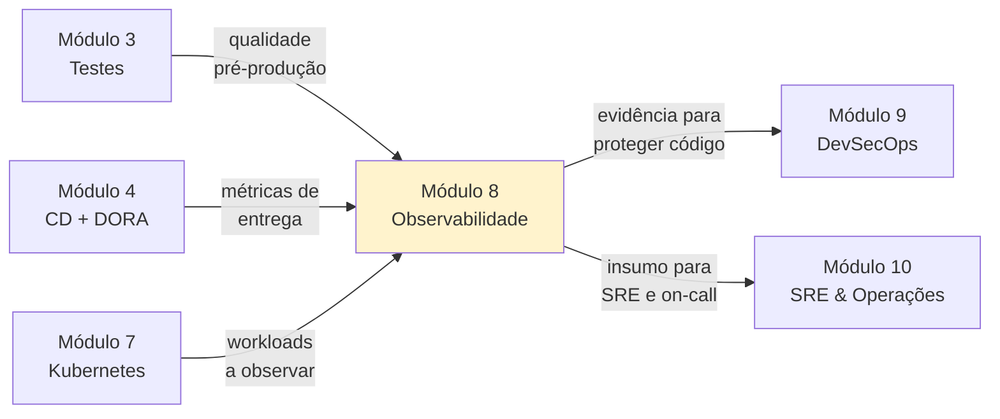

# Módulo 8 — Observabilidade

**Carga horária:** 6 horas
**Nível:** Graduação (ensino superior)
**Pré-requisitos:** Módulos 1 (Cultura), 3 (Testes), 4 (CD), 5 (Containers), 7 (Kubernetes)

---

## Por que este módulo vem aqui

O Módulo 7 nos deu um cluster **funcional e escalável**. Aplicações sobem sozinhas, se autorregeneram, fazem rolling update sem downtime. Tudo parece estar "verde" no `kubectl get pods`.

E aí o cliente liga reclamando que o pedido dele está travado há 15 minutos. E ninguém sabe onde.

Observabilidade é a disciplina de **transformar o funcionamento interno de sistemas complexos em sinais interpretáveis** para que uma pessoa (ou máquina) possa responder três perguntas:

1. **Está tudo bem?** — saúde geral do sistema.
2. **Quando não está, onde está o problema?** — localização da falha.
3. **Por quê?** — causa-raiz.

O ponto crítico: em sistemas distribuídos (3, 30 ou 300 serviços), responder essas perguntas **olhando código** é impossível. Precisa-se de instrumentação sistemática, coleta centralizada, correlação entre sinais, e uma cultura de operar por dados, não por intuição.

> *"You can't manage what you can't measure."* — atribuído a Peter Drucker
>
> *"Monitoring tells you whether the system works. Observability tells you why it doesn't."* — Charity Majors ([honeycomb.io](https://www.honeycomb.io/blog/observability-101))

Este módulo **não** é "como configurar o Prometheus". É como **projetar sistemas observáveis** e operá-los com **SLIs, SLOs e error budgets** — ferramentas de SRE que transformam "sensação de qualidade" em contratos mensuráveis entre tecnologia e negócio.

---

## Objetivos de Aprendizagem

Ao final do módulo, você será capaz de:

- **Distinguir** monitoramento de observabilidade, e explicar quando cada um é suficiente.
- **Descrever** os três pilares — **métricas, logs, traces** — e seu custo/utilidade relativos.
- **Aplicar** Golden Signals (latency, traffic, errors, saturation), USE e RED para instrumentar serviços.
- **Definir** SLIs, SLOs e error budgets acionáveis a partir de objetivos de negócio.
- **Instrumentar** uma aplicação FastAPI com `prometheus_client` e OpenTelemetry (métricas, logs estruturados, traces).
- **Operar** a stack `kube-prometheus-stack` (Prometheus, Grafana, Alertmanager), Loki e Tempo em cluster local.
- **Escrever** consultas **PromQL** e **LogQL** para diagnóstico, dashboards e alertas.
- **Correlacionar** logs, métricas e traces via `trace_id` e labels comuns.
- **Projetar** alertas maduros — SLO-based alerting em vez de thresholds estáticos — para evitar fadiga de alarme.
- **Escrever** runbooks úteis e conduzir um postmortem sem culpa, ligando achados a mudanças de sistema.
- **Reconhecer** limites — observabilidade custa, gera dados sensíveis, e não substitui design claro.

---

## Estrutura do Material

| Ordem | Conteúdo | Arquivo(s) |
|-------|----------|------------|
| 0 | Cenário PBL (LogisGo) | [00-cenario-pbl.md](00-cenario-pbl.md) |
| 1 | Fundamentos: 3 pilares, Golden Signals, SLI/SLO/Error Budget | [bloco-1/01-fundamentos-observabilidade.md](bloco-1/01-fundamentos-observabilidade.md) · [exercícios](bloco-1/01-exercicios-resolvidos.md) |
| 2 | Métricas com Prometheus e Grafana (PromQL, RED, exporters) | [bloco-2/02-metricas-prometheus.md](bloco-2/02-metricas-prometheus.md) · [exercícios](bloco-2/02-exercicios-resolvidos.md) |
| 3 | Logs (Loki) e Traces (Tempo) com OpenTelemetry | [bloco-3/03-logs-traces-otel.md](bloco-3/03-logs-traces-otel.md) · [exercícios](bloco-3/03-exercicios-resolvidos.md) |
| 4 | Alertas, SLO-based alerting, runbooks, cultura on-call | [bloco-4/04-alertas-slo-cultura.md](bloco-4/04-alertas-slo-cultura.md) · [exercícios](bloco-4/04-exercicios-resolvidos.md) |
| 5 | Exercícios progressivos (5 partes) | [exercicios-progressivos/](exercicios-progressivos/) |
| 6 | Entrega avaliativa | [entrega-avaliativa.md](entrega-avaliativa.md) |
| — | Referências bibliográficas | [referencias.md](referencias.md) |

---

## Como Estudar

1. **Leia o cenário PBL** — a **LogisGo** é uma plataforma de last-mile delivery que está "operando no escuro" apesar do cluster "verde".
2. **Instale o ferramental local:**
   ```bash
   # ambiente Python + dependências
   python -m venv .venv && source .venv/bin/activate
   pip install -r requirements.txt

   # cluster local (reuse o k3d do Módulo 7)
   k3d cluster create obs-lab --agents 1 --port "8080:80@loadbalancer"

   # helm (reuse do Módulo 7)
   helm version --short

   # promtool e amtool (opcionais, para validar alertas offline)
   curl -L https://github.com/prometheus/prometheus/releases/latest/download/prometheus-<VER>.linux-amd64.tar.gz | tar xz
   ```
3. **Siga os blocos em ordem.** Bloco 1 dá o **vocabulário e mentalidade**; Bloco 2 implementa **métricas**; Bloco 3 adiciona **logs e traces correlacionados**; Bloco 4 fecha com **alertas saudáveis e cultura**.
4. **Instrumentação é código de produção** — teste, revise, versione. Não é "enfeite" opcional.
5. **Destrua o cluster** ao final do dia (`k3d cluster delete obs-lab`) para liberar memória.

### Setup rápido

```bash
helm repo add prometheus-community https://prometheus-community.github.io/helm-charts
helm repo add grafana https://grafana.github.io/helm-charts
helm repo update

helm install monitoring prometheus-community/kube-prometheus-stack \
  --namespace monitoring --create-namespace \
  --set grafana.adminPassword=admin

helm install loki grafana/loki-stack \
  --namespace monitoring \
  --set grafana.enabled=false --set prometheus.enabled=false

helm install tempo grafana/tempo \
  --namespace monitoring
```

O `requirements.txt` consolidado está em [requirements.txt](requirements.txt).

---

## Ideia central do módulo

| Conceito | Significado |
|----------|-------------|
| **Monitoramento** | Observar sinais **conhecidos** com thresholds pré-definidos |
| **Observabilidade** | Ter dados ricos o bastante para responder perguntas **não previstas** |
| **3 pilares** | Métricas (agregadas, baratas), Logs (eventos), Traces (jornada entre serviços) |
| **Golden Signals** | Latência, tráfego, erros, saturação — os 4 sinais essenciais |
| **SLI** | **Indicador** — métrica que mede algo que o usuário percebe |
| **SLO** | **Objetivo** — alvo de qualidade (ex.: 99% dos pedidos < 500ms) |
| **Error Budget** | Quanto você pode falhar sem violar o SLO; trade-off entre velocidade e estabilidade |
| **Cardinalidade** | Número de combinações únicas de labels; explode custo se mal projetada |
| **OpenTelemetry** | Padrão aberto (CNCF) para instrumentar métricas, logs e traces |

> Observabilidade **não é** instalar Prometheus. É tornar **legível** o comportamento de um sistema para humanos sob pressão, via sinais bem projetados, correlacionáveis e acionáveis.

---

## Conexão com o restante da disciplina



---

## O que este módulo NÃO cobre

- **APM proprietário** (Datadog, New Relic, Dynatrace) — mencionamos como equivalentes comerciais; praticamos com stack open source para não esconder conceitos sob telas bonitas.
- **Service Mesh observability** (Istio telemetry v2, Linkerd viz) — tangencial; requer capítulos próprios.
- **eBPF** (Pixie, Cilium Hubble) — citado como fronteira; conceitualmente avançado para graduação.
- **Log analytics em escala petabyte** (Splunk, Elastic ao nível de SIEM) — foge do escopo.
- **Machine learning para detecção de anomalias** — mencionado brevemente como tendência.

---

*Material alinhado a: Site Reliability Engineering (Beyer et al., Google); The SRE Workbook; Observability Engineering (Majors, Fong-Jones, Miranda); Prometheus Up & Running (Brazil); documentação oficial Prometheus, Grafana, OpenTelemetry.*
