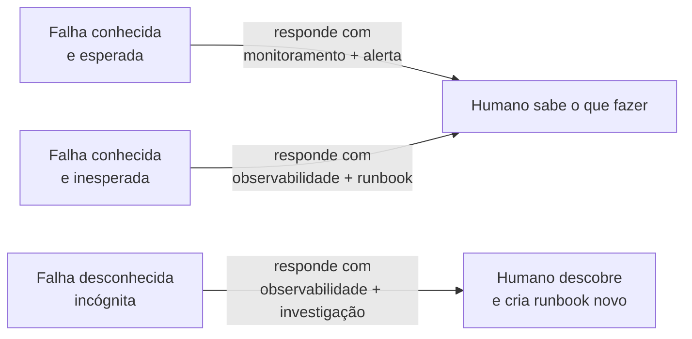
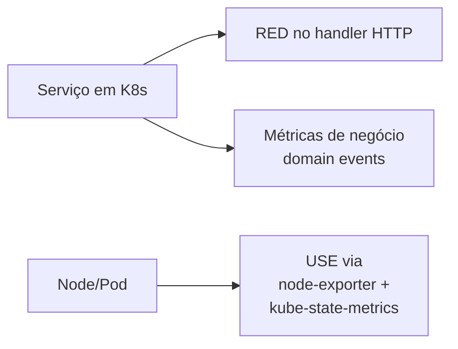
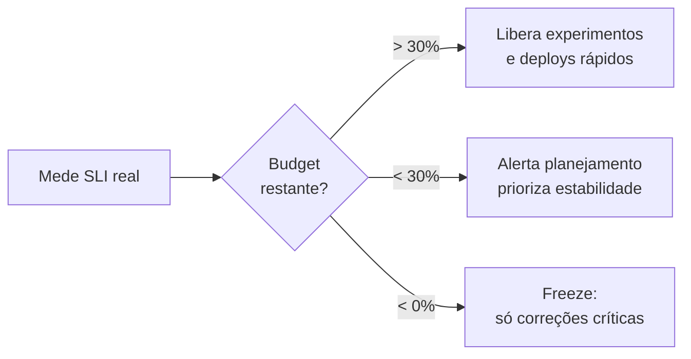

# Bloco 1 — Fundamentos da Observabilidade

> **Pergunta do bloco.** Antes de instalar qualquer ferramenta, o que é **observar** um sistema? Qual a diferença para **monitorar**? E como traduzir "qualidade" para números que se pode medir, prometer e proteger?

---

## 1.1 Monitoramento ≠ Observabilidade

A confusão é antiga. Para este módulo, fixamos a distinção que a indústria hoje adota.

### 1.1.1 Monitoramento

> **Monitoramento:** observar sinais **conhecidos** com **regras pré-definidas** (ex.: "me avise quando CPU > 80% por 5 min").

- Funciona bem para falhas **previsíveis**.
- Responde a perguntas como: "o servidor X está de pé?", "o disco encheu?".
- Artefatos típicos: thresholds, pings, heartbeats, `tail -f` de logs.

### 1.1.2 Observabilidade

> **Observabilidade:** propriedade de um sistema pela qual seu **estado interno** pode ser inferido a partir de suas **saídas** (sinais) — o bastante para responder perguntas **não previstas**.

- Conceito roubado da **teoria de controle** (Kalman, 1960): sistema observável = você pode reconstruir o estado interno do sistema a partir dos seus outputs.
- Foco: responder perguntas **novas** (*"por que o pedido do cliente Z, criado às 14h31, sumiu no caminho?"*) sem precisar deployar nova instrumentação.
- Exige **dados ricos, contextuais e correlacionáveis**.

| Monitoramento | Observabilidade |
|---------------|-----------------|
| "Tudo OK?" (binário) | "O que está acontecendo agora?" (aberto) |
| Perguntas que você já sabe | Perguntas que surgem durante incidente |
| Thresholds estáticos | Queries exploratórias |
| Dashboards fixos | Cortes dinâmicos por labels/tags |

Em sistemas simples (monolito em 1 servidor), **monitoramento basta**. Em sistemas distribuídos (K8s com 5+ serviços), é **insuficiente** — falhas se manifestam como efeitos cascata que você nunca previu.

> Charity Majors diz, provocadoramente: "*observability is what you have when you have enough data to debug problems you didn't predict*."

### 1.1.3 Os três tipos de "falha" a distinguir

No dia-a-dia você vai confrontar três situações — importante não as tratar da mesma forma:



- **Known-known**: "disco cheio" — alerta direto, ação conhecida.
- **Known-unknown**: "API está lenta" — você sabe *que* pode acontecer; precisa investigar *por que agora*.
- **Unknown-unknown**: "pedidos do cliente X sumiram entre 14h e 14h30" — não há runbook; só há investigação livre.

O terceiro caso é **o teste** da sua observabilidade.

---

## 1.2 Os três pilares: métricas, logs, traces

A tradição (e a documentação do OpenTelemetry) organiza os sinais em **três famílias**. Cada uma resolve um problema bem, e é ruim para os outros dois.

### 1.2.1 Métricas

- **Definição:** valores numéricos agregados no tempo, indexados por **labels** de baixa cardinalidade.
- Exemplo: `http_requests_total{service="pedidos", status="500", route="/orders"}` igual a `1247`.
- Armazenadas como séries temporais: cada combinação única de labels é uma **série**.

**Pontos fortes**
- Baratas — kilobytes por minuto por série.
- Excelentes para **alertas** e **tendências**.
- Fáceis de agregar: "tráfego de todos os serviços nos últimos 5 min".

**Pontos fracos**
- **Sem contexto**: você sabe "12 erros", mas não *quais*.
- **Cardinalidade explode** se labels forem livres (user_id, order_id). Regra de ouro: labels com valores **finitos e previsíveis**.
- Não servem para debug fino: "me mostra o pedido 84271" é tarefa de log/trace, não métrica.

### 1.2.2 Logs

- **Definição:** eventos discretos, com timestamp, nível e conteúdo textual ou estruturado (JSON).
- Exemplo:
  ```json
  {"ts":"2026-04-21T14:32:11Z","level":"ERROR","service":"pedidos","msg":"falha publicar evento","order_id":"84271","trace_id":"0af7651..."}
  ```

**Pontos fortes**
- **Contexto arbitrário**: qualquer campo é "grátis" (a princípio).
- Podem ter **alta cardinalidade** (order_id, user_id): cada evento é autônomo.
- Lentos para decidir "acontece agora", mas **únicos** para reconstrução de cenas passadas.

**Pontos fracos**
- **Volume**: logs podem crescer TB/dia em sistemas populares.
- **Custo de busca**: filtrar GB de texto com `grep` é insustentável; sistemas como Loki/Elastic impõem seus próprios modelos de indexação.
- **Sem correlação nativa**: logs de `serviço A` e `serviço B` só se ligam se carregarem um **`trace_id` comum**.

**Regra de ouro.** Em produção, **logs sempre estruturados**. JSON por linha. Emite-se via `stdout` (Fator XI do 12-Factor App), o cluster encaminha.

### 1.2.3 Traces

- **Definição:** árvore de **spans** (operações unitárias) interligadas pelo mesmo `trace_id`, mostrando a **jornada** de uma requisição entre serviços, threads, operações.

```mermaid
gantt
    title Trace: POST /orders (trace_id = 0af7651...)
    dateFormat X
    axisFormat %L ms
    section api-gateway
    HTTP POST /orders            :a1, 0, 412
    section pedidos
    criar_pedido                 :a2, 8, 398
    validar_estoque (http out)   :a3, 40, 120
    persistir_pedido (db)        :a4, 160, 80
    publicar_evento (rabbitmq)   :a5, 250, 140
    section estoque
    consultar_sku                :a6, 45, 110
```



**Pontos fortes**
- Revelam **onde** o tempo foi gasto na jornada de um pedido.
- Indispensáveis em arquiteturas com ≥ 3 serviços.
- Mostram dependências reais, não as desenhadas no slide.

**Pontos fracos**
- **Overhead**: instrumentação precisa estar em todos os serviços; `traceparent` precisa ser propagado.
- **Amostragem** é quase obrigatória: coletar 100% dos traces de um sistema popular é caro (*head* ou *tail sampling*).
- Sozinhos não geram alerta: traces são **ferramenta de diagnóstico**, não de detecção.

### 1.2.4 Quando cada pilar brilha

| Pergunta | Melhor pilar |
|----------|--------------|
| "O sistema está saudável?" | Métricas |
| "A latência p99 de hoje vs. ontem?" | Métricas |
| "Por que o pedido 84271 falhou?" | Logs + trace |
| "Qual serviço da cadeia está lento?" | Traces |
| "Quantos erros por cliente B2B?" | Métricas (se label cabe) ou logs agregados |
| "Eventos aconteceram na ordem certa?" | Logs |
| "O deploy de ontem aumentou p95?" | Métricas comparadas |

Na prática moderna, os três são **complementares**. A sigla que captura isso: **MELT** (Metrics, Events, Logs, Traces) — OpenTelemetry os unifica.

### 1.2.5 Eventos de alto nível (4º pilar?)

Alguns autores (Majors, Fong-Jones) argumentam que a separação rígida dos três pilares é um **acidente histórico**. Para elas, tudo deveria ser **eventos de alta cardinalidade** — e métricas/traces/logs são **visões** sobre esses eventos.

Essa linha é a tese por trás de produtos como **Honeycomb**. Para um curso de graduação, mantemos os três pilares por serem o modelo dominante nas ferramentas CNCF — mas reconheça a tensão: **a separação é uma conveniência, não uma verdade ontológica**.

---

## 1.3 Golden Signals, USE e RED — métodos de instrumentação

Dado um serviço, o que **medir**? Três frameworks canônicos respondem isso.

### 1.3.1 Four Golden Signals (Google SRE)

Derivados do capítulo 6 do *SRE Book*. Para **todo serviço voltado a usuário**, meça:

| Sinal | Significado | Exemplo na LogisGo |
|-------|-------------|---------------------|
| **Latency** | Quanto tempo as requisições levam (separando sucesso e erro) | p95 de `POST /orders` |
| **Traffic** | Quanta carga o serviço recebe | requests/s em `pedidos` |
| **Errors** | Taxa de falhas (explícitas 5xx e *implícitas* como 200 com resposta errada) | 5xx/s, 4xx com `error=true` |
| **Saturation** | Quão "cheia" está a fila/recurso — quão perto do limite | uso de pool DB, profundidade de fila Rabbit |

Notar: **separar latência de sucesso e de erro** é essencial. Respostas de erro costumam ser rápidas (retornam 503 em 5 ms); se misturadas, a média mente.

### 1.3.2 Método RED (Tom Wilkie)

Refinamento para **microsserviços** com HTTP/gRPC:

- **R**ate — requisições por segundo.
- **E**rrors — taxa de falhas.
- **D**uration — distribuição de latência (histograma).

É um subset prático dos Golden Signals, excluindo *Saturation* por ser mais dependente de recurso. **Toda rota HTTP do seu sistema deve ter RED**.

### 1.3.3 Método USE (Brendan Gregg)

Para **recursos** (CPU, memória, disco, rede, descritores):

- **U**tilization — % do tempo o recurso está ocupado.
- **S**aturation — fila de espera (trabalho pendente).
- **E**rrors — contagem de erros (ex.: pacotes perdidos).

**USE + RED cobrem juntos** infraestrutura (USE) e serviço (RED).

### 1.3.4 Receita prática

Para **cada serviço**:



- Um histograma de latência por **rota + status + método** (baixa cardinalidade, alta utilidade).
- Contador de requests total.
- Contadores por evento de negócio: `orders_created_total`, `notifications_sent_total`.
- USE de node vem de fora — `node-exporter` já entrega.

Nunca coloque IDs livres (user_id, request_id) em labels de métricas. Isso fica em **logs e traces**, onde alta cardinalidade é barata.

---

## 1.4 SLI, SLO, SLA e Error Budget

A virada cultural trazida pelo SRE: **transformar "qualidade" em número negociável**.

### 1.4.1 Definições (SRE Book, cap. 4)

- **SLI (Service Level Indicator)** — um **número** que representa uma dimensão de qualidade percebida pelo usuário. Geralmente uma razão.
  $$ SLI = \frac{\text{eventos\_bons}}{\text{eventos\_válidos}} $$
- **SLO (Service Level Objective)** — um **alvo** para o SLI ao longo de uma **janela** de tempo. Ex.: "99,5% em 30 dias".
- **SLA (Service Level Agreement)** — contrato **externo** com consequências comerciais (multa) se não cumprido. É um SLO **menos exigente** prometido contratualmente.
- **Error Budget** — quanto você pode **falhar** antes de violar o SLO. É o **orçamento de risco**.

Exemplo LogisGo:

- **Jornada:** criar pedido.
- **SLI:** razão de requests `POST /orders` retornando 2xx em < 500ms.
- **SLO:** 99% em 28 dias.
- **SLA:** 98% em 30 dias (tolerância maior, para clientes B2B).
- **Error budget:** 1% de 28 dias ≈ 6h 43min. Se em um dia você queimar 2h, sobraram 4h 43min para o resto do mês.

### 1.4.2 Como se escolhe um SLO

1. **Jornada importa** — escolha o que o usuário valoriza, não o que é fácil de medir. ("Pedido criado e visível no painel" > "endpoint HTTP retornou 200").
2. **Achievable** — começa em patamar realista. 99.99% ("quatro noves") é caro; muitos sistemas legítimos vivem bem em 99% ou 99.5%.
3. **Meaningful** — o usuário **sentiria** se falhasse. Métricas internas (CPU < 80%) não são SLO.
4. **Measurable** — você tem um SLI que captura. Se não mede, não vira SLO.
5. **Negociável** — SLO é **acordo** entre produto, engenharia e operações.

### 1.4.3 Error budget em ação

Error budget transforma a conversa.

- **Budget sobrando** → time pode **arriscar mais** (deploys agressivos, experimentos, novos features).
- **Budget estourado** → **freeze** de novas features; foco em confiabilidade.

É uma **política**, não um dashboard. Se ninguém segue, vira enfeite.



### 1.4.4 Matemática do error budget

Para um SLO de **99,5%** em uma janela de **30 dias**:

$$ \text{budget} = (1 - 0{,}995) \times 30 \times 24 \times 60 = 216 \text{ min de falha permitida} $$

Se você usa "request-based" (e não "time-based"):

$$ \text{budget} = (1 - 0{,}995) \times N_{requests} = 0{,}005 \times N $$

Para 1 milhão de requests no mês, 5000 erros é o orçamento.

### 1.4.5 Cuidados

- **Janela curta demais** (< 7 dias) é ruidosa. **Janela longa demais** (> 30 dias) esconde problemas.
- **SLO não deve ser 100%.** Se for, um single outage pequeno viola e o conceito quebra.
- **SLO não é KPI de time.** É uma **ferramenta de decisão técnica**. Se vira meta de performance individual, as pessoas vão falsificar ou travar deploys.

---

## 1.5 Cardinalidade e custo: o mundo é finito

> Toda métrica que você escreve **é uma promessa**: "vou armazenar isto por N dias, com resolução M, e vou indexar por estas K dimensões". Se não pensar no produto, o armazenamento explode.

### 1.5.1 O que é cardinalidade

Cardinalidade de uma métrica = número de **combinações únicas de labels**.

Exemplo:
```
http_request_duration_seconds{service="pedidos", route="/orders", method="POST", status="200"}
```

- `service`: 5 valores (api-gateway, pedidos, rotas, tracking, notif).
- `route`: ~30 rotas.
- `method`: 4 valores.
- `status`: ~10 valores.
- **Cardinalidade ≈ 5 × 30 × 4 × 10 = 6 000 séries**. Aceitável.

Agora adicione `user_id`:

- `user_id`: 1 000 000 usuários ativos.
- **Cardinalidade ≈ 6 000 × 1 000 000 = 6 bilhões de séries**. **Explode o Prometheus.**

### 1.5.2 Regras práticas para labels

1. **Valores com conjunto fechado e previsível** (HTTP status, enum, nome de serviço).
2. **Nunca**: ids de usuário, sessão, pedido, request.
3. **Nunca**: strings livres (mensagens, URLs completas com query string).
4. **Cuidado com versão de build** (valor por commit pode inflar com o tempo).
5. Se quiser contar por cliente: use poucos tiers (`customer_tier="free"`, `"pro"`, `"enterprise"`).
6. Auditoria recorrente: `prometheus_tsdb_head_series` deve estar sob controle.

### 1.5.3 Custo do erro

Um label com cardinalidade infinita não só aumenta disco — cada *query* que agrupa por ele passa a varrer milhões de séries. Incidentes de "Prometheus OOM" são quase sempre cardinalidade mal planejada.

---

## 1.6 O bom dashboard

Dashboards **não são enfeite**. Diferencie:

- **Dashboard de incidente**: poucos painéis (< 8), respondem "onde dói?" em 30 segundos. SLIs, golden signals, alertas ativos.
- **Dashboard executivo**: 3–5 números que medem saúde do produto. SLO, budget, tráfego, receita.
- **Dashboard exploratório**: aberto, muitos painéis, consulta livre. Raramente apontado em tela fixa.

**Anti-padrões** a evitar:
- Gráfico bonito de CPU sem contexto de saturação.
- 50 painéis do "Kubernetes Node Overview" que ninguém sabe ler.
- Cores RGB piscantes sem significado.
- Numerinho sem unidade (`417` — 417 o quê?).

> Um dashboard útil prevê: *"o que eu vou olhar na primeira olhada para saber se preciso olhar mais?"*.

---

## 1.7 Cultura: o outro 50% do problema

Observabilidade sem cultura vira "Grafana decorativo". Três vícios comuns:

1. **Caça-ao-culpado em postmortem.** Mata confiança. Ninguém mais reporta com honestidade. Solução: postmortem *blameless*, focado no sistema.
2. **Alertas sem dono.** Se "qualquer um pode resolver", ninguém resolve. Cada alerta deve ter um **time/squad** claro e um **runbook**.
3. **Observabilidade como projeto paralelo.** Instrumentar é **parte da definição de pronto**. Não é tarefa de "plataforma" sozinha.

Exploraremos postmortems e rodízio de on-call no Bloco 4.

---

## 1.8 Script Python: simulador de SLO

Para sentir como SLOs se comportam na prática, use o script [`slo_simulator.py`](./slo_simulator.py): ele sorteia requisições, classifica bem/erro, calcula budget consumido e alerta conforme a taxa de queima.

```python
"""
slo_simulator.py — simulador didático de SLO e error budget.

Uso:
    python slo_simulator.py --slo 0.995 --janela-dias 28 --rps 50

O simulador gera 1 dia de requisições. A probabilidade de erro pode ser
configurada para demonstrar budget saudável (<< SLO) e queima acelerada.
"""
from __future__ import annotations

import argparse
import random
import sys
from dataclasses import dataclass


@dataclass(frozen=True)
class Resultado:
    total: int
    bons: int
    ruins: int
    slo: float
    budget_total: int
    budget_consumido: int

    @property
    def sli_atual(self) -> float:
        return self.bons / self.total if self.total else 0.0

    @property
    def budget_restante(self) -> int:
        return self.budget_total - self.budget_consumido

    @property
    def budget_queimado_pct(self) -> float:
        return self.budget_consumido / self.budget_total * 100 if self.budget_total else 0.0


def simular(slo: float, janela_dias: int, rps: float, prob_erro: float, seed: int = 42) -> Resultado:
    random.seed(seed)
    total_janela = int(rps * 60 * 60 * 24 * janela_dias)
    budget_total = int((1 - slo) * total_janela)

    total_dia = int(rps * 60 * 60 * 24)
    bons = 0
    ruins = 0
    for _ in range(total_dia):
        if random.random() < prob_erro:
            ruins += 1
        else:
            bons += 1
    return Resultado(
        total=total_dia,
        bons=bons,
        ruins=ruins,
        slo=slo,
        budget_total=budget_total,
        budget_consumido=ruins,
    )


def relatorio(r: Resultado) -> str:
    return (
        f"Janela total (estimada)   : {r.budget_total + (r.total - r.ruins) * (r.budget_total/r.ruins) if r.ruins else 'n/a'}\n"
        f"Requisições no dia        : {r.total:>10}\n"
        f"Bons                      : {r.bons:>10}\n"
        f"Ruins                     : {r.ruins:>10}\n"
        f"SLI atual (dia)           : {r.sli_atual*100:>9.3f} %\n"
        f"SLO alvo                  : {r.slo*100:>9.3f} %\n"
        f"Budget total (janela)     : {r.budget_total:>10} erros\n"
        f"Budget consumido (dia)    : {r.budget_consumido:>10} erros\n"
        f"Budget restante           : {r.budget_restante:>10} erros\n"
        f"Budget queimado           : {r.budget_queimado_pct:>9.2f} %\n"
    )


def classificar(pct_queimado: float) -> str:
    if pct_queimado <= 5:
        return "SAUDAVEL: queima dentro do esperado."
    if pct_queimado <= 20:
        return "ATENCAO: queima acima da média. Revisar últimos deploys."
    if pct_queimado < 100:
        return "ALERTA: queima rápida. Considerar reduzir risco (freeze parcial)."
    return "CRITICO: budget estourado. Freeze de novas features até estabilizar."


def main(argv: list[str] | None = None) -> int:
    p = argparse.ArgumentParser(description="Simulador de SLO e error budget")
    p.add_argument("--slo", type=float, default=0.995, help="Alvo SLO (0-1)")
    p.add_argument("--janela-dias", type=int, default=28)
    p.add_argument("--rps", type=float, default=50.0)
    p.add_argument("--prob-erro", type=float, default=0.003, help="Probabilidade de erro por request")
    p.add_argument("--seed", type=int, default=42)
    args = p.parse_args(argv)

    if not 0 < args.slo < 1:
        print("ERRO: --slo deve estar entre 0 e 1 (exclusivo)", file=sys.stderr)
        return 2

    r = simular(args.slo, args.janela_dias, args.rps, args.prob_erro, args.seed)
    print(relatorio(r))
    print(classificar(r.budget_queimado_pct))
    return 0 if r.budget_queimado_pct < 100 else 1


if __name__ == "__main__":
    raise SystemExit(main())
```

Teste:

```bash
# cenário saudável
python slo_simulator.py --slo 0.995 --prob-erro 0.003

# cenário problemático
python slo_simulator.py --slo 0.995 --prob-erro 0.02
```

---

## 1.9 Checklist do bloco

Antes de ir ao Bloco 2, certifique-se de:

- [ ] Explicar em 3 frases a diferença entre monitoramento e observabilidade.
- [ ] Listar os 3 pilares e escolher qual usar para uma pergunta dada.
- [ ] Aplicar RED a um serviço HTTP fictício.
- [ ] Aplicar USE a um node do cluster.
- [ ] Propor 1 SLO para uma jornada (SLI, alvo, janela) e calcular o error budget.
- [ ] Nomear 3 labels seguros e 3 labels perigosos (alta cardinalidade) para métricas.
- [ ] Diferenciar dashboard de incidente e dashboard executivo.

Vá aos [exercícios resolvidos do Bloco 1](./01-exercicios-resolvidos.md) para consolidar.

---

<!-- nav:start -->

| &nbsp; | &nbsp; | &nbsp; |
|:--|:--:|--:|
| **← Anterior**<br>[Cenário PBL — LogisGo: um cluster verde, um negócio no escuro](../00-cenario-pbl.md) | **↑ Índice**<br>[Módulo 8 — Observabilidade](../README.md) | **Próximo →**<br>[Bloco 1 — Exercícios resolvidos](01-exercicios-resolvidos.md) |

<!-- nav:end -->
