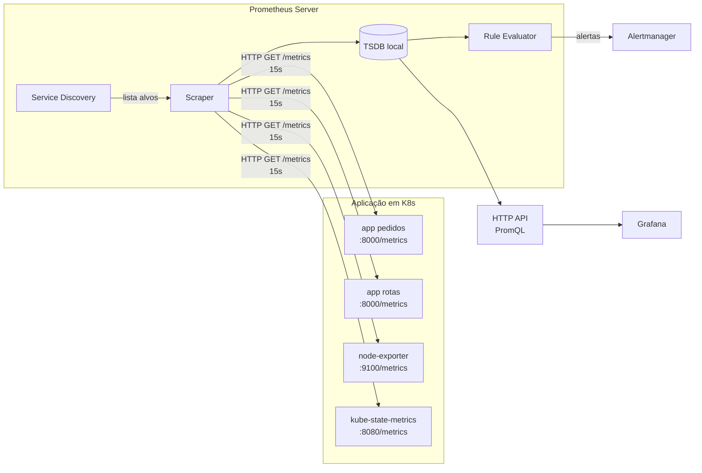
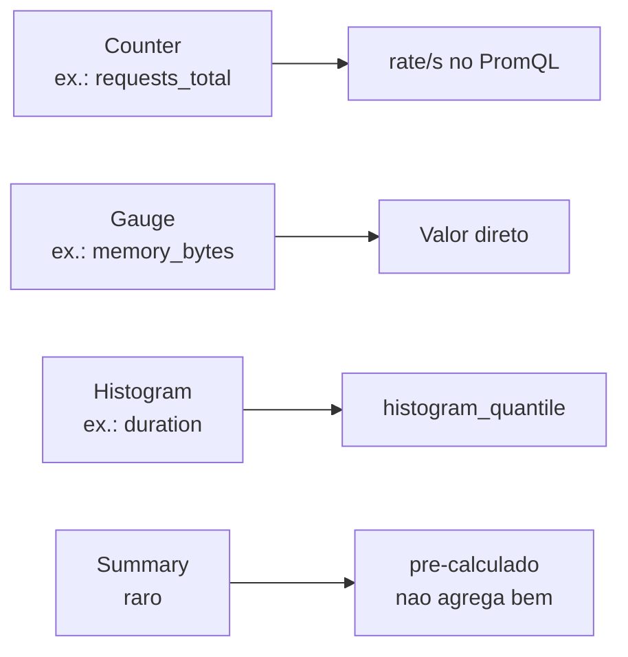
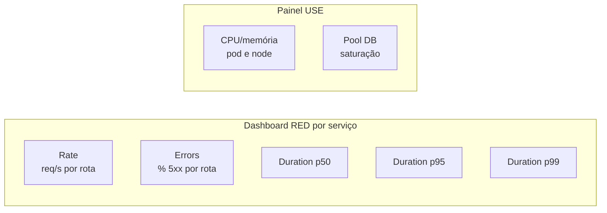

# Bloco 2 — Métricas com Prometheus e Grafana

> **Pergunta do bloco.** Como instrumentar serviços para produzir **métricas confiáveis**, armazená-las em Prometheus, consultá-las com **PromQL** e visualizá-las com Grafana — sem cair nas armadilhas de cardinalidade e agregação?

---

## 2.1 Arquitetura do Prometheus

Prometheus é um **banco de séries temporais** (TSDB) com um **modelo de coleta ativa (pull)**: ele periodicamente consulta (*scrapes*) endpoints HTTP expostos pelos alvos.



### 2.1.1 Conceitos centrais

- **Target**: endpoint HTTP que expõe métricas no **formato Prometheus/OpenMetrics**.
- **Scrape**: ato de Prometheus buscar `/metrics` de um target.
- **Série temporal**: combinação única de nome métrica + labels.
- **Sample**: um ponto `(timestamp, valor)` numa série.
- **Label**: par chave-valor que qualifica a série.
- **Job / Instance**: `job` identifica um grupo de targets similares (ex.: `pedidos`); `instance` é o endereço específico (ex.: `10.42.0.17:8000`).

### 2.1.2 Por que pull?

- **Reliability**: se o target cai, o Prometheus sabe (um scrape falha). Sem ambiguidade.
- **Service discovery centralizado**: Prometheus conhece todos os alvos a qualquer momento.
- **Simples para testar**: você pode `curl /metrics` localmente e ver.

Contra-exemplos:
- **Jobs batch curtos** (< 1 min): não dá tempo de scrape. Usa-se **Pushgateway** (exceção, não regra).
- **Redes sem visibilidade direta**: proxies, `Prometheus Federation`, ou push via OTel Collector.

### 2.1.3 O formato Prometheus

Um endpoint `/metrics` retorna texto simples:

```
# HELP http_requests_total Total de requisicoes HTTP recebidas.
# TYPE http_requests_total counter
http_requests_total{service="pedidos",route="/orders",method="POST",status="200"} 1247
http_requests_total{service="pedidos",route="/orders",method="POST",status="500"} 3
http_requests_total{service="pedidos",route="/orders/:id",method="GET",status="200"} 8912

# HELP http_request_duration_seconds Latencia das requisicoes HTTP.
# TYPE http_request_duration_seconds histogram
http_request_duration_seconds_bucket{service="pedidos",route="/orders",method="POST",le="0.1"} 980
http_request_duration_seconds_bucket{service="pedidos",route="/orders",method="POST",le="0.5"} 1200
http_request_duration_seconds_bucket{service="pedidos",route="/orders",method="POST",le="1"} 1246
http_request_duration_seconds_bucket{service="pedidos",route="/orders",method="POST",le="+Inf"} 1247
http_request_duration_seconds_sum{service="pedidos",route="/orders",method="POST"} 187.4
http_request_duration_seconds_count{service="pedidos",route="/orders",method="POST"} 1247
```

---

## 2.2 Os quatro tipos de métrica

### 2.2.1 Counter (contador)

- **Cresce monotonicamente** (só aumenta, exceto em restart do processo).
- Uso: eventos acumulados. Ex.: total de requests, de erros, de pedidos criados.
- Nome por convenção termina em `_total`.
- **Nunca** use valor absoluto dele diretamente em gráfico — use `rate()` ou `increase()` (ver seção 2.5).

### 2.2.2 Gauge (medidor)

- **Sobe e desce** livremente.
- Uso: valores instantâneos. Ex.: uso de memória, conexões ativas, tamanho de fila, temperatura.
- Pode ser observado diretamente.

### 2.2.3 Histogram (histograma)

- Série composta de:
  - `<name>_bucket{le="N"}`: counter de observações com valor ≤ N.
  - `<name>_sum`: soma total dos valores observados.
  - `<name>_count`: contador total de observações.
- Uso: latências e tamanhos. Ponto forte: **agregação por quantile via PromQL** (função `histogram_quantile`).
- **Buckets são fixos na coleta** — escolha com cuidado. Para latência HTTP, buckets comuns (em segundos):
  `0.005, 0.01, 0.025, 0.05, 0.1, 0.25, 0.5, 1, 2.5, 5, 10`.

### 2.2.4 Summary (sumário)

- Calcula **quantis já no lado do cliente** e expõe-nos como séries.
- Agregação entre instâncias é **matematicamente incorreta** (quantil não é linear).
- **Preferir histogram** em 95% dos casos.



---

## 2.3 Instrumentando FastAPI com `prometheus_client`

### 2.3.1 Esqueleto mínimo

Dependência: `prometheus-client==0.21.0` (já no `requirements.txt`).

```python
# app/obs/metrics.py
from __future__ import annotations

import time
from fastapi import Request
from prometheus_client import Counter, Histogram, REGISTRY, generate_latest, CONTENT_TYPE_LATEST
from starlette.responses import Response

REQUESTS = Counter(
    "http_requests_total",
    "Total de requisicoes HTTP.",
    ["service", "route", "method", "status"],
)

DURATION = Histogram(
    "http_request_duration_seconds",
    "Latencia das requisicoes HTTP em segundos.",
    ["service", "route", "method"],
    buckets=(0.005, 0.01, 0.025, 0.05, 0.1, 0.25, 0.5, 1, 2.5, 5, 10),
)

SERVICE_NAME = "pedidos"


async def middleware_metrics(request: Request, call_next):
    start = time.perf_counter()
    response = await call_next(request)
    elapsed = time.perf_counter() - start
    # Regra de ouro: usar padrao de rota, NAO URL expandida
    route = request.scope.get("route").path if request.scope.get("route") else request.url.path
    REQUESTS.labels(
        service=SERVICE_NAME,
        route=route,
        method=request.method,
        status=str(response.status_code),
    ).inc()
    DURATION.labels(
        service=SERVICE_NAME, route=route, method=request.method
    ).observe(elapsed)
    return response


def metrics_endpoint() -> Response:
    return Response(generate_latest(REGISTRY), media_type=CONTENT_TYPE_LATEST)
```

```python
# app/main.py
from fastapi import FastAPI
from app.obs.metrics import middleware_metrics, metrics_endpoint

app = FastAPI(title="pedidos")
app.middleware("http")(middleware_metrics)


@app.get("/healthz")
def healthz():
    return {"status": "ok"}


@app.get("/metrics")
def metrics():
    return metrics_endpoint()


@app.post("/orders")
def criar_pedido(payload: dict):
    return {"id": "o-1", "status": "created"}
```

Suba localmente:

```bash
uvicorn app.main:app --port 8000
curl -s localhost:8000/metrics | head -20
```

### 2.3.2 Armadilha: cardinalidade por rota

Se usar `request.url.path` (expandido), uma rota `/orders/{id}` gera uma série por ID — **cardinalidade infinita**. Use sempre o **padrão** da rota (`route.path` em FastAPI/Starlette).

```python
# ERRADO — explosão de séries:
REQUESTS.labels(route="/orders/84271")
REQUESTS.labels(route="/orders/84272")
# ...

# CERTO — uma série por template:
REQUESTS.labels(route="/orders/{id}")
```

### 2.3.3 Métricas de negócio

Golden Signals capturam **health técnica**. Métricas de **negócio** respondem "o produto está saudável?":

```python
ORDERS_CREATED = Counter(
    "orders_created_total",
    "Pedidos criados com sucesso.",
    ["tenant_tier", "channel"],
)

ORDERS_FAILED = Counter(
    "orders_failed_total",
    "Pedidos que falharam na criacao.",
    ["tenant_tier", "failure_reason"],
)

# Uso:
ORDERS_CREATED.labels(tenant_tier="enterprise", channel="api").inc()
ORDERS_FAILED.labels(tenant_tier="free", failure_reason="stock_empty").inc()
```

Mantenha **poucos** labels, **valores fechados** (tier, canal, motivo categórico) — nada de `tenant_id`.

---

## 2.4 Expondo no Kubernetes (ServiceMonitor)

A stack `kube-prometheus-stack` usa *Custom Resources* para descobrir alvos automaticamente.

### 2.4.1 Anotações no Service

```yaml
apiVersion: v1
kind: Service
metadata:
  name: pedidos
  namespace: logisgo
  labels:
    app: pedidos
    release: monitoring     # precisa bater com o selector do Prometheus
spec:
  selector:
    app: pedidos
  ports:
    - name: http
      port: 80
      targetPort: 8000
```

### 2.4.2 ServiceMonitor

```yaml
apiVersion: monitoring.coreos.com/v1
kind: ServiceMonitor
metadata:
  name: pedidos
  namespace: logisgo
  labels:
    release: monitoring     # este label faz o Prometheus adotar este SM
spec:
  selector:
    matchLabels:
      app: pedidos
  namespaceSelector:
    matchNames:
      - logisgo
  endpoints:
    - port: http             # nome da porta do Service
      path: /metrics
      interval: 15s
      scrapeTimeout: 10s
```

Ao aplicar, em 30–60s o Prometheus adiciona `pedidos` aos targets:

```bash
kubectl -n monitoring port-forward svc/monitoring-kube-prometheus-prometheus 9090:9090
# abre http://localhost:9090/targets
```

### 2.4.3 Watchdog & meta-monitoramento

A stack vem com regra `Watchdog` que dispara **sempre**. Não é alarme — é **prova** de que o pipeline alerta→receiver funciona. Se o Watchdog **para de chegar**, é o sinal de que sua observabilidade morreu.

---

## 2.5 PromQL — o mínimo útil

PromQL é expressiva e compacta. Você não precisa dominar tudo, mas precisa ler e escrever as formas abaixo.

### 2.5.1 Selectors

```promql
http_requests_total                                # todas as séries desse nome
http_requests_total{service="pedidos"}             # filtrar por label
http_requests_total{service="pedidos", status!="200"}   # diferente
http_requests_total{status=~"5.."}                 # regex
http_requests_total{status!~"2..|3.."}             # negação de regex
```

### 2.5.2 Range vectors e `rate()`

Counters em si **não** se graficam — cresce para sempre. Você **sempre** transforma com `rate()`:

```promql
rate(http_requests_total[5m])   # requisicoes por segundo, média em 5 min
```

Regras:
- `[5m]` é a janela de observação (range vector).
- `rate()` é resiliente a reinícios (compensa quando contador cai a zero).
- **Nunca** use `irate()` em alertas (muito sensível a ruído); `rate()` é a forma padrão.

### 2.5.3 Agregação

```promql
sum(rate(http_requests_total[5m]))                              # total do sistema
sum by (service) (rate(http_requests_total[5m]))                # por serviço
sum by (service, status) (rate(http_requests_total[5m]))        # por serviço + status
```

Operadores: `sum`, `avg`, `max`, `min`, `count`, `stddev`, `topk`, `bottomk`.

### 2.5.4 Taxa de erro

```promql
# Porcentagem de erros 5xx no serviço pedidos, últimos 5 min
sum(rate(http_requests_total{service="pedidos", status=~"5.."}[5m]))
/
sum(rate(http_requests_total{service="pedidos"}[5m]))
```

Em Grafana, multiplique por 100 e formate como percentual.

### 2.5.5 Quantis com histogramas

```promql
# p95 de latência do serviço pedidos, janela 5 min
histogram_quantile(
  0.95,
  sum by (le) (rate(http_request_duration_seconds_bucket{service="pedidos"}[5m]))
)
```

Observações:
- Sempre agregue `sum by (le)` **dentro** do histogram_quantile.
- Aproximação depende dos buckets — se seu p95 real é 0,73s e seus buckets forem `[0.5, 1]`, o valor reportado será 1 (por interpolação, varia).
- Para p99 em sistemas com cauda longa, considere buckets extras (`10`, `30`).

### 2.5.6 Operações entre séries

```promql
# Saturação: uso do pool vs. máximo
db_pool_connections_active / db_pool_connections_max
```

Matching por labels é automático; use `on()`/`ignoring()`/`group_left`/`group_right` para casos complexos (consulte a doc).

### 2.5.7 Subconsultas e `increase()`

- `increase(X[1h])` = quanto X cresceu na última 1 h.
- `rate(X[1h])` = taxa média por segundo na última 1 h.

Para alertas: prefira `rate()`. Para dashboards de "total do dia": use `increase(X[24h])`.

### 2.5.8 Recording rules

Se a mesma consulta é cara (muitas séries) e usada em múltiplos dashboards/alertas, **pré-compute**:

```yaml
# prometheusrule.yaml
apiVersion: monitoring.coreos.com/v1
kind: PrometheusRule
metadata:
  name: logisgo-recording
  namespace: logisgo
spec:
  groups:
    - name: logisgo.sli
      interval: 30s
      rules:
        - record: job:http_requests_error_ratio:5m
          expr: |
            sum by (service) (rate(http_requests_total{status=~"5.."}[5m]))
            /
            sum by (service) (rate(http_requests_total[5m]))
```

A nova série `job:http_requests_error_ratio:5m{service="pedidos"}` fica disponível para dashboards. Convenção de nome: `nivel:metric:operation_window` (ver [Prometheus naming](https://prometheus.io/docs/practices/rules/#naming)).

---

## 2.6 Grafana — dashboards como código

Grafana lê fontes de dados (Prometheus, Loki, Tempo). Dashboards são **JSON** — devem ser versionados.

### 2.6.1 Provisionamento

Em vez de clicar no UI (e perder), provisione dashboards via ConfigMap:

```yaml
apiVersion: v1
kind: ConfigMap
metadata:
  name: dashboard-red-pedidos
  namespace: monitoring
  labels:
    grafana_dashboard: "1"    # o chart adota por este label
data:
  pedidos-red.json: |
    {
      "title": "RED — pedidos",
      "panels": [ ... ]
    }
```

O chart `kube-prometheus-stack` roda um *sidecar* no Grafana que carrega ConfigMaps com esse label.

### 2.6.2 Anatomia de um painel útil

| Seção | Decisões |
|-------|----------|
| **Título** | Diz exatamente o que mostra ("p95 POST /orders — 5m janela") |
| **Query** | PromQL legível, comentada. Evite copiar de outro painel sem entender. |
| **Unidade** | **Sempre** escolha unidade (s, ms, bytes, req/s, %). |
| **Thresholds visuais** | Verde/amarelo/vermelho nos limites que importam. |
| **Legenda** | Curta; usar `{{service}} - {{status}}` em vez de string crua. |
| **Escala** | Linear ou log? Log ajuda caudas longas de latência. |

### 2.6.3 Dashboard RED — modelo canônico

Um painel por dimensão do RED + um por recurso se USE for relevante:



### 2.6.4 Templating e variáveis

Torne um dashboard reutilizável entre serviços com variáveis:

```
$service = label_values(http_requests_total, service)
```

As queries viram:

```promql
sum(rate(http_requests_total{service="$service"}[5m]))
```

Um único dashboard serve para `pedidos`, `rotas`, `tracking`... Seletores no topo alternam. Versionado uma única vez.

---

## 2.7 Exporters e sinais prontos

A indústria já mantém dezenas de **exporters** — traduzem métricas de produtos para o formato Prometheus.

- `node-exporter`: métricas de host (CPU, RAM, disco, rede).
- `kube-state-metrics`: estados de objetos K8s (pods, deployments, jobs).
- `postgres-exporter`: conexões, locks, cache hit.
- `redis-exporter`: memória, keys, clients.
- `rabbitmq-exporter`: filas, consumers, mensagens pendentes.
- `blackbox-exporter`: probes HTTP/TCP/ICMP externos.

Via Helm:

```bash
helm install postgres-exporter prometheus-community/prometheus-postgres-exporter \
  --namespace logisgo \
  --set config.datasource.host=postgres.logisgo.svc.cluster.local \
  --set config.datasource.user=exporter \
  --set config.datasource.passwordSecret.name=postgres-exporter-secret
```

Adicione um `ServiceMonitor` correspondente.

---

## 2.8 Retenção, storage e custo

Prometheus tem **TSDB local**. Default: 15 dias de retenção; ~1–3 KB/série/dia de disco ativo.

Escalonamento:
- **Vertical**: mais CPU/RAM/disco no pod do Prometheus.
- **Longo prazo**: usar **Thanos** ou **Mimir** (integração com S3/MinIO) para retenção longa e HA.
- **Remote write**: enviar métricas para backend escalável (Mimir, Cortex, VictoriaMetrics, Managed Prometheus).

Em graduação, **15 dias local basta**. Documente como escalaria — esse é critério da entrega avaliativa.

---

## 2.9 Script Python: auditor de cardinalidade

O script `metrics_audit.py` lê um endpoint `/metrics`, agrupa por nome da métrica e mostra quantas séries cada uma produz — você detecta explosões de cardinalidade antes de ir para produção.

```python
"""
metrics_audit.py - auditor de cardinalidade de um endpoint /metrics.

Uso:
    python metrics_audit.py --url http://localhost:8000/metrics --top 15

Lista as metricas com mais series e aponta candidatas a revisao.
"""
from __future__ import annotations

import argparse
import sys
from collections import Counter
from urllib.parse import urlparse

import requests
from rich.console import Console
from rich.table import Table

LIMITE_SAUDAVEL = 100
LIMITE_ATENCAO = 1000


def parse_metrics(texto: str) -> list[tuple[str, str]]:
    """Retorna lista de (nome_metrica, linha_labels)."""
    saida: list[tuple[str, str]] = []
    for raw in texto.splitlines():
        if not raw or raw.startswith("#"):
            continue
        linha = raw.split(" ", 1)[0]
        if "{" in linha:
            nome = linha.split("{", 1)[0]
            labels = linha[linha.index("{"):]
        else:
            nome = linha
            labels = "{}"
        saida.append((nome, labels))
    return saida


def classificar(qtde: int) -> str:
    if qtde <= LIMITE_SAUDAVEL:
        return "ok"
    if qtde <= LIMITE_ATENCAO:
        return "atencao"
    return "alerta"


def main(argv: list[str] | None = None) -> int:
    p = argparse.ArgumentParser(description="Auditor de cardinalidade de metricas Prometheus")
    p.add_argument("--url", required=True, help="URL do /metrics")
    p.add_argument("--top", type=int, default=15)
    args = p.parse_args(argv)

    parsed = urlparse(args.url)
    if parsed.scheme not in ("http", "https"):
        print("ERRO: URL deve comecar com http:// ou https://", file=sys.stderr)
        return 2

    try:
        resp = requests.get(args.url, timeout=10)
        resp.raise_for_status()
    except requests.RequestException as exc:
        print(f"ERRO ao buscar {args.url}: {exc}", file=sys.stderr)
        return 2

    pares = parse_metrics(resp.text)
    contagem: Counter[str] = Counter()
    for nome, _ in pares:
        contagem[nome] += 1

    console = Console()
    tabela = Table(title=f"Cardinalidade por metrica (top {args.top})")
    tabela.add_column("Metrica")
    tabela.add_column("Series", justify="right")
    tabela.add_column("Status")
    for nome, qtde in contagem.most_common(args.top):
        tabela.add_row(nome, str(qtde), classificar(qtde))

    console.print(tabela)
    total = sum(contagem.values())
    console.print(f"[bold]Total de series:[/bold] {total}")
    alerta = sum(1 for n, q in contagem.items() if q > LIMITE_ATENCAO)
    if alerta:
        console.print(f"[red]{alerta} metrica(s) com cardinalidade > {LIMITE_ATENCAO}[/red]")
        return 1
    return 0


if __name__ == "__main__":
    raise SystemExit(main())
```

Uso:

```bash
python metrics_audit.py --url http://localhost:8000/metrics --top 10
```

---

## 2.10 Checklist do bloco

- [ ] Entendo scrape pull, targets, jobs e instâncias.
- [ ] Distingo counter, gauge, histogram e quando usar cada um.
- [ ] Instrumento FastAPI com `prometheus_client` sem explodir cardinalidade.
- [ ] Exponho métricas no cluster via `ServiceMonitor`.
- [ ] Escrevo PromQL básico: `rate`, `sum by`, razão de erro, `histogram_quantile`.
- [ ] Provisiono um dashboard Grafana como código (ConfigMap).
- [ ] Uso recording rules para acelerar consultas repetidas.
- [ ] Sei quais exporters prontos usar (node, ksm, postgres, redis).

Vá aos [exercícios resolvidos do Bloco 2](./02-exercicios-resolvidos.md).

---

<!-- nav:start -->

**Navegação — Módulo 8 — Observabilidade**

- ← Anterior: [Bloco 1 — Exercícios resolvidos](../bloco-1/01-exercicios-resolvidos.md)
- → Próximo: [Bloco 2 — Exercícios resolvidos](02-exercicios-resolvidos.md)
- ↑ Índice do módulo: [Módulo 8 — Observabilidade](../README.md)

<!-- nav:end -->
