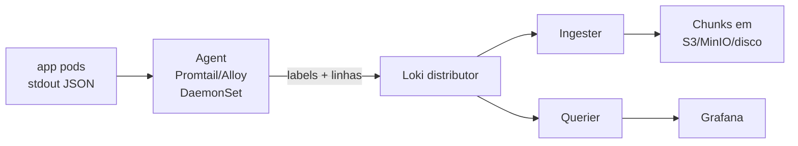
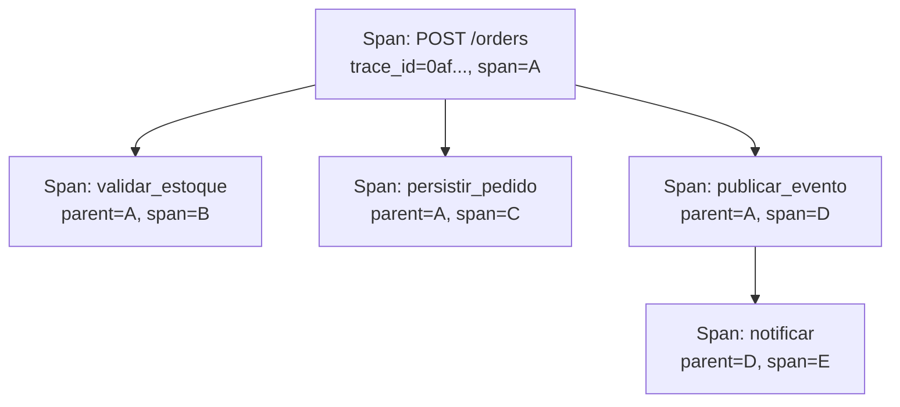
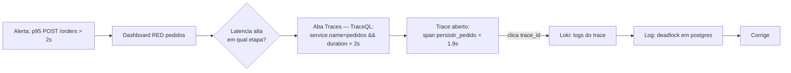

# Bloco 3 — Logs (Loki) e Traces (Tempo) com OpenTelemetry

> **Pergunta do bloco.** Como transformar "texto solto no terminal" em **logs estruturados navegáveis** e "caixa-preta entre serviços" em **traces que contam a jornada inteira de uma requisição** — tudo correlacionado por um `trace_id` comum e buscável em segundos?

---

## 3.1 Logs estruturados: o Fator XI do 12-Factor App

O Manifesto 12-Factor ([12factor.net/logs](https://12factor.net/logs)) declara:

> *"A twelve-factor app never concerns itself with routing or storage of its output stream. It should not attempt to write to or manage logfiles. Instead, each running process writes its event stream, unbuffered, to stdout."*

Traduzindo para DevOps moderno:

- App escreve **uma linha por evento** em `stdout`.
- App **não** rotaciona, **não** grava arquivo, **não** envia para Syslog.
- Encaminhamento, persistência e busca são **responsabilidade da plataforma** (Loki, Elastic, Splunk).

### 3.1.1 JSON em vez de texto

Texto corrido é legível para humanos mas difícil de filtrar em escala.

```
2026-04-21 14:32:11 INFO pedidos criando pedido id=84271 cliente=zaffran
```

vs. JSON:

```json
{"ts":"2026-04-21T14:32:11Z","level":"INFO","service":"pedidos","msg":"criando pedido","order_id":"84271","customer":"zaffran","trace_id":"0af7651916cd43dd8448eb211c80319c"}
```

O JSON permite queries exatas:
```
{service="pedidos"} | json | order_id="84271"
```

### 3.1.2 Campos mínimos obrigatórios

| Campo | Obrigatório | Exemplo |
|-------|-------------|---------|
| `ts` ou `timestamp` | sim | RFC3339 UTC |
| `level` | sim | `DEBUG/INFO/WARN/ERROR/CRITICAL` |
| `service` | sim | `pedidos` |
| `msg` | sim | "criando pedido" (curto, sem ID embutido) |
| `trace_id` | em cada log de request | `0af7651...` |
| `span_id` | idem | `b7ad6b7169203331` |
| `env` | recomendado | `prod/stg/dev` |
| `version` | recomendado | `v2.14.0` |

**Não inclua** dados sensíveis (senha, token, CPF). Logs geralmente são lidos por muita gente.

### 3.1.3 structlog em Python

Dependência: `structlog==24.4.0`.

```python
# app/obs/logging.py
from __future__ import annotations

import logging
import os
import sys

import structlog

SERVICE_NAME = os.environ.get("SERVICE_NAME", "pedidos")
ENV = os.environ.get("APP_ENV", "dev")
VERSION = os.environ.get("APP_VERSION", "0.0.0")


def configurar_logs() -> structlog.stdlib.BoundLogger:
    shared_processors = [
        structlog.contextvars.merge_contextvars,
        structlog.processors.add_log_level,
        structlog.processors.TimeStamper(fmt="iso", utc=True),
        structlog.processors.StackInfoRenderer(),
        structlog.processors.format_exc_info,
    ]

    structlog.configure(
        processors=shared_processors + [structlog.processors.JSONRenderer()],
        wrapper_class=structlog.stdlib.BoundLogger,
        context_class=dict,
        logger_factory=structlog.stdlib.LoggerFactory(),
        cache_logger_on_first_use=True,
    )

    # stdlib logging captura libs (uvicorn, etc.)
    logging.basicConfig(
        stream=sys.stdout,
        level=logging.INFO,
        format="%(message)s",
    )
    root_logger = structlog.get_logger()
    return root_logger.bind(service=SERVICE_NAME, env=ENV, version=VERSION)


log = configurar_logs()
```

Uso:

```python
from app.obs.logging import log

log.info("criando pedido", order_id="84271", customer="zaffran")
# sai JSON em stdout, pronto para Loki

try:
    publicar(event)
except Exception:
    log.error("falha publicar evento", order_id="84271", exc_info=True)
```

### 3.1.4 `trace_id` como coluna-chave

A ponte entre logs e traces é um **mesmo `trace_id`**. Com OpenTelemetry integrado ao `structlog` (próxima seção), cada log dentro de uma request do handler ganha automaticamente `trace_id` e `span_id`.

---

## 3.2 Loki — logs como séries temporais

### 3.2.1 O que é Loki

Loki ([grafana.com/loki](https://grafana.com/docs/loki/latest/)) é um sistema de logs **inspirado em Prometheus**. Diferencial:

- **Indexa labels**, não conteúdo. Rápido e barato.
- **Conteúdo comprimido em chunks** armazenados em object storage (S3/MinIO local).
- **LogQL** é parente direto de PromQL.



### 3.2.2 Labels vs. conteúdo

Como em Prometheus, labels **devem ser baixa cardinalidade**:

- Bons labels: `namespace`, `pod`, `container`, `app`, `level`.
- Ruim: `trace_id` (cada request um label diferente), `order_id`.

`trace_id` e similares ficam **dentro** da linha (como campo JSON) e são recuperados por **parsing em query time** (`| json`).

### 3.2.3 LogQL em 5 minutos

```logql
# Seletor (igual a Prometheus)
{namespace="logisgo", app="pedidos"}

# Filtro por linha
{namespace="logisgo", app="pedidos"} |= "falha"

# Parse JSON e filtro por campo
{namespace="logisgo", app="pedidos"} | json | level="ERROR"

# Agregação: contagem de erros por minuto
sum by (app) (rate({namespace="logisgo"} | json | level="ERROR" [1m]))

# p95 de duração extraído de campo log (se você logou durações):
quantile_over_time(0.95,
  {namespace="logisgo", app="pedidos"} | json | unwrap duration_ms [5m]
)
```

Pontos críticos:
- `|= "str"` é o grep; `!= "str"` exclui.
- `| json` é custoso — filtre por labels antes.
- `unwrap` converte campo em número para agregações.

### 3.2.4 Instalação via Helm

```bash
helm repo add grafana https://grafana.github.io/helm-charts
helm upgrade --install loki grafana/loki \
  --namespace monitoring \
  --set loki.auth_enabled=false \
  --set singleBinary.replicas=1 \
  --set loki.storage.type=filesystem
```

Para coleta, usamos **Grafana Alloy** (sucessor do Promtail) ou **Promtail clássico**:

```bash
helm upgrade --install promtail grafana/promtail \
  --namespace monitoring \
  --set "loki.serviceName=loki"
```

Adicione o datasource no Grafana apontando para o serviço `loki.monitoring.svc.cluster.local:3100`.

### 3.2.5 Anti-padrões

- **Log com erro + printf gigante**: emita uma linha, campos separados.
- **Log de dados sensíveis**: senhas, tokens, PII sem mascaramento.
- **Log por iteração** em loop apertado: inunda Loki; amostre ou agregue antes.
- **Logs em arquivo**: foge do 12-factor, o cluster não recupera.

---

## 3.3 Traces distribuídos: OpenTelemetry + Tempo

### 3.3.1 O que é um trace

Um **trace** é uma **árvore de spans** conectados por um mesmo `trace_id`.

- **Trace** = todas as operações de **uma requisição** ao longo do sistema.
- **Span** = uma unidade de trabalho (chamada HTTP, query DB, função).
- Cada span tem: `trace_id`, `span_id`, `parent_span_id`, `name`, `start`, `end`, `attributes`, `events`, `status`.



### 3.3.2 Propagação via W3C Trace Context

Entre serviços, o contexto de tracing é propagado **no header HTTP** (`traceparent`):

```
traceparent: 00-0af7651916cd43dd8448eb211c80319c-b7ad6b7169203331-01
             ^  ^trace_id                        ^parent_span_id  ^flags
             |
             +-- versao
```

Receptor continua a árvore — o novo span tem `parent_span_id` = o que veio no header.

### 3.3.3 OpenTelemetry SDK em Python

Dependências (já no `requirements.txt`):

```
opentelemetry-api
opentelemetry-sdk
opentelemetry-instrumentation-fastapi
opentelemetry-instrumentation-httpx
opentelemetry-instrumentation-logging
opentelemetry-exporter-otlp-proto-grpc
```

Setup:

```python
# app/obs/tracing.py
from __future__ import annotations

import os

from opentelemetry import trace
from opentelemetry.exporter.otlp.proto.grpc.trace_exporter import OTLPSpanExporter
from opentelemetry.instrumentation.fastapi import FastAPIInstrumentor
from opentelemetry.instrumentation.httpx import HTTPXClientInstrumentor
from opentelemetry.instrumentation.logging import LoggingInstrumentor
from opentelemetry.sdk.resources import Resource
from opentelemetry.sdk.trace import TracerProvider
from opentelemetry.sdk.trace.export import BatchSpanProcessor

SERVICE_NAME = os.environ.get("SERVICE_NAME", "pedidos")
OTLP_ENDPOINT = os.environ.get("OTEL_EXPORTER_OTLP_ENDPOINT", "http://otel-collector.monitoring.svc.cluster.local:4317")


def configurar_tracing(app) -> None:
    resource = Resource.create(
        {
            "service.name": SERVICE_NAME,
            "service.version": os.environ.get("APP_VERSION", "0.0.0"),
            "deployment.environment": os.environ.get("APP_ENV", "dev"),
        }
    )
    provider = TracerProvider(resource=resource)
    exporter = OTLPSpanExporter(endpoint=OTLP_ENDPOINT, insecure=True)
    provider.add_span_processor(BatchSpanProcessor(exporter))
    trace.set_tracer_provider(provider)

    FastAPIInstrumentor.instrument_app(app)
    HTTPXClientInstrumentor().instrument()
    LoggingInstrumentor().instrument(set_logging_format=False)
```

No `main.py`:

```python
from fastapi import FastAPI
from app.obs.tracing import configurar_tracing
from app.obs.logging import log

app = FastAPI()
configurar_tracing(app)

# Qualquer request HTTP a partir daqui vira span automaticamente;
# chamadas httpx carregam traceparent para downstream.
```

Para spans manuais (quando você sabe que uma operação de negócio merece seu próprio span):

```python
from opentelemetry import trace
tracer = trace.get_tracer(__name__)

with tracer.start_as_current_span("validar_estoque") as span:
    span.set_attribute("order.id", "84271")
    span.set_attribute("items.count", 3)
    # ... lógica ...
    if sem_estoque:
        span.set_status(trace.Status(trace.StatusCode.ERROR, "estoque_insuficiente"))
        span.record_exception(EstoqueInsuficiente())
        raise
```

### 3.3.4 Propagação automática em chamadas downstream

```python
import httpx
# HTTPXClientInstrumentor ja foi aplicado
async with httpx.AsyncClient() as client:
    resp = await client.get("http://estoque.logisgo.svc/sku/xyz")
# header traceparent foi injetado automaticamente
```

### 3.3.5 `LoggingInstrumentor` — a ponte logs↔traces

Esse instrumentor injeta `trace_id` e `span_id` em **todos os logs** emitidos durante um span ativo. Combinado com `structlog`, os logs saem assim:

```json
{"ts":"...","level":"INFO","service":"pedidos","msg":"criando pedido","order_id":"84271","trace_id":"0af7651916cd43dd8448eb211c80319c","span_id":"b7ad6b7169203331"}
```

E no Grafana, a partir de um trace no Tempo, você **pula direto** para os logs daquele trace em Loki. Mágica operacional fundamental.

### 3.3.6 OpenTelemetry Collector

O **Collector** é um proxy genérico que:

- **Recebe** sinais (OTLP gRPC/HTTP, Jaeger, Zipkin, Prometheus scrape, syslog).
- **Processa** (batch, filtros, redação de PII, amostragem).
- **Exporta** para backends (Tempo, Loki, Prometheus, qualquer APM).

Recomenda-se **sempre** colocar um Collector entre apps e backends — isola apps de mudanças no stack, centraliza políticas (sampling), e adiciona resiliência (retry, buffer).

Deploy via Helm:

```bash
helm upgrade --install otel-collector open-telemetry/opentelemetry-collector \
  --namespace monitoring \
  --values values-otel-collector.yaml
```

Exemplo de `values-otel-collector.yaml`:

```yaml
mode: deployment
config:
  receivers:
    otlp:
      protocols:
        grpc: { endpoint: 0.0.0.0:4317 }
        http: { endpoint: 0.0.0.0:4318 }
  processors:
    batch: { }
    memory_limiter:
      limit_mib: 400
      check_interval: 1s
    attributes/redact:
      actions:
        - key: http.request.header.authorization
          action: delete
        - key: user.email
          action: hash
  exporters:
    otlp/tempo:
      endpoint: tempo.monitoring.svc.cluster.local:4317
      tls: { insecure: true }
    otlphttp/loki:
      endpoint: http://loki.monitoring.svc.cluster.local:3100/otlp
    prometheus:
      endpoint: 0.0.0.0:8889
  service:
    pipelines:
      traces:
        receivers: [otlp]
        processors: [memory_limiter, attributes/redact, batch]
        exporters: [otlp/tempo]
      logs:
        receivers: [otlp]
        processors: [memory_limiter, batch]
        exporters: [otlphttp/loki]
      metrics:
        receivers: [otlp]
        processors: [memory_limiter, batch]
        exporters: [prometheus]
```

### 3.3.7 Tempo — backend de traces

[Tempo](https://grafana.com/docs/tempo/latest/) armazena traces indexados apenas por `trace_id` (arquitetura barata baseada em object storage). Para buscas por atributo ("me dê traces com `order.id=84271`"), ele oferece **TraceQL**.

TraceQL básico:

```
{ service.name = "pedidos" && status = error }
{ name = "POST /orders" && duration > 2s }
{ attributes."order.id" = "84271" }
```

Setup mínimo:

```bash
helm upgrade --install tempo grafana/tempo \
  --namespace monitoring
```

### 3.3.8 Amostragem

Coletar 100% dos traces é custoso. Dois modelos:

- **Head sampling**: decisão no início da request (rápido, mas cego a outliers — um trace interessante pode ser descartado logo).
- **Tail sampling**: decisão no final (Collector mantém traces em buffer e decide; pode priorizar os com erro/latência alta). Aumenta complexidade.

Em graduação, comece com `parentbased_traceidratio_sampler` em 10–20% + sempre capturar traces com status de erro (via Collector `tail_sampling`).

---

## 3.4 Correlação na prática

Ao instrumentar consistentemente os três pilares com **labels comuns** (`service`, `env`, `version`) e um `trace_id` compartilhado entre logs e traces, o Grafana habilita **correlação automática**.

### 3.4.1 Exemplo de workflow de incidente



O caminho — do alerta à causa — dura **minutos**, não horas, **porque os sinais estão correlacionados**.

### 3.4.2 Configuração do Grafana

Na fonte de dados **Tempo**, configure *"Derived fields"* do **Loki** para extrair `trace_id`:

```
Name: trace_id
Regex: "trace_id":"([^"]+)"
URL: /explore?panes=...&datasource=tempo&queries=[{"query":"$${__value.raw}","queryType":"traceId"}]
Internal link: checado (para Tempo)
```

E vice-versa em Tempo (*"Trace to logs"*):

```
Datasource: Loki
Query: {service="$${__span.tags.service.name}"} |= "$${__trace.traceId}"
```

---

## 3.5 Script Python: `log_trace_demo.py`

Esse script simula uma request com logs correlacionados a um trace_id único, demonstrando como humanizar o fluxo sem depender do cluster todo rodando.

```python
"""
log_trace_demo.py - demonstra logs estruturados correlacionados via trace_id.

Uso:
    python log_trace_demo.py --requests 5

Sem instalar Prometheus/Loki/Tempo: apenas produz, no stdout, o
tipo de saida estruturada que as ferramentas esperam consumir.
"""
from __future__ import annotations

import argparse
import contextvars
import json
import random
import time
import uuid
from contextlib import contextmanager
from dataclasses import dataclass, field, asdict

_trace_ctx: contextvars.ContextVar[dict] = contextvars.ContextVar("trace_ctx", default={})


def log(level: str, msg: str, **kw) -> None:
    ctx = _trace_ctx.get()
    registro = {
        "ts": time.strftime("%Y-%m-%dT%H:%M:%SZ", time.gmtime()),
        "level": level,
        "service": "pedidos",
        "env": "dev",
        "msg": msg,
        **ctx,
        **kw,
    }
    print(json.dumps(registro))


@dataclass
class Span:
    name: str
    trace_id: str
    span_id: str
    parent_span_id: str | None = None
    start_ns: int = field(default_factory=time.monotonic_ns)
    end_ns: int = 0
    attrs: dict = field(default_factory=dict)
    status: str = "OK"

    @property
    def duration_ms(self) -> float:
        return (self.end_ns - self.start_ns) / 1_000_000

    def to_dict(self) -> dict:
        return {
            "kind": "span",
            "name": self.name,
            "trace_id": self.trace_id,
            "span_id": self.span_id,
            "parent_span_id": self.parent_span_id,
            "duration_ms": round(self.duration_ms, 2),
            "attrs": self.attrs,
            "status": self.status,
        }


@contextmanager
def span(name: str, **attrs):
    ctx = _trace_ctx.get()
    trace_id = ctx.get("trace_id") or uuid.uuid4().hex
    parent = ctx.get("span_id")
    s = Span(name=name, trace_id=trace_id, span_id=uuid.uuid4().hex[:16], parent_span_id=parent, attrs=attrs)
    token = _trace_ctx.set({"trace_id": trace_id, "span_id": s.span_id})
    try:
        yield s
        s.status = "OK"
    except Exception as exc:
        s.status = "ERROR"
        log("ERROR", "span exception", span=name, error=str(exc))
        raise
    finally:
        s.end_ns = time.monotonic_ns()
        _trace_ctx.reset(token)
        print(json.dumps(s.to_dict()))


def simular_request(req_i: int) -> None:
    with span("POST /orders", route="/orders", method="POST") as root:
        log("INFO", "recebido POST /orders", request_index=req_i)
        with span("validar_estoque"):
            time.sleep(random.uniform(0.01, 0.05))
            log("INFO", "estoque valido", sku="xyz")
        with span("persistir_pedido") as s:
            tempo = random.uniform(0.02, 0.30)
            time.sleep(tempo)
            s.attrs["db.query_ms"] = round(tempo * 1000, 1)
            log("INFO", "pedido persistido", order_id=f"o-{req_i}")
        if random.random() < 0.1:
            root.status = "ERROR"
            log("ERROR", "falha publicar evento", order_id=f"o-{req_i}", queue="notificacoes")
        else:
            log("INFO", "pedido criado com sucesso", order_id=f"o-{req_i}")


def main(argv: list[str] | None = None) -> int:
    p = argparse.ArgumentParser(description="Demo de logs+traces correlacionados")
    p.add_argument("--requests", type=int, default=5)
    args = p.parse_args(argv)
    for i in range(args.requests):
        simular_request(i)
    return 0


if __name__ == "__main__":
    raise SystemExit(main())
```

A saída é uma intercalação de **logs JSON** e **spans JSON**, todos compartilhando o mesmo `trace_id` por requisição.

Filtre rapidamente para ver uma única jornada:

```bash
python log_trace_demo.py --requests 3 | jq -c '. | select(.trace_id=="...")'
```

---

## 3.6 Checklist do bloco

- [ ] Emito logs em JSON com campos obrigatórios (ts, level, service, msg, trace_id).
- [ ] Configuro `structlog` e entendo por que não uso `print`.
- [ ] Instalo Loki + agente e escrevo LogQL de filtro, contagem e parse JSON.
- [ ] Instrumento FastAPI com OpenTelemetry — spans automáticos + propagação HTTP.
- [ ] Envio traces ao Tempo via Collector.
- [ ] Correlaciono logs ↔ traces via `trace_id` no Grafana.
- [ ] Reconheço amostragem head vs. tail e quando aplicar.
- [ ] Sei nomear labels Loki de baixa cardinalidade, deixando IDs no conteúdo.

Vá aos [exercícios resolvidos do Bloco 3](./03-exercicios-resolvidos.md).

---

<!-- nav:start -->

| &nbsp; | &nbsp; | &nbsp; |
|:--|:--:|--:|
| **← Anterior**<br>[Bloco 2 — Exercícios resolvidos](../bloco-2/02-exercicios-resolvidos.md) | **↑ Índice**<br>[Módulo 8 — Observabilidade](../README.md) | **Próximo →**<br>[Bloco 3 — Exercícios resolvidos](03-exercicios-resolvidos.md) |

<!-- nav:end -->
