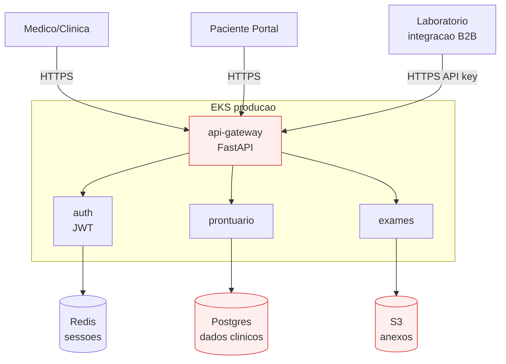

# Cenário PBL — MedVault: auditoria LGPD expõe dívida de segurança

> **PBL (Problem-Based Learning).** Este cenário é a linha narrativa do módulo. Você é consultor(a) DevSecOps contratado(a) para uma missão específica. Os blocos teóricos e exercícios giram em torno dele.

---

## A empresa

**MedVault** é uma **healthtech** que oferece sistema de **prontuário eletrônico em SaaS** para clínicas de pequeno e médio porte. Médicos lançam consultas, exames, receitas; pacientes acessam via portal; laboratórios enviam resultados via integração.

- **Fundada em:** 2019, em São Paulo.
- **Clientes (B2B):** 340 clínicas, concentradas no Sudeste; ~280 mil pacientes ativos.
- **Equipe:** 38 pessoas em engenharia (2 squads de produto, 1 squad de plataforma, **nenhum AppSec dedicado**).
- **Stack:** Python/FastAPI + Django Admin legado, Postgres 15 com dados clínicos, Redis, S3 (anexos de exames). Roda em Kubernetes gerenciado (EKS).
- **Regulação aplicável:** **LGPD** (Lei Geral de Proteção de Dados, art. 46 — "medidas de segurança técnicas e administrativas aptas a proteger os dados pessoais"), **Res. CFM 1821/2007** para prontuário digital, e expectativa de adesão a **ISO 27001** para contrato com grandes redes.

## A auditoria

Uma rede de clínicas da zona sul de São Paulo (contrato de R$ 340 mil/ano, a segunda maior conta da MedVault) exigiu, antes da renovação, que a MedVault passasse por **auditoria LGPD + ISO 27001** por uma consultoria externa. O relatório de **62 páginas** foi devastador.

Principais achados (resumido):

| # | Achado | Severidade | Evidência |
|---|--------|-----------|-----------|
| 1 | **Segredos versionados em git** | Alta | `DATABASE_URL` com senha visível em 14 commits; `.env` commitado em 2022. |
| 2 | **Dependências com CVE crítica** | Alta | `urllib3 1.26.5` vulnerável a CVE-2023-45803; Django 3.2 fora de suporte. |
| 3 | **Imagens Docker "fat"** | Média | Base `python:3.11` (~900MB) com `git`, `curl`, `vim`, rodando como `root`. |
| 4 | **Sem SBOM** | Média | Cliente pediu SBOM para due diligence; MedVault não tinha. |
| 5 | **Sem assinatura de imagem** | Média | Qualquer dev com acesso ao registry pode subir imagem; sem atestado. |
| 6 | **RBAC sem "least privilege"** | Alta | ServiceAccount default com `cluster-admin` em 4 namespaces. |
| 7 | **Pods como root** | Alta | 7 deployments com `runAsUser: 0`, sem `securityContext`. |
| 8 | **NetworkPolicy ausente** | Alta | Qualquer Pod pode falar com qualquer Pod e com internet. |
| 9 | **Secrets em ConfigMap** | Crítica | Senha do banco em ConfigMap (texto puro) desde 2021. |
| 10 | **Logs de audit K8s desabilitados** | Média | Sem registro de quem aplicou o quê, quando. |
| 11 | **Pipelines sem gate de segurança** | Alta | CI passa com 34 vulnerabilidades "HIGH" na imagem; ninguém impede. |
| 12 | **Resposta a incidentes ad-hoc** | Média | Incidente de 2024 (vazamento de 1200 e-mails) sem postmortem, sem plano. |

A consultoria atribuiu **nota 3,2/10** em maturidade de segurança. O contrato foi condicionado a um plano de remediação em **90 dias** com metas verificáveis.

---

## Impacto no negócio

- **Risco imediato:** perda do contrato da rede (R$ 340 mil/ano).
- **Risco regulatório:** LGPD prevê multa de até **2% do faturamento** (limitada a R$ 50 milhões) por incidente.
- **Risco reputacional:** healthtech que vaza prontuário **morre**. Não há segunda chance.
- **Risco operacional:** segredos em git viraram credenciais de serviço de terceiros — se alguém encontrar, pode acessar a base.

---

## Sua missão

Você tem 6 sprints (12 semanas) com um squad de 3 pessoas. Entregáveis esperados:

1. **Modelagem de ameaças** de pelo menos uma jornada crítica (ex.: login do médico + acesso ao prontuário), com STRIDE e plano de mitigação.
2. **Pipeline de CI endurecido** com gates:
   - SAST (Bandit + Semgrep).
   - SCA (pip-audit + Trivy FS).
   - Secrets detection (Gitleaks).
   - IaC scan (Checkov ou Trivy).
   - **Falha** o build em vulnerabilidade `HIGH`/`CRITICAL` sem exceção justificada.
3. **Imagens endurecidas** — base distroless ou alpine mínima, multi-stage, `USER` não-root, `HEALTHCHECK`, sem binários inúteis. Scan final sem `HIGH`/`CRITICAL`.
4. **SBOM** gerado no CI (Syft, formato CycloneDX + SPDX) e **publicado com a release**; assinatura via cosign + atestação de build.
5. **Registry com políticas**: bloquear deploy de imagem não-assinada ou com vulnerabilidades críticas via **Kyverno** admission.
6. **Cluster endurecido**:
   - Pod Security Standards: `restricted` em namespaces de prod.
   - NetworkPolicy `default-deny` + regras explícitas.
   - RBAC com ServiceAccounts por app, permissão mínima.
   - Audit logging habilitado e enviado ao Loki (Módulo 8).
7. **Gerência de segredos**: Sealed Secrets ou External Secrets + Vault — **zero** segredo em git ou ConfigMap em prod.
8. **Runbook de incidente de segurança** com papéis, comunicação LGPD e decisões de contenção.
9. **Plano de maturidade SLSA** — documento mostrando nível atual e meta de 12 meses.

---

## A pergunta norteadora

> **Como transformar um produto que "passa no teste funcional" em um produto que **também** passa no teste do adversário, sem sacrificar a velocidade de entrega que DevOps trouxe?**

Cada bloco deste módulo responde uma fatia dessa pergunta. Os exercícios progressivos entregam, ao final, uma evolução concreta da postura de segurança da MedVault — aplicável ao seu projeto.

---

## Arquitetura de partida (simplificada)

Áreas em risco herdadas: ingresso sem WAF, segredos em git, RBAC permissivo, imagens fat. Seu trabalho é endurecer sistematicamente, com feedback rápido no pipeline.

---

<!-- nav:start -->

| &nbsp; | &nbsp; | &nbsp; |
|:--|:--:|--:|
| **← Anterior** [Módulo 9 — DevSecOps](README.md) | **↑ Índice** [Módulo 9 — DevSecOps](README.md) | **Próximo →** [Bloco 1 — Fundamentos de DevSecOps](bloco-1/01-fundamentos-devsecops.md) |

<!-- nav:end -->
