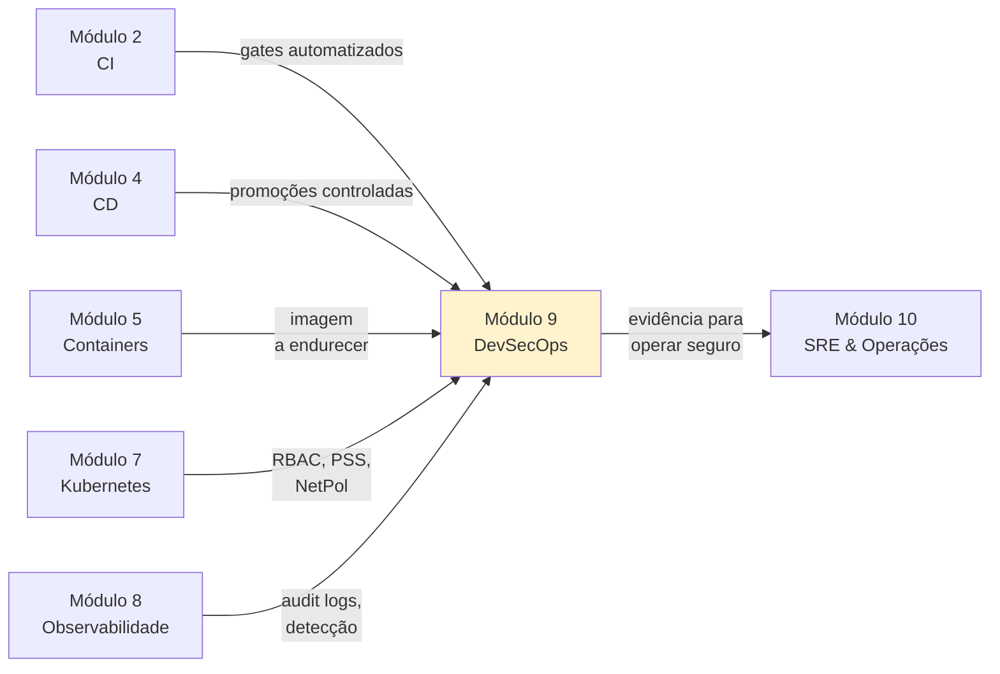

# Módulo 9 — DevSecOps

**Carga horária:** 6 horas
**Nível:** Graduação (ensino superior)
**Pré-requisitos:** Módulos 1 (Cultura), 2 (CI), 4 (CD), 5 (Containers), 7 (Kubernetes), 8 (Observabilidade)

---

## Por que este módulo vem aqui

Nos módulos anteriores, construímos **velocidade** (CI, CD, containers), **elasticidade** (Kubernetes, IaC) e **legibilidade** (observabilidade). Falta responder à pergunta que vem a seguir, sempre:

> *"Sim, entregamos rápido. Mas entregamos **seguro**?"*

Segurança tradicional é **gate no final**: um time de AppSec recebe a aplicação pronta, varredura, aponta 80 vulnerabilidades, atrasa o release. A prática moderna — **DevSecOps** — inverte a lógica: **segurança como propriedade contínua**, presente em **todas** as etapas do ciclo (código → dependências → build → imagem → deploy → runtime), com **feedback rápido** para quem escreve código.

> *"Security is everyone's responsibility."* — NIST SP 800-218 (SSDF)
>
> *"If you automate a bad process, you get a faster bad process. If you automate a secure process, you get security at speed."* — adaptação do mantra DevSecOps

Este módulo **não** ensina você a virar pentester — existem cursos de pentesting e segurança ofensiva próprios. Ensina o **mínimo prático e inadiável** que um engenheiro DevOps precisa dominar: integrar verificações automatizadas, modelar ameaças minimamente, endurecer imagens e clusters, assinar artefatos, gerenciar segredos, e fazer o pipeline **falhar** antes que algo inseguro chegue em produção.

---

## Objetivos de Aprendizagem

Ao final do módulo, você será capaz de:

- **Explicar** o *shift-left* de segurança e mapear práticas em cada estágio do ciclo.
- **Aplicar** modelagem de ameaças com **STRIDE** em diagramas de arquitetura simples.
- **Conhecer** as categorias da **OWASP Top 10** (web e API) e reconhecê-las no código.
- **Integrar** ferramentas **SAST** (Bandit, Semgrep), **SCA** (pip-audit, Trivy), **Secrets detection** (Gitleaks) e **IaC scanning** (Checkov/Trivy) no pipeline.
- **Endurecer** imagens OCI: base mínima (distroless/alpine), usuário não-root, `USER`, multi-stage, SBOM.
- **Gerar, assinar e verificar** SBOM (**Syft** + **cosign**/Sigstore); bloquear imagens não-assinadas via **admission controller** (Kyverno).
- **Aplicar** Pod Security Standards, NetworkPolicy restritiva, RBAC mínimo e audit logging.
- **Gerenciar** segredos em cluster com **Sealed Secrets** ou **External Secrets + Vault**, sem segredos em git.
- **Compreender** modelos de *supply chain security* — **SLSA**, **in-toto attestations** — e saber em que nível o seu projeto está.
- **Responder** a incidentes de segurança com base em evidência e sem pânico, com comunicação adequada (LGPD/GDPR).

---

## Estrutura do Material

| Ordem | Conteúdo | Arquivo(s) |
|-------|----------|------------|
| 0 | Cenário PBL (MedVault) | [00-cenario-pbl.md](00-cenario-pbl.md) |
| 1 | Fundamentos: shift-left, STRIDE, OWASP, SLSA | [bloco-1/01-fundamentos-devsecops.md](bloco-1/01-fundamentos-devsecops.md) · [exercícios](bloco-1/01-exercicios-resolvidos.md) |
| 2 | Código + dependências: SAST, SCA, Secrets, SBOM | [bloco-2/02-codigo-dependencias.md](bloco-2/02-codigo-dependencias.md) · [exercícios](bloco-2/02-exercicios-resolvidos.md) |
| 3 | Imagens + supply chain: Trivy, cosign, admission | [bloco-3/03-imagens-supply-chain.md](bloco-3/03-imagens-supply-chain.md) · [exercícios](bloco-3/03-exercicios-resolvidos.md) |
| 4 | Kubernetes em produção: PSS, Secrets, RBAC, audit | [bloco-4/04-k8s-producao.md](bloco-4/04-k8s-producao.md) · [exercícios](bloco-4/04-exercicios-resolvidos.md) |
| 5 | Exercícios progressivos (5 partes) | [exercicios-progressivos/](exercicios-progressivos/) |
| 6 | Entrega avaliativa | [entrega-avaliativa.md](entrega-avaliativa.md) |
| — | Referências bibliográficas | [referencias.md](referencias.md) |

---

## Como Estudar

1. **Leia o cenário PBL** — a **MedVault** é uma healthtech que gere prontuários e sofreu uma auditoria LGPD reveladora.
2. **Prepare o ferramental local:**
   ```bash
   # Python + deps
   python -m venv .venv && source .venv/bin/activate
   pip install -r requirements.txt

   # Ferramentas CLI (instalar uma vez)
   # Trivy (imagens, FS, IaC, k8s)
   curl -sfL https://raw.githubusercontent.com/aquasecurity/trivy/main/contrib/install.sh | sh -s -- -b /usr/local/bin
   # Syft (SBOM)
   curl -sSfL https://raw.githubusercontent.com/anchore/syft/main/install.sh | sh -s -- -b /usr/local/bin
   # Grype (vulnerabilidades em SBOM)
   curl -sSfL https://raw.githubusercontent.com/anchore/grype/main/install.sh | sh -s -- -b /usr/local/bin
   # Cosign (assinaturas)
   curl -sSfL -o /usr/local/bin/cosign https://github.com/sigstore/cosign/releases/latest/download/cosign-linux-amd64
   chmod +x /usr/local/bin/cosign
   # Gitleaks (segredos)
   curl -sSfL https://github.com/gitleaks/gitleaks/releases/latest/download/gitleaks_linux_x64.tar.gz | tar xz -C /usr/local/bin gitleaks
   ```
3. **Cluster local** — reuse o k3d do Módulo 7.
4. **Siga os blocos em ordem.** Bloco 1 dá o vocabulário; 2 e 3 constroem o pipeline seguro; 4 fecha com cluster endurecido.
5. **Mentalidade.** Em DevSecOps, falhar o pipeline é **sucesso** — é o sinal que o feedback chegou a tempo.

### Setup rápido

```bash
# Verificacoes
trivy --version
syft version
grype version
cosign version
gitleaks version
```

O `requirements.txt` consolidado está em [requirements.txt](requirements.txt).

---

## Ideia central do módulo

| Conceito | Significado |
|----------|-------------|
| **Shift-left** | Integrar segurança desde o editor e pre-commit, não só no fim |
| **Threat modeling** | Pensar, antes de codificar: "o que pode dar errado?" (STRIDE, LINDDUN) |
| **SAST** | Análise estática de código (padrões ruins, CWE) |
| **SCA** | Análise de dependências (CVEs em libs) |
| **Secrets detection** | Encontrar tokens/senhas commitados |
| **SBOM** | Lista formal de ingredientes da imagem/artefato |
| **Supply chain security** | Garantir integridade do caminho código → artefato → execução |
| **Admission control** | Porteiro do cluster — aceita/rejeita manifestos por política |
| **Zero Trust** | Nunca confie por default; autentique, autorize, criptografe sempre |
| **Least privilege** | Permissão mínima para cumprir a função |

> Segurança **não é estado**, é **processo contínuo**. Ferramentas automatizam, mas a responsabilidade por decidir *quando aceitar risco* é humana e documentada.

---

## Conexão com o restante da disciplina



---

## O que este módulo NÃO cobre

- **Pentest / red team** — disciplina própria; aqui cobrimos o lado defensivo e do pipeline.
- **Criptografia profunda** (algoritmos, implementações) — usamos bibliotecas bem-estabelecidas; não reinvente.
- **WAF / API Gateway avançado** (Kong, Apigee, Cloudflare) — mencionamos; prática foge do escopo.
- **Regulações completas** (PCI-DSS, HIPAA inteiros) — discutimos LGPD básico e ISO 27001 em nível de consciência.
- **Incident forensics profundo** (análise de memória, disco, malware) — cursos dedicados.

---

*Material alinhado a: NIST SSDF (SP 800-218); OWASP Top 10 (web + API) 2021/2023; OWASP SAMM; CIS Docker / Kubernetes Benchmarks; SLSA framework; documentação Trivy, Syft, cosign, Kyverno; The DevSecOps Handbook (diversos autores); Container Security (Rice, 2020).*

---

<!-- nav:start -->

**Navegação — Módulo 9 — DevSecOps**

- ← Anterior: [Referências — Módulo 8 (Observabilidade)](../08-observabilidade/referencias.md)
- → Próximo: [Cenário PBL — MedVault: auditoria LGPD expõe dívida de segurança](00-cenario-pbl.md)

<!-- nav:end -->
