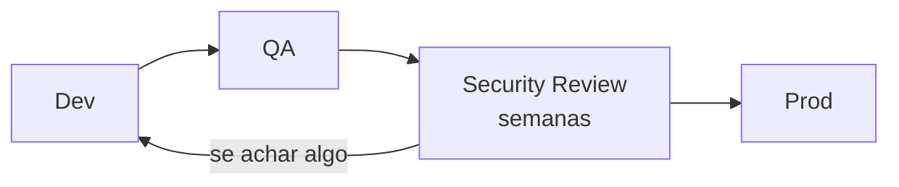
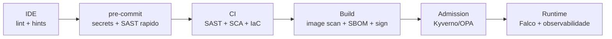
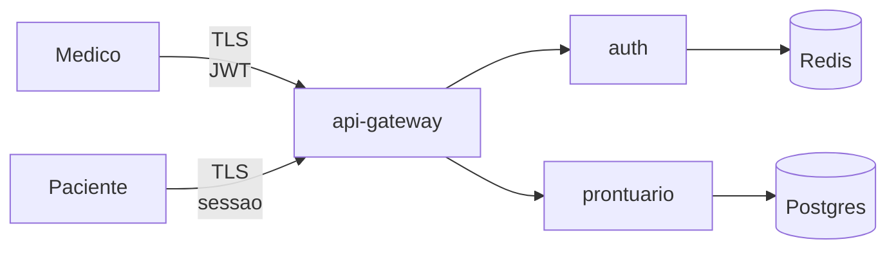

# Bloco 1 — Fundamentos de DevSecOps

> **Pergunta do bloco.** Antes de instalar qualquer scanner, o que **é** DevSecOps? Por que "segurança no fim" falha? Como se pensa sistematicamente em ameaças (STRIDE, OWASP)? E o que o mercado hoje chama de **supply chain security** e **SLSA**?

---

## 1.1 De Security-Gate a Security-Everywhere

### 1.1.1 O modelo tradicional

Nas décadas de 1990–2010, segurança era um **portão final**:



Problemas práticos:

- Feedback chega **semanas** depois da escrita do código, quando o contexto já se perdeu.
- O time de segurança vira **gargalo** e, em equipes rápidas, é **atropelado** (release com exceção virada rotina).
- Cultura de "nós vs. eles" — segurança é percebida como adversária do produto.
- Vulnerabilidades em dependências aparecem **após** deploy, no escaneamento externo.

### 1.1.2 Shift-left

DevSecOps propõe mover a segurança **para a esquerda** — para perto de quem escreve código:



Cada etapa tem custo baixo de feedback:

| Etapa | Tempo de feedback | Custo de correção |
|-------|-------------------|-------------------|
| IDE | segundos | trivial |
| pre-commit | 2–10 s | ainda no branch do dev |
| CI | minutos | antes do merge |
| Build | minutos | bloqueia imagem ruim |
| Admission | imediato | bloqueia deploy |
| Runtime | minutos | alerta e contenção |

**Princípio.** Quanto mais cedo o problema aparece, mais barato é consertar — e mais rápido a equipe aprende a *não cometê-lo de novo*.

### 1.1.3 Shift-left **não basta** (shift-right também existe)

Ingênuo pensar que shift-left resolve tudo. Algumas ameaças **só** aparecem em runtime:

- Comportamento anômalo (shell em container, tentativas de escalada).
- Vazamento de memória/credencial durante execução.
- CVE descoberta **depois** do deploy (dependência que era segura virou vulnerável).

Por isso DevSecOps maduro combina:

- **Shift-left**: prevenção.
- **Shift-right**: detecção, runtime protection, observabilidade de segurança.

### 1.1.4 Os 4 pilares do NIST SSDF

O framework [NIST SP 800-218](https://csrc.nist.gov/publications/detail/sp/800-218/final) resume em 4 práticas:

1. **PO — Prepare the Organization**: políticas, treinamento, ferramentas.
2. **PS — Protect the Software**: integridade do código e artefatos (assinatura, atestações).
3. **PW — Produce Well-Secured Software**: design seguro, code review, SAST/SCA, testes.
4. **RV — Respond to Vulnerabilities**: processo para tratar CVEs, comunicação, remediação.

Use essa taxonomia para **mapear** onde sua organização está: a maioria das startups tem PW parcial, PS quase zero, RV ad-hoc.

---

## 1.2 Modelagem de ameaças com STRIDE

Modelagem de ameaças (*threat modeling*) é o exercício de sentar antes de codificar e perguntar:

> **"O que pode dar errado? O que estamos fazendo a respeito?"**

### 1.2.1 O processo canônico (Shostack, 4 perguntas)

1. **What are we working on?** — diagrama de fluxo de dados (DFD).
2. **What can go wrong?** — aplicar taxonomia de ameaças (STRIDE).
3. **What are we going to do about it?** — mitigações, priorizadas.
4. **Did we do a good job?** — revisar.

### 1.2.2 STRIDE — seis categorias

| Letra | Ameaça | Propriedade violada | Exemplo |
|-------|--------|---------------------|---------|
| **S** | **Spoofing** | Autenticação | Atacante se passa por médico |
| **T** | **Tampering** | Integridade | Modificação de prontuário em trânsito |
| **R** | **Repudiation** | Não-repúdio | Médico nega ter prescrito algo |
| **I** | **Information Disclosure** | Confidencialidade | Vazamento de dados de paciente |
| **D** | **Denial of Service** | Disponibilidade | Portal do paciente fica inacessível |
| **E** | **Elevation of Privilege** | Autorização | Recepcionista lê prontuário restrito |

### 1.2.3 DFD rápido da MedVault



Fronteira de confiança (trust boundary): rede pública ↔ `api-gateway`. Tudo que **cruza** fronteira de confiança merece análise STRIDE.

### 1.2.4 Aplicando STRIDE ao login do médico

| Componente | Ameaça STRIDE | Cenário | Mitigação |
|------------|---------------|---------|-----------|
| `auth` | **S** | Credencial roubada via phishing | MFA obrigatório para perfis médicos |
| `auth` | **T** | JWT forjado com chave fraca | Algoritmo `RS256` com chave rotacionada; TTL curto |
| `auth` | **R** | "Eu não fiz esse login" | Log imutável com IP, user-agent, timestamp; retenção 6 meses |
| `gw → auth` | **I** | TLS fraco permitiria MITM | Enforce TLS 1.2+; HSTS; certificate pinning no app móvel |
| `auth` | **D** | Brute force derruba serviço | Rate-limit por IP e por conta; captcha |
| `auth` | **E** | Vulnerabilidade em biblioteca eleva privilégios | SCA contínuo; revisão de deps |

**Regra prática.** Para uma arquitetura real, 80% do valor vem de tratar **ameaças de alta probabilidade + alto impacto**. Pareto se aplica — não tente cobrir tudo de uma vez.

### 1.2.5 Quando modelar

- **Antes** de desenhar um serviço novo.
- Em **mudanças de arquitetura** (migração para cluster, nova dependência externa, mudança de auth).
- Em **incidentes** (reverse threat modeling: "o que o atacante explorou?").
- **Não** em cada PR — isso vira teatro. Modelagem é artefato vivo, revisado trimestralmente.

### 1.2.6 LINDDUN para privacidade

Quando o foco é **LGPD/GDPR**, complemente STRIDE com **LINDDUN** (categorias específicas de privacidade):

- **L**inkability — posso ligar ações ao mesmo usuário sem necessidade?
- **I**dentifiability — posso identificar a pessoa a partir do dado?
- **N**on-repudiation (ruim para privacidade) — o sistema força o usuário a assumir algo?
- **D**etectability — consigo saber que "esse paciente existe no sistema"?
- **D**isclosure of information.
- **U**nawareness — usuário não sabe o que está sendo coletado.
- **N**on-compliance — violação de normas.

MedVault é caso típico: prontuário é dado **sensível** pela LGPD (art. 5º-II); tratamento exige base legal específica (art. 11).

---

## 1.3 OWASP Top 10

A [OWASP Top 10](https://owasp.org/Top10/) é um consenso periódico sobre as **categorias** de falhas mais prevalentes em web/API. É **ponto de partida**, não meta.

### 1.3.1 OWASP Top 10 Web (2021)

1. **A01 Broken Access Control** — autorização falha (ex.: acesso direto a objeto via ID).
2. **A02 Cryptographic Failures** — uso errado/ausência de criptografia (dados em claro, algoritmos fracos).
3. **A03 Injection** — SQL injection, command injection, LDAP injection.
4. **A04 Insecure Design** — arquitetura que não considerou ameaças.
5. **A05 Security Misconfiguration** — defaults inseguros, permissões excessivas.
6. **A06 Vulnerable and Outdated Components** — dependências com CVE.
7. **A07 Identification and Authentication Failures** — sessões mal gerenciadas, MFA ausente.
8. **A08 Software and Data Integrity Failures** — builds não verificados, deserialização insegura.
9. **A09 Security Logging and Monitoring Failures** — sem rastro para detectar incidente.
10. **A10 Server-Side Request Forgery (SSRF)** — app chama URLs controladas por usuário.

### 1.3.2 OWASP API Security Top 10 (2023)

Versão específica para APIs, onde:
- A01 é **Broken Object Level Authorization** (IDOR: `GET /orders/42` sem checar dono).
- A02 é **Broken Authentication**.
- A03 é **Broken Object Property Level Authorization** (devolver campo sensível que o usuário não devia ver).
- A07 é **Server-Side Request Forgery**.
- A10 é **Unsafe Consumption of APIs** (confiar em parceiro externo cegamente).

**Para MedVault**, as mais sensíveis são A01 (médico só vê seus pacientes) e A03 (não devolver CPF quando só precisa nome).

### 1.3.3 Como usar no dia-a-dia

- **Review de design**: checklist informal com as 10 categorias.
- **Playbook de PR**: revisor pergunta "esse código cai em A01–A10?".
- **Mapeamento de mitigações**: cada controle (SAST, WAF, etc.) cobre subconjunto específico — documentar.

---

## 1.4 Supply Chain Security e SLSA

Ataques modernos miram o **caminho** entre o código e o usuário, não o código em si. Exemplos notórios:

- **SolarWinds (2020)**: atacantes modificaram o build do Orion, 18 mil orgs comprometidas.
- **Codecov (2021)**: script de uploader modificado; credenciais vazaram por semanas.
- **Log4Shell (2021)**: vulnerabilidade em dependência transitiva afetou metade da internet.
- **xz-utils (2024)**: backdoor inserido via PR em dependência de SSH.

Em todos os casos, o atacante não invadiu você — invadiu alguém da sua cadeia.

### 1.4.1 SLSA — Supply-chain Levels for Software Artifacts

[SLSA](https://slsa.dev) define níveis progressivos de garantia:

- **L1 — Documented**: build roda em script automatizado; proveniência gerada (metadados mínimos).
- **L2 — Hosted build**: build roda em plataforma confiável (GitHub Actions, etc.); proveniência assinada.
- **L3 — Hardened builds**: build é isolado, fontes e dependências são **verificadas**, proveniência é não-forjável.
- **(L4 em esboço)** — mais rigor: revisão humana obrigatória, build hermético.

### 1.4.2 Proveniência (provenance)

Conjunto de metadados verificáveis sobre **como** um artefato foi produzido:

```json
{
  "predicate_type": "https://slsa.dev/provenance/v1",
  "predicate": {
    "buildType": "https://github.com/actions/workflow@v1",
    "builder": { "id": "https://github.com/actions/runner" },
    "invocation": { "configSource": { "uri": "git+https://github.com/medvault/api", "digest": { "sha1": "abc..." } } },
    "materials": [ { "uri": "pkg:pypi/fastapi@0.115.4", "digest": {...} } ]
  }
}
```

Em GitHub Actions, geração automática via [`slsa-framework/slsa-github-generator`](https://github.com/slsa-framework/slsa-github-generator).

### 1.4.3 in-toto attestations

Modelo genérico para **atestar passos do pipeline**. Cada passo produz atestado assinado:

- "Build passou nos testes unitários" — assinado pelo runner.
- "SBOM foi gerado a partir deste commit" — assinado pelo Syft.
- "Imagem foi scanneada por Trivy" — assinado pelo job.

O destino verifica a **cadeia**: nada subiu sem passar pelos passos esperados.

### 1.4.4 Sigstore e cosign

[Sigstore](https://www.sigstore.dev/) tornou assinatura trivial:

- Usa OIDC (e-mail do dev ou identidade do GitHub Actions) em vez de chaves longas.
- Armazena registros em **Rekor** (transparency log), evidência pública.
- `cosign sign` / `cosign verify` operam sobre artefatos OCI (imagens, SBOMs, etc.).

Exemplo:

```bash
# sign (keyless, via OIDC do GitHub Actions)
COSIGN_EXPERIMENTAL=1 cosign sign ghcr.io/medvault/api:v1.0.0

# attest um SBOM
cosign attest --predicate sbom.cdx.json --type cyclonedx ghcr.io/medvault/api:v1.0.0

# verify
cosign verify \
  --certificate-identity "https://github.com/medvault/api/.github/workflows/release.yml@refs/heads/main" \
  --certificate-oidc-issuer "https://token.actions.githubusercontent.com" \
  ghcr.io/medvault/api:v1.0.0
```

Veremos a integração no Bloco 3.

---

## 1.5 Princípios estruturantes de DevSecOps

Mais importante que ferramenta é **princípio**. Quatro que você deve interiorizar:

### 1.5.1 Defense in Depth

Nunca confie numa única camada. Exemplo: mesmo com WAF, você valida input no app; mesmo com RBAC, aplica NetworkPolicy; mesmo com TLS, cripto no banco.

### 1.5.2 Least Privilege

Cada ator (usuário, serviço, processo) recebe **o mínimo** de permissões para cumprir sua função. ServiceAccount do app não precisa de `cluster-admin`; provavelmente precisa de zero permissão no kube-api.

### 1.5.3 Zero Trust

Não confie por padrão, **autentique continuamente**. Dentro do cluster: mTLS entre serviços, autorização por chamada, auditoria. "Nós estamos atrás do firewall, então é seguro" é mantra morto.

### 1.5.4 Fail Secure

Em caso de dúvida, **negue**. Policy ausente = deny; autenticação falha = rejeita; assinatura inválida = não aplica.

---

## 1.6 A equação do risco

Não existe "segurança absoluta". Existe **gestão de risco**:

$$ \text{Risco} = \text{Probabilidade} \times \text{Impacto} $$

Estratégias:

- **Evitar** (remove o risco): não coletar o dado.
- **Reduzir** (mitigação técnica): criptografar, endurecer.
- **Transferir** (seguro ou 3ºs): contratar processamento de pagamentos terceirizado.
- **Aceitar** (documentado): "aceitamos CVE X porque vetor de ataque exige acesso físico ao host; revisamos em 60 dias".

**Aceitar é válido**. Aceitar silenciosamente, não.

---

## 1.7 Script Python: `threat_catalog.py`

Ferramenta simples para manter catálogo de ameaças de forma estruturada (YAML) e gerar relatório. Útil para o time revisar.

```python
"""
threat_catalog.py - cataloga e prioriza ameacas STRIDE a partir de YAML.

Formato YAML esperado:
    components:
      - name: auth
        flows: [login, refresh_token]
        threats:
          - id: T-001
            category: S  # Spoofing
            description: Credencial roubada via phishing
            likelihood: M  # L/M/H
            impact: H
            mitigations:
              - "MFA obrigatorio para perfis medicos"
            status: accepted # accepted/in-progress/mitigated

Uso:
    python threat_catalog.py threats.yaml
"""
from __future__ import annotations

import argparse
import sys
from dataclasses import dataclass

import yaml
from rich.console import Console
from rich.table import Table

CATEGORIAS = {"S": "Spoofing", "T": "Tampering", "R": "Repudiation",
              "I": "Info Disclosure", "D": "DoS", "E": "Elevation"}
SCORE = {"L": 1, "M": 2, "H": 3}


@dataclass(frozen=True)
class Ameaca:
    id: str
    componente: str
    categoria: str
    descricao: str
    likelihood: str
    impact: str
    mitigacoes: tuple[str, ...]
    status: str

    @property
    def risco(self) -> int:
        return SCORE.get(self.likelihood, 0) * SCORE.get(self.impact, 0)


def carregar(path: str) -> list[Ameaca]:
    with open(path, "r", encoding="utf-8") as fh:
        doc = yaml.safe_load(fh) or {}
    ameacas: list[Ameaca] = []
    for comp in doc.get("components", []):
        nome = comp.get("name", "?")
        for t in comp.get("threats", []):
            ameacas.append(
                Ameaca(
                    id=t.get("id", "?"),
                    componente=nome,
                    categoria=t.get("category", "?"),
                    descricao=t.get("description", ""),
                    likelihood=t.get("likelihood", "L"),
                    impact=t.get("impact", "L"),
                    mitigacoes=tuple(t.get("mitigations", [])),
                    status=t.get("status", "accepted"),
                )
            )
    return ameacas


def relatar(ameacas: list[Ameaca]) -> int:
    console = Console()
    tabela = Table(title="Catalogo de Ameacas (STRIDE)")
    for col in ("id", "componente", "categoria", "likelihood", "impact", "risco", "status", "descricao"):
        tabela.add_column(col)
    for a in sorted(ameacas, key=lambda x: -x.risco):
        cat = f"{a.categoria} - {CATEGORIAS.get(a.categoria, '?')}"
        tabela.add_row(a.id, a.componente, cat, a.likelihood, a.impact, str(a.risco), a.status, a.descricao)
    console.print(tabela)

    # Resumo
    aberto_alto = [a for a in ameacas if a.risco >= 6 and a.status != "mitigated"]
    console.print(f"\nTotal ameacas: {len(ameacas)}")
    console.print(f"Alto risco em aberto (>=6 e nao mitigada): {len(aberto_alto)}")
    for a in aberto_alto:
        console.print(f"  - {a.id} [{a.componente}] {a.descricao} (status: {a.status})")
    return 0 if not aberto_alto else 1


def main(argv: list[str] | None = None) -> int:
    p = argparse.ArgumentParser(description="Catalogo de ameacas STRIDE")
    p.add_argument("arquivo", help="YAML de ameacas")
    args = p.parse_args(argv)
    try:
        ameacas = carregar(args.arquivo)
    except (OSError, yaml.YAMLError) as exc:
        print(f"ERRO: {exc}", file=sys.stderr)
        return 2
    if not ameacas:
        print("ERRO: nenhuma ameaca carregada", file=sys.stderr)
        return 2
    return relatar(ameacas)


if __name__ == "__main__":
    raise SystemExit(main())
```

Exemplo de `threats.yaml`:

```yaml
components:
  - name: auth
    flows: [login, refresh_token]
    threats:
      - id: T-001
        category: S
        description: Credencial roubada via phishing
        likelihood: M
        impact: H
        mitigations:
          - MFA obrigatorio para perfis medicos
          - Monitorar login de IP novo
        status: in-progress
      - id: T-002
        category: I
        description: JWT logado em erro expose claims
        likelihood: M
        impact: M
        mitigations:
          - Filtrar logger para mascarar tokens
        status: mitigated
  - name: prontuario
    flows: [read_patient, update_patient]
    threats:
      - id: T-010
        category: E
        description: Medico de uma clinica acessa paciente de outra
        likelihood: H
        impact: H
        mitigations:
          - Authorization por tenant_id em toda query
          - Testes de IDOR no CI
        status: in-progress
```

Rodar:

```bash
python threat_catalog.py threats.yaml
```

---

## 1.8 Checklist do bloco

- [ ] Explico shift-left e shift-right e onde cada um se aplica.
- [ ] Uso STRIDE para mapear ameaças de um componente.
- [ ] Reconheço OWASP Top 10 web e API.
- [ ] Identifico em que **nível SLSA** um repositório está hoje.
- [ ] Aplico os 4 princípios: defense in depth, least privilege, zero trust, fail secure.
- [ ] Articulo "risco = prob × impacto" para decidir entre mitigar, transferir, aceitar.
- [ ] Uso `threat_catalog.py` para priorizar ameaças de um projeto.

Vá aos [exercícios resolvidos do Bloco 1](./01-exercicios-resolvidos.md).
