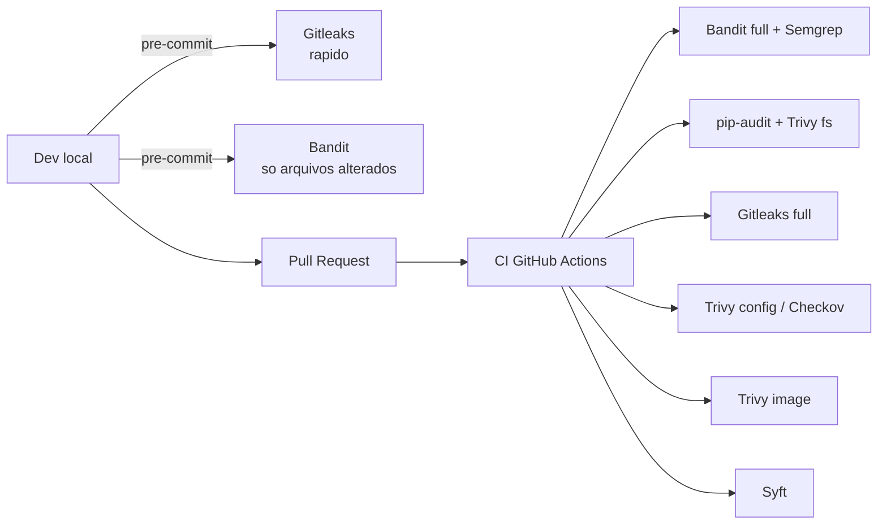
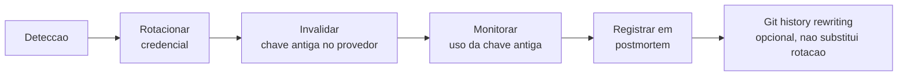

# Bloco 2 — Segurança do código e das dependências

> **Pergunta do bloco.** Como garantir, automaticamente e em minutos, que nenhum commit introduz **padrão inseguro**, **CVE conhecida** em dependência ou **credencial vazada** — e que o pipeline **falha** antes que isso chegue em qualquer lugar que importe?

---

## 2.1 Taxonomia das checagens

Quatro famílias de scanners cobrem o código e suas dependências. Cada uma responde a uma pergunta diferente.

| Ferramenta | Sigla | Pergunta que responde | Exemplo no Python |
|------------|-------|-----------------------|-------------------|
| **SAST** | Static Application Security Testing | *"O código-fonte tem padrões inseguros conhecidos?"* | Bandit, Semgrep |
| **SCA** | Software Composition Analysis | *"Minhas dependências têm CVE conhecidas?"* | pip-audit, Trivy (modo FS) |
| **Secrets detection** | — | *"Há tokens/senhas commitados?"* | Gitleaks, TruffleHog |
| **IaC scanning** | — | *"Meus manifestos têm configurações inseguras?"* | Checkov, Trivy (modo config) |

Adicione a elas duas ferramentas relacionadas (que veremos no Bloco 3):

- **Image scan**: Trivy em imagem construída.
- **SBOM**: Syft gerando lista de ingredientes.

### 2.1.1 Onde cada uma atua no pipeline



O princípio: ferramentas **rápidas** no pre-commit (feedback em segundos); ferramentas **completas** no CI (feedback em minutos).

---

## 2.2 SAST — análise estática

### 2.2.1 O que SAST **faz** e **não faz**

- ✅ Detecta padrões sintáticos ruins: `eval()`, `subprocess.run(shell=True, cmd)` com input, `pickle.loads` de bytes externos, uso de algoritmos cripto obsoletos, `yaml.load` sem safe.
- ✅ Cobertura ampla com pouco custo.
- ❌ **Não** detecta lógica de negócio insegura (IDOR, autorização faltante).
- ❌ Produz **falsos positivos** — toda regra é heurística.

### 2.2.2 Bandit (Python-específico)

Focado em Python. Executa sobre o AST e reporta achados com severidade (`LOW/MEDIUM/HIGH`) e confiança.

```bash
# Basico
bandit -r src/

# Com config e baseline
bandit -r src/ -c pyproject.toml -o bandit.json -f json
```

Exemplo de código que o Bandit pega:

```python
import subprocess
import yaml

def render(req):
    cmd = req.query_params["cmd"]
    subprocess.run(cmd, shell=True)   # [B602] shell=True com input externo
    config = yaml.load(req.body)       # [B506] yaml.load sem SafeLoader
    return ok()
```

Config em `pyproject.toml`:

```toml
[tool.bandit]
exclude_dirs = ["tests", ".venv"]
skips = ["B101"]    # assert usage aceito em tests
# severity/confidence defaults fornecidos; ajustar para HIGH/HIGH em CI
```

### 2.2.3 Semgrep (multi-linguagem, regras declarativas)

Semgrep usa **regras baseadas em sintaxe abstrata** — permite escrever padrões específicos do seu domínio.

```bash
# Regras padrao (cobre OWASP Top 10)
semgrep --config auto src/

# Regras customizadas do repo
semgrep --config ./.semgrep/ src/
```

Exemplo de regra customizada (arquivo `.semgrep/medvault.yaml`):

```yaml
rules:
  - id: medvault-no-cpf-em-log
    pattern-either:
      - pattern: log.$X($MSG, ..., cpf=$Y, ...)
      - pattern: log.$X($MSG, ..., cpf=$Y)
    message: "Nao logar CPF (dado sensivel LGPD)."
    languages: [python]
    severity: ERROR

  - id: medvault-sem-httponly-cookie
    pattern: response.set_cookie($NAME, $VAL)
    message: "Cookie deve ser httponly e secure."
    pattern-not-inside: |
      response.set_cookie($NAME, $VAL, httponly=True, secure=True, ...)
    languages: [python]
    severity: ERROR
```

### 2.2.4 Regra: escolher UM SAST principal, COMPLEMENTAR com regras custom

Por que combinar:

- **Bandit**: cobertura ampla Python, fácil de começar.
- **Semgrep**: regras do seu domínio (ex.: "não logar CPF") que nenhum SAST genérico pega.

Custom rules valem mais que 1000 regras genéricas **para o seu sistema**.

---

## 2.3 SCA — Software Composition Analysis

Mais de **90%** do código em produção é importado de dependências. SCA compara sua lista de dependências contra bancos de CVE (NVD, OSV, GHSA).

### 2.3.1 pip-audit

```bash
pip install pip-audit
pip-audit -r requirements.txt
pip-audit -r requirements.txt --fix   # tenta sugerir upgrade
pip-audit -r requirements.txt --format json > audit.json
```

Saída:

```
Found 2 known vulnerabilities in 1 package
Name     Version ID             Fix Versions
-------- ------- -------------- ------------
urllib3  1.26.5  GHSA-v845-jxx5 1.26.18
```

### 2.3.2 Trivy modo filesystem

Trivy varre repositório olhando lockfiles (`requirements.txt`, `poetry.lock`, `package-lock.json`, `go.mod`) sem precisar instalar deps.

```bash
trivy fs . --severity HIGH,CRITICAL --exit-code 1
```

Vantagem sobre `pip-audit`: cobre **todos os ecossistemas** do repositório (Python, JS, Go, Terraform...).

### 2.3.3 Tipos de dependência que importa distinguir

| Tipo | Exemplo | Tratamento |
|------|---------|------------|
| **Direta** | `fastapi` no `requirements.txt` | Você controla; upgrade direto |
| **Transitiva** | `starlette` (dep do fastapi) | Não controla diretamente; upgrade via dep pai |
| **Dev-only** | `pytest`, `bandit` | Não vai a produção; risco menor |
| **Sistema** | `libssl` na imagem | Tratar com Dockerfile (Bloco 3) |

Pip e Poetry têm comportamentos diferentes: `pip` resolve em tempo de instalação; `poetry.lock` congela todas transitivas — facilita SCA reproduzível.

### 2.3.4 Política razoável

- `CRITICAL` ou `HIGH` **com fix disponível**: **bloqueia** PR.
- `HIGH` sem fix: **aceita temporário** com issue registrada e data-limite.
- `MEDIUM`/`LOW`: acompanha em dashboard, sem bloquear.
- Dev-only: mais permissivo, mas mantém visibilidade.

---

## 2.4 Secrets detection

### 2.4.1 Por que isso é prioridade absoluta

- Segredo em commit é **público para sempre** (mesmo após rebase/force-push — histórico indexável em espelhos, GitHub archive, Google cache).
- Bots varrendo GitHub detectam em **minutos**.
- Uma AWS key vazada pode gerar milhares de dólares em minutos.

### 2.4.2 Gitleaks

```bash
# Varrer histórico inteiro
gitleaks detect --source . --verbose

# Pre-commit: varrer somente arquivos staged
gitleaks protect --staged --verbose

# Com config customizada
gitleaks detect --config .gitleaks.toml
```

`.gitleaks.toml`:

```toml
title = "MedVault gitleaks config"

[extend]
useDefault = true

[[rules]]
id = "medvault-sus-secret"
description = "String tipo chave de API MedVault"
regex = '''medvault_(sk|pk)_[A-Za-z0-9]{32,}'''
tags = ["key", "medvault"]

[allowlist]
paths = [
  '''tests/fixtures/.*''',
]
```

### 2.4.3 Pre-commit hook

`.pre-commit-config.yaml`:

```yaml
repos:
  - repo: https://github.com/gitleaks/gitleaks
    rev: v8.18.2
    hooks:
      - id: gitleaks

  - repo: https://github.com/PyCQA/bandit
    rev: 1.7.10
    hooks:
      - id: bandit
        args: ["-q", "-lll"]   # so HIGH severity em pre-commit
        exclude: ^tests/

  - repo: https://github.com/astral-sh/ruff-pre-commit
    rev: v0.7.3
    hooks:
      - id: ruff
```

Instalar:

```bash
pip install pre-commit
pre-commit install
```

### 2.4.4 Se um segredo vazou

A única resposta correta: **considere comprometido, rotacione imediatamente**. Git history rewriting **não apaga** do registro público.



---

## 2.5 SBOM — Software Bill of Materials

SBOM é a **lista de ingredientes** de um artefato. Em 2021, o Executive Order 14028 nos EUA tornou SBOM **exigência** para software vendido ao governo. Ela vai se tornando padrão de due diligence B2B.

### 2.5.1 Formatos principais

- **SPDX** (Linux Foundation) — mais usado em conformidade/auditoria.
- **CycloneDX** (OWASP) — mais usado em segurança aplicada, melhor suporte a vulnerabilidade.

Ambos são JSON/XML; escolha **um principal**, gere os dois se CI comportar.

### 2.5.2 Syft

```bash
# SBOM de diretório
syft . -o cyclonedx-json > sbom.cdx.json

# SBOM de imagem
syft docker:medvault/api:v1.0.0 -o spdx-json > sbom.spdx.json

# Múltiplos formatos de uma vez
syft docker:medvault/api:v1.0.0 \
  -o cyclonedx-json=sbom.cdx.json \
  -o spdx-json=sbom.spdx.json
```

Trecho do SBOM CycloneDX:

```json
{
  "bomFormat": "CycloneDX",
  "specVersion": "1.5",
  "metadata": { "component": { "name": "medvault-api", "version": "1.0.0" } },
  "components": [
    {
      "type": "library",
      "name": "fastapi",
      "version": "0.115.4",
      "purl": "pkg:pypi/fastapi@0.115.4",
      "licenses": [{"license": {"id": "MIT"}}]
    }
  ]
}
```

### 2.5.3 Grype — vulnerabilidades a partir de SBOM

```bash
grype sbom:sbom.cdx.json --fail-on high
```

Vantagem de SBOM + Grype: mesmo SBOM pode ser reanalisado depois — se uma CVE for descoberta **amanhã**, você reexecuta Grype sobre o SBOM antigo e sabe se foi afetado.

### 2.5.4 Onde armazenar

- SBOM como **asset de release** (GitHub Releases).
- SBOM atestada no registry OCI via `cosign attest` (ver Bloco 3).
- Guardar por no mínimo **o tempo de suporte** da versão.

---

## 2.6 IaC scanning

Seu Dockerfile e seus YAMLs K8s **são código** — e podem esconder problemas de segurança.

### 2.6.1 Exemplos clássicos

- Dockerfile sem `USER` → container roda como root.
- Deployment sem `readOnlyRootFilesystem: true`.
- NetworkPolicy ausente.
- `hostNetwork: true` sem necessidade.

### 2.6.2 Trivy config

```bash
# Varre Dockerfile, YAML K8s, Terraform, Helm
trivy config .
trivy config . --severity HIGH,CRITICAL --exit-code 1
```

Ele usa regras baseadas em **Open Policy Agent (OPA/Rego)** sob o capô.

### 2.6.3 Checkov

Mais especializado, com catálogo grande e amigável para relatórios:

```bash
checkov -d . --framework all --soft-fail
checkov -d . --framework kubernetes,dockerfile
checkov -d . -f charts/medvault/values.yaml
```

Gera SARIF:

```bash
checkov -d . -o sarif > checkov.sarif
```

---

## 2.7 Integração em GitHub Actions

Exemplo de pipeline consolidado. **Cada job** roda em paralelo; **nenhum** é `continue-on-error`.

```yaml
name: security-ci

on:
  pull_request:
    branches: [main]
  push:
    branches: [main]

permissions:
  contents: read
  security-events: write   # para upload SARIF

jobs:
  sast:
    runs-on: ubuntu-latest
    steps:
      - uses: actions/checkout@v4
      - uses: actions/setup-python@v5
        with: { python-version: '3.12' }
      - run: pip install bandit semgrep
      - name: Bandit
        run: bandit -r src/ -f sarif -o bandit.sarif
      - name: Semgrep
        run: semgrep --config auto --sarif --output semgrep.sarif src/
      - uses: github/codeql-action/upload-sarif@v3
        with: { sarif_file: semgrep.sarif }
      - uses: github/codeql-action/upload-sarif@v3
        with: { sarif_file: bandit.sarif }

  sca:
    runs-on: ubuntu-latest
    steps:
      - uses: actions/checkout@v4
      - uses: actions/setup-python@v5
        with: { python-version: '3.12' }
      - run: pip install pip-audit
      - run: pip-audit -r requirements.txt --strict

  secrets:
    runs-on: ubuntu-latest
    steps:
      - uses: actions/checkout@v4
        with: { fetch-depth: 0 }
      - uses: gitleaks/gitleaks-action@v2

  iac:
    runs-on: ubuntu-latest
    steps:
      - uses: actions/checkout@v4
      - name: Trivy config
        uses: aquasecurity/trivy-action@master
        with:
          scan-type: config
          severity: HIGH,CRITICAL
          exit-code: '1'

  sbom:
    runs-on: ubuntu-latest
    needs: [sast, sca, secrets, iac]
    steps:
      - uses: actions/checkout@v4
      - name: Syft
        uses: anchore/sbom-action@v0
        with:
          format: cyclonedx-json
          output-file: sbom.cdx.json
      - uses: actions/upload-artifact@v4
        with: { name: sbom, path: sbom.cdx.json }
```

### 2.7.1 Publicar SARIF no GitHub Security

`github/codeql-action/upload-sarif` envia achados para a aba **Security → Code scanning**, agrupados por arquivo e regra, com histórico e vinculação a PR.

### 2.7.2 Política de bloqueio

- Configure *branch protection* em `main`: requer passagem dos checks `sast`, `sca`, `secrets`, `iac`.
- Obrigue code review (≥ 1 aprovador, com `CODEOWNERS`).
- Proibir force-push em `main`.

---

## 2.8 Exceções documentadas

Segurança sem válvula de escape vira sabotagem operacional. Tenha um arquivo `.trivyignore` (ou equivalente) com entradas assinadas por significado:

```
# CVE-2024-XXXXX
#   Package: cryptography 41.0.0
#   Severity: HIGH
#   Status: aceita ate 2025-07-01
#   Justificativa: vetor requer pubkey controlada por atacante; fluxo nao existe no produto.
#   Responsavel: AppSec@medvault
#   Revisao: ticket SEC-1234
CVE-2024-XXXXX
```

Reflita trimestralmente — exceção sem prazo e dono vira dívida permanente.

---

## 2.9 Script Python: `security_report.py`

Consolida relatórios SARIF/JSON de múltiplas ferramentas em uma visão única, útil para o dashboard do projeto.

```python
"""
security_report.py - consolida achados de seguranca em uma tabela unica.

Entende:
  - SARIF (Bandit, Semgrep, Trivy em modo SARIF)
  - JSON do pip-audit (--format json)

Uso:
    python security_report.py bandit.sarif semgrep.sarif pip-audit.json --fail-on high
"""
from __future__ import annotations

import argparse
import json
import sys
from dataclasses import dataclass

from rich.console import Console
from rich.table import Table

SEV_RANK = {"none": 0, "note": 1, "low": 1, "medium": 2,
            "warning": 2, "high": 3, "error": 3, "critical": 4}


@dataclass(frozen=True)
class Achado:
    ferramenta: str
    id: str
    severidade: str
    alvo: str
    descricao: str


def carregar_sarif(path: str) -> list[Achado]:
    with open(path, "r", encoding="utf-8") as fh:
        doc = json.load(fh)
    out: list[Achado] = []
    for run in doc.get("runs", []):
        tool = ((run.get("tool") or {}).get("driver") or {}).get("name", "sarif")
        for res in run.get("results", []):
            lvl = res.get("level", res.get("properties", {}).get("severity", "warning")).lower()
            rid = res.get("ruleId", "?")
            loc = (res.get("locations") or [{}])[0].get("physicalLocation", {}).get("artifactLocation", {}).get("uri", "?")
            msg = (res.get("message") or {}).get("text", "")
            out.append(Achado(tool, rid, lvl, loc, msg))
    return out


def carregar_pip_audit(path: str) -> list[Achado]:
    with open(path, "r", encoding="utf-8") as fh:
        doc = json.load(fh)
    out: list[Achado] = []
    for dep in doc.get("dependencies", []):
        nome = dep.get("name")
        versao = dep.get("version")
        for v in dep.get("vulns", []):
            out.append(Achado(
                ferramenta="pip-audit",
                id=v.get("id", "?"),
                severidade=(v.get("aliases") and "medium") or "high",
                alvo=f"{nome}=={versao}",
                descricao=v.get("description", "")[:120],
            ))
    return out


def carregar(path: str) -> list[Achado]:
    if path.endswith(".sarif"):
        return carregar_sarif(path)
    if path.endswith(".json"):
        return carregar_pip_audit(path)
    raise ValueError(f"Formato nao suportado: {path}")


def main(argv: list[str] | None = None) -> int:
    p = argparse.ArgumentParser()
    p.add_argument("arquivos", nargs="+")
    p.add_argument("--fail-on", default="high", choices=list(SEV_RANK.keys()))
    args = p.parse_args(argv)

    limite = SEV_RANK[args.fail_on]
    todos: list[Achado] = []
    for f in args.arquivos:
        try:
            todos.extend(carregar(f))
        except (OSError, ValueError, json.JSONDecodeError) as exc:
            print(f"AVISO: nao consegui ler {f}: {exc}", file=sys.stderr)

    if not todos:
        print("Nenhum achado. (Arquivos vazios ou sem vulnerabilidades.)")
        return 0

    console = Console()
    tabela = Table(title="Relatorio consolidado de seguranca")
    for col in ("ferramenta", "severidade", "id", "alvo", "descricao"):
        tabela.add_column(col)
    for a in sorted(todos, key=lambda x: -SEV_RANK.get(x.severidade, 0)):
        tabela.add_row(a.ferramenta, a.severidade, a.id, a.alvo, a.descricao)
    console.print(tabela)

    piores = [a for a in todos if SEV_RANK.get(a.severidade, 0) >= limite]
    console.print(f"\nTotal: {len(todos)} | >= {args.fail_on}: {len(piores)}")
    return 0 if not piores else 1


if __name__ == "__main__":
    raise SystemExit(main())
```

Uso:

```bash
python security_report.py bandit.sarif semgrep.sarif pip-audit.json --fail-on high
```

---

## 2.10 Checklist do bloco

- [ ] Distingo SAST, SCA, Secrets e IaC scanning e sei quando aplicar cada.
- [ ] Configuro pre-commit com Gitleaks + Bandit rápido.
- [ ] Integro Bandit, Semgrep, pip-audit, Trivy, Checkov em GitHub Actions paralelo.
- [ ] Gero SBOM (Syft) e analiso com Grype.
- [ ] Publico achados em GitHub Security (SARIF).
- [ ] Documento exceções em `.trivyignore` com justificativa, dono e prazo.
- [ ] Uso `security_report.py` para visualização unificada.

Vá aos [exercícios resolvidos do Bloco 2](./02-exercicios-resolvidos.md).
