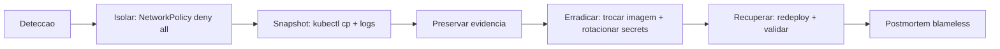

# Bloco 4 — Segurança do cluster em produção

> **Pergunta do bloco.** Pipelines endurecidos não salvam um cluster mal configurado. Como aplicar **least privilege**, **defense in depth** e **Zero Trust** no próprio Kubernetes — **PSS**, **NetworkPolicy**, **RBAC**, **Secrets**, **audit** — e sustentar com evidência e rotina?

---

## 4.1 Pod Security Standards (PSS)

O Kubernetes formalizou três níveis de segurança para Pods:

| Nível | O que garante | Para quê |
|-------|---------------|---------|
| **privileged** | Nenhuma restrição | Componentes de infra que precisam (CNI, CSI) |
| **baseline** | Impede capacidades óbvias (hostNetwork, hostPID, privilegedContainers) | Desenvolvimento, cargas legadas |
| **restricted** | Máximo: runAsNonRoot, seccomp, capabilities drop ALL, readOnlyRootFilesystem | Produção |

### 4.1.1 Aplicação por namespace

```yaml
apiVersion: v1
kind: Namespace
metadata:
  name: medvault-prod
  labels:
    pod-security.kubernetes.io/enforce: restricted
    pod-security.kubernetes.io/enforce-version: latest
    pod-security.kubernetes.io/audit: restricted
    pod-security.kubernetes.io/warn: restricted
```

- **enforce**: rejeita o manifest.
- **audit**: log no audit policy (sem bloquear).
- **warn**: mostra aviso no `kubectl apply`.

Migração prática: comece com **warn** e **audit**, corrija workloads, suba para **enforce**.

### 4.1.2 Pod conforme restricted

```yaml
apiVersion: apps/v1
kind: Deployment
metadata:
  name: prontuario
  namespace: medvault-prod
spec:
  replicas: 2
  selector: { matchLabels: { app: prontuario } }
  template:
    metadata:
      labels: { app: prontuario }
    spec:
      securityContext:
        runAsNonRoot: true
        runAsUser: 10001
        runAsGroup: 10001
        fsGroup: 10001
        seccompProfile:
          type: RuntimeDefault
      automountServiceAccountToken: false
      containers:
        - name: app
          image: ghcr.io/medvault/prontuario@sha256:abc...
          securityContext:
            allowPrivilegeEscalation: false
            readOnlyRootFilesystem: true
            capabilities:
              drop: ["ALL"]
          resources:
            requests: { cpu: 50m, memory: 128Mi }
            limits:   { cpu: 500m, memory: 512Mi }
          ports:
            - containerPort: 8000
          volumeMounts:
            - { name: tmp, mountPath: /tmp }
      volumes:
        - name: tmp
          emptyDir: {}
```

Pontos:

- `runAsNonRoot: true` + UID/GID explícitos.
- `readOnlyRootFilesystem` + `emptyDir` para `/tmp` (que apps frequentemente precisam).
- `capabilities.drop: ["ALL"]` — não precisa de `NET_ADMIN`, `SYS_ADMIN`, etc.
- `seccompProfile: RuntimeDefault` — perfil seccomp do runtime (bloqueia dezenas de syscalls perigosas).
- `automountServiceAccountToken: false` se o app não fala com kube-api.
- Resources definidos (DoS containment).

### 4.1.3 Alternativa: Kyverno para substituir/melhorar PSS

PSS é built-in mas limitado. Kyverno pode aplicar regras **equivalentes** e mais finas (ex.: exigir *probe* configurado, label específico, registry allowlist). Muitos times usam **PSS no baseline** + **Kyverno para restricted+**.

---

## 4.2 NetworkPolicy — default deny

Por padrão no Kubernetes, **todo Pod fala com todo Pod**. Em produção isso é inaceitável — um Pod comprometido consegue varrer a rede interna inteira.

### 4.2.1 Default deny

```yaml
apiVersion: networking.k8s.io/v1
kind: NetworkPolicy
metadata:
  name: default-deny-all
  namespace: medvault-prod
spec:
  podSelector: {}
  policyTypes: ["Ingress", "Egress"]
```

Isso bloqueia **tudo**. Em seguida, libere explicitamente o necessário.

### 4.2.2 Liberar tráfego app ↔ banco

```yaml
apiVersion: networking.k8s.io/v1
kind: NetworkPolicy
metadata:
  name: allow-prontuario-to-postgres
  namespace: medvault-prod
spec:
  podSelector: { matchLabels: { app: prontuario } }
  policyTypes: ["Egress"]
  egress:
    - to:
        - podSelector: { matchLabels: { app: postgres } }
      ports:
        - protocol: TCP
          port: 5432
    - to:       # DNS (kube-system)
        - namespaceSelector:
            matchLabels: { kubernetes.io/metadata.name: kube-system }
          podSelector:
            matchLabels: { k8s-app: kube-dns }
      ports:
        - protocol: UDP
          port: 53
```

Notas:

- DNS precisa ser explicitamente liberado (senão nada resolve).
- `ingress` do Postgres precisa de policy correspondente **do lado do banco**.

### 4.2.3 Pre-requisito: CNI que suporta NetworkPolicy

- k3d/k3s: use `--k3s-arg=--flannel-backend=none` e instale Calico/Cilium. Ou:

  ```bash
  k3d cluster create medvault --k3s-arg="--disable=traefik@server:0" \
    --k3s-arg="--flannel-backend=none@server:0" \
    --k3s-arg="--disable-network-policy@server:0"
  helm install calico projectcalico/tigera-operator -n tigera-operator
  ```

- kind: precisa CNI com policy (calico). Padrão do kind é kindnet (sem policy).

### 4.2.4 Testar

```bash
# Dentro de um Pod na med-prod, deve falhar se policy funciona:
kubectl -n medvault-prod run test --rm -it --image=alpine -- sh
# dentro: apk add curl && curl -m 3 http://google.com  # deve dar timeout
# mas: curl -m 3 http://postgres:5432                  # deve conectar
```

---

## 4.3 RBAC e ServiceAccounts

### 4.3.1 Princípio: ServiceAccount por aplicação

Cada Deployment recebe **sua** ServiceAccount, com **apenas** as permissões que precisa.

```yaml
apiVersion: v1
kind: ServiceAccount
metadata:
  name: prontuario
  namespace: medvault-prod
---
apiVersion: rbac.authorization.k8s.io/v1
kind: Role
metadata:
  name: prontuario-ro
  namespace: medvault-prod
rules:
  - apiGroups: [""]
    resources: ["configmaps"]
    verbs: ["get", "list", "watch"]
---
apiVersion: rbac.authorization.k8s.io/v1
kind: RoleBinding
metadata:
  name: prontuario-ro
  namespace: medvault-prod
subjects:
  - kind: ServiceAccount
    name: prontuario
    namespace: medvault-prod
roleRef:
  apiGroup: rbac.authorization.k8s.io
  kind: Role
  name: prontuario-ro
```

E no Deployment:

```yaml
spec:
  template:
    spec:
      serviceAccountName: prontuario
      automountServiceAccountToken: true   # false se nao consome kube-api
```

### 4.3.2 O que NUNCA fazer

- **Nunca** dar `cluster-admin` a ServiceAccounts de apps.
- **Nunca** usar `default` ServiceAccount em produção.
- **Nunca** conceder `*` em `verbs` ou `resources`.
- **Evitar** roles em nível de cluster (`ClusterRole`) quando `Role` em namespace basta.

### 4.3.3 Auditar RBAC existente

```bash
# Listar bindings
kubectl get clusterrolebindings -o wide
kubectl get rolebindings -A -o wide

# Perguntar "quem pode X?"
kubectl auth can-i list secrets --as=system:serviceaccount:medvault-prod:prontuario -n medvault-prod

# Ver permissoes de uma SA
kubectl describe clusterrolebinding
```

Ou ferramentas comunitárias:

- **rakkess** — mostra matriz de permissões por recurso.
- **kubectl-who-can** — "quem pode deletar pods nesse ns?".

### 4.3.4 Rotação de tokens

Desde Kubernetes 1.22+, tokens de ServiceAccount são **projeted** e rotacionam automaticamente. Mas tokens manuais (legado, `Secret` do tipo `kubernetes.io/service-account-token`) não rotacionam — audite e remova.

---

## 4.4 Secrets management

### 4.4.1 Por que `kubectl create secret` não basta em produção

- Secrets em `etcd` estão em **base64** (não criptografia). Em clusters gerenciados, `etcd` é criptografado em repouso; em self-hosted, **nem sempre**.
- Se seu GitOps aplica tudo do git, um Secret "normal" **não pode** estar no git.
- Rotação: como trocar uma senha em 8 namespaces sem script fora do git?

### 4.4.2 Três estratégias

| Estratégia | Princípio | Quando usar |
|------------|-----------|-------------|
| **Sealed Secrets** | "Secret" criptografado **é** commitado; controller descriptografa | GitOps simples, sem gerenciamento externo |
| **External Secrets Operator** | Referencia um segredo em Vault/AWS SM/GCP SM; sincroniza para cluster | Organização já tem cofre centralizado |
| **SPIFFE/SPIRE + mTLS** | Identidade SPIFFE, sem senhas; tokens curtos por chamada | Arquitetura zero-trust madura |

Para graduação: **Sealed Secrets** é pedagogicamente mais direto; **ESO + Vault em modo dev** é o próximo passo.

### 4.4.3 Sealed Secrets

Instalar:

```bash
helm install sealed-secrets sealed-secrets/sealed-secrets -n kube-system
kubectl get pods -n kube-system | grep sealed-secrets
```

Criar "Secret" normal localmente (nunca commitar este!):

```bash
kubectl create secret generic db-creds \
  --from-literal=user=medvault \
  --from-literal=password='senhaR34lD0Banco' \
  --dry-run=client -o yaml > /tmp/db-creds.yaml
```

Selar:

```bash
kubeseal --format yaml < /tmp/db-creds.yaml > db-creds.sealed.yaml
```

Resultado (seguro para git):

```yaml
apiVersion: bitnami.com/v1alpha1
kind: SealedSecret
metadata:
  name: db-creds
  namespace: medvault-prod
spec:
  encryptedData:
    user: AgB...Q==   # ciphertext
    password: AgBx...G==
```

O cluster descriptografa **in-cluster** via chave privada do controller. Se você fizer backup da chave, restaura selagem em novo cluster.

### 4.4.4 External Secrets + Vault (modo dev)

```bash
# Vault em modo dev no cluster
helm install vault hashicorp/vault \
  --set "server.dev.enabled=true" \
  --set "server.dev.devRootToken=root" \
  -n vault --create-namespace

# ESO
helm install external-secrets external-secrets/external-secrets -n external-secrets --create-namespace
```

Escrever segredo no Vault:

```bash
kubectl exec -n vault vault-0 -- vault kv put secret/medvault/db user=medvault password='senhaR34l'
```

Mapear com ESO:

```yaml
apiVersion: external-secrets.io/v1beta1
kind: SecretStore
metadata:
  name: vault-store
  namespace: medvault-prod
spec:
  provider:
    vault:
      server: http://vault.vault.svc.cluster.local:8200
      path: secret
      version: v2
      auth:
        tokenSecretRef:
          name: vault-token
          key: token
---
apiVersion: external-secrets.io/v1beta1
kind: ExternalSecret
metadata:
  name: db-creds
  namespace: medvault-prod
spec:
  refreshInterval: 1h
  secretStoreRef:
    name: vault-store
    kind: SecretStore
  target:
    name: db-creds
    creationPolicy: Owner
  data:
    - secretKey: user
      remoteRef: { key: medvault/db, property: user }
    - secretKey: password
      remoteRef: { key: medvault/db, property: password }
```

Resultado: um `Secret` `db-creds` aparece no namespace, populado pelo Vault, **rotacionando sozinho** quando o valor no Vault mudar.

### 4.4.5 Rotação e auditoria

- **Rotação automática**: ESO com `refreshInterval`; Sealed Secrets exige re-selar + commit.
- **Auditar**: `kubectl get secrets -A` + logs do operator; Vault tem `vault audit enable file`.
- **Limitar quem consome**: `RoleBinding` específico; ESO pode restringir por template e destino.

### 4.4.6 Regras de ouro

- **Nenhum** segredo em ConfigMap.
- **Nenhum** segredo em git sem selagem.
- **Nenhum** `envFrom.secretRef` sem contexto claro de quem pode listar o Secret.
- **Rotacionar** em incidente **imediatamente** (§ Bloco 2, ex. 4).

---

## 4.5 Audit logging

Sem audit log, você não sabe **quem aplicou o quê e quando** no cluster. Incidentes ficam impossíveis de investigar.

### 4.5.1 Audit policy

`audit-policy.yaml`:

```yaml
apiVersion: audit.k8s.io/v1
kind: Policy
omitStages: ["RequestReceived"]
rules:
  # Alto interesse: secrets, configmaps, RBAC, exec em pods
  - level: RequestResponse
    resources:
      - group: ""
        resources: ["secrets", "configmaps"]
      - group: "rbac.authorization.k8s.io"
        resources: ["*"]
  - level: RequestResponse
    resources:
      - group: ""
        resources: ["pods/exec", "pods/attach", "pods/portforward"]
  # Deployments, services
  - level: Metadata
    resources:
      - group: "apps"
      - group: ""
  # Tudo mais em Metadata
  - level: Metadata
```

Níveis (em ordem crescente de detalhe):

- **None**: não registra.
- **Metadata**: registra metadata (quem, quando, request URI).
- **Request**: metadata + request body.
- **RequestResponse**: metadata + request + response body.

### 4.5.2 Configurar kube-apiserver

Em k3d/k3s, passe flags na criação:

```bash
k3d cluster create medvault \
  --volume /home/you/k8s/audit:/var/log/k8s-audit \
  --volume /home/you/k8s/audit-policy.yaml:/etc/kubernetes/audit-policy.yaml \
  --k3s-arg="--kube-apiserver-arg=audit-policy-file=/etc/kubernetes/audit-policy.yaml@server:0" \
  --k3s-arg="--kube-apiserver-arg=audit-log-path=/var/log/k8s-audit/audit.log@server:0" \
  --k3s-arg="--kube-apiserver-arg=audit-log-maxage=7@server:0"
```

### 4.5.3 Enviar para Loki

Agente Promtail lê `/var/log/k8s-audit/audit.log` e envia para Loki (Módulo 8). Consultas úteis:

```logql
# Tentativas de acessar secrets fora do horario comercial
{job="k8s-audit"} | json | objectRef_resource="secrets" | ts < "08:00" or ts > "20:00"

# Quem fez exec em pod ultimo dia
{job="k8s-audit"} | json | objectRef_resource="pods" and objectRef_subresource="exec"
| line_format "{{.user_username}} -> {{.objectRef_name}}"
```

### 4.5.4 Detecção em runtime (Falco)

Complementar ao audit: [Falco](https://falco.org/) observa **syscalls** de containers e alerta sobre padrões suspeitos:

- Shell em container de produção.
- Escrita em `/etc/passwd`.
- Leitura de `~/.ssh/`.
- Criação de listener em porta não-esperada.

Regras vêm em catálogo; ajuste para seu ambiente.

---

## 4.6 Compliance — do teatro à rotina

Frameworks comuns:

- **ISO 27001**: sistema de gestão de segurança da informação. Requer políticas, responsáveis, revisões.
- **SOC 2**: controles operacionais atestados por auditor externo.
- **PCI-DSS**: específico para dados de cartão.
- **LGPD/GDPR**: proteção de dados pessoais.
- **HIPAA**: saúde (EUA).

### 4.6.1 Duas abordagens

- **Compliance as paperwork**: documentos para auditor, desconectados do dia a dia. Falso conforto.
- **Compliance as code**: controles expressos como **pipelines** e **policies**; evidência é o próprio artefato.

Exemplo: requisito "todo acesso a dado de paciente é registrado". Implementação:

- App emite log estruturado por consulta (auditoria aplicacional).
- Kube audit log registra acesso a recursos do cluster.
- Ambos vão a Loki, retidos 6 meses (config declarado em Helm values).
- Alerta se ingestão cai (detectar perda de observabilidade).

Auditor pede evidência: mostre o Helm values, uma consulta LogQL, um dashboard. Não PDF.

### 4.6.2 Controle "CIS K8s Benchmark"

CIS publica **benchmarks** de configuração segura. Ferramenta: [`kube-bench`](https://github.com/aquasecurity/kube-bench).

```bash
docker run --pid=host \
  -v /etc:/etc:ro -v /var:/var:ro \
  aquasec/kube-bench:latest --version 1.27
```

Produz relatório com pontuação por item (master, node, policies). Útil para **priorizar remediação**.

---

## 4.7 Runtime e resposta a incidente

### 4.7.1 Detecção

Trilha de evidência em ordem de latência:

| Fonte | Latência | Exemplos |
|-------|----------|----------|
| Falco (syscalls) | segundos | Shell em pod, escrita em `/etc/shadow` |
| Audit log K8s | segundos | `kubectl exec`, mudança de RBAC |
| Métricas Prometheus | segundos–minutos | Spike de erros 5xx, saturação de CPU |
| Logs de aplicação | minutos | Erros de auth, requests suspeitas |
| Trivy/Grype scheduled | horas | CVE descoberta hoje afeta imagem antiga |

### 4.7.2 Contenção



### 4.7.3 Runbook de incidente de segurança

Campos mínimos:

1. **Critério de severidade** (S1..S4).
2. **Quem é IR lead** (rotação on-call de segurança).
3. **Comunicação interna** (canal `#sec-ir`, paging).
4. **Comunicação externa**:
   - **LGPD art. 48**: se incidente envolver **dado pessoal** e **risco relevante** aos titulares, notificar a ANPD e os titulares "em prazo razoável" (a ANPD recomenda até 3 dias úteis).
   - Template de comunicação ao cliente (sem prometer o que não pode; sem culpar terceiros sem evidência).
5. **Ações técnicas de contenção** (scripts prontos).
6. **Preservação de evidência** (não apagar pod; snapshot de estado).
7. **Postmortem** (blameless, 3 whys, ações com responsável).

Exemplo de ADR: "Para incidentes S1, IR lead tem autoridade para derrubar produção sem aprovação gerencial."

---

## 4.8 Script Python: `rbac_audit.py`

Analisa RoleBindings/ClusterRoleBindings do cluster e aponta ServiceAccounts com permissões excessivas.

```python
"""
rbac_audit.py - audita RBAC de um cluster Kubernetes.

Chama kubectl e analisa:
  RBAC-001: ServiceAccount com cluster-admin
  RBAC-002: Role/ClusterRole com verbo "*"
  RBAC-003: Role/ClusterRole com resource "*"
  RBAC-004: default SA usada por workloads (indicacao)

Uso:
    python rbac_audit.py [--namespace NS]
"""
from __future__ import annotations

import argparse
import json
import subprocess
import sys
from dataclasses import dataclass

from rich.console import Console
from rich.table import Table


@dataclass(frozen=True)
class Achado:
    id: str
    severidade: str
    alvo: str
    descricao: str


def _kubectl_json(args: list[str]) -> dict:
    try:
        out = subprocess.check_output(["kubectl", *args, "-o", "json"],
                                      stderr=subprocess.STDOUT, timeout=30)
    except subprocess.CalledProcessError as exc:
        print(f"ERRO kubectl: {exc.output.decode(errors='replace')}", file=sys.stderr)
        sys.exit(2)
    return json.loads(out)


def _roles_por_nome(items: list[dict]) -> dict[str, dict]:
    return {it["metadata"]["name"]: it for it in items}


def auditar(namespace: str | None) -> list[Achado]:
    ach: list[Achado] = []

    crb = _kubectl_json(["get", "clusterrolebindings"])
    cr = _roles_por_nome(_kubectl_json(["get", "clusterroles"])["items"])

    rb_args = ["get", "rolebindings"]
    role_args = ["get", "roles"]
    if namespace:
        rb_args += ["-n", namespace]
        role_args += ["-n", namespace]
    else:
        rb_args += ["-A"]
        role_args += ["-A"]
    rb = _kubectl_json(rb_args)
    r = _roles_por_nome(_kubectl_json(role_args)["items"])

    # RBAC-001: ClusterRoleBinding para cluster-admin
    for item in crb.get("items", []):
        role_ref = item.get("roleRef", {})
        if role_ref.get("name") == "cluster-admin":
            for sub in item.get("subjects", []) or []:
                if sub.get("kind") == "ServiceAccount":
                    ach.append(Achado(
                        "RBAC-001", "high",
                        f"{sub.get('namespace','?')}/{sub.get('name','?')}",
                        f"SA tem cluster-admin via {item['metadata']['name']}"
                    ))

    # RBAC-002/003: roles com wildcard
    for nome, role in {**cr, **r}.items():
        for rule in role.get("rules", []) or []:
            if "*" in (rule.get("verbs") or []):
                ach.append(Achado("RBAC-002", "medium", nome,
                                  f"regra com verbs=['*']: {rule}"))
            if "*" in (rule.get("resources") or []):
                ach.append(Achado("RBAC-003", "medium", nome,
                                  f"regra com resources=['*']: {rule}"))

    # RBAC-004: deployments usando default SA
    dep_args = ["get", "deployments"]
    if namespace:
        dep_args += ["-n", namespace]
    else:
        dep_args += ["-A"]
    deps = _kubectl_json(dep_args)
    for d in deps.get("items", []):
        md = d.get("metadata", {})
        sa = ((d.get("spec") or {}).get("template") or {}).get("spec", {}).get("serviceAccountName")
        if sa in (None, "", "default"):
            ach.append(Achado(
                "RBAC-004", "medium",
                f"{md.get('namespace','?')}/{md.get('name','?')}",
                "Deployment usa default ServiceAccount"
            ))
    return ach


def main(argv: list[str] | None = None) -> int:
    p = argparse.ArgumentParser()
    p.add_argument("--namespace", default=None)
    args = p.parse_args(argv)

    ach = auditar(args.namespace)
    console = Console()
    if not ach:
        console.print("RBAC sem alertas encontrados.")
        return 0
    tabela = Table(title="Auditoria RBAC")
    for c in ("id", "severidade", "alvo", "descricao"):
        tabela.add_column(c)
    ordem = {"high": 3, "medium": 2, "low": 1, "info": 0}
    for a in sorted(ach, key=lambda x: -ordem[x.severidade]):
        tabela.add_row(a.id, a.severidade, a.alvo, a.descricao)
    console.print(tabela)
    return 1 if any(a.severidade == "high" for a in ach) else 0


if __name__ == "__main__":
    raise SystemExit(main())
```

---

## 4.9 Checklist do bloco

- [ ] Aplico PSS `restricted` em namespaces de produção.
- [ ] Tenho NetworkPolicy `default-deny` + allows explícitos, com CNI que suporta.
- [ ] Cada app tem ServiceAccount própria, com `Role` mínima.
- [ ] Não existe `cluster-admin` concedido a SA de app.
- [ ] Uso Sealed Secrets OU External Secrets + Vault; nenhum segredo em ConfigMap.
- [ ] Audit log habilitado e enviado ao Loki.
- [ ] Runbook de incidente de segurança cobre detectar, conter, erradicar, recuperar e postmortem.
- [ ] Uso `rbac_audit.py` periodicamente.

Vá aos [exercícios resolvidos do Bloco 4](./04-exercicios-resolvidos.md).
