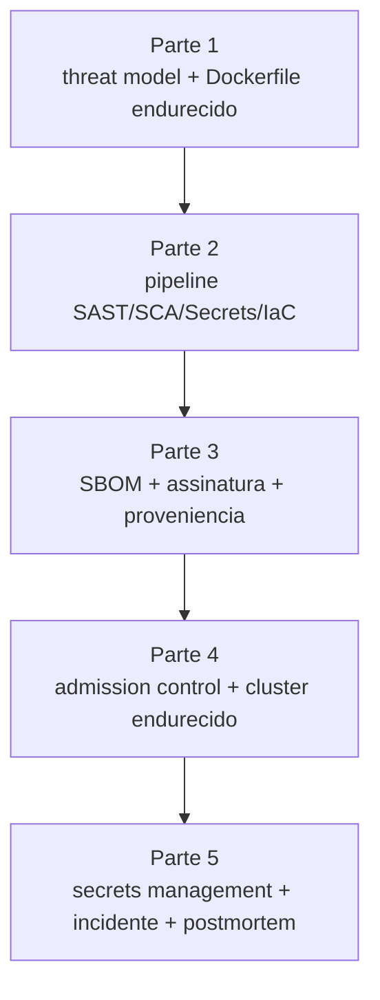

# Exercícios progressivos — Módulo 9 (DevSecOps)

Cinco partes encadeadas. Cada uma **incrementa** a anterior; ao final você entrega o produto descrito em [entrega-avaliativa.md](../entrega-avaliativa.md).

Recomenda-se **uma parte por dia/sessão de estudo**. Todas usam o mesmo repositório.

---

## Visão geral

## Entregáveis agregados

Ao concluir as 5 partes, o repositório terá:

- `docs/threat-model.md` — STRIDE de uma jornada crítica.
- `Dockerfile` (multi-stage, distroless, não-root) + `.dockerignore`.
- `.github/workflows/security-ci.yml` — jobs paralelos SAST/SCA/Secrets/IaC/Image.
- `.github/workflows/release.yml` — build, Trivy, SBOM (Syft), sign (cosign), provenance (SLSA).
- `k8s/` manifests ou `charts/medvault/` Helm — cluster endurecido (PSS, NetworkPolicy, RBAC mínimo).
- `policies/` — ClusterPolicies Kyverno (verify-images, disallow-latest, require-nonroot, registry-allowlist, limits).
- `docs/secrets.md` — processo de Sealed Secrets ou ESO + Vault.
- `docs/runbooks/security-incident.md` — runbook com etapas e comunicação LGPD.
- `docs/adrs/NNN-*.md` — decisões (threat model scope, choice de admission, SLSA L2, estratégia de secrets).
- `docs/postmortem-*.md` — relato blameless do incidente simulado.
- `Makefile` — alvos `scan`, `sbom`, `sign`, `verify`, `apply`, `policy-test`, `incident`.

## Pré-requisitos

- Cluster k3d com CNI que suporta NetworkPolicy (Calico recomendado).
- Python 3.11+, `pip install -r requirements.txt`.
- CLI: `trivy`, `syft`, `grype`, `cosign`, `gitleaks`, `helm`, `kubectl`, `kubeseal` (opcional).
- Conta GitHub com GHCR habilitado (para workflows OIDC).

## Critérios globais de aceitação

- `git log -p | grep -i "password\|aws_secret"` **não** retorna nada.
- `trivy image` na imagem final: zero `HIGH`/`CRITICAL` sem exceção documentada.
- `cosign verify` com `--certificate-identity` do seu workflow passa.
- `kubectl apply -f manifests/pod-inseguro.yaml` é **rejeitado** com mensagem clara.
- `kubectl get netpol -A` mostra `default-deny` em `medvault-prod`.
- `python rbac_audit.py` sai com código 0 após remediações.
- Makefile executa todos os alvos.

Comece pela [Parte 1](./parte-1-threat-model.md).

---

<!-- nav:start -->

**Navegação — Módulo 9 — DevSecOps**

- ← Anterior: [Bloco 4 — Exercícios resolvidos](../bloco-4/04-exercicios-resolvidos.md)
- → Próximo: [Parte 1 — Threat model e Dockerfile endurecido](parte-1-threat-model.md)
- ↑ Índice do módulo: [Módulo 9 — DevSecOps](../README.md)

<!-- nav:end -->
