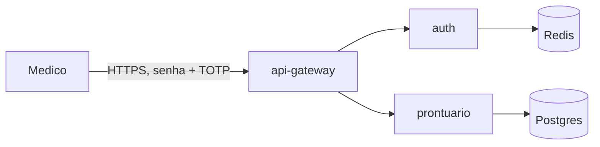

# Parte 1 — Threat model e Dockerfile endurecido

**Entrega desta parte:**

- `docs/threat-model.md` — STRIDE da jornada crítica da MedVault.
- `Dockerfile` multi-stage distroless + `.dockerignore`.
- Trivy "antes/depois" documentado.

---

## 1. Preparação do repo

Crie repositório `medvault-api` (ou evolua o do Módulo 7/8). Estrutura inicial:

```
medvault-api/
  src/
    main.py
    api/
    domain/
  tests/
  Dockerfile
  .dockerignore
  requirements.txt
  docs/
  .github/
  Makefile
```

Aplicação mínima (`src/main.py`):

```python
from fastapi import FastAPI

app = FastAPI(title="medvault-api")

@app.get("/healthz")
def healthz():
    return {"ok": True}

@app.get("/prontuarios/{pid}")
def prontuario(pid: int):
    return {"id": pid, "paciente": "exemplo", "status": "demo"}
```

Tarefa: adicionar **intencionalmente** um risco para tratarmos depois (ex.: log sem máscara de CPF).

---

## 2. Threat model

Crie `docs/threat-model.md` seguindo o template:

```markdown
# Threat Model — MedVault

## 1. Escopo
Jornada: login do medico (auth) + consulta de prontuario (prontuario).

## 2. Data Flow Diagram



## 3. STRIDE por componente

### api-gateway
- S: ataque de spoofing via cert forjado → mitigacao: TLS 1.2+, HSTS.
- ...

### auth
- S: credencial roubada → MFA; rate-limit.
- T: JWT forjado → RS256 + kid rotacionado.
- R: ...

### prontuario
- E (critico): medico de outra clinica acessa prontuario (IDOR) → autorizacao por tenant_id + teste automatico.
- I: response devolve dado nao solicitado → projecao minima + contract test.
- D: enumeracao de IDs → UUID v4; rate-limit por conta.

## 4. Decisoes
- Aceitamos ameaca de D (captcha ingerencia na UX) por 90 dias; mitigacao compensatoria: rate-limit AWS.
- ...
```

Usar `threat_catalog.py` do Bloco 1 (opcional, mas recomendado) para manter em YAML:

```bash
python ../devops/09-devsecops/bloco-1/threat_catalog.py docs/threats.yaml
```

---

## 3. Dockerfile "v1 gorda" (baseline para comparar)

```dockerfile
# Dockerfile.v1 (intencionalmente ruim, para comparar)
FROM python:3.12
WORKDIR /app
COPY . .
RUN apt-get update && apt-get install -y curl vim git
RUN pip install -r requirements.txt
EXPOSE 8000
CMD uvicorn src.main:app --host 0.0.0.0 --port 8000
```

Scan:

```bash
docker build -f Dockerfile.v1 -t medvault/api:v1 .
trivy image medvault/api:v1 | tee trivy-v1.txt
syft medvault/api:v1 -o cyclonedx-json=sbom-v1.cdx.json
```

Anote (em `docs/antes-depois.md`):

- Tamanho (`docker image ls`).
- CVEs totais por severidade.
- Top 10 pacotes com mais CVEs.

---

## 4. Dockerfile endurecido

```dockerfile
# Dockerfile (final endurecido)
FROM python:3.12-slim AS builder
WORKDIR /build
COPY requirements.txt .
RUN python -m venv /opt/venv && \
    /opt/venv/bin/pip install --no-cache-dir -U pip && \
    /opt/venv/bin/pip install --no-cache-dir -r requirements.txt
COPY src/ src/

FROM gcr.io/distroless/python3-debian12:nonroot
WORKDIR /app
COPY --from=builder --chown=nonroot:nonroot /opt/venv /opt/venv
COPY --from=builder --chown=nonroot:nonroot /build/src /app/src
ENV PATH="/opt/venv/bin:$PATH" PYTHONUNBUFFERED=1
EXPOSE 8000
HEALTHCHECK --interval=30s --timeout=5s --retries=3 \
  CMD ["python","-c","import urllib.request;urllib.request.urlopen('http://127.0.0.1:8000/healthz').read()"]
ENTRYPOINT ["python","-m","uvicorn","src.main:app","--host","0.0.0.0","--port","8000"]

LABEL org.opencontainers.image.source="https://github.com/SEU/medvault-api" \
      org.opencontainers.image.licenses="Apache-2.0" \
      org.opencontainers.image.version="1.0.0"
```

E `.dockerignore`:

```
.git
.env
.env.*
tests/
docs/
.venv
__pycache__
*.md
.github
Makefile
```

Auditar:

```bash
python ../devops/09-devsecops/bloco-3/dockerfile_audit.py Dockerfile --fail-on high
```

Build e comparar:

```bash
docker build -t medvault/api:v2 .
trivy image medvault/api:v2 | tee trivy-v2.txt
```

---

## 5. Tabela antes/depois

Preencha em `docs/antes-depois.md`:

| Métrica | v1 (gorda) | v2 (endurecida) |
|---------|-----------|-----------------|
| Tamanho | ~1 GB | ~80 MB |
| Pacotes | ~450 | ~35 |
| CRITICAL | N | 0 |
| HIGH | N | 0 |
| MEDIUM | N | pequeno |
| Roda como root | sim | não |
| Tem shell | sim | não |

---

## 6. Makefile inicial

```makefile
IMG ?= ghcr.io/seu-user/medvault-api:dev

build:
	docker build -t $(IMG) .

scan:
	trivy image --severity HIGH,CRITICAL --exit-code 1 $(IMG)

audit:
	python ../devops/09-devsecops/bloco-3/dockerfile_audit.py Dockerfile --fail-on high
```

---

## Critérios de aceitação

- [ ] `docs/threat-model.md` existe com DFD e STRIDE por componente.
- [ ] Pelo menos 1 ameaça de alto risco identificada com mitigação.
- [ ] `make scan` falha em v1 e **passa** em v2.
- [ ] `make audit` passa no Dockerfile endurecido.
- [ ] Tabela antes/depois preenchida com números reais.

Próxima: [Parte 2 — pipeline SAST/SCA/Secrets/IaC](./parte-2-pipeline-seguranca.md).

---

<!-- nav:start -->

| &nbsp; | &nbsp; | &nbsp; |
|:--|:--:|--:|
| **← Anterior**<br>[Exercícios progressivos — Módulo 9 (DevSecOps)](README.md) | **↑ Índice**<br>[Módulo 9 — DevSecOps](../README.md) | **Próximo →**<br>[Parte 2 — Pipeline de segurança no CI](parte-2-pipeline-seguranca.md) |

<!-- nav:end -->
