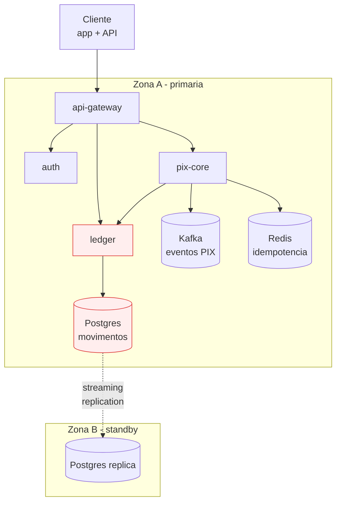

# Cenário PBL — PagoraPay: a fintech de PIX que queimou o orçamento da confiabilidade

> **PBL (Problem-Based Learning).** Esse cenário é a linha narrativa do módulo. Você é SRE contratado para uma missão específica; os blocos teóricos e exercícios giram em torno dele.

---

## A empresa

**PagoraPay** é uma **fintech de pagamentos instantâneos** (PIX) que atua como **IP — Instituição de Pagamento** autorizada pelo Banco Central do Brasil. Oferece conta digital com PIX ilimitado para pequenos negócios (barbearias, food trucks, lojas virtuais de baixo volume).

- **Fundada em:** 2020, em Recife.
- **Clientes:** 410 mil contas ativas; ~1,2 milhão de transações PIX/dia (pico: 80 tps).
- **Equipe:** 72 engenheiros (4 squads de produto, 1 squad de pagamentos, 1 squad de plataforma/infra). **Sem time dedicado de SRE** — pagamentos acumulou a função.
- **Stack:** Python/FastAPI + Go nos hot paths; Postgres 15 em RDS-like managed (provedor local); Kafka; Redis; roda em Kubernetes em 2 zonas de disponibilidade (1 região).
- **SLA contratual:** 99,9% de disponibilidade mensal para operações críticas (PIX envio/recebimento). **Regulatório BACEN Resolução 4.893**: disponibilidade agregada mensal ≥ 99,5% para IPs, com sanções em caso de descumprimento reiterado.

---

## O ponto de ruptura

**Domingo, 2026-03-09, 14:18 BRT.** Uma atualização de schema em `ledger` (serviço que registra movimentações de conta) entrou em deploy. A migração, que passou em staging, travou em produção — `ALTER TABLE` com lock exclusivo na tabela `movimentos` (180 GB).

Nos 43 minutos seguintes:

| Hora | Evento |
|------|--------|
| 14:18 | Deploy inicia. Migração começa `ALTER TABLE movimentos ADD COLUMN categoria INT`. |
| 14:19 | P99 de `POST /pix/enviar` sobe de 120 ms para 4 s; clientes começam a receber timeout. |
| 14:23 | Plantonista (squad produto, sem contexto de ledger) acorda, abre Slack. Não há runbook para esse cenário. |
| 14:27 | Primeiro grupo no Twitter: "PagoraPay fora". |
| 14:31 | Tentativa de rollback de imagem via ArgoCD — irrelevante, o problema é o DB. |
| 14:38 | Plantonista liga para o CTO. CTO chama dev que escreveu a migração (estava em aniversário). |
| 14:46 | Dev orienta `pg_cancel_backend()` — não funciona (migration em `ADD COLUMN` é rápida em tabela vazia; esta tem 180 GB). |
| 14:55 | `pg_terminate_backend` finalmente mata o processo; P99 volta ao normal. |
| 15:01 | Banco Central detecta 28 min consecutivos < 95% disponibilidade e registra formalmente. |

**Impacto:**

- **Transações perdidas**: 41.200 tentativas com falha.
- **Valor não processado**: estimativa R$ 3,8 milhões (pico horário).
- **Cliente furioso #1**: uma rede de lanchonetes com 22 unidades, perdeu 1 hora de vendas no almoço de domingo.
- **Regulatório**: ofício do BACEN exigindo plano de ação em 30 dias; menção de inclusão em monitoramento diferenciado.
- **Time**: squad pagamentos, que "virou SRE por acidente", está em burnout. 2 pessoas pediram demissão na semana seguinte.

---

## O diagnóstico pós-incidente

O consultor externo contratado produziu um relatório duro:

| # | Achado | Categoria | Evidência |
|---|--------|-----------|-----------|
| 1 | **Sem Error Budget Policy** — equipes não sabem quando frear releases | Cultura/SRE | Último mês: 67% do budget de 99.9% queimado, ninguém notou |
| 2 | **Runbooks desatualizados** — 40% dos links apontam para dashboards que não existem | Operação | Amostra de 22 runbooks; só 9 rodam na íntegra |
| 3 | **Toil não medido** — ninguém sabe quantas horas/semana vão para trabalho manual | Economia operacional | Estimativa informal: 40–60% do tempo de squad de pagamentos |
| 4 | **Nunca fizemos DR real** — último teste foi em 2022 | DR | Backup existe, restore nunca foi validado ponta a ponta |
| 5 | **Capacidade dimensionada "no feeling"** | Capacity | Sem headroom declarado; DB a 78% de CPU no pico diário |
| 6 | **Sem chaos engineering** | Resiliência | "Não podemos quebrar produção"; staging diverge muito |
| 7 | **Sem comando de incidente claro** | Gestão de incidente | No incidente de 2026-03-09, ninguém era IC; 6 pessoas decidindo em paralelo |
| 8 | **Comunicação caótica durante incidente** | Gestão | 14 mensagens nos primeiros 10 min em 3 canais diferentes; cliente ficou sem status por 30 min |
| 9 | **Postmortems viraram teatro** | Aprendizado | Dos 8 postmortems de 2025, 0 geraram ações concluídas e verificadas |
| 10 | **On-call sem limites** | Sustentabilidade | Um engenheiro foi paginado 42× em 30 dias; nenhum ajuste feito |

O Conselho aprovou um investimento específico: **6 sprints (12 semanas)** com um squad de SRE dedicado de 4 pessoas, com autonomia para parar releases, priorizar resiliência e propor mudanças organizacionais.

---

## Sua missão

Como SRE tech lead, você tem como entregáveis:

1. **SLOs formais** (3–5) com SLIs que refletem experiência do cliente; **Error Budget Policy** com gatilhos acionáveis.
2. **Toil tracker** operacional: classificação, medição, orçamento e plano de eliminação.
3. **Dashboard de capacidade** com headroom e previsão de saturação.
4. **Programa de Chaos Engineering**: 3 experimentos com hipótese, blast radius, critérios de abortar, relatório de aprendizado. Pelo menos 1 em game day.
5. **DR funcional**: Velero configurado, backup testado com restore real em cluster alternativo, RPO/RTO medidos, playbook escrito.
6. **Incident Command System** adotado: severidades, papéis, comunicação. Tabletop mensal.
7. **Processo de postmortem blameless** que produz ações rastreadas; base de conhecimento operacional viva.
8. **On-call sustentável**: política de rotação, limites, compensação, game days regulares.

---

## A pergunta norteadora

> **Como transformar uma operação que depende de heroísmo, memória e sorte em uma operação que depende de **métricas, processos e aprendizado organizacional** — mantendo a velocidade que DevOps entregou?**

Cada bloco ataca uma fatia:

- **Bloco 1 (SRE):** a economia que te dá vocabulário para decidir.
- **Bloco 2 (Chaos):** a prática que te dá confiança na resiliência.
- **Bloco 3 (DR):** a capacidade de sobreviver ao pior cenário.
- **Bloco 4 (Incidentes):** o tecido humano e organizacional que costura tudo.

---

## Arquitetura relevante para o módulo

Pontos a mirar: `ledger`/DB é o coração de risco; failover não é automático; falta DR testado; falta chaos para validar resiliência em `pix-core`; falta comando em incidentes.

Nos próximos blocos, essa arquitetura ganha **instrumentação operacional**, **experimentos**, **backup** e **processos humanos**.

---

<!-- nav:start -->

**Navegação — Módulo 10 — SRE e operações**

- ← Anterior: [Módulo 10 — Site Reliability Engineering (SRE) e Operações](README.md)
- → Próximo: [Bloco 1 — SRE como disciplina: economia operacional, toil, capacidade](bloco-1/01-sre-fundamentos.md)
- ↑ Índice do módulo: [Módulo 10 — SRE e operações](README.md)

<!-- nav:end -->
