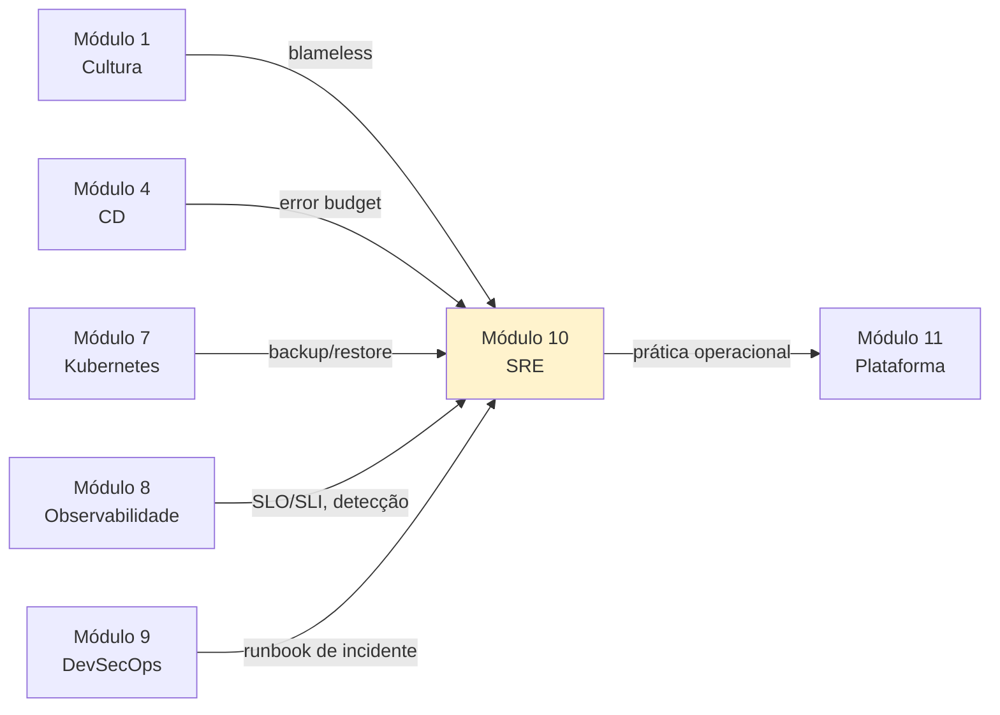

# Módulo 10 — Site Reliability Engineering (SRE) e Operações

**Carga horária:** 6 horas
**Nível:** Graduação (ensino superior)
**Pré-requisitos:** Módulos 1 (Cultura), 4 (CD), 7 (Kubernetes), 8 (Observabilidade), 9 (DevSecOps)

---

## Por que este módulo vem aqui

Até aqui você construiu o sistema: pipelines (Módulos 2 e 4), containers (Módulo 5), infra como código (Módulo 6), Kubernetes (Módulo 7), observabilidade (Módulo 8), segurança (Módulo 9). Falta responder uma última pergunta, a mais difícil:

> *"Agora que o sistema existe e é seguro, **como operá-lo bem** durante anos, com times reais, budget finito, pessoas cansando — sem que a qualidade e a sanidade se degradem?"*

Esse é o território da **SRE — Site Reliability Engineering**. Criada no Google no início dos anos 2000 e formalizada nos livros *[Site Reliability Engineering](https://sre.google/sre-book/table-of-contents/)* (2016) e *[The SRE Workbook](https://sre.google/workbook/table-of-contents/)* (2018), SRE é a disciplina que trata **operação** como problema **de engenharia** — com métricas, experimentos e economia explícita.

Os pilares que exploraremos aqui:

1. **Economia operacional.** Error budgets, toil budgets e policies acionáveis que dão ao time **linguagem compartilhada** para dizer "pare a feature, estabilize o sistema" ou "meu SLO está ocioso, assumir mais risco".
2. **Validação de resiliência.** Chaos Engineering — a prática de **injetar falhas** controladamente, em produção ou próximo dela, para **descobrir** fragilidades antes do cliente. "Se não testamos, não sabemos — e estamos apostando."
3. **Continuidade.** Disaster Recovery pensado como **capacidade verificável**, não como PDF. RPO, RTO, estratégias de backup/restore, DR game days.
4. **Gestão de incidentes em escala.** Quando um incidente deixa de ser "um evento pontual" e vira "um desafio organizacional": comando de incidentes, severidades, comunicação, aprendizado organizacional pós-incidente.

> *"Hope is not a strategy."* — Traci Pamela Lueck (SRE folclore)
>
> *"In order to maintain a fast pace of change, we must embrace the chaos."* — Casey Rosenthal, sobre Chaos Engineering

---

## Objetivos de Aprendizagem

Ao final do módulo, você será capaz de:

- **Distinguir** DevOps, SRE e "Ops tradicional" — e saber quando cada forma cabe.
- **Escrever** uma **Error Budget Policy** operacional: gatilhos, ações automáticas e decisórias.
- **Classificar** e **quantificar** toil; propor **toil budget** e plano de eliminação.
- **Dimensionar** capacidade com headroom realista e métricas de saturação (Módulo 8).
- **Planejar** e **conduzir** experimentos de chaos engineering com hipótese, blast radius limitado, critérios de abortar, aprendizado.
- **Operacionalizar** Disaster Recovery: medir RPO/RTO alcançáveis; criar e validar backup com **Velero**; executar **DR game day**.
- **Conduzir** incidentes em escala com Incident Command System (IC, Ops lead, Comms, Scribe), severidades claras, decisões registradas.
- **Transformar** postmortems em aprendizado organizacional: ação com dono, prazo e verificação; retros recorrentes; base de conhecimento operacional.

---

## Estrutura do Material

| Ordem | Conteúdo | Arquivo(s) |
|-------|----------|------------|
| 0 | Cenário PBL (PagoraPay) | [00-cenario-pbl.md](00-cenario-pbl.md) |
| 1 | SRE: error budget policy, toil, capacidade | [bloco-1/01-sre-fundamentos.md](bloco-1/01-sre-fundamentos.md) · [exercícios](bloco-1/01-exercicios-resolvidos.md) |
| 2 | Chaos Engineering: hipóteses, blast radius, Chaos Mesh | [bloco-2/02-chaos-engineering.md](bloco-2/02-chaos-engineering.md) · [exercícios](bloco-2/02-exercicios-resolvidos.md) |
| 3 | Disaster Recovery: RPO/RTO, Velero, DR game day | [bloco-3/03-disaster-recovery.md](bloco-3/03-disaster-recovery.md) · [exercícios](bloco-3/03-exercicios-resolvidos.md) |
| 4 | Incidentes em escala: ICS, severidade, aprendizado | [bloco-4/04-incidentes-escala.md](bloco-4/04-incidentes-escala.md) · [exercícios](bloco-4/04-exercicios-resolvidos.md) |
| 5 | Exercícios progressivos (5 partes) | [exercicios-progressivos/](exercicios-progressivos/) |
| 6 | Entrega avaliativa | [entrega-avaliativa.md](entrega-avaliativa.md) |
| — | Referências bibliográficas | [referencias.md](referencias.md) |

---

## Como Estudar

1. **Leia o cenário PBL** — **PagoraPay** é uma fintech de PIX passando por crise operacional após auditoria do Banco Central.
2. **Prepare o ferramental local:**
   ```bash
   python -m venv .venv && source .venv/bin/activate
   pip install -r requirements.txt

   # Cluster local
   k3d cluster create sre-pbl --agents 1

   # Chaos Mesh
   curl -sSL https://mirrors.chaos-mesh.org/v2.7.0/install.sh | bash -s -- --local kind

   # Velero (DR)
   curl -sL https://github.com/vmware-tanzu/velero/releases/download/v1.14.1/velero-v1.14.1-linux-amd64.tar.gz \
     | tar xz -C /tmp && sudo mv /tmp/velero-v1.14.1-linux-amd64/velero /usr/local/bin/
   ```
3. **Siga os blocos em ordem.** Bloco 1 dá a economia operacional; 2 testa resiliência; 3 garante continuidade; 4 costura gestão humana de crise.
4. **Mentalidade.** Operação é **engenharia**: mede-se, experimenta-se, aprende-se. Nada aqui depende de heroísmo.

### Setup rápido

```bash
# Verificacoes
k3d version
kubectl get pods -A
helm version
velero version --client-only
```

---

## Ideia central do módulo

| Conceito | Significado |
|----------|-------------|
| **Error Budget** | Quanto de "falhar" está orçado no SLO — e usado para decidir velocidade |
| **Error Budget Policy** | Decisões pré-acordadas quando o orçamento está baixo/alto |
| **Toil** | Trabalho manual, repetitivo, sem valor duradouro — automatiza ou elimina |
| **Blameless postmortem** | Postmortem que busca o sistema, não o culpado |
| **Chaos Engineering** | Experimentação controlada para descobrir fragilidades do sistema |
| **RPO / RTO** | Perda de dados aceitável / tempo de recuperação alvo |
| **DR Game Day** | Ensaio programado de cenário catastrófico, com aprendizado |
| **Incident Command** | Papéis claros em incidente (IC, Ops, Comms, Scribe) |
| **Psychological Safety** | Base cultural para postmortems e on-call sustentáveis |

> SRE não é "Ops com mais ferramentas". É **tratar confiabilidade como feature** — com time dedicado, backlog, métricas, budget. E é **assumir que falhas acontecem** — e preparar-se para aprender delas.

---

## Conexão com o restante da disciplina



---

## O que este módulo NÃO cobre

- **Implementação profunda de sistemas distribuídos** (consenso, CRDTs, paxos) — disciplina própria; aqui usamos ferramentas prontas.
- **Finanças/FinOps avançado** — custo de cloud é tocado de passagem; ver cursos específicos.
- **Operações multi-cloud complexas** — focamos em Kubernetes local + conceitos.
- **Tooling de Pager (PagerDuty/Opsgenie) completos** — mencionamos; a política de rotação é o central.
- **Análise forense profunda** (malware, disco) — fora do escopo.

---

*Material alinhado a: Google SRE Book e SRE Workbook; Chaos Engineering (Rosenthal & Jones, 2020); Learning Chaos Engineering (Miles, 2019); Seeking SRE (Blank-Edelman, 2018); ICS FEMA (Incident Command System); documentação Chaos Mesh, Litmus, Velero; Etsy Debriefing Facilitation Guide; John Allspaw sobre blameless postmortems.*

---

<!-- nav:start -->

| &nbsp; | &nbsp; | &nbsp; |
|:--|:--:|--:|
| **← Anterior**<br>[Referências — Módulo 9 (DevSecOps)](../09-devsecops/referencias.md) | **↑ Índice**<br>Módulo 10 — SRE e operações | **Próximo →**<br>[Cenário PBL — PagoraPay: a fintech de PIX que queimou o orçamento da confiabilidade](00-cenario-pbl.md) |

<!-- nav:end -->
