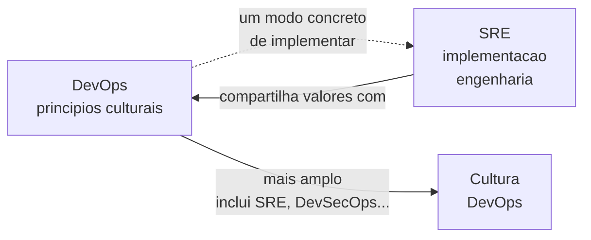
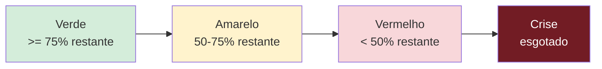

# Bloco 1 — SRE como disciplina: economia operacional, toil, capacidade

> **Pergunta do bloco.** Como **operar** um sistema por anos sem depender de heroísmo? SRE responde tratando operação como **problema de engenharia**, com economia explícita (error budget, toil budget), métricas (SLO/SLI, saturação) e decisões automatizadas onde possível.

---

## 1.1 DevOps, SRE, Ops — o que é cada um?

Três termos, três ênfases. Todos se sobrepõem.

| Disciplina | Ênfase central | Origem | Em 1 frase |
|-----------|----------------|--------|-----------|
| **Ops tradicional** | Estabilidade; mudança é risco | TI corporativa, anos 1990+ | "Não mexe se está funcionando." |
| **DevOps** | Fluxo rápido entre dev e ops; cultura | ~2009 (Patrick Debois, Allspaw/Hammond) | "Tire as paredes." |
| **SRE** | Operação como engenharia; métricas e orçamentos | Google, 2003 (Ben Treynor) | "Se não é mensurável, não é gerenciável." |

### 1.1.1 O insight de Ben Treynor

Em 2003 o Google colocou um engenheiro de software (Treynor) para cuidar de operações — com instrução: **"faça o que faria como engenheiro, não como admin de sistemas"**. Disso emergiram três ideias que definem SRE até hoje:

1. **Confiabilidade é feature**, e como toda feature **tem custo**.
2. **100% de uptime é o errado** — é caro e bloqueia inovação.
3. **Time SRE tem backlog de engenharia** (automação, ferramenta, estabilidade), não fila de tickets.

### 1.1.2 A relação com DevOps



Podemos dizer: **DevOps é o quê; SRE é um como específico.** Você pode ter DevOps sem SRE (muitas startups). Mas SRE sem DevOps é improvável: as barreiras dev↔ops já precisam estar derrubadas para SRE funcionar.

---

## 1.2 SLO, SLI, SLA — revisão rápida e novas sutilezas

(Revisão do Módulo 8, agora com lentes operacionais.)

### 1.2.1 Definições

- **SLI (Service Level Indicator):** métrica mensurável de qualidade vista pelo cliente.
- **SLO (Service Level Objective):** alvo numérico para o SLI em uma janela.
- **SLA (Service Level Agreement):** SLO com **consequência contratual**.
- **Error budget:** complemento do SLO — quanto você **pode falhar** e ainda estar dentro do alvo.

### 1.2.2 A fórmula central

$$ \text{Error Budget}_{janela} = 1 - SLO $$

Para SLO = 99,9% numa janela de 30 dias: **43 min 12 s** de falha permitidos. Acima disso, você **quebrou** o orçamento.

### 1.2.3 Más escolhas comuns de SLO

- **SLO baseado em disponibilidade do *servidor*** (CPU up) em vez de **sucesso de requisição** do ponto de vista do cliente.
- **SLO agregado demais** ("99.9% de disponibilidade") sem separar endpoints críticos vs. secundários.
- **SLO sem janela clara** ("deve ser rápido") — não é SLO.
- **SLO igual ao SLA** — você não tem **folga** interna para agir antes da quebra contratual.
- **SLO aspiracional** ("queremos 99.999%") sem ninguém operar para isso.

### 1.2.4 SLIs úteis para PagoraPay (PIX)

| Categoria | SLI | Janela | SLO alvo |
|-----------|-----|--------|---------|
| Disponibilidade | % de `POST /pix/enviar` com status 2xx | 30 dias | 99,95% |
| Latência | % de `POST /pix/enviar` com p95 ≤ 500 ms | 30 dias | 99% |
| Frescor de saldo | % de consultas de saldo com atraso ≤ 3 s | 30 dias | 99,5% |
| Integridade | % de transações conciliadas em `ledger` em 24h | 7 dias | 99,99% |

Note: **4 SLOs**, não 1. Cada um captura dimensão diferente do que "funcionar bem" significa — e cada um tem seu **próprio error budget**.

---

## 1.3 Error Budget Policy — a economia escrita

Ter SLO e budget sem **política** é equivalente a ter balança sem dieta. A policy é **acordo prévio**: "quando o budget cair a X%, automaticamente fazemos Y".

### 1.3.1 Estrutura mínima de uma policy



Cada nível tem **decisões pré-acordadas**.

### 1.3.2 Exemplo operacional (PagoraPay)

```markdown
# Error Budget Policy — PIX Envio (SLO 99.95% / 30d)

## Verde (budget remanescente >= 75%)
- Velocidade normal: deploys liberados; canary 5%→25%→100% em ~1h.
- Experimentos de chaos autorizados no horario comercial.

## Amarelo (50-75%)
- Deploys **nao** urgentes de features novas devem ter revisao adicional de risco.
- Canary estendido (>=4h em 25%).
- Chaos experiments somente em staging.
- Squad de pagamentos revisa top-3 causas de queima na reuniao semanal.

## Vermelho (< 50%)
- **Freeze de features** (deploys so de fix). Exception requires CTO+SRE approval.
- Priorizacao explicita de engenharia em confiabilidade.
- Review diario do budget com engineering lead.
- Postmortems pending **bloqueiam** features.

## Esgotado (< 0%)
- Freeze total. Somente fix para fechamento do gap.
- Comunicacao proativa a clientes afetados.
- Postmortem formal obrigatorio com acoes datadas.
- SLO revisitado: se o alvo e inalcancavel com capacidade atual, reavaliar.
```

### 1.3.3 Princípios ao desenhar a policy

1. **Gatilho quantificável** (não "se parecer ruim").
2. **Ação executável hoje** (não "melhorar confiabilidade" — vago).
3. **Quem decide** em cada nível.
4. **Aprovada por quem sustenta** (CTO, VP de eng) **antes** da crise.
5. **Reviewed trimestralmente**.

### 1.3.4 Anti-padrão: a policy simbólica

*"Quando o budget acabar, faremos o que for necessário."* — tradução: nada mudará. O poder da policy está em **pré-comprometer** o time a ações que, no calor do momento, seriam politicamente difíceis.

---

## 1.4 Toil — o inimigo invisível

### 1.4.1 Definição (SRE Workbook)

**Toil** é trabalho operacional que possui ≥ 1 destas propriedades:

- **Manual** — alguém executa comandos/cliques.
- **Repetitivo** — mesmas ações, várias vezes.
- **Automatizável** — poderia ser script, mas não é.
- **Reativo** — responde a evento, não cria valor duradouro.
- **Sem valor persistente** — após terminar, não deixa melhoria estrutural.
- **Cresce linear/superlinearmente** com o tráfego/tamanho.

Exemplos clássicos:

| Tipo | Exemplo real em PagoraPay |
|------|---------------------------|
| Re-execução de job | Job de conciliação falha de madrugada; alguém abre terminal, `kubectl delete job`, `make retry`. |
| Rotação manual de segredo | Segredo do gateway PIX precisa trocar trimestralmente; dev faz kubectl edit em 4 namespaces. |
| Limpeza de fila | Redis encheu; alguém entra e faz `redis-cli FLUSHDB`. |
| Revalidação após deploy | Checklist de 18 itens executado à mão em cada release. |
| Atendimento interno | "O dashboard da receita não abre", engenheiro vai resetar nginx. |

### 1.4.2 Toil ≠ trabalho ruim ou fácil

- Toil pode ser crítico (manter sistema funcionando).
- Toil pode ser intelectualmente estimulante (dependendo do problema).

O problema não é com o trabalho, é com **a curva de crescimento**: toil cresce com o sistema e, sem limite, **engole** a engenharia.

### 1.4.3 Toil budget

Google propõe **≤ 50% do tempo de um SRE** em toil. Além disso, automação/estabilidade param de avançar. É um **budget**, não meta — você pode estar com 30% de toil num período, e 60% em outro (crise).

Consequência: se você atinge 50% semanal por 3 semanas seguidas, **é hora de parar** features e eliminar toil.

### 1.4.4 Como medir

```
Toil_ratio = tempo_em_toil / (tempo_total_dedicado_ao_trabalho)
```

Formas:

- **Diário** — log simples por dia (categoria + minutos), auto-reportado.
- **Weekly survey** — "estime sua semana".
- **Tagging de issues** — todo ticket ops tem label `toil`.
- **Pager stats** — minutos em incidente + pós-incidente.

Não busque precisão de 5%. Busque **tendência**.

### 1.4.5 Eliminação priorizada

Inventory por:

1. **Custo semanal** (horas × frequência).
2. **Dificuldade de automação** (fácil/médio/difícil).
3. **Risco operacional em automatizar** (baixo/médio/alto).

Matriz: comece pelos **alto custo / fácil automação / baixo risco**. Esses são os "frutos baixos" que liberam tempo para resolver os difíceis.

### 1.4.6 Armadilhas

- **Automatizar sem medir** → você não sabe se melhorou.
- **"Runbook documentado" ≠ automação**. Se alguém precisa executar passo-a-passo, ainda é toil.
- **Criar ferramentas internas que viram elas próprias fontes de toil** (a ferramenta quebra, alguém consserta).

---

## 1.5 Capacity planning — a matemática da margem

### 1.5.1 Headroom

**Headroom** é a distância entre uso atual e saturação. Headroom zero = qualquer pico derruba.

| Métrica | Exemplo PagoraPay | Headroom sugerido |
|---------|-------------------|-------------------|
| CPU do DB | pico 78% → saturação 95% | **30% livre** no pico |
| Conexões Postgres | 85 de 100 | **20%** |
| Kafka lag consumer | p95 2.5 s → SLO 3 s | **30%** |
| Kubernetes nodes | 6 nodes, CPU 70% | crescimento absorvível sem reagir |

Regra prática: **nunca rodar em produção sem headroom**. Um spike de 20% do tráfego é comum.

### 1.5.2 Previsão simples (linear)

Para capacidade **linearmente** consumida (ex.: armazenamento de logs):

$$ C_{futuro}(t) = C_{atual} + (t - t_0) \cdot \text{taxa} $$

Com margem de segurança: multiplicar por 1.3 (30%).

### 1.5.3 Previsão para tráfego sazonal

PIX tem sazonalidade clara: dias úteis > fins de semana; 5º dia útil ≈ pagamento; festas e datas comerciais. Previsão realista precisa:

- **Baseline** (média mensal),
- **Fatores sazonais** (multiplicadores por dia/hora),
- **Eventos especiais** (Black Friday, 13º).

Ferramentas como Prophet, ARIMA, ou mesmo regressão simples servem. Para este módulo, o conceito basta.

### 1.5.4 Saturation pela USE method (Brendan Gregg)

Revisão do Módulo 8: **U**tilization, **S**aturation, **E**rrors. Para cada recurso (CPU, memória, disco, rede, conexões):

- Utilization alta + saturation = problema.
- Utilization baixa + errors = bug.

Dashboards de capacidade mostram os 3 lado a lado.

### 1.5.5 Scaling decisions

- **Vertical** (maior node): rápido de aplicar; limite físico; cara.
- **Horizontal** (mais nodes/replicas): mais resiliente; requer app stateless ou sharding.
- **Sharding** (partitioning por chave): complexidade grande; use quando inevitável.
- **Cache / indireção**: pode adiar scaling, a custo de complexidade de invalidação.

Regra de ouro: scale quando **métrica de saturação** sobe, **não** quando "parece devagar".

---

## 1.6 Reliability como feature: priorização

SRE Workbook propõe que o time de produto trate confiabilidade como trabalho explícito:

- Item de backlog com "DoD" (definition of done) mensurável.
- Estimativa e capacidade dedicada.
- Dashboard mostrando % de capacidade em confiabilidade por sprint.

Exemplo:

| Item | Tipo | SLO impactado | DoD |
|------|------|---------------|-----|
| Retry idempotente em `pix-core → ledger` | Reliability | PIX Envio | p99 de timeout volta a <500 ms em game day |
| Feature flag para novo fluxo de PIX Saque | Produto | N/A | Feature habilitada para 10% sem queima de budget |

Com isso, "não temos tempo para estabilizar" vira um dado, não uma opinião.

---

## 1.7 Cultura SRE e psychological safety

SRE não funciona sem:

- **Blameless postmortems** — se culpam pessoas, ninguém reporta incidente real.
- **Decisões registradas** (ADR) — evita reabrir mesma discussão a cada crise.
- **Compartilhar on-call com dev** — dev que só entrega e não é acordado **não** aprende o custo real.
- **SRE com veto de release** — autoridade real para dizer "não".

Se a cultura ainda é de heroísmo (herói salva produção às 3h), SRE vira lipstick on a pig. O Módulo 1 tratou desses pilares; revisite.

---

## 1.8 Script Python: `toil_tracker.py`

Registra/classifica toil a partir de CSV e gera relatório com tendência.

```python
"""
toil_tracker.py - rastreia e classifica toil a partir de CSV de logs diarios.

Formato CSV esperado (separador virgula):
    data,autor,categoria,atividade,minutos,automatizavel,risco_automacao
    2026-03-09,alice,rotacao-segredo,rotate secret PIX gateway,45,sim,baixo
    2026-03-10,bob,incidente,paging 3am LedgerErr,60,parcial,medio

Uso:
    python toil_tracker.py data/toil-log.csv --budget-horas 20 --semana-inicio 2026-03-09
"""
from __future__ import annotations

import argparse
import csv
import sys
from collections import defaultdict
from dataclasses import dataclass, field
from datetime import date, datetime, timedelta

from rich.console import Console
from rich.table import Table


@dataclass(frozen=True)
class Entrada:
    data: date
    autor: str
    categoria: str
    atividade: str
    minutos: int
    automatizavel: str
    risco_automacao: str


@dataclass
class Resumo:
    total_min: int = 0
    por_categoria: dict[str, int] = field(default_factory=lambda: defaultdict(int))
    por_autor: dict[str, int] = field(default_factory=lambda: defaultdict(int))
    facilmente_automatizavel_min: int = 0


def parse_data(s: str) -> date:
    return datetime.strptime(s.strip(), "%Y-%m-%d").date()


def carregar(path: str) -> list[Entrada]:
    entradas: list[Entrada] = []
    with open(path, "r", encoding="utf-8", newline="") as fh:
        leitor = csv.DictReader(fh)
        for row in leitor:
            try:
                entradas.append(Entrada(
                    data=parse_data(row["data"]),
                    autor=row["autor"].strip(),
                    categoria=row["categoria"].strip(),
                    atividade=row["atividade"].strip(),
                    minutos=int(row["minutos"]),
                    automatizavel=row.get("automatizavel", "").strip().lower(),
                    risco_automacao=row.get("risco_automacao", "").strip().lower(),
                ))
            except (KeyError, ValueError) as exc:
                print(f"AVISO: linha invalida ignorada: {row} ({exc})", file=sys.stderr)
    return entradas


def resumir(entradas: list[Entrada], semana_inicio: date) -> Resumo:
    limite = semana_inicio + timedelta(days=7)
    r = Resumo()
    for e in entradas:
        if not (semana_inicio <= e.data < limite):
            continue
        r.total_min += e.minutos
        r.por_categoria[e.categoria] += e.minutos
        r.por_autor[e.autor] += e.minutos
        if e.automatizavel == "sim" and e.risco_automacao in ("baixo", "medio"):
            r.facilmente_automatizavel_min += e.minutos
    return r


def classificar(min_total: int, budget_min: int) -> str:
    if budget_min <= 0:
        return "?"
    ratio = min_total / budget_min
    if ratio < 0.5:
        return "verde"
    if ratio < 1.0:
        return "amarelo"
    return "vermelho"


def relatorio(r: Resumo, budget_horas: int) -> int:
    console = Console()
    budget_min = budget_horas * 60

    tbl = Table(title=f"Toil (semana) - budget {budget_horas}h = {budget_min}min")
    for c in ("categoria", "minutos", "horas"):
        tbl.add_column(c)
    for cat, minutos in sorted(r.por_categoria.items(), key=lambda x: -x[1]):
        tbl.add_row(cat, str(minutos), f"{minutos/60:.1f}h")
    console.print(tbl)

    tbl2 = Table(title="Por autor")
    for c in ("autor", "minutos", "horas"):
        tbl2.add_column(c)
    for autor, minutos in sorted(r.por_autor.items(), key=lambda x: -x[1]):
        tbl2.add_row(autor, str(minutos), f"{minutos/60:.1f}h")
    console.print(tbl2)

    status = classificar(r.total_min, budget_min)
    console.print(f"\nTotal: {r.total_min} min ({r.total_min/60:.1f}h) | Budget: {budget_horas}h | Status: [bold]{status}[/bold]")
    console.print(f"Facilmente automatizavel: {r.facilmente_automatizavel_min} min "
                  f"({r.facilmente_automatizavel_min/60:.1f}h) - candidatos prioritarios")

    return 0 if status != "vermelho" else 1


def main(argv: list[str] | None = None) -> int:
    p = argparse.ArgumentParser()
    p.add_argument("csv")
    p.add_argument("--budget-horas", type=int, default=20,
                   help="Budget semanal de toil em horas (default 20, i.e. 50% de 40h)")
    p.add_argument("--semana-inicio", default=None,
                   help="Data inicial da semana YYYY-MM-DD. Default: ultima segunda-feira")
    args = p.parse_args(argv)

    try:
        entradas = carregar(args.csv)
    except OSError as exc:
        print(f"ERRO: {exc}", file=sys.stderr)
        return 2

    if args.semana_inicio:
        semana_inicio = parse_data(args.semana_inicio)
    else:
        hoje = date.today()
        semana_inicio = hoje - timedelta(days=hoje.weekday())

    resumo = resumir(entradas, semana_inicio)
    if resumo.total_min == 0:
        print("Sem entradas para a semana alvo.")
        return 0

    return relatorio(resumo, args.budget_horas)


if __name__ == "__main__":
    raise SystemExit(main())
```

Exemplo `data/toil-log.csv`:

```csv
data,autor,categoria,atividade,minutos,automatizavel,risco_automacao
2026-03-09,alice,rotacao-segredo,rotate secret PIX gateway,45,sim,baixo
2026-03-10,bob,incidente,paging 3am LedgerErr,60,parcial,medio
2026-03-10,alice,conciliacao,retry manual job conciliar,30,sim,baixo
2026-03-11,carla,atendimento,dashboard receita caiu,20,sim,baixo
2026-03-12,bob,limpeza,flush redis cache,15,sim,baixo
2026-03-12,alice,incidente,investigacao latencia,90,nao,alto
2026-03-13,carla,deploy-manual,apply migration em prod,45,sim,medio
```

Rodar:

```bash
python toil_tracker.py data/toil-log.csv --budget-horas 20 --semana-inicio 2026-03-09
```

---

## 1.9 Checklist do bloco

- [ ] Distingo DevOps, SRE e Ops com precisão.
- [ ] Escrevo SLI concreto a partir de experiência do cliente.
- [ ] Defino SLO com janela e racional; calculo error budget.
- [ ] Redijo **Error Budget Policy** com gatilhos e ações.
- [ ] Classifico trabalho como toil e meço com ferramenta simples.
- [ ] Aplico toil budget e priorizo eliminação.
- [ ] Enxergo capacidade com headroom e saturação.
- [ ] Trato confiabilidade como item priorizável de backlog.

Vá aos [exercícios resolvidos do Bloco 1](./01-exercicios-resolvidos.md).
