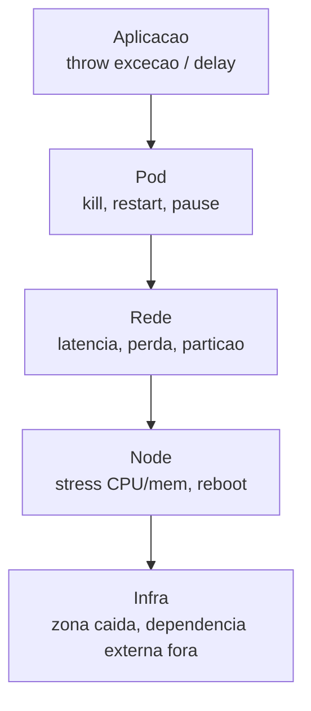
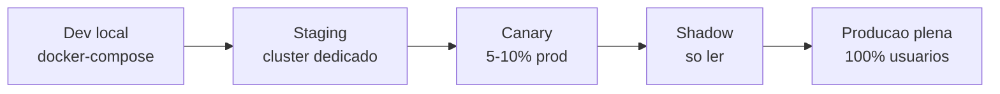

# Bloco 2 — Chaos Engineering: descobrir fragilidades antes do cliente

> **Pergunta do bloco.** Seu sistema **parece** resiliente porque nunca falhou numa forma específica. Isso não é o mesmo que **ser** resiliente. Como **provar** — com experimento controlado — que ele aguenta o que você acredita que aguenta, e, quando não aguenta, aprender **antes** do cliente?

---

## 2.1 O que é Chaos Engineering (e o que não é)

Chaos Engineering (Rosenthal et al., Netflix, ~2011) é:

> *"A disciplina de **experimentar em um sistema distribuído** com o intuito de **construir confiança na capacidade do sistema** de suportar **condições turbulentas** em produção."* — Principles of Chaos Engineering

### 2.1.1 Não é...

- **"Quebrar produção de surpresa"** — isso é sabotagem, não chaos engineering.
- **"Simplesmente matar pods aleatórios"** — sem hipótese é barulho.
- **"Staging quebrando sozinha"** — útil mas pouco representativo.
- **Substituto para testes unitários, integração, carga** — é complementar.

### 2.1.2 É...

- **Método científico aplicado a sistemas em produção**.
- **Experimento com hipótese clara** ("se isso acontecer, aquilo deve se manter").
- **Blast radius limitado e reversível**.
- **Aprendizado** — mesmo (ou especialmente) quando refuta a hipótese.

---

## 2.2 Os 4 princípios de Rosenthal

1. **Hypothesize about steady state behavior** — defina um estado de regime (métricas-alvo).
2. **Vary real-world events** — injete falhas que acontecem de verdade (pod morre, rede lenta, DNS falha).
3. **Run experiments in production** (ou o mais próximo possível) — é onde o sistema **importa**.
4. **Automate experiments to run continuously** — testar uma vez é nada; contínuo é disciplina.

Esses são o norte. Na graduação, ficaremos em staging/cluster local, mas com a **mentalidade** de produção.

---

## 2.3 Desenho de um experimento

### 2.3.1 Template

```markdown
# Experimento: <nome curto>

## Hipotese
Se <acao> acontecer em <componente>, o sistema mantem <comportamento observavel>.

Exemplo:
"Se 1 das 3 replicas de `pix-core` for terminada, a latencia p99 de `/pix/enviar` permanece <= 600 ms e a taxa de erro < 1%."

## Blast radius
- Componente: pix-core (producao) OU pix-core (staging).
- Quantidade: 1 replica.
- Janela: 5 minutos, uma vez.

## Steady state (metricas)
- SLI principal: taxa 2xx/total em `/pix/enviar` >= 99.5%.
- Latencia p99 <= 600 ms.
- Throughput >= 40 tps.

## Critério de abortar
- Se SLI < 98% por 30s → abortar.
- Se p99 > 1200 ms por 30s → abortar.
- Se paginar on-call → abortar.

## Plano
1. Avisar canais #chaos, #pagamentos, #sre.
2. Verificar dashboard baseline (5 min).
3. Aplicar Chaos: PodChaos kill 1 replica.
4. Observar 5 min.
5. Verificar: hipotese **confirmada**, **refutada**, ou **inconclusiva**.
6. Registrar aprendizado.

## Responsavel
<quem lidera>

## Data / revisao
<data>
```

### 2.3.2 Critério de aceitação de um bom experimento

- A **hipótese** existe e é falsificável.
- O **blast radius** é descrito em número (replicas, % de tráfego, tempo).
- Os **critérios de abortar** são objetivos e mensuráveis.
- Existe um **responsável** com autoridade para abortar.
- O **aprendizado** é registrado, independente do resultado.

---

## 2.4 Família de experimentos

### 2.4.1 Mapa por camada



### 2.4.2 Lista de experimentos canônicos

| Experimento | Pergunta que responde |
|-------------|----------------------|
| Pod kill | Uma replica morrer quebra o SLO? |
| Pod failure (process up, not ready) | Probes detectam mau estado? |
| Network latency (10ms → 500ms) | Timeout e retry estão adequados? |
| Network loss (10% packet loss) | Idempotência funciona com retry? |
| DNS down (pontual) | Sistema degrada bem? |
| CPU stress (node) | HPA reage a tempo? |
| Memory stress | OOM-killer não derruba o serviço errado? |
| Disk full | Logs não travam o serviço? |
| Clock skew | Tokens/timestamps aceitam drift? |
| DB slow | Timeouts não vão bloquear thread pool do app? |
| Dependência externa 5xx | Circuit breaker funciona? |

### 2.4.3 Experimentos específicos para PagoraPay

| # | Experimento | Hipótese |
|---|------------|----------|
| 1 | Matar 1 de 3 replicas de `pix-core` | p99 de `/pix/enviar` permanece <= 600 ms |
| 2 | 200 ms de latência entre `pix-core` e `ledger` | Retry idempotente absorve; sem duplicata |
| 3 | Node onde está Redis reinicia | Sistema degrada para "idempotência via DB" sem perder ordem |
| 4 | Kafka lag sobe artificialmente (pause consumer 30s) | Alerta dispara em <2 min; sem perda de eventos |

---

## 2.5 Blast radius — a arte da contenção

O risco maior não é um experimento pequeno que falha — é um experimento **grande** que foge do controle.

### 2.5.1 Gradação



Comece pequeno. Só suba quando o anterior for **verde** consistente.

### 2.5.2 Blast radius por 3 eixos

- **Usuários**: % do tráfego afetável.
- **Tempo**: duração do experimento.
- **Reversibilidade**: quanto leva para voltar ao normal.

### 2.5.3 Controles técnicos

- **Kill switch** — botão de aborto imediato (script, annotation, config flag).
- **Janela de tempo máxima** — experimento expira sozinho.
- **Guarda automática** — se SLO cair X%, aborta via operador.
- **Observabilidade preparada** — dashboards e alertas **antes** do experimento.

---

## 2.6 Ferramental: Chaos Mesh

[Chaos Mesh](https://chaos-mesh.org) é projeto CNCF nativo Kubernetes. Alternativa: Litmus (também CNCF).

### 2.6.1 Instalação rápida em k3d

```bash
helm repo add chaos-mesh https://charts.chaos-mesh.org
kubectl create ns chaos-mesh
helm install chaos-mesh chaos-mesh/chaos-mesh -n chaos-mesh \
  --set chaosDaemon.runtime=containerd \
  --set chaosDaemon.socketPath=/run/k3s/containerd/containerd.sock

kubectl -n chaos-mesh get pods
```

Interface web:

```bash
kubectl -n chaos-mesh port-forward svc/chaos-dashboard 2333:2333
# abrir http://localhost:2333
```

### 2.6.2 CRDs principais

| CRD | Uso |
|-----|-----|
| `PodChaos` | pod-kill, pod-failure, container-kill |
| `NetworkChaos` | latency, loss, partition, bandwidth |
| `IOChaos` | delay I/O, erros |
| `StressChaos` | CPU, memória |
| `TimeChaos` | skew de relógio |
| `HTTPChaos` | falhas HTTP em proxy sidecar |
| `DNSChaos` | falhas DNS |
| `KernelChaos` | falhas em syscalls (avançado) |
| `JVMChaos` | exceções em JVMs |

### 2.6.3 Exemplo: PodChaos matar 1 de 3

```yaml
apiVersion: chaos-mesh.org/v1alpha1
kind: PodChaos
metadata:
  name: pix-core-pod-kill
  namespace: pagora
spec:
  action: pod-kill
  mode: fixed
  value: "1"
  duration: "5m"
  selector:
    namespaces: [pagora]
    labelSelectors:
      app: pix-core
  scheduler:
    cron: "@every 0s"     # uma vez
```

Aplicar:

```bash
kubectl apply -f chaos/pod-kill-pix-core.yaml
kubectl get podchaos -n pagora
# Observar dashboards. Abortar: kubectl delete -f ...
```

### 2.6.4 Exemplo: NetworkChaos adicionando 200ms de latência

```yaml
apiVersion: chaos-mesh.org/v1alpha1
kind: NetworkChaos
metadata:
  name: pix-to-ledger-latency
  namespace: pagora
spec:
  action: delay
  mode: all
  selector:
    namespaces: [pagora]
    labelSelectors:
      app: pix-core
  direction: to
  target:
    mode: all
    selector:
      namespaces: [pagora]
      labelSelectors:
        app: ledger
  delay:
    latency: "200ms"
    jitter: "50ms"
    correlation: "50"
  duration: "5m"
```

### 2.6.5 Schedule e Workflow

Para experimentos **contínuos**, use `Schedule` (executa em cron) e `Workflow` (composição de experimentos).

```yaml
apiVersion: chaos-mesh.org/v1alpha1
kind: Schedule
metadata:
  name: semanal-pod-kill
  namespace: pagora
spec:
  schedule: "0 14 * * 1"    # toda segunda 14h
  historyLimit: 10
  concurrencyPolicy: "Forbid"
  type: PodChaos
  podChaos:
    action: pod-kill
    mode: one
    duration: "3m"
    selector:
      namespaces: [pagora]
      labelSelectors:
        app: pix-core
```

### 2.6.6 Alternativa: Litmus

Litmus traz biblioteca de "ChaosExperiment" prontos (~30 experimentos) e "ChaosHub". Ambos (Mesh e Litmus) são válidos; escolha **um** e aprofunde.

---

## 2.7 Game Day

**Game Day** é sessão agendada em que o time **pratica** um cenário de falha. Não é experimento automático; é exercício humano.

### 2.7.1 Formato típico (2–3 h)

1. **Briefing (20 min)**: cenário escolhido, hipótese, regras, kill switch.
2. **Baseline (10 min)**: estado do sistema, dashboards.
3. **Injeção da falha (tempo variável)**: aplicar o experimento.
4. **Observar + agir**: o on-call hipotético (um membro do time) precisa **responder**.
5. **Debrief (45 min)**: o que funcionou, o que falhou, surpresas, ações.
6. **Ata pública**: todo o time lê; ações viram tickets.

### 2.7.2 Objetivos de um Game Day

- **Testar runbook**: ele funciona escrito daquele jeito?
- **Testar pessoas**: novo membro consegue operar?
- **Testar ferramentas**: dashboards, alertas, kill switches, comunicação.
- **Testar organização**: IC, comms, escalamento funcionam?

### 2.7.3 Regras de ouro

- **Não é avaliação individual**. É teste do sistema sociotécnico.
- **Tem um "observador seguro"** que pode abortar se algo sair do radius.
- **É voluntário e preparado** — não pegadinha.
- **Gera learning review** distribuído a todo o time.

---

## 2.8 Anti-padrões

- **"Vamos quebrar produção e ver o que acontece"** — sem hipótese, é apenas quebrar.
- **Chaos em ambiente que ninguém olha** — experimento silencioso ≈ experimento sem aprendizado.
- **Experimentos sem dashboard dedicado** — ninguém vê o que mudou.
- **Rodar uma vez e declarar "sistema resiliente"** — resiliência é **propriedade contínua**; mudanças introduzem regressões.
- **Evitar chaos "porque custa tempo"** — custa menos que o próximo incidente.
- **Culpar o experimento por revelar falha** — falha **existia**; experimento só a trouxe para cima do tapete.

---

## 2.9 Script Python: `chaos_plan.py`

Valida um experimento Chaos Mesh **antes** de aplicar: checa se tem hipótese, abort, blast radius, duration e responsável.

```python
"""
chaos_plan.py - valida definicao de experimento chaos antes de aplicar.

Espera um YAML com dois documentos:
  1) Metadados do experimento (nao-Kubernetes):
     apiVersion: chaos.pagora/v1
     kind: Plan
     spec:
       hipotese: "..."
       blastRadius: { componente: "...", escala: "1 replica", janela: "5m" }
       steadyState:
         - { sli: "taxa 2xx", alvo: ">= 99.5%" }
       abort:
         - "SLI < 98% por 30s"
       responsavel: "alice@pagora"
       dataAprovacao: "2026-04-20"
  2) O manifesto Chaos Mesh de verdade.

Uso:
    python chaos_plan.py chaos/pod-kill.yaml
"""
from __future__ import annotations

import argparse
import sys
from dataclasses import dataclass

import yaml
from rich.console import Console
from rich.table import Table

OBRIGATORIOS_SPEC = ["hipotese", "blastRadius", "steadyState", "abort", "responsavel"]
OBRIGATORIOS_BLAST = ["componente", "escala", "janela"]
CHAOSMESH_KINDS = {"PodChaos", "NetworkChaos", "StressChaos", "IOChaos",
                   "TimeChaos", "HTTPChaos", "DNSChaos", "Schedule", "Workflow"}


@dataclass(frozen=True)
class Achado:
    severidade: str
    regra: str
    mensagem: str


def carregar_documentos(path: str) -> list[dict]:
    with open(path, "r", encoding="utf-8") as fh:
        docs = [d for d in yaml.safe_load_all(fh) if d]
    return docs


def encontrar(docs: list[dict]) -> tuple[dict | None, dict | None]:
    plano = None
    manifesto = None
    for d in docs:
        kind = d.get("kind")
        if kind == "Plan":
            plano = d
        elif kind in CHAOSMESH_KINDS:
            manifesto = d
    return plano, manifesto


def validar(plano: dict | None, manifesto: dict | None) -> list[Achado]:
    ach: list[Achado] = []
    if plano is None:
        ach.append(Achado("high", "PLAN-MISSING",
                          "Sem documento 'kind: Plan' com hipotese/blast/abort/responsavel."))
    if manifesto is None:
        ach.append(Achado("high", "CHAOS-MISSING",
                          f"Sem manifesto Chaos Mesh. Esperado kind em {sorted(CHAOSMESH_KINDS)}."))
    if plano is None:
        return ach

    spec = plano.get("spec", {}) or {}
    for campo in OBRIGATORIOS_SPEC:
        if campo not in spec:
            ach.append(Achado("high", f"SPEC-{campo.upper()}",
                              f"Plan.spec precisa do campo '{campo}'"))

    blast = spec.get("blastRadius", {}) or {}
    for campo in OBRIGATORIOS_BLAST:
        if campo not in blast:
            ach.append(Achado("medium", f"BLAST-{campo.upper()}",
                              f"blastRadius precisa do campo '{campo}'"))

    ss = spec.get("steadyState", []) or []
    if not ss:
        ach.append(Achado("medium", "STEADY-EMPTY",
                          "steadyState vazio: nenhum SLI para verificar."))

    abort = spec.get("abort", []) or []
    if not abort:
        ach.append(Achado("high", "ABORT-EMPTY",
                          "abort: sem criterios de parada, experimento nao e seguro."))

    resp = spec.get("responsavel", "")
    if not isinstance(resp, str) or "@" not in resp:
        ach.append(Achado("low", "RESP-INVALID",
                          "responsavel deve ser um contato (email)."))

    if manifesto is not None:
        dur = (manifesto.get("spec") or {}).get("duration")
        if dur is None and manifesto.get("kind") != "Schedule":
            ach.append(Achado("medium", "CHAOS-DURATION",
                              "Chaos sem 'duration' pode ficar preso. Adicione."))

    return ach


def main(argv: list[str] | None = None) -> int:
    p = argparse.ArgumentParser()
    p.add_argument("arquivo")
    args = p.parse_args(argv)
    try:
        docs = carregar_documentos(args.arquivo)
    except (OSError, yaml.YAMLError) as exc:
        print(f"ERRO: {exc}", file=sys.stderr)
        return 2

    plano, manifesto = encontrar(docs)
    ach = validar(plano, manifesto)

    console = Console()
    if not ach:
        console.print("Experimento aparenta estar bem definido. Proceda com cautela.")
        return 0

    tbl = Table(title=f"Validacao de {args.arquivo}")
    for c in ("severidade", "regra", "mensagem"):
        tbl.add_column(c)
    ordem = {"high": 3, "medium": 2, "low": 1}
    for a in sorted(ach, key=lambda x: -ordem[x.severidade]):
        tbl.add_row(a.severidade, a.regra, a.mensagem)
    console.print(tbl)

    return 1 if any(a.severidade == "high" for a in ach) else 0


if __name__ == "__main__":
    raise SystemExit(main())
```

Exemplo de uso. Arquivo `chaos/pod-kill.yaml`:

```yaml
apiVersion: chaos.pagora/v1
kind: Plan
metadata:
  name: pix-core-pod-kill
spec:
  hipotese: "Matar 1 de 3 replicas de pix-core mantem p99 <= 600ms e 2xx >= 99.5%."
  blastRadius:
    componente: pagora/pix-core
    escala: "1 replica de 3"
    janela: "5m"
  steadyState:
    - { sli: "taxa 2xx POST /pix/enviar", alvo: ">= 99.5%" }
    - { sli: "p99 latencia", alvo: "<= 600ms" }
  abort:
    - "SLI 2xx < 98% por 30s"
    - "p99 > 1200ms por 30s"
  responsavel: "alice@pagora.example"
  dataAprovacao: "2026-04-20"
---
apiVersion: chaos-mesh.org/v1alpha1
kind: PodChaos
metadata:
  name: pix-core-pod-kill
  namespace: pagora
spec:
  action: pod-kill
  mode: fixed
  value: "1"
  duration: "5m"
  selector:
    namespaces: [pagora]
    labelSelectors:
      app: pix-core
```

Rodar:

```bash
python chaos_plan.py chaos/pod-kill.yaml && kubectl apply -f chaos/pod-kill.yaml
```

---

## 2.10 Checklist do bloco

- [ ] Articulo os 4 princípios de Chaos Engineering.
- [ ] Escrevo experimentos com hipótese, blast radius, abort, responsável.
- [ ] Uso Chaos Mesh (`PodChaos`, `NetworkChaos`) com `duration` e `selector` precisos.
- [ ] Planejo Game Day completo (briefing → debrief).
- [ ] Reconheço anti-padrões e os evito.
- [ ] Uso `chaos_plan.py` antes de aplicar.
- [ ] Entendo que **chaos contínuo** é mais valioso que um evento isolado.

Vá aos [exercícios resolvidos do Bloco 2](./02-exercicios-resolvidos.md).

---

<!-- nav:start -->

| &nbsp; | &nbsp; | &nbsp; |
|:--|:--:|--:|
| **← Anterior**<br>[Bloco 1 — Exercícios resolvidos](../bloco-1/01-exercicios-resolvidos.md) | **↑ Índice**<br>[Módulo 10 — SRE e operações](../README.md) | **Próximo →**<br>[Bloco 2 — Exercícios resolvidos](02-exercicios-resolvidos.md) |

<!-- nav:end -->
