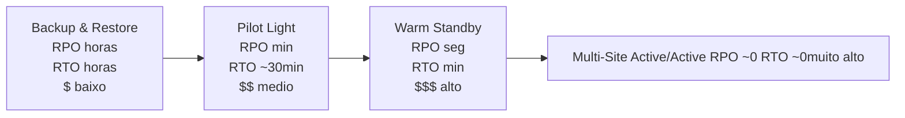

# Bloco 3 — Disaster Recovery: a capacidade que você só descobre se tem ao usar

> **Pergunta do bloco.** O seu plano de DR existe em PDF — **funciona**? Quando o cluster inteiro for perdido, quanto tempo (RTO) e quanto dado (RPO) **de fato** você perde? Este bloco trata DR como **capacidade verificável**, não como documento.

---

## 3.1 Continuidade de negócio vs. DR

Dois termos que se confundem mas não são iguais:

| Termo | Escopo | Exemplo |
|-------|--------|---------|
| **Business Continuity (BC)** | Toda a organização operando apesar de interrupções | "Se o escritório pegar fogo, como o time continua?" |
| **Disaster Recovery (DR)** | Tecnologia: recuperar sistemas após desastre | "Se a região cloud cair, como voltar a servir PIX?" |

DR é **subconjunto técnico** de BC. Sem DR funcional, BC desmorona — mas DR sozinho não é BC.

---

## 3.2 RPO e RTO — as duas promessas quantitativas

### 3.2.1 Definições

- **RPO — Recovery Point Objective.** Quanto dado você **aceita perder** medido em tempo. Se o último backup foi há 1h e o desastre aconteceu agora, RPO ≥ 1h.
- **RTO — Recovery Time Objective.** Quanto tempo você aceita **ficar fora do ar** até recuperar.

```mermaid
gantt
    title RPO e RTO em linha do tempo
    dateFormat HH:mm
    axisFormat %H:%M

    section Operacao
    Ultimo backup OK     :milestone, b1, 13:00, 0m
    Operacao normal      :active, o1, 13:00, 60m
    Desastre             :crit, milestone, d1, 14:00, 0m
    Recuperacao em curso :crit, r1, 14:00, 45m
    Servico restaurado   :milestone, s1, 14:45, 0m

    section Metricas
    RPO <= 1h            :a1, 13:00, 60m
    RTO <= 45min         :a2, 14:00, 45m
```



### 3.2.2 Quem define RPO/RTO

**Produto + negócio**, com SRE informando **custo**. Exemplo:

| Sistema PagoraPay | RPO alvo | RTO alvo | Justificativa |
|-------------------|----------|----------|---------------|
| PIX Envio (core) | 0 min (zero perda) | 15 min | Regulatório; cliente critico |
| Saldo (consulta) | 5 min | 30 min | Afeta UX, mas reversivel |
| Relatórios | 24h | 24h | Pode esperar |
| Logs de auditoria | 0 min | 1h | Regulatório |

### 3.2.3 Custo do rigor

- **RPO 0** requer **replicação síncrona** (custo alto, overhead em latência).
- **RPO horas** permite **backup** (barato, operacional).
- **RTO minutos** requer **standby quente** ou **active-active** (caro).
- **RTO horas** pode ser atingido com **restore from backup** (barato).

Regra de ouro: **RPO/RTO definem custo, não aspiração**. O alvo precisa ser factível com budget atual.

---

## 3.3 Padrões de DR (AWS white paper, válido fora AWS)



- **Backup & Restore**: só backup; restaura sob demanda em infra nova.
- **Pilot Light**: infra mínima já provisionada no DR (ex.: DB replica, mas app off).
- **Warm Standby**: infra completa rodando com capacidade reduzida.
- **Multi-Site Active/Active**: dois lados servem tráfego; se um cair, o outro absorve.

PagoraPay (hoje): **entre Backup & Restore e Pilot Light** no PIX core; nada mais.
Meta do módulo: elevar para **Pilot Light** validado com RPO ≤ 5 min e RTO ≤ 30 min.

---

## 3.4 Tipos de backup

| Tipo | O que captura | Uso típico |
|------|---------------|------------|
| **Snapshot de volume** | Estado do disco em ponto no tempo | DBs stateful; rápido; consome storage |
| **Logical backup** | Dump SQL/JSON interpretado | Portável, testável, mas mais lento |
| **Application-consistent** | Com `fsync`, flush, quiesce da app | Garante consistência (Postgres `pg_start_backup`) |
| **Crash-consistent** | Snapshot sem coordenação | "Como se o servidor tivesse caído"; pode exigir replay de log |
| **Backup do cluster K8s** | Manifests, CRDs, PVs, ConfigMaps | Velero |
| **PITR (Point-In-Time Recovery)** | Base + WAL → qualquer ponto | Postgres WAL archiving |

---

## 3.5 Velero — backup/restore nativo Kubernetes

### 3.5.1 O que Velero faz

- Exporta **objetos Kubernetes** (Deployments, Services, ConfigMaps, Secrets, CRDs) para storage externo (S3-compatível).
- Snapshots de **PersistentVolumes** (via CSI ou plugin do cloud).
- Suporta **restore parcial** (por namespace, label, resource).
- Agendamentos (cron).
- Hooks (pré/pós-backup na app para garantir consistência).

### 3.5.2 Instalação local com MinIO

```bash
# 1. MinIO (S3 compativel local)
kubectl create ns minio
helm repo add minio https://charts.min.io/
helm install minio minio/minio \
  -n minio \
  --set rootUser=admin,rootPassword=adminpass123 \
  --set mode=standalone \
  --set persistence.size=10Gi \
  --set resources.requests.memory=512Mi

# 2. Cria bucket
kubectl -n minio port-forward svc/minio 9001:9001 &
# acesse http://localhost:9001 e crie bucket "velero"

# 3. Velero
VELERO_VERSION="v1.14.1"
# (binario ja no PATH conforme README)

cat <<EOF > /tmp/credentials-velero
[default]
aws_access_key_id = admin
aws_secret_access_key = adminpass123
EOF

velero install \
  --provider aws \
  --plugins velero/velero-plugin-for-aws:v1.10.0 \
  --bucket velero \
  --secret-file /tmp/credentials-velero \
  --backup-location-config region=minio,s3ForcePathStyle=true,s3Url=http://minio.minio:9000 \
  --use-volume-snapshots=false \
  --use-node-agent \
  --default-volumes-to-fs-backup
```

Verificação:

```bash
kubectl -n velero get pods
velero backup-location get
```

### 3.5.3 Backup sob demanda

```bash
# Backup do namespace pagora
velero backup create pagora-$(date +%Y%m%d-%H%M) \
  --include-namespaces pagora \
  --default-volumes-to-fs-backup

velero backup describe pagora-... --details
velero backup logs pagora-...
```

### 3.5.4 Backup agendado (diário às 2h)

```yaml
apiVersion: velero.io/v1
kind: Schedule
metadata:
  name: pagora-daily
  namespace: velero
spec:
  schedule: "0 2 * * *"
  template:
    includedNamespaces: [pagora]
    ttl: "168h"                       # 7 dias de retencao
    defaultVolumesToFsBackup: true
    includeClusterResources: false
```

### 3.5.5 Restore

```bash
# Restaurar em outro namespace (para ensaio)
velero restore create pagora-drill-$(date +%Y%m%d-%H%M) \
  --from-backup pagora-20260420-0200 \
  --namespace-mappings pagora:pagora-dr

kubectl get all -n pagora-dr
```

### 3.5.6 Hooks de consistência (Postgres)

Para garantir backup application-consistent, usar `pre`/`post` hook no pod:

```yaml
annotations:
  pre.hook.backup.velero.io/container: postgres
  pre.hook.backup.velero.io/command: '["/bin/sh","-c","pg_start_backup('"'velero'"', true)"]'
  post.hook.backup.velero.io/container: postgres
  post.hook.backup.velero.io/command: '["/bin/sh","-c","pg_stop_backup()"]'
```

> Com `pg_start_backup/pg_stop_backup`, o Postgres entra em modo "backup ativo" durante o snapshot — garantindo que WAL seja consistente após restore. Alternativa moderna: `pgBackRest` ou `pg_basebackup` em container sidecar.

### 3.5.7 O que Velero NÃO faz

- **Não substitui PITR**. Para RPO muito baixo, combine com archive-log do DB (`pgBackRest`, WAL streaming).
- **Não valida o restore**. Você ainda precisa **testar** que a aplicação sobe.
- **Não faz DR multi-região** automaticamente — você ainda decide geografia.

---

## 3.6 Estratégia de backup para o DB (Postgres)

### 3.6.1 Três camadas combinadas

1. **Base backup periódico** (pgBackRest ou `pg_basebackup` diário).
2. **WAL archiving contínuo** (cada arquivo WAL enviado a storage remoto).
3. **Réplica streaming** (standby com recovery) para failover mais rápido.

Com as três, você tem:

- **RPO** ≈ tempo entre envios de WAL (geralmente ≤ 1 min).
- **RTO** depende do cenário: com standby quente, ~minutos; sem, ~horas.

### 3.6.2 Teste obrigatório

Um dump `pg_dump` guardado num bucket **não é backup**. É **promessa**. Backup é o que **já foi restaurado com sucesso em ambiente separado**.

Política mínima: **restore full mensal** para cluster isolado, validando:

- App sobe.
- Migrations rodam (ou já estão aplicadas).
- Queries de sanidade retornam esperado.
- Checksum de tabelas críticas (ex.: `ledger_movimentos`) confere contra primário.

---

## 3.7 DR Game Day

### 3.7.1 Diferença vs. Chaos Game Day

- Chaos Game Day → resiliência a falhas parciais.
- DR Game Day → recuperação de falhas **catastróficas** (perda total).

### 3.7.2 Cenários representativos

| Cenário | Simulação | RTO alvo |
|---------|-----------|----------|
| Cluster K8s corrompido | Deletar cluster; recriar do zero; restore Velero | ≤ 2h |
| Base de dados corrompida | `DROP TABLE` acidental; restore do último backup | ≤ 30 min |
| Região cloud fora | Falha de provider; subir em DR region | ≤ 1h |
| Pessoas-chave indisponíveis | Sem o SRE sênior; o júnior conduz | sem bloqueio |

### 3.7.3 Estrutura (1 dia inteiro, 1-2× por ano)

1. **Manhã (3h)**: preparação, revisão de runbooks, teste de ferramentas.
2. **Tarde (4h)**: execução do cenário + observação.
3. **Debrief (1h)**: aprendizado, ações, tickets.

---

## 3.8 Runbook de DR — estrutura mínima

Todo runbook de DR **deve**:

1. **Nomear o cenário** (ex.: "Perda total do cluster `pagora-prod`").
2. **Pré-condições** (backup íntegro? DNS controlado?).
3. **Comando exato, numerado, com output esperado**.
4. **Critério de sucesso** (p.ex.: `GET /healthz` em 3 endpoints retorna 200).
5. **Plano B** se comando falhar.
6. **Comunicação** — quem avisa quem, em que canal.
7. **Timestamp de última execução** e resultado.

Exemplo resumido:

```markdown
# Runbook: Restore completo do namespace `pagora`

## Pre-condicoes
- Backup mais recente `pagora-<DATA>` passou verificacao (`velero backup describe`).
- Credenciais de MinIO/S3 validas.
- DNS externo (pagora.example) apontando para o LB correto.

## Passo 1 — Restaurar namespace em cluster fresco
    kubectl create ns pagora
    velero restore create pagora-restore-$(date +%Y%m%d-%H%M) \
        --from-backup pagora-<DATA>

Esperado: `status: Completed` em <=5 min.

## Passo 2 — Aplicar migrations pendentes
    kubectl -n pagora exec deploy/ledger -- python -m alembic upgrade head

Esperado: "Running upgrade ... -> head".

## Passo 3 — Validar
    kubectl -n pagora get pods          # todos Ready
    curl -f https://pagora.example/healthz
    curl -f https://pagora.example/pix/ping

## Criterio de sucesso
3 healthchecks OK por 5 min consecutivos.

## Plano B
Se Velero falhar, restore manual: `pg_restore` do dump mais recente + `kubectl apply -k infra/k8s/prod`.

## Comunicacao
- Canal #incidentes: anunciar inicio, marcos, conclusao.
- Status page publica: atualizar a cada 15 min.

## Ultima execucao
2026-04-15 14:00 — sucesso, RTO medido 28 min.
```

---

## 3.9 Dependências externas e DR

Nem tudo está no seu cluster. Mapear e documentar:

- **DNS**: quem controla? TTL baixo (60–300s) para failover rápido.
- **CDN**: tem regra de failover?
- **Registry de imagens**: caiu → pods novos não iniciam.
- **Provedor de identidade (OIDC)**: caiu → ninguém entra.
- **Provedor de pagamentos upstream** (no caso PIX → SPI do BCB): **fora do seu controle**, mas você precisa degradar graciosamente.
- **Observabilidade**: Prometheus/Grafana/Loki no mesmo cluster? Se sim, **falha silenciosa** — você não verá o desastre. **Separe o plano de observabilidade**.

---

## 3.10 Script Python: `dr_simulator.py`

Simula cenários de DR, calcula RPO/RTO esperados e gera relatório.

```python
"""
dr_simulator.py - simula cenarios de DR e calcula RPO/RTO esperados.

Entrada: YAML com definicoes de cenarios e parametros.
    cenarios:
      - nome: "cluster-perdido"
        rpo_fonte_min: 5           # ultimo snapshot/backup
        etapas:
          - { nome: "detectar", minutos: 5 }
          - { nome: "decidir-DR", minutos: 5 }
          - { nome: "provisionar-cluster", minutos: 10 }
          - { nome: "velero-restore", minutos: 15 }
          - { nome: "validar", minutos: 5 }

Uso:
    python dr_simulator.py cenarios.yaml --rto-alvo-min 30 --rpo-alvo-min 5
"""
from __future__ import annotations

import argparse
import sys
from dataclasses import dataclass

import yaml
from rich.console import Console
from rich.table import Table


@dataclass(frozen=True)
class Etapa:
    nome: str
    minutos: int


@dataclass(frozen=True)
class Cenario:
    nome: str
    rpo_fonte_min: int
    etapas: list[Etapa]

    @property
    def rto_total_min(self) -> int:
        return sum(e.minutos for e in self.etapas)


def carregar(path: str) -> list[Cenario]:
    with open(path, "r", encoding="utf-8") as fh:
        data = yaml.safe_load(fh) or {}
    cenarios: list[Cenario] = []
    for c in data.get("cenarios", []):
        etapas = [Etapa(nome=e["nome"], minutos=int(e["minutos"]))
                  for e in c.get("etapas", [])]
        cenarios.append(Cenario(
            nome=c["nome"],
            rpo_fonte_min=int(c.get("rpo_fonte_min", 0)),
            etapas=etapas,
        ))
    return cenarios


def avaliar(c: Cenario, rpo_alvo: int, rto_alvo: int) -> tuple[str, str]:
    rpo_ok = c.rpo_fonte_min <= rpo_alvo
    rto_ok = c.rto_total_min <= rto_alvo
    rpo_label = "OK" if rpo_ok else f"EXCEDE (+{c.rpo_fonte_min - rpo_alvo}min)"
    rto_label = "OK" if rto_ok else f"EXCEDE (+{c.rto_total_min - rto_alvo}min)"
    return rpo_label, rto_label


def relatorio(cenarios: list[Cenario], rpo_alvo: int, rto_alvo: int) -> int:
    console = Console()
    algum_excede = False
    for c in cenarios:
        tbl = Table(title=f"Cenario: {c.nome}")
        for col in ("etapa", "minutos"):
            tbl.add_column(col)
        for e in c.etapas:
            tbl.add_row(e.nome, str(e.minutos))
        tbl.add_row("[b]TOTAL RTO[/b]", f"[b]{c.rto_total_min}[/b]")
        console.print(tbl)

        rpo_l, rto_l = avaliar(c, rpo_alvo, rto_alvo)
        console.print(f"RPO esperado: {c.rpo_fonte_min}min (alvo {rpo_alvo}) -> {rpo_l}")
        console.print(f"RTO esperado: {c.rto_total_min}min (alvo {rto_alvo}) -> {rto_l}\n")

        if "EXCEDE" in rpo_l or "EXCEDE" in rto_l:
            algum_excede = True

    return 1 if algum_excede else 0


def main(argv: list[str] | None = None) -> int:
    p = argparse.ArgumentParser()
    p.add_argument("cenarios_yaml")
    p.add_argument("--rpo-alvo-min", type=int, default=15)
    p.add_argument("--rto-alvo-min", type=int, default=60)
    args = p.parse_args(argv)

    try:
        cenarios = carregar(args.cenarios_yaml)
    except (OSError, yaml.YAMLError) as exc:
        print(f"ERRO: {exc}", file=sys.stderr)
        return 2

    if not cenarios:
        print("Nenhum cenario encontrado.")
        return 0

    return relatorio(cenarios, args.rpo_alvo_min, args.rto_alvo_min)


if __name__ == "__main__":
    raise SystemExit(main())
```

Exemplo `cenarios.yaml`:

```yaml
cenarios:
  - nome: "cluster-perdido"
    rpo_fonte_min: 5
    etapas:
      - { nome: "detectar via monitoring", minutos: 3 }
      - { nome: "decisao de DR", minutos: 5 }
      - { nome: "provisionar cluster novo (IaC)", minutos: 10 }
      - { nome: "velero restore pagora", minutos: 12 }
      - { nome: "aplicar migrations", minutos: 3 }
      - { nome: "validacao healthz", minutos: 5 }

  - nome: "db-corrompido"
    rpo_fonte_min: 1
    etapas:
      - { nome: "detectar via alert", minutos: 2 }
      - { nome: "diagnostico", minutos: 10 }
      - { nome: "restore PITR ate momento anterior", minutos: 25 }
      - { nome: "validar integridade", minutos: 5 }

  - nome: "regiao-inteira-down"
    rpo_fonte_min: 5
    etapas:
      - { nome: "detectar", minutos: 5 }
      - { nome: "ativar DR region", minutos: 15 }
      - { nome: "DNS failover (TTL 300)", minutos: 5 }
      - { nome: "velero restore na DR region", minutos: 20 }
      - { nome: "migracoes + aquecer cache", minutos: 10 }
      - { nome: "validar", minutos: 10 }
```

Rodar:

```bash
python dr_simulator.py cenarios.yaml --rpo-alvo-min 5 --rto-alvo-min 60
```

---

## 3.11 Checklist do bloco

- [ ] Diferencio BC de DR.
- [ ] Defino RPO/RTO por sistema com justificativa.
- [ ] Escolho padrão apropriado (Backup/Pilot/Warm/Active) considerando custo.
- [ ] Opero Velero: instalar, backup agendado, restore entre namespaces.
- [ ] Entendo camadas de backup de DB (base, WAL, replica).
- [ ] Conduzo DR Game Day estruturado.
- [ ] Escrevo runbook com comandos numerados, critério de sucesso, plano B.
- [ ] Uso `dr_simulator.py` para validar RPO/RTO planejados.

Vá aos [exercícios resolvidos do Bloco 3](./03-exercicios-resolvidos.md).

---

<!-- nav:start -->

| &nbsp; | &nbsp; | &nbsp; |
|:--|:--:|--:|
| **← Anterior**<br>[Bloco 2 — Exercícios resolvidos](../bloco-2/02-exercicios-resolvidos.md) | **↑ Índice**<br>[Módulo 10 — SRE e operações](../README.md) | **Próximo →**<br>[Bloco 3 — Exercícios resolvidos](03-exercicios-resolvidos.md) |

<!-- nav:end -->
