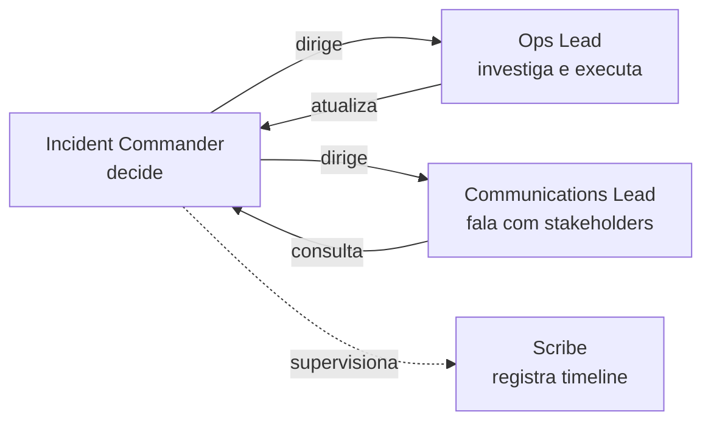
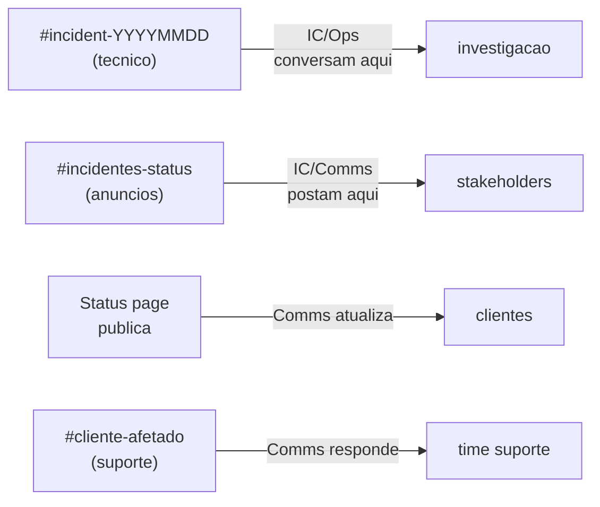

# Bloco 4 — Gestão de Incidentes em Escala: papéis, comunicação e aprendizado

> **Pergunta do bloco.** Pequenas empresas resolvem incidentes com três engenheiros no Slack e força de vontade. **Não escala.** Quando o sistema cresce, o incidente vira **desafio organizacional**: quem decide? quem comunica? como ninguém esquece lição aprendida? Este bloco traz o **Incident Command System (ICS)** e a cultura de postmortem que fazem a operação virar aprendizado sistemático.

---

## 4.1 Por que incidentes ficam caóticos

Antes de gerenciar bem, entenda por que dá errado. Padrões comuns:

```mermaid
flowchart TD
    A[Incidente comeca] --> B[3-6 pessoas entram<br/>em 2 canais Slack]
    B --> C1[Todos investigam em paralelo<br/>sem coordenar]
    B --> C2[Cliente fica sem update]
    C1 --> D1[Descobertas perdidas<br/>"alguem falou em DM"]
    C1 --> D2[Acoes contraditorias<br/>"eu dei apply, voce reverteu"]
    C2 --> D3[Redes sociais<br/>descobrem primeiro]
    D1 --> E[Pos-incidente:<br/>ninguem sabe<br/>o que aconteceu]
    D2 --> E
    D3 --> E

    style E fill:#f8d7da
```

O antídoto: **comando claro**, **comunicação separada da investigação**, e **registro em tempo real**.

---

## 4.2 Incident Command System (ICS) — origem e adaptação

O **ICS** nasceu em 1970 no combate a incêndios florestais na Califórnia. Vira padrão da **FEMA** (EUA) e organizações de emergência mundiais. Facebook, Google, PagerDuty adaptaram para operações de software.

### 4.2.1 Os 4 papéis essenciais



| Papel | Responsabilidade | Autoridade | **NÃO faz** |
|-------|------------------|-----------|-------------|
| **Incident Commander (IC)** | Coordenar; decidir próximas ações; escalar | Autoriza ações disruptivas (rollback, failover) | **Não digita em terminal**. Não investiga. |
| **Ops Lead** | Investigar tecnicamente; propor hipóteses; executar fixes aprovados | Executa após IC autorizar | Não decide escopo do incidente. |
| **Comms Lead** | Atualizar status page; notificar clientes/stakeholders | Aprova texto de comunicação (com IC) | Não conversa no canal técnico. |
| **Scribe** | Registrar timeline factual (hora, quem, o quê, decisão) | Pode interromper para confirmar fato | Não opina nem investiga. |

### 4.2.2 Por que separar

- **IC** precisa de "cabeça acima" — se entra no terminal, perde visão geral.
- **Ops** precisa concentração técnica — não deve redigir post para Twitter.
- **Comms** protege o time de distração — cliente perguntando "ainda está fora?" todo minuto não ajuda investigação.
- **Scribe** evita a pergunta pós-incidente "o que aconteceu mesmo?".

### 4.2.3 Pessoas vs. Papéis

- Uma pessoa pode acumular papéis em incidentes pequenos (IC + Scribe, p.ex.).
- Em incidentes grandes, NUNCA acumule: IC precisa estar livre para decidir.
- Papéis têm **horário de passar** — não faça turno de 6h de IC.

---

## 4.3 Severidades (Sev)

Sem classificação de severidade, todo mundo trata tudo como pânico — ou nada como urgente. Proposta prática:

| Sev | Descrição | Exemplo PagoraPay | Resposta |
|-----|-----------|-------------------|----------|
| **Sev-1** | Indisponibilidade total ou perda de dados | `/pix/enviar` retornando 500 para >5% em 2 min | IC em <5 min; status page; CEO ciente |
| **Sev-2** | Degradação significativa em função crítica | p95 >2s por >15 min | IC em <15 min; comunicação interna |
| **Sev-3** | Degradação parcial; workaround existe | Dashboard de suporte fora | Squad responsável trata em horário |
| **Sev-4** | Problema cosmético / risco futuro | Alerta de disco "amanhã encherá" | Issue, fila normal |

### 4.3.1 Critérios objetivos

Nunca baseie severidade em "achômetro". Sempre use **SLI** medida:

- Sev-1: SLI < 50% do alvo **ou** duração > 5 min.
- Sev-2: SLI entre 50–90% do alvo **ou** duração > 15 min.
- Sev-3: SLI entre 90–99% **ou** impacto < 10% dos usuários.

### 4.3.2 Upgrade/Downgrade

- Sev **pode mudar** durante o incidente. Exemplo: começa Sev-3 ("um dashboard caiu"), depois descobre que é Sev-1 ("tudo caiu com o dashboard").
- IC é quem muda. Comunica ao canal.

---

## 4.4 Comunicação durante incidente

### 4.4.1 Canais (separados!)



Regra de ouro: **canal técnico de Ops é sagrado**. Ninguém escreve "quando volta?" lá. Comms intercepta fora.

### 4.4.2 Status page

Atualizar **a cada 15–30 minutos**, mesmo sem novidade. "Ainda investigando — próxima atualização 14:30" é **mais** calmante que silêncio.

Template:

```markdown
[14:18] Identificada degradacao em PIX envio. Investigando.
[14:30] Equipe isolou a causa: migracao de schema em andamento. Cancelando.
[14:45] Operacoes retomadas. Monitorando estabilidade.
[15:15] Totalmente estavel. Postmortem sera publicado em ate 72h.
```

Tom: **factual, sem jargão, sem promessa**.

### 4.4.3 Comunicação regulada

Para setores regulados (financeiro, saúde), há obrigações legais:

- **BACEN** (instituições de pagamento): comunicação formal se evento afetar SLA regulatório.
- **LGPD**: notificação à ANPD e a titulares se houver vazamento com risco.
- **HIPAA/GDPR**: similares em outras jurisdições.

Ter **templates prontos** em runbook reduz chance de erro sob pressão.

---

## 4.5 Declarar e encerrar um incidente

### 4.5.1 Declaração

Quem declara? **Qualquer engenheiro** que suspeite de Sev-1/2. Melhor sobre-declarar que sob-declarar.

Declaração dispara:

1. Abertura do canal `#incident-YYYYMMDD-<slug>`.
2. Paging de IC on-call.
3. Paging de Ops on-call do serviço afetado.
4. Criação automática de documento Postmortem draft.

### 4.5.2 Encerramento

Encerra quando:

- SLI volta ao alvo por **janela mínima** (ex.: 15 min estável).
- Não há pista de retorno do problema.
- Comms anunciou fim publicamente.
- IC declara encerramento; scribe fecha timeline.

Encerramento **não** é fim do trabalho: postmortem começa.

---

## 4.6 Postmortem blameless

### 4.6.1 Propósito

Não é julgamento. É **engenharia** aplicada à análise de falha — para que ela não se repita por **causa estrutural**, não por "alguém se concentrar mais".

### 4.6.2 Princípios (Allspaw, Etsy)

1. **Hindsight bias** é real: sabendo o desfecho, tudo parecia óbvio. Não era.
2. **Pessoas agem razoavelmente** dado o que sabiam no momento. Culpar é fácil e inútil.
3. **O sistema socio-técnico falhou**, não a pessoa. Corrigir o sistema evita repetição.
4. **Curiosidade > Acusação.** "Como essa decisão fez sentido no momento?" é mais útil que "por que você fez isso?".

### 4.6.3 Estrutura

```markdown
# Postmortem: <titulo curto, data>

## Resumo (1 paragrafo)
O que aconteceu, impacto, duracao.

## Impacto
- Usuarios afetados: N
- Requests falhadas: N
- Budget queimado: X min (de Y min)
- Perda financeira estimada (se aplicavel): R$

## Timeline (factual)
| Hora | Evento | Quem |
|------|--------|------|
| 14:18 | Deploy de schema iniciou | CI |
| 14:19 | Monitoramento detectou subida de p99 | Alerta X |
| ...  | | |
| 14:55 | Operacoes normais | Ops lead |

## O que funcionou
- Item 1 (concreto)
- ...

## O que nao funcionou
- Item 1 (concreto, no sistema)
- ...

## Contributing factors
Lista estruturada (nao "causa raiz" unica):
- Factor 1: migracao nao foi revisada; processo permitia push direto.
- Factor 2: runbook de rollback de schema nao existia.
- Factor 3: on-call foi paginado, mas ninguem entendia o sistema afetado.
- ...

## Acoes
| Acao | Dono | Prazo | Verificacao |
|------|------|-------|-------------|
| Adicionar gate "migracao requer aprovacao DBA" em CI | Alice | 2026-03-20 | PR merged + review |
| Escrever runbook rollback schema | Bob | 2026-03-25 | Exercitado em game day |
| Redistribuir on-call pagamentos (3 pessoas) | Carla | 2026-03-30 | Rotacao publicada |

## Aprendizado organizacional
O que todo o time precisa saber sobre essa classe de falha.
```

### 4.6.4 O que **não** colocar

- **Culpados.** "Alice fez X" nunca. "A migração de schema entrou sem revisão de DBA" é estrutural.
- **Ações sem dono/prazo.** "Melhorar cultura de revisão" = nada.
- **"Causa raiz"** (singular). Pense em **múltiplos fatores contribuintes**.

---

## 4.7 "Causa raiz" vs. "contributing factors"

Falácia popular: "achamos a causa raiz". Sistemas complexos **falham por múltiplas causas** que se encontraram. Mudar só uma delas pode não impedir repetição.

Exemplo PagoraPay 09/03:

| Fator | Presente? |
|-------|-----------|
| Migração de schema pesada em prod | ✓ |
| Falta de gate de aprovação DBA | ✓ |
| Runbook de rollback ausente | ✓ |
| Dev responsável não no plantão | ✓ |
| Ferramenta `pg_cancel_backend` insuficiente (mas não `pg_terminate`) | ✓ |
| Monitor alertou 1 min tarde | ✓ |
| Sem IC definido | ✓ |

Remover só 1 não teria evitado o incidente — ou teria reduzido o impacto? A análise honesta lista **todos** e prioriza ações em múltiplos.

---

## 4.8 Just Culture (Sidney Dekker)

**Just culture** distingue:

- **Erro humano**: execução falha de boa intenção.
- **At-risk behavior**: atalhos comuns, normalizados.
- **Reckless behavior**: desconsideração consciente de risco.

Cada um pede resposta diferente:

- Erro → apoio e melhoria de design.
- At-risk → treinamento, remoção do incentivo ao atalho.
- Reckless → ação formal (muito raro).

**Nunca culpe erro humano como se fosse reckless.** Isso mata a cultura de reportar.

---

## 4.9 Learning Review — o ciclo organizacional

Postmortem individual é útil mas insuficiente. A cada trimestre (ou semestre):

1. **Agregar** postmortems do período.
2. **Buscar padrões**: "5 incidentes em 6 meses envolvem migrações de schema — existe problema estrutural".
3. **Propor** investimento mais alto (reformar pipeline de schema, não só adicionar gate).
4. **Verificar** se ações de postmortems anteriores foram concluídas **e** funcionaram.

Sem Learning Review, postmortems viram burocracia. Com ele, viram motor de evolução.

---

## 4.10 On-call sustentável

### 4.10.1 A lei da entropia humana

- Burnout é certeza quando 1-2 pessoas absorvem todas as páginas.
- Engenheiro paginado >2× fora do horário/semana **sistematicamente** reduz produtividade.
- Alertas falsos positivos corroem confiança no pager.

### 4.10.2 Política sustentável

```markdown
# On-call PagoraPay (politica)

## Rotacao
- Minimo 4 pessoas por servico critico (evita concentracao).
- Turno: 1 semana; primario + secundario.
- Segunda a segunda; trocas trocam-se pares (nao 1 pessoa por 2 semanas).

## Limites
- Paging fora do horario/semana: alvo <= 2.
- Se >= 3 em 2 semanas seguidas: review obrigatorio do alerta (ruido?) e da resiliencia.
- Turnos de fim de semana tem peer de apoio.

## Compensacao
- Paging noturno: compensacao em tempo (meio dia off apos ciclo).
- Turno cumprido: folga compensatoria.
- Salario ou bonus nao substitui descanso.

## Qualidade
- Sem paging para acoes que podem esperar proximo dia util (usar alerta nao-urgente).
- Todo paging novo passa por revisao antes de entrar em rotacao.
- Se alerta disparar 3x sem acao util: remover/ajustar; nao manter "por seguranca".

## Aprendizado
- Todo paging gera entrada em log (5 min); semanalmente review.
- Game day trimestral com cenarios.
- Onboarding de on-call: shadowing por 1 ciclo.
```

### 4.10.3 Métricas de saúde do on-call

- **Pages per person per week** (alvo < 2 fora do horário).
- **% de pages acionáveis** (não falso-positivos); alvo > 70%.
- **Tempo médio de reconhecimento** (ack).
- **Satisfação** de on-call (pesquisa trimestral, não anual).

---

## 4.11 Tabletop exercise

**Tabletop** é exercício "de mesa": não executam comandos, **discutem** o que fariam. Barato, rápido, valioso.

Formato (45 min):

1. Cenário é lido em voz alta: "Sexta 23h, o DB `ledger` começa a responder em 8 s."
2. IC (voluntário) descreve primeiras 5 ações.
3. Outros papéis complementam.
4. Facilitador injeta complicações: "Comms liga para você: Twitter está em pânico."
5. Discussão: O que aprendemos? Qual runbook revisitar? Ação?

Rode **mensalmente** com cenários rotativos. O time reconhece gaps sem custo real.

---

## 4.12 Script Python: `incident_timeline.py`

Constrói timeline a partir de lista de eventos (CSV ou YAML) e calcula MTTR + fases.

```python
"""
incident_timeline.py - constroi timeline de incidente e calcula MTTR + fases.

Entrada: CSV com colunas timestamp,ator,fase,evento
Fases esperadas (padrao): detect, ack, investigate, mitigate, resolve

    timestamp,ator,fase,evento
    2026-03-09T14:18:00,CI,detect,deploy iniciou
    2026-03-09T14:19:30,monitor,detect,alerta p99 dispara
    2026-03-09T14:21:00,bob,ack,on-call reconhece
    2026-03-09T14:38:00,alice,investigate,cto chama dev da migracao
    2026-03-09T14:55:00,bob,mitigate,pg_terminate_backend executado
    2026-03-09T15:00:00,monitor,resolve,SLI volta ao normal

Uso:
    python incident_timeline.py incident.csv
"""
from __future__ import annotations

import argparse
import csv
import sys
from dataclasses import dataclass
from datetime import datetime, timedelta

from rich.console import Console
from rich.table import Table


FASES_ORDEM = ["detect", "ack", "investigate", "mitigate", "resolve"]


@dataclass(frozen=True)
class Evento:
    ts: datetime
    ator: str
    fase: str
    descricao: str


def parse_ts(s: str) -> datetime:
    s = s.strip()
    # aceita ISO com ou sem timezone
    try:
        return datetime.fromisoformat(s)
    except ValueError:
        return datetime.strptime(s, "%Y-%m-%dT%H:%M:%S")


def carregar(path: str) -> list[Evento]:
    eventos: list[Evento] = []
    with open(path, "r", encoding="utf-8", newline="") as fh:
        leitor = csv.DictReader(fh)
        for row in leitor:
            try:
                eventos.append(Evento(
                    ts=parse_ts(row["timestamp"]),
                    ator=row["ator"].strip(),
                    fase=row["fase"].strip().lower(),
                    descricao=row["evento"].strip(),
                ))
            except (KeyError, ValueError) as exc:
                print(f"AVISO: linha invalida: {row} ({exc})", file=sys.stderr)
    eventos.sort(key=lambda e: e.ts)
    return eventos


def primeira_ocorrencia(eventos: list[Evento], fase: str) -> datetime | None:
    for e in eventos:
        if e.fase == fase:
            return e.ts
    return None


def fmt_delta(d: timedelta | None) -> str:
    if d is None:
        return "-"
    total = int(d.total_seconds())
    h, rest = divmod(total, 3600)
    m, s = divmod(rest, 60)
    return f"{h:02d}:{m:02d}:{s:02d}"


def relatorio(eventos: list[Evento]) -> int:
    if not eventos:
        print("Sem eventos.")
        return 0

    console = Console()

    tbl = Table(title=f"Timeline do incidente ({len(eventos)} eventos)")
    for c in ("timestamp", "fase", "ator", "evento"):
        tbl.add_column(c)
    for e in eventos:
        tbl.add_row(e.ts.isoformat(), e.fase, e.ator, e.descricao)
    console.print(tbl)

    inicio = primeira_ocorrencia(eventos, "detect") or eventos[0].ts
    ack = primeira_ocorrencia(eventos, "ack")
    mitigate = primeira_ocorrencia(eventos, "mitigate")
    resolve = primeira_ocorrencia(eventos, "resolve")

    tbl2 = Table(title="Metricas de incidente")
    for c in ("metrica", "valor", "descricao"):
        tbl2.add_column(c)
    tbl2.add_row("MTTA (tempo ate ack)",
                 fmt_delta((ack - inicio) if ack else None),
                 "Velocidade de deteccao humana")
    tbl2.add_row("MTTM (tempo ate mitigacao)",
                 fmt_delta((mitigate - inicio) if mitigate else None),
                 "Ate primeira acao corretiva")
    tbl2.add_row("MTTR (tempo ate resolucao)",
                 fmt_delta((resolve - inicio) if resolve else None),
                 "Fim do incidente")
    console.print(tbl2)

    fases_presentes = {e.fase for e in eventos}
    faltantes = [f for f in FASES_ORDEM if f not in fases_presentes]
    if faltantes:
        console.print(f"\n[yellow]Fases ausentes na timeline: {', '.join(faltantes)}[/yellow]")
        console.print("Dica: toda timeline de Sev-1/2 deveria cobrir todas as fases.")
        return 1
    return 0


def main(argv: list[str] | None = None) -> int:
    p = argparse.ArgumentParser()
    p.add_argument("csv")
    args = p.parse_args(argv)
    try:
        eventos = carregar(args.csv)
    except OSError as exc:
        print(f"ERRO: {exc}", file=sys.stderr)
        return 2
    return relatorio(eventos)


if __name__ == "__main__":
    raise SystemExit(main())
```

Exemplo `incident.csv` (incidente PagoraPay 2026-03-09):

```csv
timestamp,ator,fase,evento
2026-03-09T14:18:00,CI,detect,deploy iniciou com migracao de schema
2026-03-09T14:19:30,monitor,detect,alerta p99 dispara
2026-03-09T14:23:00,bob,ack,on-call reconhece no slack
2026-03-09T14:38:00,alice,investigate,CTO chama dev da migracao
2026-03-09T14:46:00,dev,investigate,tentativa pg_cancel_backend falha
2026-03-09T14:55:00,bob,mitigate,pg_terminate_backend executado
2026-03-09T15:00:00,monitor,resolve,SLI volta ao normal
```

---

## 4.13 Anti-padrões comuns

- **Culpar pessoa** em vez de sistema → ninguém reporta nada mais.
- **Postmortem sem ações acompanhadas** → teatro.
- **Executar rollback sem registrar** → timeline fica incompleta; aprendizado se perde.
- **Ignorar severidade baixa** → Sev-3 recorrente vira Sev-1 um dia.
- **On-call com 1–2 pessoas** → quando uma sair, o sistema colapsa.
- **Runbook desatualizado** → perigoso; instrui errado sob pressão.
- **Alertas ruidosos** → fatiga; quando vier o alerta real, é ignorado.

---

## 4.14 Checklist do bloco

- [ ] Distingo papéis IC, Ops, Comms, Scribe e sei quando acumular/separar.
- [ ] Defino severidade com critérios objetivos (SLI, duração).
- [ ] Separo canais técnico, anúncios, suporte.
- [ ] Declaro e encerro incidente com protocolo claro.
- [ ] Escrevo postmortem blameless com timeline, contributing factors, ações.
- [ ] Diferencio erro/at-risk/reckless (Just Culture).
- [ ] Conduzo Learning Review trimestral.
- [ ] Projeto política de on-call sustentável.
- [ ] Pratico Tabletop mensalmente.
- [ ] Uso `incident_timeline.py` para construir cronologia com MTTA/MTTM/MTTR.

Vá aos [exercícios resolvidos do Bloco 4](./04-exercicios-resolvidos.md).

---

<!-- nav:start -->

| &nbsp; | &nbsp; | &nbsp; |
|:--|:--:|--:|
| **← Anterior**<br>[Bloco 3 — Exercícios resolvidos](../bloco-3/03-exercicios-resolvidos.md) | **↑ Índice**<br>[Módulo 10 — SRE e operações](../README.md) | **Próximo →**<br>[Bloco 4 — Exercícios resolvidos](04-exercicios-resolvidos.md) |

<!-- nav:end -->
