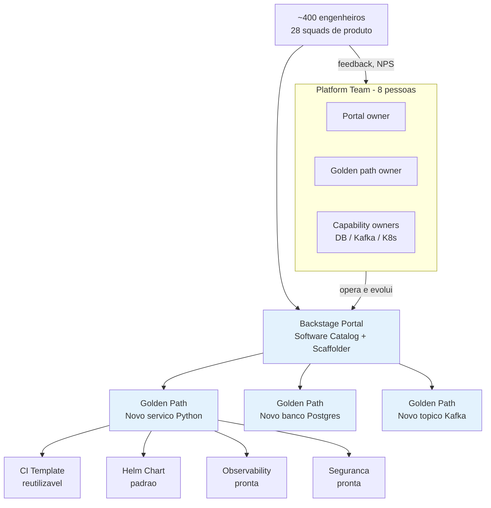

# Cenário PBL — OrbitaTech: 5 para 28 squads em 18 meses

> **PBL (Problem-Based Learning).** Esse cenário é a linha narrativa do módulo. Blocos e exercícios giram em torno dele.

---

## A empresa

**OrbitaTech** é uma **proptech** (tecnologia imobiliária) brasileira fundada em 2019. Oferece:

- Marketplace de aluguéis urbanos (C2C + parcerias com imobiliárias).
- Plataforma de gestão de condomínios (SaaS B2B).
- Score de crédito de inquilino (B2B).
- App para síndicos e moradores.

Números (Q1/2026):

- **580 mil usuários ativos** mensais.
- **R$ 2,1 bi/ano** em aluguéis intermediados.
- **420 engenheiros**, divididos em **28 squads** (em Q1/2024 eram 5 squads e 58 engenheiros).
- **47 serviços em produção** — Python (FastAPI, Django), Go, Node.js, Kotlin.
- Infra: **Kubernetes** (EKS-like managed em provedor local), Terraform/Pulumi, Postgres, Kafka, Redis, observabilidade com Grafana stack.

---

## A dor

A empresa tinha **cultura DevOps saudável** quando era pequena: cada squad conhecia sua pipeline, seus charts Helm, seus dashboards. Com o hipercrescimento, isso virou **caos distribuído**:

### Achados da pesquisa interna "Developer Experience" (janeiro/2026)

| # | Sintoma | Evidência |
|---|---------|-----------|
| 1 | **Onboarding de 3 a 6 semanas** até o primeiro deploy em prod | Entrevistas com 34 contratados dos últimos 6 meses |
| 2 | **47 pipelines CI/CD diferentes** entre serviços similares | Inventário do time de infra; 12 formas diferentes de build Docker |
| 3 | **8 dialetos de Helm chart** — cada squad "remix" de chart antigo | Análise estática dos 47 charts |
| 4 | **Serviço "órfão" descoberto** há 14 meses sem dono | Incidente #2026-01-18: ninguém sabia quem mantinha `score-risk-legacy` |
| 5 | **"Onde está X?"** é a pergunta mais feita no Slack geral | 312 ocorrências em 30 dias |
| 6 | **Shadow IT**: 3 squads montaram suas próprias plataformas internas | Descoberto em audit: 3 instalações paralelas de ArgoCD não monitoradas |
| 7 | **Time de Infra vira fila de tickets** — 187 tickets abertos, prazo médio 9 dias | Jira dashboard |
| 8 | **Custo cloud cresce 12% ao mês** — ninguém sabe quem gasta o quê | FinOps report ad-hoc |
| 9 | **Padrões de segurança (Módulo 9) são aplicados inconsistentemente** | Somente 11 dos 47 serviços têm cosign + SBOM |
| 10 | **DORA metrics** — time de produto alto (5 deploys/dia), mas **Change Failure Rate de 22%** e **Lead Time médio de 9 dias** (deveria ser < 1 dia) | Métricas internas |
| 11 | **Turnover alto** entre engenheiros pleno/sênior: 18% ao ano, citando "frustração com tooling" em exit interview | RH |

### O ponto de estalo

No incidente **#2026-01-18**, a responsável pelo serviço `score-risk-legacy` (uma engenheira sênior que saiu 9 meses antes) não respondia. Ninguém sabia:

- Onde estava o repositório.
- Qual era o dashboard.
- Qual squad herdou.
- Se o serviço era **crítico** (era — feed de `/recomendacoes`).

Depois de 2h de investigação (incluindo acordar o CTO), descobriu-se que o serviço rodava há 14 meses sem deploy, sem monitoramento adicional, e sem owner claro.

**O CEO, numa reunião executiva dura, resumiu:** *"Nós perdemos o mapa da nossa própria empresa."*

---

## A resposta: Platform Team

O Board aprovou a criação de um **Platform Team** de 8 pessoas (originalmente um subgrupo do Infra), com **mandato** de produto interno:

1. Construir uma **plataforma interna** (IDP) com portal de desenvolvedor.
2. Definir **golden paths** opinioniados para criação de novos serviços.
3. Publicar um **Software Catalog** vivo com owner, SLO e dependências.
4. Oferecer **capabilities self-service** (banco Postgres, Kafka topic, namespace K8s) via UI + API.
5. Medir **DORA, SPACE, DevEx** e **NPS interno** da plataforma.
6. Absorver complexidade (cognitive load) do **squad de produto**.

**Mandato explícito**: plataforma não **obriga** uso — cada squad pode continuar fazendo sozinho. Mas o golden path precisa ser tão bom que usar seja a escolha natural.

---

## Sua missão

Você é **líder técnico** do Platform Team. Em 6 sprints (12 semanas), você precisa:

1. **Definir** a plataforma como produto: persona, jobs-to-be-done, golden paths, anti-golden paths.
2. **Implantar Backstage** com Software Catalog populado para os 47 serviços existentes.
3. **Publicar 2 golden paths**: (a) "novo microsserviço FastAPI" e (b) "novo banco Postgres de produto".
4. **Formalizar contratos** de plataforma (capabilities, tiers, SLOs internos, custo, lifecycle).
5. **Instrumentar** métricas DORA, SPACE survey, NPS interno; dashboard Grafana unificado.
6. **Reduzir onboarding** de 3-6 semanas para **<= 3 dias** até o primeiro deploy em prod.

---

## A pergunta norteadora

> **Como entregar, em forma de produto interno, a consistência, segurança e observabilidade que a empresa precisa — sem reduzir a autonomia que tornou a engenharia rápida?**

Cada bloco ataca uma parte:

- **Bloco 1** — estrutura organizacional e o vocabulário de plataforma-como-produto.
- **Bloco 2** — o portal e os golden paths como produtos concretos.
- **Bloco 3** — os contratos que sustentam o relacionamento plataforma ↔ squad de produto.
- **Bloco 4** — as métricas que dizem se a plataforma de fato entrega valor.

---

## Arquitetura e papéis relevantes

Nota: **Platform Team = produto**, não projeto. Tem backlog, roadmap, survey trimestral, NPS. Mede-se pela **adoção voluntária**.

---

Nos próximos blocos essa empresa ganha um **portal**, **golden paths** funcionais, **contratos** formais e **métricas** de saúde.

---

<!-- nav:start -->

**Navegação — Módulo 11 — Plataforma interna**

- ← Anterior: [Módulo 11 — Plataforma Interna de Desenvolvimento (IDP)](README.md)
- → Próximo: [Bloco 1 — Platform Engineering: times, cognitive load e produto interno](bloco-1/01-platform-engineering.md)
- ↑ Índice do módulo: [Módulo 11 — Plataforma interna](README.md)

<!-- nav:end -->
