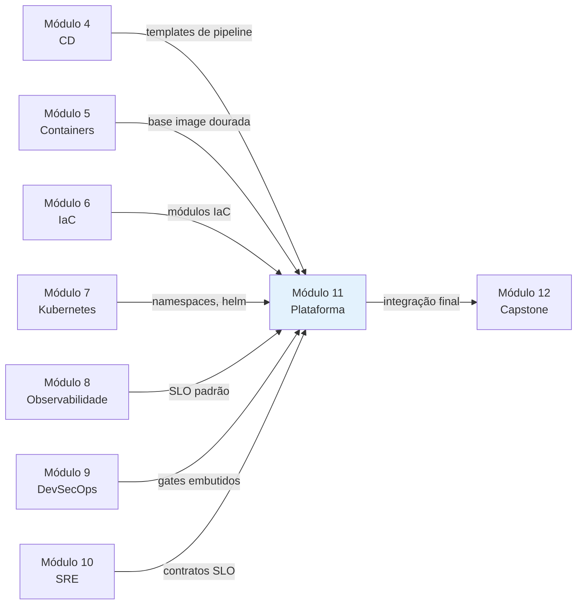

# Módulo 11 — Plataforma Interna de Desenvolvimento (IDP)

**Carga horária:** 6 horas
**Nível:** Graduação (ensino superior)
**Pré-requisitos:** Módulos 1 (Cultura), 4 (CD), 5-7 (Containers/IaC/K8s), 8 (Observabilidade), 9 (DevSecOps), 10 (SRE)

---

## Por que este módulo vem aqui

Até o Módulo 10 você aprendeu a **construir, entregar, operar, proteger e garantir** um sistema. Mas há um ponto que a indústria vem descobrindo com dor: tudo isso, feito bem, **não escala linearmente**. Quando a empresa passa de 3 para 30 squads:

- Cada squad recria a **mesma pipeline** levemente diferente.
- **Onboarding** de novo dev leva semanas ("qual repo? qual cluster? qual chart?").
- Conhecimento de SRE/DevSecOps fica **preso em poucas cabeças**.
- O time de infraestrutura vira **fila de tickets**.
- Shadow IT proliferam — "a gente monta o nosso porque é mais rápido".

A resposta organizacional a esse problema é a **Plataforma Interna de Desenvolvimento** (*Internal Developer Platform*, **IDP**) — um produto **interno**, com clientes internos (os engenheiros), cujo objetivo é oferecer **autonomia com guardrails**: a mesma velocidade de "cada squad faz o seu", com a **consistência, segurança e observabilidade** de uma infraestrutura madura.

> *"If your platform needs a ticket to do its job, it's not a platform."* — Nigel Kersten
>
> *"Platform Engineering is the **productization** of infrastructure."* — Thoughtworks Technology Radar

---

## Objetivos de Aprendizagem

Ao final do módulo, você será capaz de:

- **Distinguir** Platform Engineering de "DevOps Team" e "SRE Team"; aplicar **Team Topologies** (Skelton & Pais).
- **Desenhar** a **cognitive load** do time de produto e identificar o que a plataforma deve absorver.
- **Definir** uma **plataforma como produto interno**: usuários, jobs-to-be-done, golden paths, anti-golden paths.
- **Implementar** um **portal de desenvolvedor** com Backstage: Software Catalog, TechDocs, Scaffolder.
- **Publicar** golden paths (templates) que geram repositórios funcionais com CI/CD, observabilidade e segurança **por padrão**.
- **Modelar** contratos de plataforma: capabilities, tiers, SLO, custo, lifecycle.
- **Medir** plataforma com **DORA, SPACE, DevEx** e **NPS interno**; evitar métricas de vaidade.
- **Reconhecer** anti-padrões comuns: "plataforma = Kubernetes", "plataforma feita sem clientes", "golden path sem seiva".

---

## Estrutura do Material

| Ordem | Conteúdo | Arquivo(s) |
|-------|----------|------------|
| 0 | Cenário PBL (OrbitaTech) | [00-cenario-pbl.md](00-cenario-pbl.md) |
| 1 | Platform Engineering: Team Topologies, cognitive load, produto interno | [bloco-1/01-platform-engineering.md](bloco-1/01-platform-engineering.md) · [exercícios](bloco-1/01-exercicios-resolvidos.md) |
| 2 | Backstage e Golden Paths: portal, catalog, scaffolder, techdocs | [bloco-2/02-backstage-golden-paths.md](bloco-2/02-backstage-golden-paths.md) · [exercícios](bloco-2/02-exercicios-resolvidos.md) |
| 3 | Service catalog e contratos de plataforma: capabilities, tiers, SLOs internos | [bloco-3/03-contratos-plataforma.md](bloco-3/03-contratos-plataforma.md) · [exercícios](bloco-3/03-exercicios-resolvidos.md) |
| 4 | Métricas de plataforma: DORA, SPACE, DevEx, NPS interno | [bloco-4/04-metricas-plataforma.md](bloco-4/04-metricas-plataforma.md) · [exercícios](bloco-4/04-exercicios-resolvidos.md) |
| 5 | Exercícios progressivos (5 partes) | [exercicios-progressivos/](exercicios-progressivos/) |
| 6 | Entrega avaliativa | [entrega-avaliativa.md](entrega-avaliativa.md) |
| — | Referências bibliográficas | [referencias.md](referencias.md) |

---

## Como Estudar

1. **Leia o cenário PBL** — **OrbitaTech** é uma empresa em hipercrescimento (5 → 28 squads em 18 meses) sofrendo com fragmentação, onboarding lento e shadow IT.
2. **Prepare o ferramental local:**
   ```bash
   # Node.js 20+ é pré-requisito do Backstage
   node --version    # >= 20.10
   npm --version     # >= 10

   # Python para scripts didáticos
   python -m venv .venv && source .venv/bin/activate
   pip install -r requirements.txt

   # Backstage (app de avaliação local)
   npx @backstage/create-app@latest --path my-idp
   cd my-idp && yarn install && yarn dev
   ```
3. **Siga os blocos em ordem.** Bloco 1 dá os fundamentos organizacionais; 2 traz o portal e os golden paths; 3 formaliza contratos; 4 fecha com métricas.
4. **Mentalidade.** Plataforma é **produto**, não projeto. Seus clientes (engenheiros) têm alternativas ("eu monto o meu") — se você não entregar valor claro, eles vão.

---

## Ideia central do módulo

| Conceito | Significado |
|----------|-------------|
| **Platform Engineering** | Disciplina de construir e operar uma plataforma interna como produto |
| **Team Topologies** | Modelo (Skelton & Pais) que define 4 tipos de time e 3 modos de interação |
| **Cognitive Load** | Quanto o time precisa "carregar na cabeça" para operar; plataforma deve reduzir |
| **Golden Path** | Caminho pavimentado, opinioniado, bem-suportado, para 80% dos casos |
| **Internal Developer Platform (IDP)** | Produto-plataforma que oferece capabilities self-service |
| **Service Catalog** | Inventário vivo de serviços, owners, dependências e APIs |
| **DORA metrics** | Deploy frequency, Lead time, Change failure rate, MTTR |
| **SPACE framework** | Satisfaction, Performance, Activity, Communication, Efficiency |
| **DevEx** | Developer Experience: friction, cognitive load, feedback loops |

> **Regra central:** plataforma **não impõe** — ela **torna o caminho correto mais fácil que o errado**. Se seu time precisa de poder contratual para forçar uso, o design do golden path está ruim.

---

## Conexão com o restante da disciplina



A plataforma **costura** tudo que vimos: CI/CD, containers, K8s, observabilidade, segurança, SRE — tudo entregue como **capabilities self-service** para o squad de produto.

---

## O que este módulo NÃO cobre

- **Implementação profunda de Backstage plugins** (frontend TypeScript/React avançado) — mostramos uso; um curso dedicado vai fundo.
- **Substitutos do Backstage** (Port, Cortex, Humanitec) — mencionamos; conceitos são portáveis.
- **Produto/design de UX avançado** — tocamos "plataforma como produto"; design UX profissional é outra disciplina.
- **FinOps profundo** — custo aparece como capability/atributo; FinOps completo merece curso à parte.
- **Governança corporativa grande (ITIL, COBIT)** — mencionamos onde cabe, sem aprofundar.

---

*Material alinhado a: Team Topologies (Skelton & Pais, 2019); Platform Engineering on Kubernetes (Salatino, 2023); A Guide to Internal Developer Platforms (Humanitec, 2023); Accelerate (Forsgren, Humble, Kim); State of DevOps Report (DORA, Google Cloud); documentação oficial do Backstage (CNCF); The SPACE of Developer Productivity (ACM Queue, 2021); DevEx (Microsoft Research, 2023); CNCF Platform White Paper (2023).*

---

<!-- nav:start -->

**Navegação — Módulo 11 — Plataforma interna**

- ← Anterior: [Referências — Módulo 10 (SRE e Operações)](../10-sre-operacoes/referencias.md)
- → Próximo: [Cenário PBL — OrbitaTech: 5 para 28 squads em 18 meses](00-cenario-pbl.md)

<!-- nav:end -->
