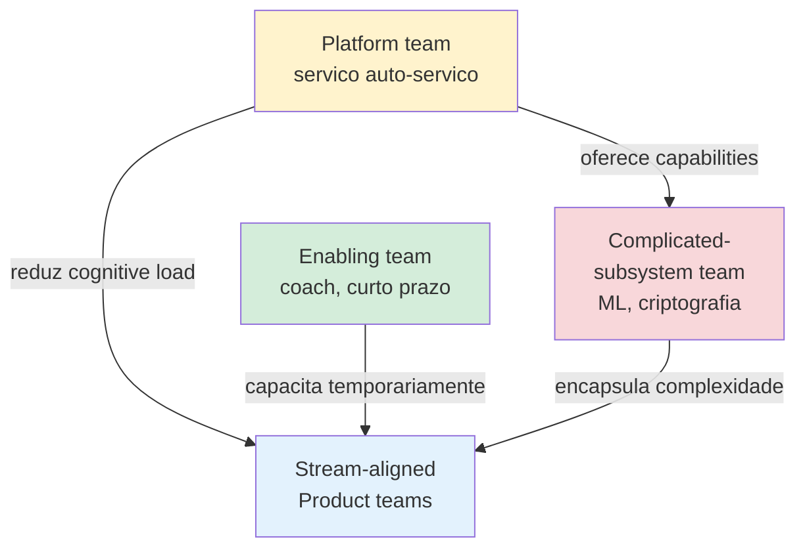

# Bloco 1 — Platform Engineering: times, cognitive load e produto interno

> **Pergunta do bloco.** Por que uma empresa com 28 squads produtivos pode ainda **falhar** em entregar? E por que a resposta certa não é "mais processo", mas sim **absorver complexidade em um produto interno**?

---

## 1.1 Lei de Conway e seu inverso

Melvin Conway (1968):

> *"Any organization that designs a system will produce a design whose structure is a copy of the organization's communication structure."*

Aplicação direta: se você tem 28 squads que não se falam, terá **28 arquiteturas** acopladas, com **28 pipelines**, **28 dialetos**. Isso **não é bug**; é consequência natural.

**Inverse Conway Maneuver** — se você quer uma arquitetura desejada, **desenhe a organização** que produza essa arquitetura. Platform Engineering é, em parte, aplicação intencional desse movimento.

---

## 1.2 Team Topologies (Skelton & Pais, 2019)

Quatro tipos de time:



### 1.2.1 Os 4 tipos

| Tipo | Função | Exemplo OrbitaTech |
|------|--------|---------------------|
| **Stream-aligned** | Entrega valor ao cliente final; dono de um fluxo de valor | Squad "aluguel-marketplace"; squad "score-inquilino" |
| **Platform** | Constrói e opera serviços internos self-service para reduzir cognitive load dos stream-aligned | Platform Team do cenário |
| **Complicated-subsystem** | Encapsula expertise profunda (matemática, domínio específico); liberam stream-aligned de aprender | Squad de ML que mantém modelo de score; squad de criptografia que mantém HSM |
| **Enabling** | Ajuda stream-aligned a adquirir capacidade nova; temporário | SRE viajante que faz coaching por 4 semanas até squad assumir |

### 1.2.2 Os 3 modos de interação

1. **Collaboration** — times trabalham juntos, alta largura de banda, por tempo limitado (para destravar).
2. **X-as-a-Service** — consumo estável, baixa fricção, contrato claro (ex.: plataforma ↔ squad).
3. **Facilitation** — time A ajuda time B a melhorar, sem entrega de código (ex.: Enabling team).

Principal regra: o **modo padrão** entre Platform e Stream-aligned é **X-as-a-Service** — **baixa fricção**, uso sem precisar conversar. Cada ticket aberto é **sinal** de que o X-as-a-Service falhou.

### 1.2.3 Anti-padrões organizacionais

- **"DevOps Team"** como equipe dedicada operando infra: vira **bottleneck**; não é platform team.
- **Platform Team que não é cliente-focado** (escreve o que "acha que é certo", sem ouvir).
- **Stream-aligned gigante** (> 7-9 pessoas): divide em 2.
- **Complicated-subsystem virando shadow platform**: ambiguidade de escopo.

---

## 1.3 Cognitive Load

### 1.3.1 Três tipos (Sweller, 1988)

1. **Intrinsic**: complexidade da tarefa em si (aprender cálculo).
2. **Extraneous**: complexidade acidental imposta pelo entorno (interface confusa, docs ruins).
3. **Germane**: esforço que constrói competência (prática deliberada).

Plataforma deve **reduzir extraneous** — sem remover o intrinsic (isso é o trabalho do dev) nem o germane (isso é aprendizado).

### 1.3.2 Medindo (qualitativamente)

Team Topologies sugere survey trimestral:

- *"Quantos serviços seu time mantém?"*
- *"Quantas ferramentas diferentes você usa por dia?"*
- *"Quantos dialetos de pipeline CI você precisa entender?"*
- *"De 1 a 5, quão sobrecarregado você se sente?"*

Resultado > 3.5 consistente → sinal de que cognitive load excedeu; platform team deve absorver mais.

### 1.3.3 Exemplo OrbitaTech

Squad "aluguel-marketplace":

| Antes da plataforma | Depois |
|---------------------|--------|
| Escreve pipeline CI do zero | Usa template; 10 linhas de override |
| Escreve Dockerfile; cuida de CVEs | Usa base image dourada (Platform) |
| Configura observabilidade manualmente | Dashboards e alertas gerados automaticamente |
| Cuida de segredos (rotação, ESO config) | Plataforma abstrai com capability `secret` |
| Aprende Kubernetes fundo | Plataforma oferece abstração tipo Score ou Helm standard |

Redução de **cognitive load extraneous** → mais tempo no **intrinsic** (o domínio do produto).

---

## 1.4 Platform Engineering como disciplina

### 1.4.1 Definição (CNCF Platforms White Paper, 2023)

> *"Platform Engineering is the discipline of **designing and building self-service capabilities** for software engineering organizations to **minimize cognitive load** and enable fast, secure delivery."*

Três palavras-chave:

- **self-service** — dev não depende de ticket.
- **cognitive load** — explicitamente reduzido.
- **fast, secure** — não um ou outro, os dois.

### 1.4.2 Platform Engineering ≠ DevOps, ≠ SRE

| Disciplina | Foco | Saída |
|------------|------|-------|
| DevOps (cultura) | Derrubar muros entre dev e ops | Valores, práticas |
| SRE | Operar sistemas com engenharia e economia | SLOs, EBP, toil eliminado, incidentes |
| Platform Engineering | Construir produto interno que oferece capabilities | Portal, golden paths, templates, APIs |

As três podem (e devem) coexistir: SRE garante que a plataforma é confiável; DevOps é a cultura; Platform é o produto.

### 1.4.3 Platform como produto — o shift mental

Construir plataforma como **projeto** → entregar, passar adiante, fechar.
Construir plataforma como **produto** → roadmap contínuo, personas, métricas, NPS, deprecations, evolução.

Consequências:

- Platform Team tem **Product Manager** (formal ou informal).
- Há **roadmap público** para a engenharia.
- Clientes (engenheiros) participam de **discovery**.
- Mede-se **adoção voluntária**, não "cobertura obrigatória".

---

## 1.5 Golden Path

### 1.5.1 Definição

**Golden Path**: caminho opinioniado, bem-suportado, para os **80% dos casos comuns**. É a **estrada pavimentada** — outros caminhos existem (estradas de terra), mas o pavimento é tão convidativo que faz sentido usar.

### 1.5.2 O que um golden path contém

Para "novo microsserviço Python" na OrbitaTech:

- Scaffold do repositório (estrutura, `pyproject.toml`, `requirements.txt`).
- CI/CD pronto (lint, test, build, scan, deploy staging/prod).
- Dockerfile hardened (multi-stage, distroless, non-root, cosign).
- Helm chart com SLOs default (taxa 2xx ≥ 99.9%, p95 ≤ 500ms).
- Observabilidade (métricas Prometheus, logs estruturados, traces OpenTelemetry).
- Segurança (Kyverno policies, network policies, RBAC mínimo).
- TechDocs inicial (README, arquitetura, runbook placeholder).
- **Entrada automática no Software Catalog** (`catalog-info.yaml`).

O dev clica "Create service" no Backstage, preenche 4 campos (nome, descrição, squad, domain), e recebe um repositório que **já está em produção** 20 minutos depois.

### 1.5.3 Anti-golden paths

Declarar **o que a plataforma não suporta** é tão importante quanto declarar o que suporta:

- "Não suportamos Kotlin novo" → force consolidar em Python ou Go.
- "Não suportamos banco MongoDB" → Postgres é a escolha padrão.
- "Não suportamos deploy em staging sem SLO definido" → qualidade por padrão.

Isso **não proíbe** — mas fora do golden path o squad **absorve o custo** (sem template, sem suporte de primeira linha).

### 1.5.4 Golden path ≠ Gold-plated

- Golden: **suficiente** e **manutenível**. Inclui o necessário.
- Gold-plated: exagerado. Inclui coisas "caso precise" que ninguém usa.

Regra: se < 30% dos usuários usam uma parte do template, é candidato a **sair**.

---

## 1.6 "Plataforma como Produto" — o que isso implica

### 1.6.1 Ter clientes

Sua plataforma tem **clientes pagantes** — mesmo que a moeda seja tempo/adoção, não dinheiro. Sendo cliente, eles:

- Têm **alternativas** (montar o deles, usar SaaS externo, migrar de empresa).
- Esperam **valor claro** e **qualidade crescente**.
- **Abandonam** se a experiência degrada.

### 1.6.2 Discovery real

Entrevistas (3-5 devs por trimestre), shadowing (acompanhar dev fazendo deploy), survey SPACE. **Não** se pauta em "o que a gente acha".

### 1.6.3 Roadmap público

Próximas 2 sprints visíveis a todos. **Deprecation plan** igualmente visível — *"vamos remover template X em 2026-06"*.

### 1.6.4 SLOs internos

A plataforma tem SLOs — mesmos rigor do Módulo 10:

- **Portal disponível** ≥ 99.9%.
- **Scaffolder** cria repositório em ≤ 3 min em p95.
- **Build de golden path** verde em ≤ 10 min em p95.
- **Onboarding a primeiro deploy** ≤ 3 dias.

### 1.6.5 Custo e chargeback

Mesmo sem chargeback real, atribuir **custo visível** por squad ajuda decisão (ex.: "seu serviço custa R$ 4 k/mês; está OK?"). Backstage plugins e FinOps tools ajudam.

---

## 1.7 Maturidade (CNCF Platform Maturity Model)

Quatro níveis:

1. **Provisional** — plataforma existe mas é improvisada; poucos usuários.
2. **Operational** — usada por alguns times; suporte ad hoc; roadmap inicial.
3. **Scalable** — adoção ampla; SLOs internos; governança.
4. **Optimizing** — medida continuamente; evolução data-driven; NPS alto.

OrbitaTech (início do cenário) está em **Provisional** (shadow IT, inconsistências). Meta: **Operational** no Q2, **Scalable** ao fim do ano.

---

## 1.8 Script Python: `cognitive_load_survey.py`

Agrega respostas de survey e identifica squads com cognitive load elevado.

```python
"""
cognitive_load_survey.py - agrega survey de cognitive load dos squads.

Formato CSV:
    data,squad,respondente,q_sobrecarga,q_ferramentas,q_servicos_mantidos,comentario

q_sobrecarga: 1 (baixa) a 5 (muito alta).
q_ferramentas: numero de ferramentas distintas usadas por semana.
q_servicos_mantidos: numero de servicos operados por squad.

Uso:
    python cognitive_load_survey.py respostas.csv --threshold 3.5
"""
from __future__ import annotations

import argparse
import csv
import statistics
import sys
from collections import defaultdict
from dataclasses import dataclass, field

from rich.console import Console
from rich.table import Table


@dataclass
class RespostaSquad:
    scores: list[int] = field(default_factory=list)
    ferramentas: list[int] = field(default_factory=list)
    servicos: list[int] = field(default_factory=list)
    respondentes: int = 0
    comentarios: list[str] = field(default_factory=list)

    @property
    def media_sobrecarga(self) -> float:
        return statistics.mean(self.scores) if self.scores else 0.0

    @property
    def media_ferramentas(self) -> float:
        return statistics.mean(self.ferramentas) if self.ferramentas else 0.0

    @property
    def media_servicos(self) -> float:
        return statistics.mean(self.servicos) if self.servicos else 0.0


def parse_int(s: str, minimo: int = 0) -> int:
    v = int(s)
    if v < minimo:
        raise ValueError(f"valor {v} menor que minimo {minimo}")
    return v


def carregar(path: str) -> dict[str, RespostaSquad]:
    dados: dict[str, RespostaSquad] = defaultdict(RespostaSquad)
    with open(path, "r", encoding="utf-8", newline="") as fh:
        leitor = csv.DictReader(fh)
        for row in leitor:
            try:
                s = row["squad"].strip()
                r = dados[s]
                sobrecarga = parse_int(row["q_sobrecarga"])
                if not 1 <= sobrecarga <= 5:
                    raise ValueError(f"q_sobrecarga fora de 1-5: {sobrecarga}")
                r.scores.append(sobrecarga)
                r.ferramentas.append(parse_int(row["q_ferramentas"]))
                r.servicos.append(parse_int(row["q_servicos_mantidos"]))
                r.respondentes += 1
                comentario = row.get("comentario", "").strip()
                if comentario:
                    r.comentarios.append(comentario)
            except (KeyError, ValueError) as exc:
                print(f"AVISO: linha invalida ignorada: {exc}", file=sys.stderr)
    return dados


def relatorio(dados: dict[str, RespostaSquad], threshold: float) -> int:
    if not dados:
        print("Sem respostas.")
        return 0

    console = Console()
    tbl = Table(title="Cognitive load por squad")
    for c in ("squad", "respondentes", "sobrecarga(avg)", "ferramentas(avg)", "servicos(avg)", "status"):
        tbl.add_column(c)

    ordenado = sorted(dados.items(), key=lambda kv: -kv[1].media_sobrecarga)
    squads_acima = 0
    for squad, r in ordenado:
        acima = r.media_sobrecarga >= threshold
        status = "[bold red]ALTO[/]" if acima else "ok"
        if acima:
            squads_acima += 1
        tbl.add_row(
            squad,
            str(r.respondentes),
            f"{r.media_sobrecarga:.2f}",
            f"{r.media_ferramentas:.1f}",
            f"{r.media_servicos:.1f}",
            status,
        )
    console.print(tbl)

    total = len(dados)
    console.print(f"\n{squads_acima}/{total} squads acima do threshold {threshold}.")
    if squads_acima > 0:
        console.print("\nProxima acao: investigar squads [red]ALTO[/] com entrevista e priorizar "
                      "absorcao de complexidade pela plataforma.")
    return 0 if squads_acima == 0 else 1


def main(argv: list[str] | None = None) -> int:
    p = argparse.ArgumentParser()
    p.add_argument("csv")
    p.add_argument("--threshold", type=float, default=3.5,
                   help="Acima deste valor a sobrecarga e considerada alta (1-5).")
    args = p.parse_args(argv)

    try:
        dados = carregar(args.csv)
    except OSError as exc:
        print(f"ERRO: {exc}", file=sys.stderr)
        return 2

    return relatorio(dados, args.threshold)


if __name__ == "__main__":
    raise SystemExit(main())
```

Exemplo `respostas.csv`:

```csv
data,squad,respondente,q_sobrecarga,q_ferramentas,q_servicos_mantidos,comentario
2026-04-01,aluguel-marketplace,alice,4,12,6,muito tempo em pipeline
2026-04-01,aluguel-marketplace,bob,4,10,5,
2026-04-01,score-inquilino,carla,3,8,3,
2026-04-01,score-inquilino,daniel,2,6,2,
2026-04-01,condominios,emma,5,14,8,fazemos de tudo
2026-04-01,condominios,felipe,5,13,8,
```

Rodar:

```bash
python cognitive_load_survey.py respostas.csv --threshold 3.5
```

---

## 1.9 Checklist do bloco

- [ ] Articulo Lei de Conway e seu inverso.
- [ ] Identifico os 4 tipos de time e 3 modos de interação.
- [ ] Explico **cognitive load** e suas 3 formas.
- [ ] Diferencio DevOps, SRE e Platform Engineering.
- [ ] Defino golden path e anti-golden path com exemplos.
- [ ] Trato plataforma como produto (clientes, roadmap, NPS, deprecations).
- [ ] Posiciono uma plataforma no CNCF Maturity Model.
- [ ] Uso `cognitive_load_survey.py` para identificar squads em risco.

Vá aos [exercícios resolvidos do Bloco 1](./01-exercicios-resolvidos.md).

---

<!-- nav:start -->

**Navegação — Módulo 11 — Plataforma interna**

- ← Anterior: [Cenário PBL — OrbitaTech: 5 para 28 squads em 18 meses](../00-cenario-pbl.md)
- → Próximo: [Bloco 1 — Exercícios resolvidos](01-exercicios-resolvidos.md)
- ↑ Índice do módulo: [Módulo 11 — Plataforma interna](../README.md)

<!-- nav:end -->
