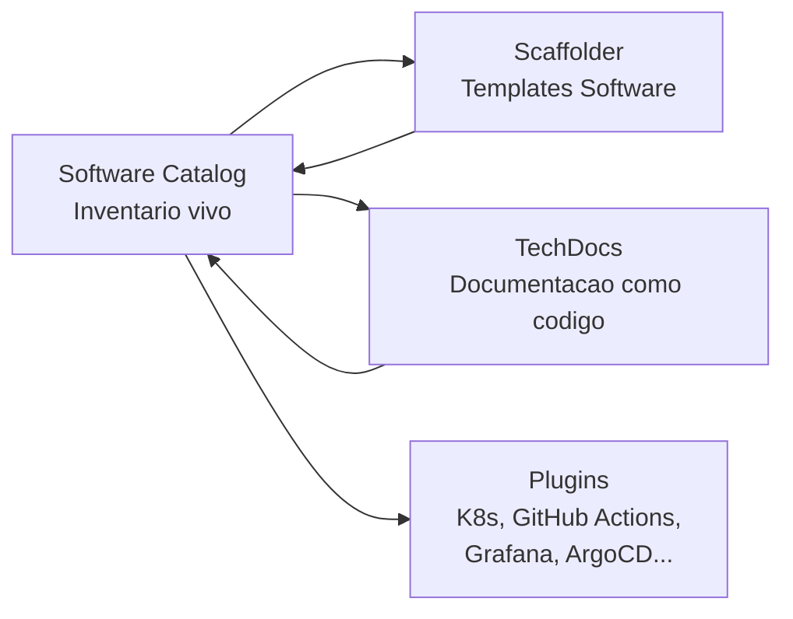
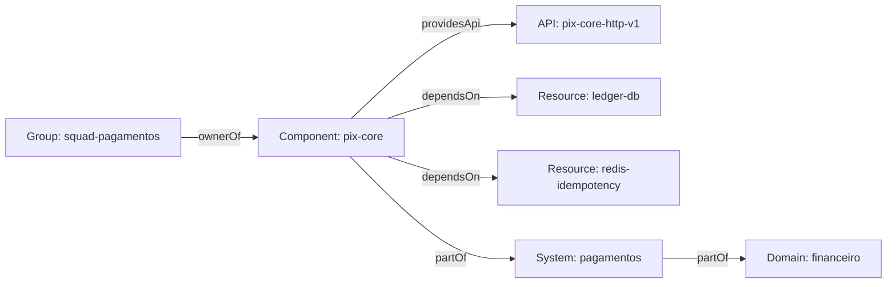

# Bloco 2 — Backstage e Golden Paths

> **Pergunta do bloco.** Como entregar, em forma de **portal self-service**, a ideia de golden path? Como um engenheiro cria um novo serviço em **minutos**, com CI, segurança e observabilidade **já inclusos**, sem depender de ticket?

---

## 2.1 O que é Backstage

[Backstage](https://backstage.io) é projeto open-source CNCF (graduated, 2023) criado pela Spotify em 2020 para resolver **seu próprio problema**: centenas de serviços, desenvolvedores perdidos. Hoje é o portal de desenvolvedor mais adotado do mercado.

### 2.1.1 Componentes principais



| Componente | Função |
|-----------|--------|
| **Software Catalog** | Inventário de *componentes* (serviços), *APIs*, *resources* (DBs, queues), *systems*, *domains*, com **owners** e **relations** |
| **Scaffolder** | Criação guiada (UI) de novos componentes a partir de **Software Templates** |
| **TechDocs** | Publicação de documentação `Markdown + mkdocs` direto do repositório |
| **Plugins** | Extensões para mostrar estado (K8s pods, pipelines CI, SLOs) no portal |

### 2.1.2 Alternativas ao Backstage

- **Port** (SaaS) — mesma filosofia, menos código.
- **Cortex** (SaaS) — focado em service catalog + scorecards.
- **Humanitec** — orquestrador de workloads, complementar.
- **Stack próprio** (CookieCutter/Copier + Git repo de catálogo + Grafana) — "plataforma mínima".

A escolha depende de **escala** e **preferência pela customização**. Para o curso, Backstage por ser padrão aberto.

---

## 2.2 Software Catalog — o inventário vivo

### 2.2.1 Entidades (kinds)

| Kind | Representa |
|------|-----------|
| `Component` | Serviço/biblioteca/site (o nível operacional) |
| `API` | Contrato (OpenAPI, GraphQL, AsyncAPI) |
| `Resource` | Infra (banco, bucket, tópico Kafka) |
| `System` | Agrupamento lógico (p.ex. "aluguel-marketplace") |
| `Domain` | Área de negócio (p.ex. "locacao") |
| `Group` / `User` | Squads e pessoas |
| `Location` | De onde o catálogo carrega (URL) |

### 2.2.2 `catalog-info.yaml` — o arquivo-padrão

Cada repositório contém `catalog-info.yaml` na raiz:

```yaml
apiVersion: backstage.io/v1alpha1
kind: Component
metadata:
  name: pix-core
  title: "PIX Core"
  description: "Servico que processa envio e recebimento de PIX."
  tags: [python, fastapi, critical]
  annotations:
    github.com/project-slug: orbita/pix-core
    backstage.io/techdocs-ref: dir:.
    grafana/dashboard-selector: "label=tier,value=gold"
    prometheus.io/rule: tier=gold
  links:
    - url: https://grafana.orbita.example/d/pix-core
      title: Dashboard
      icon: dashboard
spec:
  type: service
  lifecycle: production
  owner: group:default/squad-pagamentos
  system: pagamentos
  providesApis:
    - pix-core-http-v1
  dependsOn:
    - resource:default/ledger-db
    - resource:default/redis-idempotency
    - component:default/ledger
```

Esse arquivo é **single source of truth** para quem é dono, tipo, lifecycle, APIs, dependências.

### 2.2.3 Relations



Visualização em **System Graph** mostra dependências; útil em **change management** e **impact analysis**.

### 2.2.4 Lifecycle

Valores padronizados: `experimental`, `production`, `deprecated`. Serviço `deprecated` aparece com badge amarelo; `experimental` com azul.

---

## 2.3 Setup do Backstage local

### 2.3.1 Criar app

```bash
npx @backstage/create-app@latest --path my-idp
# Responda: App name = orbita-idp
cd my-idp
yarn install
yarn dev           # sobe frontend (3000) e backend (7007)
```

Acessar: [http://localhost:3000](http://localhost:3000).

### 2.3.2 Adicionar o primeiro componente

No diretório `examples/` já há um `entities.yaml`. Para adicionar um próprio, crie um repositório externo com `catalog-info.yaml` e, no Backstage:

1. *Create → Register existing component*.
2. Cole a URL do `catalog-info.yaml`.
3. Catálogo valida e importa.

Alternativa para curso: usar um arquivo local `examples/entities.yaml` referenciado em `app-config.yaml`.

### 2.3.3 Organizando o catálogo da empresa

Padrão recomendado: **catálogo próprio em repo separado** (`orbita-catalog`) onde cada serviço registra arquivo por pull request. Backstage é configurado para carregar:

```yaml
# app-config.yaml (trecho)
catalog:
  locations:
    - type: url
      target: https://github.com/orbita/orbita-catalog/blob/main/all.yaml
      rules:
        - allow: [Component, API, Resource, System, Domain, Group, User, Location]
```

O `all.yaml` contém `Location` kinds apontando para cada `catalog-info.yaml` real.

---

## 2.4 Scaffolder — Software Templates

### 2.4.1 Anatomia de um template

```yaml
apiVersion: scaffolder.backstage.io/v1beta3
kind: Template
metadata:
  name: python-fastapi-service
  title: "Novo servico Python FastAPI"
  description: "Cria um servico FastAPI com CI/CD, Dockerfile hardened, Helm chart e catalog-info.yaml."
  tags: [recommended, python, service]
spec:
  owner: group:default/platform-team
  type: service

  parameters:
    - title: Dados basicos
      required: [name, owner, description]
      properties:
        name:
          title: Nome
          type: string
          pattern: "^[a-z]([a-z0-9-]{1,38}[a-z0-9])$"
        description:
          title: Descricao
          type: string
        owner:
          title: Owner (squad)
          type: string
          ui:field: OwnerPicker
          ui:options:
            catalogFilter:
              kind: Group
    - title: Repositorio
      required: [repoUrl]
      properties:
        repoUrl:
          title: Repositorio (GitHub)
          type: string
          ui:field: RepoUrlPicker
          ui:options:
            allowedHosts: ["github.com"]

  steps:
    - id: template
      name: Renderizar template
      action: fetch:template
      input:
        url: ./skeleton
        values:
          name: ${{ parameters.name }}
          description: ${{ parameters.description }}
          owner: ${{ parameters.owner }}

    - id: publish
      name: Publicar no GitHub
      action: publish:github
      input:
        repoUrl: ${{ parameters.repoUrl }}
        description: ${{ parameters.description }}
        defaultBranch: main
        repoVisibility: private

    - id: register
      name: Registrar no catalogo
      action: catalog:register
      input:
        repoContentsUrl: ${{ steps.publish.output.repoContentsUrl }}
        catalogInfoPath: /catalog-info.yaml

  output:
    links:
      - title: Repositorio
        url: ${{ steps.publish.output.remoteUrl }}
      - title: Component no catalogo
        icon: catalog
        entityRef: ${{ steps.register.output.entityRef }}
```

### 2.4.2 Estrutura do `skeleton/`

O esqueleto é o **conteúdo que será clonado** para o repositório novo:

```
templates/python-fastapi-service/
├── template.yaml
└── skeleton/
    ├── catalog-info.yaml
    ├── README.md
    ├── pyproject.toml
    ├── Dockerfile
    ├── .github/workflows/ci.yml
    ├── .github/workflows/release.yml
    ├── .gitleaks.toml
    ├── helm/
    │   └── Chart.yaml
    ├── src/
    │   └── app/
    │       ├── __init__.py
    │       └── main.py
    ├── tests/
    │   └── test_main.py
    └── docs/
        ├── index.md
        └── runbook.md
```

Campos `${{ values.name }}` são substituídos pelo `fetch:template` usando Nunjucks (similar a Jinja).

### 2.4.3 Exemplo de `skeleton/catalog-info.yaml`

```yaml
apiVersion: backstage.io/v1alpha1
kind: Component
metadata:
  name: ${{ values.name }}
  description: ${{ values.description }}
  tags: [python, fastapi, golden-path]
  annotations:
    github.com/project-slug: orbita/${{ values.name }}
    backstage.io/techdocs-ref: dir:.
spec:
  type: service
  lifecycle: experimental
  owner: ${{ values.owner }}
```

### 2.4.4 Exemplo de `skeleton/src/app/main.py`

```python
from fastapi import FastAPI

app = FastAPI(title="${{ values.name }}")

@app.get("/healthz")
def healthz() -> dict[str, str]:
    return {"status": "ok"}

@app.get("/ready")
def ready() -> dict[str, str]:
    return {"ready": "yes"}
```

### 2.4.5 Exemplo de `skeleton/.github/workflows/ci.yml`

```yaml
name: ci
on: [push, pull_request]
jobs:
  test:
    runs-on: ubuntu-latest
    steps:
      - uses: actions/checkout@v4
      - uses: actions/setup-python@v5
        with:
          python-version: "3.12"
      - run: pip install -e '.[dev]'
      - run: ruff check .
      - run: pytest -q
      - run: bandit -r src
      - run: pip-audit
```

### 2.4.6 Exemplo de `Dockerfile` hardened

```dockerfile
# syntax=docker/dockerfile:1.7

FROM python:3.12-slim AS build
WORKDIR /app
COPY pyproject.toml ./
RUN pip install --no-cache-dir --prefix=/install -e .
COPY src/ src/

FROM gcr.io/distroless/python3-debian12:nonroot
WORKDIR /app
COPY --from=build /install /usr/local
COPY --from=build /app/src /app/src
ENV PYTHONPATH=/app/src PYTHONUNBUFFERED=1
USER 65532
EXPOSE 8080
ENTRYPOINT ["python","-m","app.main"]
```

### 2.4.7 Outputs e documentação inicial

Ao final, o usuário vê no portal:

- **"Abrir repositorio"** (link GitHub).
- **"Ver no catalogo"** (entityRef).
- TechDocs já presente em `/docs`.
- CI verde após primeiro push.

---

## 2.5 TechDocs — Documentação como Código

### 2.5.1 Fluxo

1. Dev escreve Markdown em `docs/`.
2. `mkdocs.yml` na raiz define estrutura.
3. Backstage renderiza via plugin **TechDocs**, com busca full-text.
4. Quando `catalog-info.yaml` tem `backstage.io/techdocs-ref: dir:.`, o portal exibe aba "Docs".

### 2.5.2 Estrutura típica `docs/`

```markdown
# Introducao
Visao geral do servico.

# Arquitetura
Diagrama Mermaid e fluxo.

# Runbook
Cenarios de incidente e passos.

# API
Endpoints e exemplos.

# SLOs
SLI/SLO declarados.
```

### 2.5.3 Vantagens sobre Confluence

- Versionado junto ao código; revisão no PR.
- Pull requests de docs seguem o mesmo ritual.
- Engenheiros escrevem em ambiente familiar.
- Sem drift: doc e código evoluem juntos.

---

## 2.6 Plugins — enriquecer o catálogo

Exemplos populares:

- **Kubernetes plugin** — mostra pods, deployments do Component direto no portal.
- **GitHub Actions plugin** — exibe últimos runs.
- **ArgoCD plugin** — estado de entrega do deployment.
- **Grafana plugin** — dashboards linkados.
- **Tech Insights** (scorecards) — checks automatizados ("tem SLO?", "tem `catalog-info.yaml`?").

Instalação: geralmente `yarn add @backstage/plugin-*` no backend e frontend, configuração em `app-config.yaml`.

---

## 2.7 Boas práticas de golden path

### 2.7.1 Princípios de design

1. **Convention over configuration.** Nomes, estrutura, stack definidos por padrão; override é exceção.
2. **Pavimentar atalhos seguros.** CVE scan, SBOM, cosign, ruff, pytest — tudo embutido.
3. **Quebrar cedo.** CI rejeita se faltar `catalog-info.yaml`, se README estiver vazio, se cobertura < X%.
4. **Documentar a decisão.** TechDocs inicial explica por que a escolha é essa (ADR).
5. **Versionar o template.** Cada release do template tem changelog.

### 2.7.2 Múltiplos golden paths?

Sim, desde que cada um tenha **clientela significativa** (≥ 3 squads). Ex.:

- `python-fastapi-service`
- `go-http-service`
- `worker-python-celery` (para async)
- `frontend-react-next`

Mas **cuidado**: cada template adicional multiplica custo de manutenção. Regra: **não criar template até que ≥ 3 usuários reais pedam**.

### 2.7.3 Anti-padrões

- Template gera código que ninguém entende (magic generator).
- Template pede 30 perguntas (já passou do bom senso).
- Template que **não roda verde** após criação.
- Template sem **canal de suporte** claro (`#platform-help`).

---

## 2.8 Script Python: `template_audit.py`

Audita um `template.yaml` do Scaffolder para garantir boas práticas: descrição presente, steps mínimos, skeleton existe, catálogo registrado.

```python
"""
template_audit.py - audita um Software Template (Backstage Scaffolder) para boas praticas.

Regras:
- metadata.description != vazio.
- tags nao vazio.
- spec.owner declarado.
- parameters com ao menos "name" e "owner".
- steps contem publish + catalog:register.
- output.entityRef presente.
- skeleton/catalog-info.yaml existe no diretorio do template.

Uso:
    python template_audit.py templates/python-fastapi-service
"""
from __future__ import annotations

import argparse
import os
import sys
from dataclasses import dataclass

import yaml
from rich.console import Console
from rich.table import Table


@dataclass(frozen=True)
class Achado:
    severidade: str
    regra: str
    mensagem: str


def carregar_template(path_dir: str) -> dict:
    fpath = os.path.join(path_dir, "template.yaml")
    if not os.path.isfile(fpath):
        raise FileNotFoundError(f"template.yaml nao encontrado em {path_dir}")
    with open(fpath, "r", encoding="utf-8") as fh:
        return yaml.safe_load(fh) or {}


def auditar(template: dict, path_dir: str) -> list[Achado]:
    achados: list[Achado] = []

    meta = template.get("metadata", {}) or {}
    if not meta.get("description"):
        achados.append(Achado("high", "META-DESC",
                              "metadata.description obrigatoria para exibicao no portal"))
    if not meta.get("tags"):
        achados.append(Achado("low", "META-TAGS",
                              "metadata.tags vazio; dificulta descoberta"))

    spec = template.get("spec", {}) or {}
    if not spec.get("owner"):
        achados.append(Achado("high", "SPEC-OWNER",
                              "spec.owner obrigatorio para accountability"))

    params = spec.get("parameters", []) or []
    props_planas: set[str] = set()
    for grupo in params:
        props = (grupo or {}).get("properties", {}) or {}
        props_planas.update(props.keys())
    for obrigatorio in ("name", "owner"):
        if obrigatorio not in props_planas:
            achados.append(Achado("high", f"PARAM-{obrigatorio.upper()}",
                                  f"parametros devem ter '{obrigatorio}'"))

    steps = spec.get("steps", []) or []
    actions = {s.get("action") for s in steps if s}
    if not any(a and a.startswith("publish:") for a in actions):
        achados.append(Achado("high", "STEP-PUBLISH",
                              "falta step publish:* (github, gitlab...)"))
    if "catalog:register" not in actions:
        achados.append(Achado("high", "STEP-CATALOG",
                              "falta step catalog:register para aparecer no Software Catalog"))

    out = spec.get("output", {}) or {}
    links = out.get("links", []) or []
    if not any(l.get("entityRef") for l in links) and "entityRef" not in out:
        achados.append(Achado("medium", "OUTPUT-ENTITYREF",
                              "output sem entityRef; usuario nao volta para o catalogo"))

    skeleton_catalog = os.path.join(path_dir, "skeleton", "catalog-info.yaml")
    if not os.path.isfile(skeleton_catalog):
        achados.append(Achado("high", "SKEL-CATALOG",
                              "skeleton/catalog-info.yaml ausente; repositorio gerado nao entra no catalogo"))

    skeleton_readme = os.path.join(path_dir, "skeleton", "README.md")
    if not os.path.isfile(skeleton_readme):
        achados.append(Achado("medium", "SKEL-README",
                              "skeleton/README.md ausente; repositorio nasce sem docs"))

    return achados


def relatorio(achados: list[Achado], dir_alvo: str) -> int:
    console = Console()
    if not achados:
        console.print(f"[green]Template em {dir_alvo} passou na auditoria.[/]")
        return 0

    tbl = Table(title=f"Auditoria de template em {dir_alvo}")
    for c in ("severidade", "regra", "mensagem"):
        tbl.add_column(c)
    ordem = {"high": 3, "medium": 2, "low": 1}
    for a in sorted(achados, key=lambda x: -ordem[x.severidade]):
        tbl.add_row(a.severidade, a.regra, a.mensagem)
    console.print(tbl)
    return 1 if any(a.severidade == "high" for a in achados) else 0


def main(argv: list[str] | None = None) -> int:
    p = argparse.ArgumentParser()
    p.add_argument("dir", help="Diretorio do template (contem template.yaml + skeleton/)")
    args = p.parse_args(argv)
    try:
        tpl = carregar_template(args.dir)
    except (FileNotFoundError, yaml.YAMLError) as exc:
        print(f"ERRO: {exc}", file=sys.stderr)
        return 2
    achados = auditar(tpl, args.dir)
    return relatorio(achados, args.dir)


if __name__ == "__main__":
    raise SystemExit(main())
```

Rodar em um template:

```bash
python template_audit.py templates/python-fastapi-service
```

---

## 2.9 Checklist do bloco

- [ ] Entendo os componentes do Backstage (Catalog, Scaffolder, TechDocs, Plugins).
- [ ] Escrevo `catalog-info.yaml` com owner, tags, relations.
- [ ] Subo Backstage localmente (`yarn dev`).
- [ ] Escrevo Software Template com parameters, steps (publish + register), output.
- [ ] Estruturo `skeleton/` com CI, Dockerfile hardened, Helm, docs, catalog.
- [ ] Adiciono TechDocs funcional a um serviço.
- [ ] Sei escolher plugins (K8s, GHA, Grafana) e evitar gold-plating.
- [ ] Uso `template_audit.py` para verificar qualidade do golden path.

Vá aos [exercícios resolvidos do Bloco 2](./02-exercicios-resolvidos.md).

---

<!-- nav:start -->

| &nbsp; | &nbsp; | &nbsp; |
|:--|:--:|--:|
| **← Anterior**<br>[Bloco 1 — Exercícios resolvidos](../bloco-1/01-exercicios-resolvidos.md) | **↑ Índice**<br>[Módulo 11 — Plataforma interna](../README.md) | **Próximo →**<br>[Bloco 2 — Exercícios resolvidos](02-exercicios-resolvidos.md) |

<!-- nav:end -->
