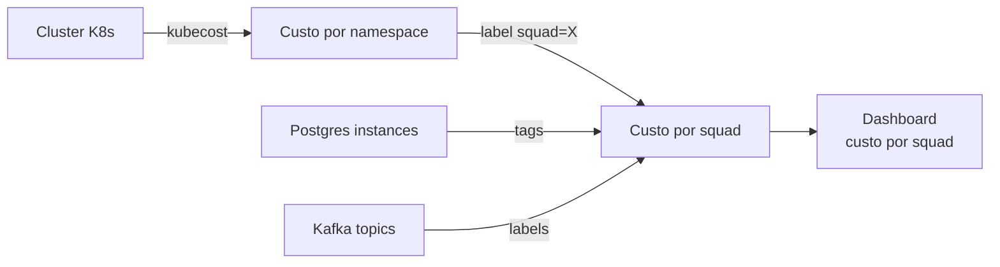
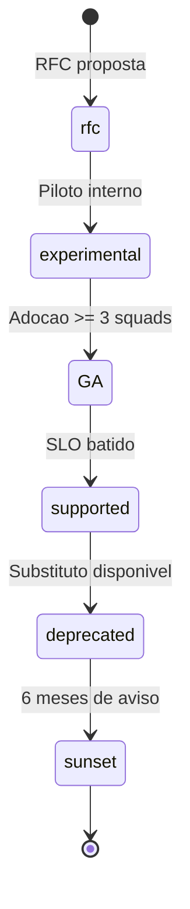

# Bloco 3 — Service Catalog e Contratos de Plataforma

> **Pergunta do bloco.** Quando um squad *consome* a plataforma, o que exatamente ele recebe? Quando a plataforma muda algo, o que o squad pode esperar? Contratos **explícitos** tornam a relação X-as-a-Service saudável e substituem conversas repetidas por expectativas claras.

---

## 3.1 Do "catálogo" ao "contrato"

Bloco 2 instalou o **Software Catalog**. Ele resolve **inventário** (quem tem o quê). Mas a plataforma também oferece **capabilities** (recursos prontos como "banco Postgres", "tópico Kafka"). Quem oferece, oferece **o quê**, com **que qualidade**, por **qual preço**, por **quanto tempo**?

A resposta é o **contrato de plataforma**: um documento que formaliza a oferta. Assim como SLAs externos descrevem o que a empresa entrega a cliente externo, SLOs internos + capability catalog descrevem o que a plataforma entrega ao squad cliente.

---

## 3.2 Capabilities — as unidades de oferta

### 3.2.1 O que é uma capability

Uma **capability** é um recurso self-service consumível pelo squad, com:

- **Interface** (UI, API, CLI, declarativa) consistente.
- **Lifecycle** (provisão, uso, deprecation, remoção).
- **SLO** próprio.
- **Custo** (mesmo se chargeback for conceitual).
- **Owner** (time dentro do Platform Team).

### 3.2.2 Exemplos para OrbitaTech

| Capability | Interface | O que entrega |
|-----------|-----------|---------------|
| `postgres-db` | Scaffolder + CRD | Instância Postgres com backup, HA opcional, monitoramento |
| `kafka-topic` | Scaffolder | Tópico com ACLs, retention, monitoramento |
| `k8s-namespace` | Form no portal | Namespace com quotas, RBAC, NetworkPolicy default-deny |
| `observability-stack` | Label auto-descoberta | Metrics scrape + logs + tracing pré-configurados |
| `secret-vault` | API + External Secrets | Rotação, auditoria, policy |
| `ci-template` | Reutilizável via GHA `uses:` | Workflow reusable com SAST, SCA, build, deploy |
| `service-workload` | Score.dev ou Helm template | Workload K8s com HPA, PDB, probes, observability padrão |

### 3.2.3 Score.dev — workload spec agnóstica

[Score](https://score.dev) é spec aberta (CNCF sandbox) para descrever workloads sem amarrar ao K8s. Um `score.yaml`:

```yaml
apiVersion: score.dev/v1b1
metadata:
  name: pix-core

containers:
  main:
    image: ghcr.io/orbita/pix-core:1.4.2
    variables:
      DATABASE_URL: "postgres://${resources.db.host}:${resources.db.port}/${resources.db.database}"

resources:
  db:
    type: postgres
    class: tier-gold

service:
  ports:
    http:
      port: 8080

containers:
  main:
    livenessProbe:
      httpGet:
        path: /healthz
        port: http
```

A plataforma traduz `score.yaml` para manifests K8s (Helm, Kustomize) **conforme sua política**. O squad **não precisa conhecer K8s**; escreve a intenção. Muda a plataforma → o mesmo `score.yaml` gera manifestos evoluídos.

---

## 3.3 Tiers — qualidade e custo declarados

### 3.3.1 Padrão bronze/silver/gold

| Tier | Disponibilidade | Custo relativo | Uso típico |
|------|-----------------|----------------|-----------|
| **Bronze** | 99% (7h 18min off/mês) | 1× | Dev, experimental, tools internas |
| **Silver** | 99,9% (43 min/mês) | 3× | Produtos backoffice, relatórios |
| **Gold** | 99,95% (21 min/mês) | 10× | Crítico ao cliente, regulado |

### 3.3.2 O que diferencia tecnicamente

| Característica | Bronze | Silver | Gold |
|---------------|--------|--------|------|
| Réplicas de app | 1 | 2 | 3+ HPA |
| PodDisruptionBudget | – | ✓ | ✓ |
| Backup DB | semanal | diário | contínuo (WAL) |
| HA DB | – | standby | replicação síncrona |
| NetworkPolicy | opcional | ✓ | ✓ + audit |
| Observability | logs | logs + metrics | logs + metrics + traces |
| Alertas | nenhum | básicos | SLO-based |
| On-call cover | – | diurno | 24×7 |
| SBOM + cosign | – | ✓ | ✓ + policy enforce |

### 3.3.3 Escolha declarada

No `catalog-info.yaml` do serviço:

```yaml
metadata:
  tags: [tier-gold]
spec:
  # ...
```

Ou via annotation + Score:

```yaml
resources:
  db:
    type: postgres
    class: tier-gold   # <- intenção explícita
```

A plataforma faz o resto. **Um squad sabe qual tier está consumindo**; consegue justificar orçamento; não é surpresa quando a conta chega.

---

## 3.4 SLOs internos da plataforma

A plataforma **tem SLOs** (Módulo 10, SRE), como qualquer outro produto. Exemplos:

| Capability | SLI | Janela | SLO |
|-----------|-----|--------|-----|
| Portal Backstage | requisições 2xx / total | 30d | ≥ 99,9% |
| Scaffolder | job completa em ≤ 3 min | 30d | ≥ 95% dos jobs |
| CI template reusable | tempo médio de build | 30d | ≤ 8 min p95 |
| Provisão postgres | tempo entre request e pronto | 30d | ≤ 10 min p95 |
| Catálogo: sincronização | lag entre PR merge e refresh | 30d | ≤ 5 min p95 |

**Consequência**: quando a plataforma viola um SLO, ela entra em **error budget** como qualquer serviço. Se queima budget, foca em confiabilidade — exatamente como ensinado no Módulo 10.

---

## 3.5 Custo e chargeback

Chargeback é **transferir** custo real ao squad consumidor. Alguns negócios fazem; outros usam **showback** (apenas mostrar).

### 3.5.1 Modelo de showback



Grafana painel:
- Custo do mês vs orçamento.
- Serviços mais caros do squad.
- Tendência de crescimento.

### 3.5.2 Por que showback (no mínimo) é importante

- Dá **feedback rápido** ao squad: "meu serviço custa R$ 4 k/mês, posso justificar?"
- Facilita **priorização** de otimização.
- Evita o **tragedy of the commons** (todo mundo usa, ninguém paga).

### 3.5.3 Ferramentas

- **Kubecost / OpenCost** — custo por namespace/deployment em K8s.
- **CloudQuery / Infracost** — custo de IaC antes de `apply`.
- **Planilha de manual tagging** — ok para começar.

---

## 3.6 Lifecycle de uma capability



### 3.6.1 Estágios

1. **RFC** — documento público descrevendo capability, problema, design. Tempo de review: 2 semanas.
2. **Experimental** — piloto com 1-3 squads; nome com badge `[experimental]`; sem SLO formal.
3. **GA (General Availability)** — SLO declarado, documentação completa, suporte.
4. **Supported** — padrão operacional; evolução incremental.
5. **Deprecated** — marcado; novos usuários desencorajados; comunicação em TODO o portal.
6. **Sunset** — data de remoção; ≥ 6 meses de antecedência; migração documentada.

### 3.6.2 Deprecation saudável

RFC de deprecation contém:

- Por que deprecar (métrica, alternativa, custo).
- Quando remover (data clara).
- Quem tem até lá (lista gerada do catálogo).
- Como migrar (guia passo a passo, com script se possível).
- Quem ajuda (Enabling team disponível).
- Consequência se não migrar (suporte cessa; alertas cessam; etc.).

### 3.6.3 Anti-padrões

- **Remover sem aviso** ou com < 1 mês.
- **Deprecation eterna** (5 anos depois, ainda em `deprecated`).
- **Promessa sem dente** ("deprecamos mas ainda damos suporte total"): squads ignoram.

---

## 3.7 Processo de RFC

RFC (Request for Comments) é o jeito de **propor e documentar decisões**. Plataforma madura mantém repositório de RFCs públicos.

### 3.7.1 Template

```markdown
# RFC-000X: Titulo

- Status: draft | review | accepted | rejected | superseded
- Proponente: @fulano
- Data: 2026-04-15
- Revisao: 2 semanas ate 2026-04-29

## Contexto e problema
Descreva o problema em 1-2 paragrafos, sem solucao.

## Motivacao
Por que vale a pena resolver agora?

## Proposta
O que exatamente sera feito (interfaces, fluxo, limites).

## Alternativas consideradas
- Alternativa A (+/- tradeoffs).
- Alternativa B.

## Impacto
- Squads afetados.
- Migracao necessaria.
- Custo (pessoas-semana).

## Rollout
- Experimental em X sprint.
- GA em Y sprint.

## Rejeicao (se for o caso)
Motivo da nao-aceitacao.
```

### 3.7.2 Ritmo

- **RFCs curtas** (1-2 páginas) são OK para mudanças pequenas.
- **RFCs grandes** merecem sessão síncrona de apresentação (30 min).
- Objetivo: **registrar por que**, não só **o que**.

Com histórico, o time evita re-abrir discussões já decididas.

---

## 3.8 ADR — Architecture Decision Record

ADR é primo da RFC, mas **registrado por serviço** (dentro do repo do componente). Exemplo:

```markdown
# ADR-003: Uso de Postgres 15 com pgBouncer

- Data: 2026-02-10
- Status: accepted
- Consequencia: todos os novos servicos em tier-gold usam pgBouncer.

## Contexto
Servicos gold tem pico de 2000 conexoes concorrentes, enquanto o Postgres
aguenta ~800 com configuracao padrao.

## Decisao
Adicionar pgBouncer em modo transaction pooling entre app e Postgres.

## Consequencias
+ Reduz conexoes diretas em ~4x.
- Adiciona 1 hop; latencia +1ms.
- Algumas features Postgres (prepared statements) exigem ajuste.
```

Pratica: todo ADR vai para `docs/adr/NNNN-titulo.md` e entra nos TechDocs.

---

## 3.9 Ownership formal

### 3.9.1 Catálogo declara

```yaml
spec:
  owner: group:default/squad-pagamentos
```

Mas **dono** significa o quê, em termos operacionais?

### 3.9.2 Matriz de responsabilidades

| Ação | Squad dono | Platform Team |
|------|------------|---------------|
| Decidir feature do serviço | ✓ | – |
| Operar on-call 24×7 | ✓ | – |
| Escolher tier bronze/silver/gold | ✓ | – |
| Prover o tier (réplicas, backup, obs) | – | ✓ |
| Gerenciar CVEs do serviço | ✓ | – |
| Gerenciar CVEs da base image | – | ✓ |
| Aprovar mudança de schema DB | ✓ | – (oferece gate) |
| Manter template e golden path | – | ✓ |
| Escalonar infra conforme tier | – | ✓ |

**Regra**: ambiguidade prejudica operação; a matriz é escrita e revisada.

---

## 3.10 Script Python: `catalog_validator.py`

Valida um repositório de catálogo (muitos `catalog-info.yaml`) garantindo:
- Owner sempre presente e existente no diretório `groups/`.
- Lifecycle válido (`experimental`, `production`, `deprecated`).
- Tier presente em tags para serviços `production`.
- Relations (dependsOn) apontam para entidades existentes.

```python
"""
catalog_validator.py - valida um diretorio com catalog-info.yaml's e groups.

Espera estrutura:
    catalog/
      groups.yaml                     # lista kind: Group
      services/
        svc-a.yaml                    # kind: Component
        svc-b.yaml
      resources/
        db-a.yaml                     # kind: Resource

Regras:
- Todo Component tem owner no formato group:default/<nome>.
- owner deve existir em groups.yaml.
- lifecycle em {experimental, production, deprecated}.
- Se lifecycle == production: tags tem exatamente uma tag tier-{bronze,silver,gold}.
- dependsOn referencia entidade existente (component:/resource:).

Uso:
    python catalog_validator.py catalog/
"""
from __future__ import annotations

import argparse
import os
import sys
from dataclasses import dataclass

import yaml
from rich.console import Console
from rich.table import Table

LIFECYCLES_VALIDAS = {"experimental", "production", "deprecated"}
TIERS_VALIDAS = {"tier-bronze", "tier-silver", "tier-gold"}


@dataclass(frozen=True)
class Achado:
    severidade: str
    entidade: str
    regra: str
    mensagem: str


def carregar_arquivos(raiz: str) -> list[dict]:
    docs: list[dict] = []
    for dirpath, _, files in os.walk(raiz):
        for f in files:
            if not f.endswith((".yaml", ".yml")):
                continue
            full = os.path.join(dirpath, f)
            try:
                with open(full, "r", encoding="utf-8") as fh:
                    for d in yaml.safe_load_all(fh):
                        if d:
                            d["__file__"] = full
                            docs.append(d)
            except (OSError, yaml.YAMLError) as exc:
                print(f"AVISO: {full}: {exc}", file=sys.stderr)
    return docs


def key(ent: dict) -> str:
    return f"{ent.get('kind', '?').lower()}:{(ent.get('metadata') or {}).get('name', '?')}"


def validar(docs: list[dict]) -> list[Achado]:
    achados: list[Achado] = []
    grupos = {
        (d.get("metadata") or {}).get("name")
        for d in docs if d.get("kind") == "Group"
    }
    existentes = {key(d) for d in docs if d.get("kind")}

    for d in docs:
        kind = d.get("kind")
        meta = d.get("metadata") or {}
        spec = d.get("spec") or {}
        nome = meta.get("name", "?")
        ent_label = f"{kind}/{nome}"

        if kind == "Component":
            owner = spec.get("owner", "")
            if not owner.startswith("group:"):
                achados.append(Achado("high", ent_label, "OWNER-FMT",
                                      "owner deve comecar com 'group:'"))
            else:
                grp = owner.split("/")[-1]
                if grp not in grupos:
                    achados.append(Achado("high", ent_label, "OWNER-UNK",
                                          f"grupo '{grp}' referenciado mas nao definido"))

            lifecycle = spec.get("lifecycle", "")
            if lifecycle not in LIFECYCLES_VALIDAS:
                achados.append(Achado("high", ent_label, "LIFECYCLE",
                                      f"lifecycle invalido: {lifecycle}"))

            tags = set(meta.get("tags", []) or [])
            tiers = tags & TIERS_VALIDAS
            if lifecycle == "production":
                if len(tiers) != 1:
                    achados.append(Achado("high", ent_label, "TIER-PROD",
                                          "production exige exatamente uma tag tier-{bronze,silver,gold}"))

            for ref in spec.get("dependsOn", []) or []:
                ref_norm = ref.replace("default/", "")
                if ref_norm.lower() not in existentes:
                    achados.append(Achado("medium", ent_label, "DEP-UNK",
                                          f"dependsOn '{ref}' nao encontrado no catalogo"))

    return achados


def relatorio(achados: list[Achado]) -> int:
    console = Console()
    if not achados:
        console.print("[green]Catalogo valido.[/]")
        return 0

    tbl = Table(title="Validacao de catalogo")
    for c in ("severidade", "entidade", "regra", "mensagem"):
        tbl.add_column(c)
    ordem = {"high": 3, "medium": 2, "low": 1}
    for a in sorted(achados, key=lambda x: (-ordem[x.severidade], x.entidade)):
        tbl.add_row(a.severidade, a.entidade, a.regra, a.mensagem)
    console.print(tbl)
    return 1 if any(a.severidade == "high" for a in achados) else 0


def main(argv: list[str] | None = None) -> int:
    p = argparse.ArgumentParser()
    p.add_argument("dir")
    args = p.parse_args(argv)

    if not os.path.isdir(args.dir):
        print(f"ERRO: diretorio nao existe: {args.dir}", file=sys.stderr)
        return 2

    docs = carregar_arquivos(args.dir)
    achados = validar(docs)
    return relatorio(achados)


if __name__ == "__main__":
    raise SystemExit(main())
```

Rodar:

```bash
python catalog_validator.py catalog/
```

---

## 3.11 Checklist do bloco

- [ ] Explico o que é capability e dou exemplos.
- [ ] Defino tiers (bronze/silver/gold) com SLO e custo.
- [ ] Conheço `score.dev` como spec agnóstica de workload.
- [ ] Estabeleço SLOs internos da plataforma.
- [ ] Aplico showback (ou chargeback) para visibilidade de custo.
- [ ] Controlo lifecycle de capability (experimental → GA → deprecated → sunset).
- [ ] Conduzo RFC e registro ADR.
- [ ] Matriz de responsabilidade clara entre squad e Platform Team.
- [ ] Uso `catalog_validator.py` para garantir consistência do catálogo.

Vá aos [exercícios resolvidos do Bloco 3](./03-exercicios-resolvidos.md).

---

<!-- nav:start -->

| &nbsp; | &nbsp; | &nbsp; |
|:--|:--:|--:|
| **← Anterior**<br>[Bloco 2 — Exercícios resolvidos](../bloco-2/02-exercicios-resolvidos.md) | **↑ Índice**<br>[Módulo 11 — Plataforma interna](../README.md) | **Próximo →**<br>[Bloco 3 — Exercícios resolvidos](03-exercicios-resolvidos.md) |

<!-- nav:end -->
