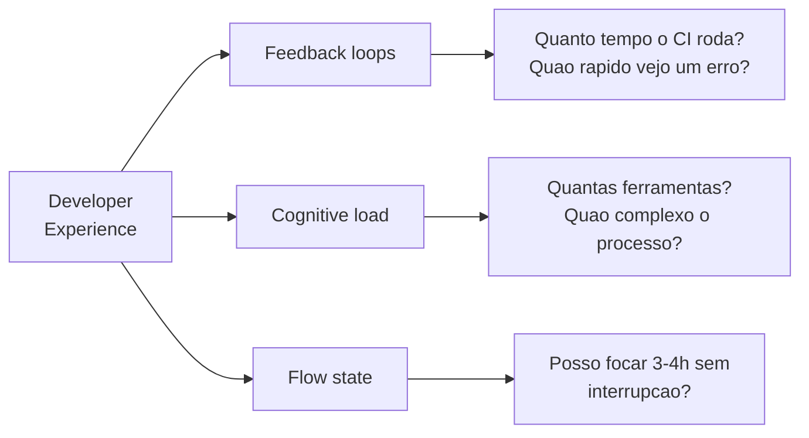

# Bloco 4 — Métricas de Plataforma: DORA, SPACE, DevEx e NPS interno

> **Pergunta do bloco.** Como a plataforma sabe se **está entregando valor**? Métricas erradas (vaidade) dizem que "está tudo bem" quando não está. Métricas certas destravam roadmap baseado em dado, respeito com stakeholders e melhoria contínua.

---

## 4.1 Por que métricas de plataforma são diferentes

Plataforma é **produto interno**. Diferente de um produto externo:

- **Clientes cativos** (na maioria das vezes) — podem reclamar pouco e usar mesmo assim.
- **Sem métricas de vendas** — adoção não vem por dinheiro, vem por escolha.
- **Dor invisível** — frustração não aparece em logs.
- **Múltiplos stakeholders** — dev, squad lead, CTO, CFO.

Portanto: misturar métricas **técnicas** (DORA), **qualitativas** (SPACE/DevEx) e **relacionais** (NPS interno).

> **Goodhart's Law**: *"When a measure becomes a target, it ceases to be a good measure."* Métricas geram comportamento. Escolher mal gera **jogo de métrica** (gaming).

---

## 4.2 DORA — Four Keys revisitado

Do Módulo 4 você viu as 4 métricas DORA. Aqui olhamos do ponto de vista **da plataforma**:

| Métrica | Definição | Plataforma influencia como |
|---------|-----------|----------------------------|
| **Deployment Frequency** | Nº de deploys em prod / tempo | Golden path com CD automático eleva |
| **Lead Time for Changes** | Do commit ao deploy em prod | Template reduz; gates bem feitos mantêm baixo |
| **Change Failure Rate** | % deploys que causam incidente | Segurança/testes embutidos reduzem |
| **Mean Time to Restore** | Tempo médio de recovery | Runbook automatizado + observabilidade reduzem |

Classificação DORA (State of DevOps Report):

| Classe | Deploy Freq | Lead Time | Change Fail | MTTR |
|--------|-------------|-----------|-------------|------|
| **Elite** | on-demand (múltiplos/dia) | < 1 dia | 0–15% | < 1h |
| **High** | 1/dia a 1/semana | 1 dia – 1 semana | 16–30% | < 1 dia |
| **Medium** | 1/semana a 1/mês | 1 semana – 1 mês | 16–30% | 1 dia – 1 semana |
| **Low** | 1/mês a 1/6 meses | 1-6 meses | 16–30% | > 1 semana |

### 4.2.1 Coleta técnica

Fontes típicas:
- **GitHub Actions** API → deploys (merged PRs com label `release`, ou tag semver).
- **Incident management tool** (Jira, Opsgenie) → change failure rate, MTTR.
- **Git** → commits para lead time.

O projeto open-source [dora-team/fourkeys](https://github.com/dora-team/fourkeys) (Google) serve de base.

### 4.2.2 Onde a plataforma **ajuda** e onde **atrapalha**

Ajuda:
- CI padrão com gate de qualidade → menos CFR.
- CD automatizado a staging → maior DF.
- Golden path com observability → menor MTTR.

Atrapalha (quando mal feito):
- CI lento (30 min) → Lead Time cresce.
- Gate demais (bloqueio em cada PR) → DF cai.
- Template com bug → CFR sobe para **todos** os squads que usam.

### 4.2.3 Por squad vs. agregado

Olhar DORA **por squad** mostra heterogeneidade. Agregado esconde. Ex.: plataforma boa em média, mas squad `condominios` com Lead Time alto sinaliza atenção dedicada.

---

## 4.3 DORA ≠ tudo

Críticas populares:

- **Deploy frequency** pode crescer **quebrando trabalho demais** (PR de 3 linhas) → anti-pattern.
- **Lead Time** curto com CFR alto = qualidade ruim.
- Métricas **não capturam** experiência subjetiva (frustração, burnout).

Daí o SPACE e o DevEx.

---

## 4.4 SPACE — Satisfaction, Performance, Activity, Communication, Efficiency

SPACE (Forsgren et al., ACM Queue 2021) cobre **5 dimensões**:

| Dimensão | Exemplo |
|----------|---------|
| **Satisfaction** | Percepção: "Eu recomendo minha empresa?" NPS interno |
| **Performance** | Resultados: features entregues, defeitos fechados |
| **Activity** | Ações: commits, PRs, reviews (cuidado com vaidade) |
| **Communication & collaboration** | Revisão cruzada, PRs atendidos em quanto tempo |
| **Efficiency & flow** | Tempo em "deep work", interrupções, focus time |

**Regra SPACE**: escolher **1 métrica de cada dimensão**, **triangulando**. Nunca uma só.

### 4.4.1 Aplicado à plataforma

| Dimensão | Métrica | Como medir |
|----------|---------|-----------|
| Satisfaction | NPS da plataforma | Survey trimestral |
| Performance | Serviços em produção via golden path (%) | Catálogo |
| Activity | Deploys/semana via golden path | CI/CD |
| Communication | Tempo de resposta em `#platform-help` | Slack stats |
| Efficiency | Onboarding: commit→deploy em prod (dias) | Survey + métricas |

### 4.4.2 Exemplo de survey

```markdown
## Survey trimestral - Plataforma OrbitaTech (Q2/2026)

1. [0-10] Quanto voce recomenda a plataforma a outro engenheiro da OrbitaTech? (NPS)
2. [0-10] Quao satisfeito com a plataforma hoje? (CSAT)
3. [1-5] Qual sua cognitive load atual? (1 baixa, 5 muito alta)
4. [checkbox] Voce usa: [ ] golden path python-fastapi [ ] kafka-topic [ ] postgres-db [ ] outros
5. [aberta] Qual a **maior friccao** que voce encontra hoje?
6. [aberta] Qual **melhoria** mais te ajudaria nos proximos 3 meses?
7. [1-5] Tempo gasto em infra/tooling fora do golden path (1 nenhum, 5 a maior parte do tempo)
8. [0-10] Feedback loop: ao fazer push, quanto tempo para ver resultado em staging?
```

**Princípios**:
- Mix quantitativo + qualitativo.
- Limitar a ~10 questões.
- Anonimizar em nível de resposta individual.
- Publicar os resultados (com ações).

---

## 4.5 DevEx — Developer Experience

DevEx (Noda, Storey, Forsgren, Greiler, *ACM Queue* 2023) refina com **3 drivers**:



### 4.5.1 Drivers

1. **Feedback loops** — quão rápido o sistema responde ao dev (CI, deploy, logs).
2. **Cognitive load** — (Bloco 1) quão complexa a tarefa.
3. **Flow state** — capacidade de mergulhar profundamente; interrupções.

### 4.5.2 Métricas concretas DevEx

- **Time to first commit merged** (onboarding).
- **PR review latency** (tempo entre abrir PR e primeira review).
- **Local build time** (quanto tempo "compilar" localmente).
- **CI feedback time** (push → resultado).
- **Time to rollback** (botão verde → versão anterior).

---

## 4.6 NPS interno

Pergunta: *"De 0 a 10, quanto voce recomendaria a plataforma a outro engenheiro?"*

- 9-10: **Promotores**.
- 7-8: **Passivos**.
- 0-6: **Detratores**.

**NPS = %Promotores - %Detratores**, em uma escala de -100 a +100.

| NPS | Interpretação |
|-----|---------------|
| < 0 | Plataforma mal recebida; revisão profunda |
| 0-20 | Mediana; há ganhos, mas insatisfação significativa |
| 20-50 | Bom; refinar |
| > 50 | Excelente; manter + escalar |

### 4.6.1 Follow-up em detratores

Todo detrator (0-6) **merece call** de 15-30 min. Perguntas:

1. O que te fez responder essa nota?
2. Qual mudança concreta subiria a nota em 2 pontos?
3. Tem alternativa que você usa/quer usar?

As respostas viram **input de roadmap**.

---

## 4.7 Métricas de vaidade a evitar

- **Nº de features da plataforma** — não é valor; pode ser gold-plating.
- **Linhas de código** — nada diz.
- **Contagem de serviços no catálogo** se for **forçada** — aumenta pressão, destrói confiança.
- **Uptime do Kubernetes** — é prerequisito, não conquista.
- **Incidentes evitados** — contrafactual não-mensurável.

Diretriz: métrica só conta se **pode descer** e se **muda decisão** quando desce.

---

## 4.8 Dashboard unificado

Para o CTO/squads, um dashboard Grafana mostra:

- **DORA** (DF, Lead Time, CFR, MTTR) — plataforma agregada + top 3/bottom 3 squads.
- **Adoção do golden path** — % novos serviços em template.
- **NPS trimestral** — linha temporal.
- **Tempo de onboarding** — medido por survey + data real (primeiro PR merge).
- **Backlog de issues no portal** — abertos, resolvidos, SLA.
- **Custo por squad** (showback).

### 4.8.1 Exemplo de painel

```json
{
  "title": "Plataforma OrbitaTech - SPACE",
  "panels": [
    { "title": "DORA: Deploy Frequency", "type": "timeseries", "expr": "sum by (squad) (rate(platform_deployments_total[7d]))" },
    { "title": "Lead Time (dias)", "type": "stat", "expr": "histogram_quantile(0.5, sum(rate(platform_lead_time_seconds_bucket[30d])) by (le)) / 86400" },
    { "title": "Change Failure Rate", "type": "stat", "expr": "sum(platform_deployments_failed_total) / sum(platform_deployments_total)" },
    { "title": "MTTR (minutos)", "type": "stat", "expr": "histogram_quantile(0.5, sum(rate(platform_mttr_seconds_bucket[30d])) by (le)) / 60" },
    { "title": "NPS interno", "type": "gauge", "expr": "platform_nps_score" },
    { "title": "Adocao golden path", "type": "piechart", "expr": "platform_services_by_template" }
  ]
}
```

---

## 4.9 Ritmo de revisão

| Cadência | Evento |
|----------|--------|
| Diário | Alertas de SLO da plataforma |
| Semanal | Platform Team review: incidentes, issues, PRs |
| Quinzenal | Feedback qualitativo: `#platform-help` e office hours |
| Mensal | DORA por squad publicado |
| Trimestral | Survey SPACE completo + NPS + roadmap público |
| Semestral | Revisão de contratos/capabilities (deprecations) |

---

## 4.10 Script Python: `platform_metrics.py`

Calcula DORA a partir de arquivos CSV + computa NPS a partir de respostas de survey.

```python
"""
platform_metrics.py - calcula DORA e NPS da plataforma.

Entrada:
  deployments.csv: data,squad,status  (status in {success,failed,rolled-back})
  leadtime.csv:    commit_at,deploy_at (ISO8601)
  incidents.csv:   detect_at,restore_at (ISO8601)
  survey.csv:      respondente,score_nps (0-10)

Uso:
  python platform_metrics.py --deployments d.csv --leadtime lt.csv \
      --incidents inc.csv --survey s.csv
"""
from __future__ import annotations

import argparse
import csv
import statistics
import sys
from datetime import datetime
from pathlib import Path

from rich.console import Console
from rich.table import Table


def ler_csv(path: str) -> list[dict]:
    with open(path, "r", encoding="utf-8", newline="") as fh:
        return list(csv.DictReader(fh))


def classificar_dora(df_per_week: float, lead_time_days: float, cfr: float, mttr_hours: float) -> str:
    if df_per_week >= 7 and lead_time_days < 1 and cfr < 0.15 and mttr_hours < 1:
        return "Elite"
    if df_per_week >= 1 and lead_time_days < 7 and cfr < 0.30 and mttr_hours < 24:
        return "High"
    if df_per_week >= 0.25 and lead_time_days < 30 and cfr < 0.30 and mttr_hours < 168:
        return "Medium"
    return "Low"


def calc_deploy_freq(deploys: list[dict]) -> tuple[float, dict[str, float]]:
    successes = [d for d in deploys if d["status"] == "success"]
    if not successes:
        return 0.0, {}
    datas = [datetime.fromisoformat(d["data"]) for d in successes]
    semanas = max((max(datas) - min(datas)).days / 7.0, 1.0)
    por_squad: dict[str, int] = {}
    for d in successes:
        por_squad[d["squad"]] = por_squad.get(d["squad"], 0) + 1
    return len(successes) / semanas, {k: v / semanas for k, v in por_squad.items()}


def calc_lead_time_days(rows: list[dict]) -> float:
    leads = []
    for r in rows:
        c = datetime.fromisoformat(r["commit_at"])
        d = datetime.fromisoformat(r["deploy_at"])
        leads.append((d - c).total_seconds() / 86400)
    return statistics.median(leads) if leads else 0.0


def calc_cfr(deploys: list[dict]) -> float:
    if not deploys:
        return 0.0
    fails = sum(1 for d in deploys if d["status"] in {"failed", "rolled-back"})
    return fails / len(deploys)


def calc_mttr_hours(rows: list[dict]) -> float:
    if not rows:
        return 0.0
    tempos = []
    for r in rows:
        a = datetime.fromisoformat(r["detect_at"])
        b = datetime.fromisoformat(r["restore_at"])
        tempos.append((b - a).total_seconds() / 3600)
    return statistics.median(tempos)


def calc_nps(rows: list[dict]) -> tuple[float, int, int, int]:
    scores = [int(r["score_nps"]) for r in rows]
    if not scores:
        return 0.0, 0, 0, 0
    promotores = sum(1 for s in scores if s >= 9)
    passivos = sum(1 for s in scores if 7 <= s <= 8)
    detratores = sum(1 for s in scores if s <= 6)
    total = len(scores)
    nps = 100 * (promotores / total - detratores / total)
    return nps, promotores, passivos, detratores


def relatorio(args) -> int:
    console = Console()

    deploys = ler_csv(args.deployments)
    df, por_squad = calc_deploy_freq(deploys)
    lead = calc_lead_time_days(ler_csv(args.leadtime))
    cfr = calc_cfr(deploys)
    mttr = calc_mttr_hours(ler_csv(args.incidents))
    classe = classificar_dora(df, lead, cfr, mttr)

    tbl = Table(title="DORA (agregado)")
    for c in ("metrica", "valor"):
        tbl.add_column(c)
    tbl.add_row("Deploy Frequency (deploys/semana)", f"{df:.2f}")
    tbl.add_row("Lead Time (dias, mediana)", f"{lead:.2f}")
    tbl.add_row("Change Failure Rate", f"{cfr*100:.1f}%")
    tbl.add_row("MTTR (horas, mediana)", f"{mttr:.2f}")
    tbl.add_row("Classe DORA", classe)
    console.print(tbl)

    if por_squad:
        t2 = Table(title="Deploy Frequency por squad")
        for c in ("squad", "deploys/semana"):
            t2.add_column(c)
        for squad, v in sorted(por_squad.items(), key=lambda kv: -kv[1]):
            t2.add_row(squad, f"{v:.2f}")
        console.print(t2)

    if args.survey and Path(args.survey).exists():
        nps, p, pa, d = calc_nps(ler_csv(args.survey))
        t3 = Table(title="NPS Interno")
        for c in ("faixa", "quantidade"):
            t3.add_column(c)
        t3.add_row("Promotores (9-10)", str(p))
        t3.add_row("Passivos (7-8)", str(pa))
        t3.add_row("Detratores (0-6)", str(d))
        t3.add_row("NPS", f"{nps:+.1f}")
        console.print(t3)

    return 0


def main(argv: list[str] | None = None) -> int:
    ap = argparse.ArgumentParser()
    ap.add_argument("--deployments", required=True)
    ap.add_argument("--leadtime", required=True)
    ap.add_argument("--incidents", required=True)
    ap.add_argument("--survey", default="")
    args = ap.parse_args(argv)
    try:
        return relatorio(args)
    except OSError as exc:
        print(f"ERRO: {exc}", file=sys.stderr)
        return 2


if __name__ == "__main__":
    raise SystemExit(main())
```

Exemplo de execução:

```bash
python platform_metrics.py \
  --deployments data/deployments.csv \
  --leadtime   data/leadtime.csv \
  --incidents  data/incidents.csv \
  --survey     data/survey.csv
```

---

## 4.11 Checklist do bloco

- [ ] Conheço as 4 DORA e sua classificação.
- [ ] Limito métricas de vaidade (activity sem contexto).
- [ ] Aplico SPACE (5 dimensões, ≥ 1 métrica de cada).
- [ ] Coleto NPS interno e faço follow-up com detratores.
- [ ] Meço DevEx (feedback loops, cognitive load, flow).
- [ ] Monto dashboard Grafana com visão unificada.
- [ ] Defino ritmo (diário → semestral) de revisão.
- [ ] Uso `platform_metrics.py` para DORA + NPS agregados.

Vá aos [exercícios resolvidos do Bloco 4](./04-exercicios-resolvidos.md).
