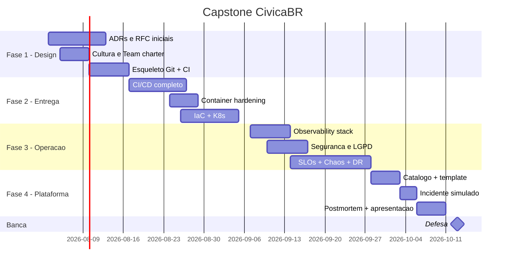

# Projeto Capstone — CivicaBR

---

## O produto (fictício, realista)

**CivicaBR** é uma plataforma civic-tech brasileira que permite cidadãos reportarem problemas urbanos (buracos, iluminação, sinalização, acessibilidade, limpeza, poda de árvores). Os reports são **roteados** para as prefeituras parceiras, que tratam no seu próprio sistema e devolvem o status ao cidadão.

- **App mobile** (cidadão) — MVP: web-responsive, não mobile nativo neste capstone.
- **Painel web** (prefeitura) — triagem, SLA de resposta, relatórios.
- **API pública** (integradores externos, OSC, imprensa).

### Modelo de negócio e contratos

- **SaaS B2G** (business-to-government): cada prefeitura paga mensalidade por habitante.
- **SLA contratual** com municípios:
  - Disponibilidade geral **≥ 99,9%** (sala de máquinas) / **99,5%** em janelas críticas (chuva).
  - **Latência p95** ≤ 800 ms para busca e abertura de report.
  - **Notificação ao cidadão** em ≤ 5 min após mudança de status.
- **Multa contratual** se SLA descumprido por > 30 min em janela crítica.

### Escala-alvo (dimensionamento para o capstone)

- **12 prefeituras** parceiras (pequeno/médio porte) no MVP.
- **~120 mil cidadãos cadastrados**.
- **Pico sazonal**: chuvas de novembro–março triplicam volume de reports; **Dia do Grande Evento** (ex.: rompimento de adutora) pode decuplicar em horas.
- Baseline: ~8 reports/min; pico: ~80 reports/min.

### Dados sensíveis (LGPD)

- Cidadão: nome, CPF opcional, e-mail, **localização** do report.
- Localização é **dado pessoal sensível** quando combinada com identificador.
- Foto do problema pode conter **pessoas identificáveis** (desafio de privacidade).
- DPO interno responde por direitos LGPD (acesso, portabilidade, eliminação).

---

## Requisitos funcionais mínimos

Para reduzir escopo sem perder a espinha dorsal DevOps:

1. **Cidadão** cria report com: categoria, descrição, localização (lat/long), foto (opcional).
2. **Sistema** classifica por prefeitura (via lookup geográfico simples) e grava.
3. **Prefeitura** (via painel web) vê fila, muda status (`recebido` → `em triagem` → `em andamento` → `resolvido` / `rejeitado`).
4. **Cidadão** recebe notificação por e-mail quando status muda.
5. **API pública** expõe contagem agregada de reports por bairro (dados anonimizados).
6. **Admin** (CivicaBR staff) acessa dashboard multi-tenant.

Não obrigatório (mas bem-vindo como extra): OAuth social login, comentários, app mobile nativo, integração real com prefeitura externa.

---

## Stack de referência

Sugestão, **não obrigação** — justifique divergências em ADR.

| Camada | Ferramenta de referência |
|--------|--------------------------|
| API | Python 3.12 + FastAPI |
| Worker | Python + Celery (ou RQ, ou Arq) |
| DB | PostgreSQL 16 |
| Queue/stream | RabbitMQ ou Redis Stream |
| Cache | Redis |
| Container | Docker (Dockerfile hardened, distroless) |
| Orquestração local | Docker Compose |
| Orquestração alvo | Kubernetes (k3d/kind local) |
| IaC | OpenTofu (Docker/Kubernetes providers) ou Pulumi (Python) |
| CI/CD | GitHub Actions + ArgoCD (ou Flux) |
| Observability | Prometheus + Grafana + Loki + Tempo (ou Jaeger) + OpenTelemetry |
| Security | Trivy (images + IaC), Bandit, pip-audit, Gitleaks, Cosign, Kyverno |
| SRE | Velero (backup K8s), Chaos Mesh (experimentos), runbooks em Markdown |
| Platform | Backstage (ou substituto leve: repo catálogo + scripts) |
| Frontend (opcional) | Next.js ou Streamlit para MVP interno |

---

## Requisitos não-funcionais (exigidos pela rubrica)

Obrigatórios — cada item será avaliado na banca.

### Entrega e CI/CD (Módulos 2, 3, 4)

- CI com: lint (Ruff), tipos (mypy opcional), teste unitário (pytest, cobertura mínima 70%), SAST (Bandit), SCA (pip-audit), secret scan (Gitleaks).
- Build reprodutível (Docker com multi-stage, digest pinado).
- Artefatos assinados (Cosign) e com SBOM (Syft).
- Deploy automático em **staging** a cada merge.
- Deploy em **prod** sob aprovação manual (Environments do GitHub).
- Estratégia de release: Blue-green **ou** Canary com feature flags.
- Migrações de DB seguras (expand/contract) — documentar em ADR.

### Container e K8s (Módulos 5, 7)

- Imagens: base distroless/Chainguard, usuário non-root, healthcheck.
- Scan sem CVEs Critical em main (Trivy).
- K8s: Deployment + Service + Ingress + HPA + PDB + NetworkPolicy.
- ConfigMap para config, Secret/Sealed Secret para segredos.
- Probes liveness e readiness corretas.
- RBAC mínimo — ServiceAccount dedicado por workload.

### IaC (Módulo 6)

- Tudo em código (nada provisionado à mão).
- Remote state (ou arquivo local com `.gitignore` correto para curso).
- Ambientes separados: `dev`, `staging`, `prod`.
- Policy-as-code (Checkov ou OPA) rodando em CI.

### Observability (Módulo 8)

- Três pilares: **métricas** (Prometheus), **logs estruturados** (Loki ou STDOUT + scraping), **traces** (OpenTelemetry → Tempo/Jaeger).
- Golden signals instrumentados (latência, tráfego, erro, saturação).
- SLIs definidos e SLOs publicados com janela e meta.
- ≥ 3 dashboards Grafana: *sistema geral*, *golden signals por serviço*, *saúde operacional*.
- ≥ 3 alertas SLO-based (burn rate) roteados para "on-call".

### Segurança (Módulo 9)

- Hardening de containers.
- Image signing + SBOM.
- Admission control (Kyverno) com ≥ 2 políticas (ex.: só imagens assinadas; só readOnlyRootFilesystem).
- Threat model mínimo (STRIDE) documentado.
- Análise LGPD — mapeamento de dados pessoais e controles.
- Plan de resposta a incidente de segurança.

### SRE (Módulo 10)

- SLO formal com Error Budget Policy (política de ações).
- ≥ 1 experimento Chaos Engineering documentado (hipótese, blast radius, steady state, resultado).
- Backup agendado (Velero) **e teste de restore** documentado.
- DR playbook (cluster perdido) com RPO/RTO medidos.
- ≥ 3 runbooks executáveis.
- Política de on-call sustentável (mesmo em projeto solo, declarar).
- Postmortem blameless (template + 1 real ou simulado).

### Plataforma (Módulo 11)

- Catalog com o serviço, owners, SLO, dependências.
- Pelo menos um golden path (template de serviço) gerando um componente real — mesmo que só você use, fica demonstrado.
- Contratos de capability declarados (bronze/silver/gold tiers se fizer sentido no escopo).

### Cultura (Módulo 1)

- ADRs: mínimo **8 registradas** (cada decisão significativa).
- RFCs: mínimo 2 (propostas discutidas antes de implementar).
- README claro como um produto real.
- Blameless postmortem com linguagem correta.

---

## Escopo realista (e o que **deixar de fora**)

**Incluído**:
- Núcleo API + worker + DB + cache + queue.
- Pipeline completa CI/CD.
- Stack de obs/sec/SRE.
- Chaos game day + postmortem.

**Deliberadamente fora** (não é fraqueza — é prioridade):
- App mobile nativo (web basta).
- Pagamentos reais.
- ML / recomendação.
- i18n completo.
- Multi-região geográfica.
- SRE "plena" com 24×7 — simulamos.

---

## Linha do tempo sugerida (12 semanas)

---

## Critério de aprovação

- **70 pts mínimo** na rubrica consolidada (ver [entrega-avaliativa.md](entrega-avaliativa.md)).
- **Demonstração ao vivo**: ambiente sobe em ≤ 10 min; avaliador consegue injetar falha; sistema mostra alerta; aluno conduz resposta.
- **Defesa oral**: explica 3 ADRs escolhidos pelo avaliador; sabe o que mudaria; aceita crítica.

---

## Pergunta norteadora

> **Qual é a próxima decisão mais importante que seu sistema enfrenta, e como seu sistema atual está preparado para suportá-la?**

Se você conseguir responder essa pergunta **com evidência** (ADRs, métricas, ensaios), o capstone está cumprido. As fases a seguir são o caminho para chegar lá.
