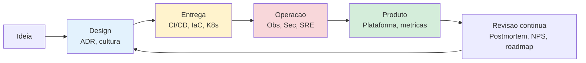
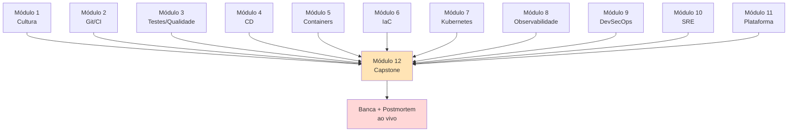

# Módulo 12 — Capstone: da ideia à operação

**Carga horária:** 12 horas (equivalente em projeto: ~60-80h distribuídas no semestre)
**Nível:** Graduação (fechamento do curso)
**Pré-requisitos:** Módulos 1 a 11 concluídos

---

## O que este módulo é

É o **projeto integrador** do curso. Não há mais "conteúdo novo" a ensinar — cada módulo anterior **já entregou uma disciplina**. Aqui você **costura tudo** num sistema de verdade: do primeiro commit à operação 24x7, passando por containers, Kubernetes, observabilidade, segurança, SRE e plataforma interna.

O objetivo não é listar ferramentas, é **demonstrar juízo**. Um engenheiro DevOps senior se distingue menos pelo que **conhece** e mais pelo que **escolhe** — quando adotar, quando adiar, quando remover.

---

## Objetivos de aprendizagem

Ao final do módulo, você será capaz de:

- **Projetar** um sistema do zero, justificando cada decisão de arquitetura em ADRs.
- **Integrar** CI/CD, containers, IaC, Kubernetes, observabilidade, segurança e SRE num único produto coeso.
- **Operar** o sistema: receber métricas, atender alertas, conduzir um incidente simulado, redigir postmortem.
- **Medir** sua própria entrega com DORA, SPACE e NPS interno.
- **Defender** decisões em banca: explicar *por que* um trade-off foi feito; apontar riscos remanescentes; mostrar como o próximo passo foi priorizado.

---

## O cenário

**CivicaBR** — uma civic-tech brasileira que recebe reports de problemas urbanos (buracos, iluminação pública, acessibilidade, limpeza) e os roteia para prefeituras parceiras. Sistema multi-tenant, com SLA contratual perante municípios, picos sazonais (chuvas → buracos) e requisitos LGPD. Detalhes em [`00-projeto-capstone.md`](00-projeto-capstone.md).

Você constrói o sistema de ponta a ponta, em **4 fases**, entregando artefatos a cada sprint. No final, defende em banca com um scripted incident response (caos ao vivo).

---

## Estrutura do módulo

| Fase | Foco | Tempo sugerido | Arquivo |
|------|------|-----------------|---------|
| Setup | Cenário, objetivos, rubrica | — | [00-projeto-capstone.md](00-projeto-capstone.md) |
| **1** | Design, cultura, fundação (commit + CI inicial) | ~20h | [bloco-1/01-fase-design.md](bloco-1/01-fase-design.md) |
| **2** | Entrega contínua end-to-end (CI/CD, containers, IaC, K8s) | ~20h | [bloco-2/02-fase-entrega.md](bloco-2/02-fase-entrega.md) |
| **3** | Operação: observability, segurança, SRE | ~20h | [bloco-3/03-fase-operacao.md](bloco-3/03-fase-operacao.md) |
| **4** | Plataforma interna, métricas, apresentação final | ~15h | [bloco-4/04-fase-plataforma.md](bloco-4/04-fase-plataforma.md) |
| Marcos | 5 entregas encadeadas (ver cronograma) | — | [exercicios-progressivos/](exercicios-progressivos/) |
| Entrega | Rubrica final e banca | — | [entrega-avaliativa.md](entrega-avaliativa.md) |
| — | Referências | — | [referencias.md](referencias.md) |

---

## Produto final esperado

Um repositório (monorepo ou múltiplos repos orquestrados) que, para um avaliador com permissões adequadas, permita:

1. **`make up`** — ambiente local completo em ≤ 10 min (K8s, observabilidade, segurança, app).
2. **Pipeline CI/CD** verde no último PR do master.
3. **Deploy em staging** automático após merge em `main`.
4. **Dashboard** com SLOs vigentes, DORA e saúde operacional.
5. **Runbooks** ativos para ≥ 3 tipos de incidente.
6. **Postmortem real** de um incidente simulado durante a banca.
7. **Software Catalog** (Backstage ou equivalente leve) com o produto e dependências.
8. **ADRs** documentando as 8-12 decisões mais importantes.
9. **Portfolio pitch** (≤ 5 min) vendendo a arquitetura para um CTO hipotético.

---

## Princípios orientadores

1. **Simples primeiro, sofisticado quando dor.** Não invente o que ainda não dói.
2. **Automatize o que se repete 3 vezes.** Idealmente antes.
3. **Mede antes de otimizar.** Sem baseline, otimização é suposição.
4. **Culpa em sistema, não em pessoa.** Todo postmortem é blameless.
5. **Documente o "por quê", não o "o que".** ADR cobre a decisão; código mostra a implementação.
6. **Plataforma como produto interno.** Mesmo num projeto solo, trate seu próprio "usuário futuro" (você daqui a 6 meses) como cliente.

---

## Como estudar

1. **Leia 00-projeto-capstone.md** e a rubrica antes de qualquer coisa.
2. **Escolha seu escopo.** CivicaBR é referência — se preferir outro domínio (edtech, healthtech, fintech), use, desde que atenda os requisitos não-funcionais (ver rubrica).
3. **Não inicie pelo deploy.** A fase 1 é sobre *por quê* tanto quanto sobre *o quê*.
4. **Use os módulos anteriores como livro-texto.** Cada decisão que envolva CI, container, IaC, K8s, observability, security ou SRE tem um capítulo dedicado.
5. **Mantenha cadência.** Semanalmente: um PR, um ADR, uma atualização no README.
6. **Reserve tempo para defesa.** A última semana é **só** para polir apresentação, ensaiar o postmortem ao vivo e revisar a documentação.

---

## O que este módulo NÃO faz

- Não ensina ferramentas novas. Se você precisa de uma não vista nos Módulos 1 ao 11, justifique em ADR e assuma o custo de aprendizado.
- Não exige escala real (milhões de usuários). O foco é **maturidade de processo e arquitetura**, não performance a qualquer custo.
- Não cobre UX/frontend profundo. A UI pode ser mínima — mas funcional.
- Não substitui disciplinas de arquitetura de software, UX ou negócio.

---

## Conexão com todos os módulos anteriores

---

*Material alinhado a: Accelerate (Forsgren, Humble, Kim); The DevOps Handbook (Kim et al.); The SRE Book (Beyer et al.); Team Topologies (Skelton & Pais); Building Secure and Reliable Systems (Adkins et al.); Database Reliability Engineering (Campbell, Majors); Release It! (Nygard); Thinking in Systems (Meadows); e toda a bibliografia anterior do curso.*

---

<!-- nav:start -->

| &nbsp; | &nbsp; | &nbsp; |
|:--|:--:|--:|
| **← Anterior** [Referências — Módulo 11 (Plataforma Interna)](../11-plataforma-interna/referencias.md) | **↑ Índice** Módulo 12 — Capstone integrador | **Próximo →** [Projeto Capstone — CivicaBR](00-projeto-capstone.md) |

<!-- nav:end -->
