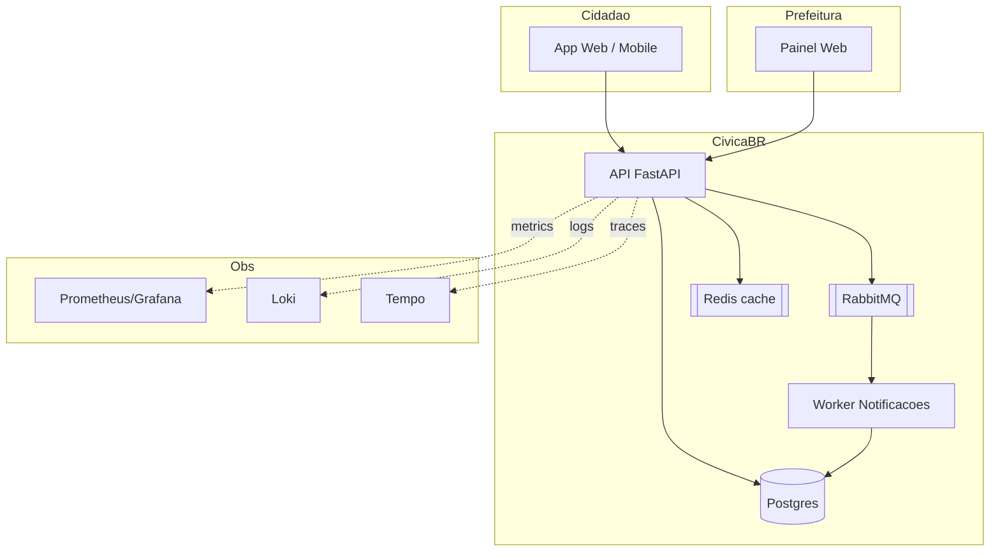

# Fase 1 — Design e fundação

> **Propósito da fase.** Antes de código funcionar, decisões precisam existir e estar **registradas**. Nesta fase você estabelece o vocabulário técnico e a constituição do projeto: quem faz o quê, quais trade-offs foram aceitos, por que esse caminho.

**Duração sugerida:** 15-20h de trabalho distribuídas em ~2 semanas.

---

## 1.1 Objetivos da fase

Ao final:

- Existe um **repositório Git** com estrutura clara, `.gitignore`, LICENSE e CODEOWNERS.
- Existe um **README raiz** com pitch em 3 parágrafos + diagrama Mermaid da arquitetura-alvo.
- Existem **pelo menos 5 ADRs** iniciais registrando as decisões de base.
- Existe **1 RFC** propondo a abordagem geral (discussão aberta, não fato consumado).
- Existe um **team charter** (mesmo que você seja o único "time") declarando valores e limites.
- Existe um **esqueleto de CI** rodando verde com pelo menos `ruff` e `pytest`.
- Existe um **Makefile** inicial com `make up` / `make test` / `make lint` conceituais.

Produto da fase: um repositório *desenhado*, não um sistema que roda completo. O sistema virá nas fases seguintes.

---

## 1.2 Mentalidade

> *"The document is not the design; the document is the communication of the design."* — Linda Rising

Você não está enchendo papel. Está **defendendo escolhas para seu eu futuro** — aquele que, em 3 meses, esqueceu por que escolheu PostgreSQL em vez de MySQL, ou por que as filas são RabbitMQ em vez de Redis Streams. **Escreva para esse humano.**

---

## 1.3 Estrutura mínima do repositório

```
civicabr/
├── README.md
├── LICENSE
├── CODEOWNERS
├── .gitignore
├── .github/
│   └── workflows/
│       └── ci.yml
├── Makefile
├── docs/
│   ├── adr/
│   │   ├── 0001-escolha-postgres.md
│   │   ├── 0002-monorepo-vs-polyrepo.md
│   │   ├── 0003-strategia-de-release.md
│   │   ├── 0004-stack-observability.md
│   │   └── 0005-abordagem-multitenancy.md
│   ├── rfc/
│   │   └── 0001-abordagem-geral.md
│   ├── arquitetura.md
│   └── charter.md
├── services/
│   └── api/
│       ├── pyproject.toml
│       ├── src/
│       └── tests/
└── infra/        # placeholder, preenche na Fase 2
    └── README.md
```

Obs.: monorepo por padrão — se preferir multi-repo, documentar em ADR-002.

---

## 1.4 Os ADRs iniciais (≥ 5)

### 1.4.1 Template recomendado

```markdown
# ADR-NNNN: Titulo curto, decisão em 1 frase

- Data: YYYY-MM-DD
- Status: proposed | accepted | deprecated | superseded-by:NNNN
- Autores: @fulano

## Contexto
Problema, forças em jogo, restrições não-negociáveis. 2-4 paragrafos.

## Decisão
A escolha. 1-3 paragrafos. Seja explícito.

## Alternativas consideradas
- **A**: pros/contras.
- **B**: pros/contras.

## Consequências
- Positivas.
- Negativas.
- Riscos a mitigar.

## Revisão
Quando/como revisitamos esta decisão.
```

### 1.4.2 ADRs sugeridos (adapte, justifique se divergir)

1. **ADR-0001 — Escolha do banco**: Postgres 16 vs alternativas (MySQL, Mongo). Fatores: LGPD, consistência, extensões (PostGIS se usar localização).
2. **ADR-0002 — Monorepo vs polyrepo**: ergonomia para projeto solo vs isolamento.
3. **ADR-0003 — Estratégia de release**: blue-green vs canary para o MVP; feature flags ou não.
4. **ADR-0004 — Stack de observability**: Prometheus+Grafana+Loki+Tempo vs alternativas (Datadog, Dynatrace).
5. **ADR-0005 — Abordagem de multitenancy**: um schema por prefeitura vs um campo `tenant_id` em tabelas. Impacto em segurança, backup, custo.
6. (Opcional 0006) — Fila: RabbitMQ vs Redis Stream.
7. (Opcional 0007) — Frontend: Next.js vs Streamlit vs server-rendered.

O importante não é copiar — é **tomar a decisão com consciência**. Se você escolher "não há banco" (tudo em-memória porque é MVP), documente também, com riscos.

### 1.4.3 Regras de ADR

- **Um arquivo, uma decisão.**
- **Imutável após aceita.** Se mudou: novo ADR com `supersedes`.
- **Revisão escrita por pares.** Mesmo num projeto solo, faça um "round de revisão comigo mesmo em 48h" antes de aceitar.
- **Numeração sequencial.** Sem lacunas.

---

## 1.5 A RFC inicial

Diferente do ADR (decisão já tomada), a RFC **propõe** e aceita debate.

**RFC-0001 — Proposta de abordagem geral do CivicaBR** deve ter:

- Contexto (o problema CivicaBR).
- Objetivos e não-objetivos explicitamente listados.
- Proposta resumida (arquitetura desenhada).
- Alternativas descartadas.
- Plano faseado (esta mesma estrutura de fases).
- Riscos principais.
- Métricas de sucesso.

O exercício de escrever a RFC é o exercício de descobrir **o que ainda não está decidido**.

---

## 1.6 Cultura e charter

### 1.6.1 Team charter (`docs/charter.md`)

Mesmo que você seja o único "membro", escreva o documento como se fosse recrutar amanhã.

Conteúdo mínimo:

```markdown
# CivicaBR - Team charter

## Missao
Tornar relatos cidadaos em acao publica rastreavel, com SLA.

## Valores operacionais
- Blameless postmortem: discutimos falhas, nao culpados.
- Commit pequeno, feedback rapido.
- Seguranca e LGPD desde o design (shift-left).
- Decisao registrada (ADR) > discussao oral.

## Papeis (este capstone)
- Owner tecnico: voce.
- "Consciencia senior": orientador / banca.
- Time topologies: neste escopo, o projeto e stream-aligned com
  capabilities de plataforma embutidas.

## Expectativas de comunicacao
- PRs sao revisados em <= 24h (self-review documentada se solo).
- Incidente simulado segue ICS (IC, Ops, Comms, Scribe - papeis rodam).

## Politica de on-call
- Simulada neste capstone; escalado conforme severidade.
- Postmortem obrigatorio para Sev-1 e Sev-2.
```

### 1.6.2 Princípio de "shift-left"

Da fase 1, você já deve mostrar:

- **Security**: Bandit e pip-audit rodando no CI inicial (mesmo sem app real).
- **LGPD**: lista preliminar de dados pessoais em `docs/lgpd/inventario-dados.md`.
- **Testabilidade**: test de exemplo já no `services/api/tests/`.
- **Observability**: plano declarado ("vamos instrumentar" com cronograma), não implementação ainda.

---

## 1.7 CI inicial

O CI nasce pobre e cresce. Na Fase 1:

```yaml
# .github/workflows/ci.yml (esqueleto)
name: ci
on:
  push:
    branches: [main]
  pull_request:

jobs:
  lint-test:
    runs-on: ubuntu-latest
    defaults:
      run:
        working-directory: services/api
    steps:
      - uses: actions/checkout@v4
      - uses: actions/setup-python@v5
        with: { python-version: "3.12" }
      - run: pip install -e '.[dev]'
      - run: ruff check .
      - run: pytest -q
      - run: bandit -r src -ll -q
      - run: pip-audit --strict
```

Teste mínimo em `services/api/tests/test_smoke.py`:

```python
def test_smoke_app_importa():
    import app.main  # noqa: F401
```

Um CI verde no Dia 1 é um **ritual fundador**. Prova que há ciclo: commit → CI → resultado.

---

## 1.8 Makefile conceitual

```makefile
.PHONY: up down test lint fmt

up:
	@echo "Sera preenchido na Fase 2 (docker compose up)"

down:
	@echo "Sera preenchido na Fase 2"

test:
	cd services/api && pytest -q

lint:
	cd services/api && ruff check .

fmt:
	cd services/api && ruff format .
```

Comandos incompletos são **intencionais**. Eles declaram a API do projeto e se completam ao longo das fases.

---

## 1.9 Diagrama da arquitetura-alvo

No `docs/arquitetura.md`, desenhe o que você **pretende construir**. Não precisa estar pronto; precisa estar **pensado**.

Exemplo conceitual:



---

## 1.10 Análise preliminar LGPD

Em `docs/lgpd/inventario-dados.md`:

| Dado | Fonte | Finalidade | Base legal | Retenção | Controles |
|------|-------|------------|------------|----------|-----------|
| Nome, e-mail | formulário | identificação do cidadão | consentimento | 3 anos após último uso | criptografia em trânsito; hash de e-mail para busca |
| CPF (opcional) | formulário | deduplicação | consentimento | 3 anos | criptografia em repouso; tokenização |
| Localização (lat/long) | formulário / device | roteamento p/ prefeitura | legítimo interesse | agregada após 30 dias | blur p/ < 50 m quando exposto publicamente |
| Foto do problema | upload | evidência | legítimo interesse | 1 ano | redimensionar; metadata EXIF removido; moderação |
| Endereço IP do request | log de acesso | auditoria/segurança | legítimo interesse | 6 meses | rotação de logs; acesso controlado |

Esse mapa vira pilar do bloco de segurança (Fase 3).

---

## 1.11 Checklist de aceitação da Fase 1

### Estruturais
- [ ] Repositório inicializado e push no remoto.
- [ ] `.gitignore`, `LICENSE` (MIT/Apache/BSD — escolha + ADR se relevante), `CODEOWNERS` (pode ser só você).
- [ ] `README.md` raiz com pitch + diagrama + como rodar (ainda placeholder para fases seguintes).
- [ ] `Makefile` com alvos declarados (ainda que incompletos).

### Decisões
- [ ] ≥ 5 ADRs aceitos.
- [ ] 1 RFC com alternativas.
- [ ] `docs/charter.md` escrito.
- [ ] `docs/lgpd/inventario-dados.md` iniciado.

### Qualidade de base
- [ ] CI roda em ≤ 5 min e está verde.
- [ ] `ruff`, `pytest`, `bandit`, `pip-audit` rodando.
- [ ] Teste de smoke existe.

### Evidência
- [ ] Pelo menos 3 PRs mergeados (histórico de trabalho incremental).
- [ ] Commits com mensagem significativa (Conventional Commits sugerido).
- [ ] Uma "office hours com você mesmo" documentada: 30 min refletindo sobre trade-offs e anotando em RFC ou ADR.

---

## 1.12 Armadilhas comuns

- **Escrever 20 ADRs de uma vez no dia 1.** ADR nasce de **decisão real**; inventar ADR gera ruído. Melhor 5 consistentes que 20 decorativos.
- **"Vou começar pelo Kubernetes."** Kubernetes é Fase 2. Na Fase 1, seu palco é `docker compose up` conceitual — o raciocínio sobre o design.
- **README genérico** copiado de template. O README é **seu pitch**; personalizar é trabalho.
- **Pular RFC** e ir direto para implementação. Sem RFC, alternativas descartadas **nunca aparecem** no portfólio.
- **Nenhum `.gitignore` pensado** — segredos e `__pycache__` poluem logo.
- **LGPD tratada como "vemos depois".** Na Fase 3 você não vai retrocesso sem arrepender.

---

## Próxima fase

Com decisões registradas e CI verde, você está pronto para [Fase 2 — Entrega contínua](../bloco-2/02-fase-entrega.md): fazer o sistema **rodar** e **chegar em staging automaticamente**.

---

<!-- nav:start -->

**Navegação — Módulo 12 — Capstone integrador**

- ← Anterior: [Projeto Capstone — CivicaBR](../00-projeto-capstone.md)
- → Próximo: [Fase 1 — Armadilhas, dicas e orientações de banca](01-armadilhas-e-dicas.md)
- ↑ Índice do módulo: [Módulo 12 — Capstone integrador](../README.md)

<!-- nav:end -->
