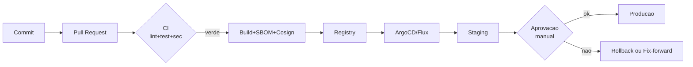

# Fase 2 — Entrega contínua end-to-end

> **Propósito.** Transformar as decisões da Fase 1 em um **fluxo real**: commit → CI → artefato assinado → staging → prod. O sistema deve ficar em pé com um único comando.

**Duração sugerida:** 15-20h em ~2 semanas.

---

## 2.1 Objetivos da fase

- **App mínimo funcionando** (API + worker + DB + cache + queue) via `docker compose`.
- **Pipeline CI/CD** completo: lint, test, coverage ≥ 70%, SAST, SCA, secret scan, build reprodutível, SBOM, Cosign, deploy staging.
- **Imagem hardened** (distroless, non-root, healthcheck).
- **IaC** inicial (OpenTofu ou Pulumi) provisionando recursos locais (Docker ou cluster kind).
- **Cluster Kubernetes local** (k3d/kind) com o app rodando.
- **Estratégia de release** implementada (blue-green OU canary OU rolling com surge controlado) documentada em ADR.
- **Migrations** seguras (expand/contract) com ferramenta (Alembic).
- **Deploy automático em staging**; **deploy em prod** sob gate manual.

Produto da fase: o sistema **existe** e **chega** em um ambiente quase-produtivo.

---

## 2.2 Fluxo de trabalho da fase



---

## 2.3 Aplicação mínima

Não perca tempo em features ricas. Entregue **pequeno** e **correto**.

### 2.3.1 API (FastAPI)

Endpoints obrigatórios:

- `POST /v1/reports` — cria report (cidadão).
- `GET /v1/reports/{id}` — consulta status.
- `PATCH /v1/reports/{id}/status` — prefeitura muda status (requer auth).
- `GET /v1/reports?tenant=X&status=Y` — listagem por prefeitura.
- `GET /v1/reports/stats/by-district` — agregado público anonimizado.
- `GET /healthz` e `GET /ready` — probes.

Usar **dependency injection** do FastAPI para DB/Redis/Queue — facilita testabilidade e migração futura.

### 2.3.2 Worker

Consome fila `notificacoes`; envia e-mail (pode ser mock/fake-smtp no MVP). Idempotência via `idempotency_key`.

### 2.3.3 Schemas DB (exemplo PostGIS opcional)

```sql
CREATE TABLE tenant (
    id UUID PRIMARY KEY,
    nome TEXT NOT NULL,
    cnpj TEXT UNIQUE,
    criado_em TIMESTAMPTZ DEFAULT now()
);

CREATE TABLE cidadao (
    id UUID PRIMARY KEY,
    email_hash BYTEA NOT NULL,
    nome TEXT,
    criado_em TIMESTAMPTZ DEFAULT now()
);

CREATE TABLE report (
    id UUID PRIMARY KEY,
    tenant_id UUID NOT NULL REFERENCES tenant,
    cidadao_id UUID REFERENCES cidadao,
    categoria TEXT NOT NULL,
    descricao TEXT,
    localizacao GEOGRAPHY(Point, 4326),
    foto_url TEXT,
    status TEXT NOT NULL DEFAULT 'recebido',
    criado_em TIMESTAMPTZ DEFAULT now()
);

CREATE INDEX ix_report_tenant_status ON report (tenant_id, status);
CREATE INDEX ix_report_localizacao ON report USING GIST (localizacao);
```

---

## 2.4 CI completo

Expansão da Fase 1:

```yaml
name: ci-cd
on:
  push:
    branches: [main]
    tags: [ 'v*' ]
  pull_request:

jobs:
  quality:
    runs-on: ubuntu-latest
    defaults: { run: { working-directory: services/api } }
    steps:
      - uses: actions/checkout@v4
      - uses: actions/setup-python@v5
        with: { python-version: "3.12" }
      - run: pip install -e '.[dev]'
      - run: ruff check .
      - run: mypy src || true    # transitorio; remover "|| true" quando baseline verde
      - run: pytest -q --cov=src --cov-fail-under=70
      - run: bandit -r src -ll -q
      - run: pip-audit --strict
      - uses: gitleaks/gitleaks-action@v2
        with: { config-path: .gitleaks.toml }

  build:
    needs: quality
    if: github.event_name != 'pull_request'
    runs-on: ubuntu-latest
    permissions:
      contents: read
      packages: write
      id-token: write
    steps:
      - uses: actions/checkout@v4
      - uses: docker/setup-buildx-action@v3
      - uses: docker/login-action@v3
        with:
          registry: ghcr.io
          username: ${{ github.actor }}
          password: ${{ secrets.GITHUB_TOKEN }}
      - id: meta
        uses: docker/metadata-action@v5
        with:
          images: ghcr.io/${{ github.repository }}/api
          tags: |
            type=sha,format=long
            type=ref,event=tag
      - uses: docker/build-push-action@v5
        with:
          context: services/api
          file: services/api/Dockerfile
          push: true
          tags: ${{ steps.meta.outputs.tags }}
          labels: ${{ steps.meta.outputs.labels }}
          provenance: true
          sbom: true
      - name: Install cosign
        uses: sigstore/cosign-installer@v3
      - name: Sign image
        run: |
          for tag in $(echo "${{ steps.meta.outputs.tags }}" | tr ',' '\n'); do
            cosign sign --yes "$tag"
          done
      - name: Trivy scan
        uses: aquasecurity/trivy-action@master
        with:
          image-ref: ghcr.io/${{ github.repository }}/api:sha-${{ github.sha }}
          exit-code: '1'
          severity: 'CRITICAL'

  deploy-staging:
    needs: build
    if: github.ref == 'refs/heads/main'
    runs-on: ubuntu-latest
    environment: staging
    steps:
      - uses: actions/checkout@v4
      - name: Update manifests
        run: |
          echo "TODO: atualizar infra/k8s/staging/values.yaml com nova tag"
          echo "TODO: commitar em repo de GitOps (ArgoCD observa)"
```

Variações aceitas:
- **GitHub Actions** é a referência; GitLab CI ou Jenkins são aceitos se justificado.
- **ArgoCD** é a referência; Flux ou push-based são aceitos com ADR.

---

## 2.5 Dockerfile hardened

```dockerfile
# syntax=docker/dockerfile:1.7

FROM python:3.12-slim AS builder
WORKDIR /app
ENV PIP_NO_CACHE_DIR=1
COPY pyproject.toml ./
RUN pip install --prefix=/install -e .
COPY src/ src/

FROM gcr.io/distroless/python3-debian12:nonroot AS runtime
WORKDIR /app
COPY --from=builder /install /usr/local
COPY --from=builder /app/src /app/src
ENV PYTHONPATH=/app/src PYTHONUNBUFFERED=1
USER nonroot:nonroot
EXPOSE 8080
HEALTHCHECK --interval=15s --timeout=3s CMD ["python","-c","import urllib.request; urllib.request.urlopen('http://localhost:8080/healthz').read()"]
ENTRYPOINT ["python","-m","app.main"]
```

Propriedades:
- Multi-stage (build cacheável separado do runtime).
- Distroless + nonroot.
- `PYTHONUNBUFFERED=1` para logs imediatos.
- Healthcheck reduz "running but broken".

Validar com:

```bash
docker scout cves --only-severity critical ghcr.io/.../api:sha-XXX
# ou
trivy image ghcr.io/.../api:sha-XXX
```

---

## 2.6 IaC inicial (OpenTofu + Pulumi OK)

Estrutura sugerida (`infra/`):

```
infra/
├── README.md
├── opentofu/
│   ├── modules/
│   │   └── k8s-app/
│   ├── envs/
│   │   ├── dev/
│   │   ├── staging/
│   │   └── prod/
│   └── versions.tf
└── kubernetes/
    ├── base/                    # Kustomize base
    │   ├── deployment.yaml
    │   ├── service.yaml
    │   ├── ingress.yaml
    │   ├── hpa.yaml
    │   ├── pdb.yaml
    │   ├── networkpolicy.yaml
    │   └── kustomization.yaml
    └── overlays/
        ├── dev/
        ├── staging/
        └── prod/
```

Na Fase 2 você **não precisa** IaC em cloud real — use **provider docker** (OpenTofu) ou **Pulumi Python** com provider Kubernetes apontando para k3d/kind.

### 2.6.1 Políticas em CI (Checkov / OPA)

```yaml
- name: Checkov on IaC
  uses: bridgecrewio/checkov-action@master
  with:
    directory: infra/
    soft_fail: false
```

---

## 2.7 Kubernetes em k3d/kind

### 2.7.1 Subir cluster

```bash
k3d cluster create civica --servers 1 --agents 2 -p "8080:80@loadbalancer"
kubectl config use-context k3d-civica
```

### 2.7.2 Manifest base (Kustomize)

```yaml
# infra/kubernetes/base/deployment.yaml
apiVersion: apps/v1
kind: Deployment
metadata:
  name: api
spec:
  replicas: 2
  selector:
    matchLabels: { app: api }
  template:
    metadata:
      labels: { app: api }
    spec:
      serviceAccountName: api
      automountServiceAccountToken: false
      securityContext:
        runAsNonRoot: true
        runAsUser: 65532
        fsGroup: 65532
        seccompProfile: { type: RuntimeDefault }
      containers:
        - name: api
          image: ghcr.io/civica/api:sha-REPLACEME
          imagePullPolicy: IfNotPresent
          ports: [{ containerPort: 8080, name: http }]
          readinessProbe: { httpGet: { path: /ready, port: http }, periodSeconds: 5 }
          livenessProbe:  { httpGet: { path: /healthz, port: http }, periodSeconds: 10 }
          resources:
            requests: { cpu: 100m, memory: 128Mi }
            limits:   { cpu: 500m, memory: 512Mi }
          securityContext:
            allowPrivilegeEscalation: false
            readOnlyRootFilesystem: true
            capabilities: { drop: [ALL] }
```

+ `service.yaml`, `ingress.yaml`, `hpa.yaml` (CPU e/ou custom), `pdb.yaml` (minAvailable 1), `networkpolicy.yaml` (default deny + allow específicos).

### 2.7.3 Overlay staging

Altera: recursos, hostname do Ingress, `replicas`, e a tag.

---

## 2.8 Estratégia de release

Escolher **uma** e documentar em ADR-0003:

| Estratégia | Quando faz sentido | Complexidade |
|------------|---------------------|--------------|
| **Rolling update** | Default K8s; MVP | Baixa |
| **Blue-green** | Troca rápida; rollback instantâneo | Média (requer infra dupla) |
| **Canary** | Valida mudanças com subset real de tráfego | Média/Alta (requer mesh ou Argo Rollouts) |

Para este capstone, **canary com Argo Rollouts** é recomendável porque une CD real + métrica (SLO) como gate. Se seu escopo é apertado, rolling é aceitável com ADR explicando.

---

## 2.9 Migrations com Alembic (expand/contract)

Padrão para mudar schema sem downtime:

1. **Expand**: adicionar coluna nova, tornar app capaz de **ler e escrever** em ambas.
2. **Migrate**: backfill dos dados.
3. **Contract**: app passa a **usar só** a nova forma; colunas velhas removidas em release subsequente.

Exemplo Alembic:

```bash
cd services/api
alembic revision -m "expand: add col status_atualizado_em"
alembic upgrade head
```

Automatize via CI (job pós-deploy em staging):

```yaml
- name: Run migrations staging
  run: |
    kubectl run migrate-$(date +%s) --rm -i --restart=Never \
      --image=ghcr.io/.../api:sha-${{ github.sha }} \
      --command -- alembic upgrade head
```

---

## 2.10 Ambientes e gates

- **dev**: seu laptop. Nada automatizado.
- **staging**: deploy a cada merge em `main`. Sem dados pessoais reais.
- **prod**: deploy manual (Environment do GitHub com required reviewers). Tag `v*` gera release.

Gates úteis (GitHub Environments):
- *Required reviewers* — pelo menos 1 (mesmo você, com `self-review` explícito).
- *Wait timer* — 15 min após staging (reduz reflex decisions).
- *Branch protection* — só `main` deploya prod.

---

## 2.11 Makefile consolidado

```makefile
.PHONY: up down test lint fmt build push k8s-up k8s-deploy

up:
	docker compose -f ops/docker-compose.yml up -d

down:
	docker compose -f ops/docker-compose.yml down

build:
	docker build -t civica/api:dev services/api

test:
	cd services/api && pytest -q --cov=src

lint:
	cd services/api && ruff check .

fmt:
	cd services/api && ruff format .

k8s-up:
	k3d cluster create civica -p "8080:80@loadbalancer" || true
	kubectl apply -k infra/kubernetes/overlays/dev

k8s-deploy:
	kubectl apply -k infra/kubernetes/overlays/staging
```

---

## 2.12 Checklist de aceitação da Fase 2

### Funcionalidade
- [ ] `make up` sobe API + worker + DB + cache + queue via docker compose.
- [ ] `curl http://localhost:8080/healthz` retorna 200.
- [ ] POST de um report persiste no DB.
- [ ] Mudança de status dispara fila; worker envia e-mail (mock).

### CI/CD
- [ ] PR roda CI em ≤ 15 min.
- [ ] Coverage ≥ 70% reportado.
- [ ] SAST, SCA, gitleaks presentes.
- [ ] Build de imagem com SBOM + Cosign sign.
- [ ] Trivy scan bloqueia CVE Critical.

### Container
- [ ] Imagem distroless, nonroot, readOnlyRootFilesystem.
- [ ] `trivy image` limpo de Critical.
- [ ] Healthcheck configurado.

### IaC + K8s
- [ ] IaC versionado e aplica staging.
- [ ] Deployment + Service + Ingress + HPA + PDB + NetworkPolicy.
- [ ] RBAC mínimo (ServiceAccount dedicado).
- [ ] Policy Checkov/Kyverno rodando em CI ou cluster.

### Release
- [ ] Estratégia documentada em ADR.
- [ ] `main` → staging automático; prod com gate.
- [ ] Rollback documentado + testado (apontar tag anterior).

### Migrations
- [ ] Ferramenta Alembic (ou equivalente) configurada.
- [ ] Ao menos uma mudança feita em modo expand/contract.
- [ ] Execução automatizada em CI pós-deploy.

---

## 2.13 Armadilhas comuns

- **"Imagem puxada do Docker Hub sem scan".** Qualquer base não-scaneada é débito acumulado.
- **Secrets em `env` do `values.yaml`.** Use Secret ou Sealed Secret — já desde o dia 1.
- **CI lento (> 25 min)** por esperar build a cada PR sem cache. Buildx cache + matrix paralelo reduz.
- **Sem readiness probe correta** — K8s envia tráfego antes do app pronto; 5xx apresentados como "bug", mas é de operação.
- **Rolling update sem PDB** — atualização e maintenance do node geram downtime silencioso.
- **Migrations "destrutivas"** (drop coluna + deploy) — quebram app em blue-green. Expand/contract é obrigatório.
- **HPA sem limites** — escala infinito e quebra custo.

---

## Próxima fase

Com o sistema rodando de ponta a ponta, a [Fase 3 — Operação e resiliência](../bloco-3/03-fase-operacao.md) adiciona observabilidade, segurança e SRE: **ver** o sistema, **proteger** o sistema, **ensaiar** falha.

---

<!-- nav:start -->

| &nbsp; | &nbsp; | &nbsp; |
|:--|:--:|--:|
| **← Anterior**<br>[Fase 1 — Armadilhas, dicas e orientações de banca](../bloco-1/01-armadilhas-e-dicas.md) | **↑ Índice**<br>[Módulo 12 — Capstone integrador](../README.md) | **Próximo →**<br>[Fase 2 — Armadilhas, dicas e orientações de banca](02-armadilhas-e-dicas.md) |

<!-- nav:end -->
