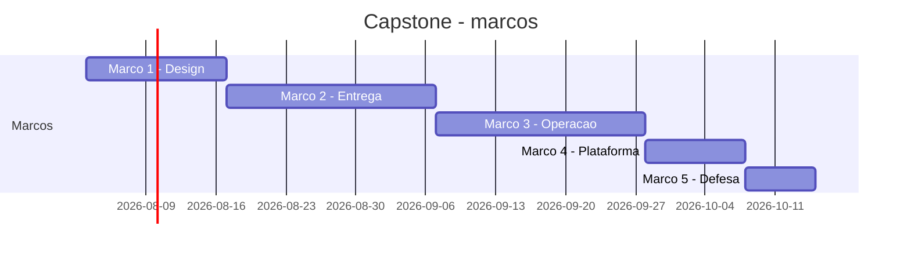

# Marcos do Capstone — roteiro de 5 partes

> Diferente dos outros módulos, aqui os "exercícios progressivos" **são** o próprio capstone, divididos em 5 marcos avaliáveis. Cada marco fecha uma fase + parte da banca.

---

## Visão geral

| Parte | Marco | Ligação com fases | Tag git sugerida |
|-------|-------|--------------------|-------------------|
| **1** | Design e fundação | Fase 1 completa | `v0.1.0-design-ready` |
| **2** | Sistema entregando em staging | Fase 2 completa | `v0.2.0-delivery-ready` |
| **3** | Sistema observável e resiliente | Fase 3 completa | `v0.3.0-operable` |
| **4** | Plataforma e métricas | Fase 4 parcial (plataforma, DORA, NPS) | `v0.4.0-platform-ready` |
| **5** | Defesa com incidente ao vivo | Fase 4 final (banca) | `v1.0.0-capstone-defended` |

---

## Regra de entrega por marco

Cada marco é um **PR grande único** (ou uma série de PRs rotulados `milestone-N`) acompanhado de:

1. **Tag git** marcando o ponto de maturidade.
2. **Entrada em `docs/CHANGELOG.md`** descrevendo o que mudou (use Conventional Commits ou *Keep a Changelog*).
3. **Retrospectiva de 1 página** em `docs/retro/marcoN.md`: o que aprendeu, o que lhe surpreendeu, o que mudaria.
4. **Screenshot ou curta gravação** (< 60s) evidenciando o marco (dashboard, rollout, cenário de chaos).

A **retrospectiva** não é opcional. É o que transforma fazer em aprender.

---

## Autoavaliação por marco

Rode o script:

```bash
python ../scripts/capstone_checklist.py .
```

Ele valida, com base em presença de arquivos e diretórios, o que foi entregue até aquele marco. Interpretar como guia — não é a avaliação final (essa vem da banca humana).

---

## Cronograma recomendado (12 semanas)



---

## Princípio condutor

> **"Se você não pode demonstrar, você não completou."**

Cada marco é completo quando você consegue, ao vivo, mostrar os artefatos rodando. Apresentação polida sem sistema funcionando reprova. Sistema funcionando sem apresentação coerente reprova parcialmente.

Os dois juntos, com honestidade sobre limites e clareza de próximos passos, é o que define **um capstone bem entregue**.

---

<!-- nav:start -->

| &nbsp; | &nbsp; | &nbsp; |
|:--|:--:|--:|
| **← Anterior**<br>[Fase 4 — Armadilhas, dicas e orientações de banca](../bloco-4/04-armadilhas-e-dicas.md) | **↑ Índice**<br>[Módulo 12 — Capstone integrador](../README.md) | **Próximo →**<br>[Marco 1 — Design e fundação](parte-1-design-fundacao.md) |

<!-- nav:end -->
