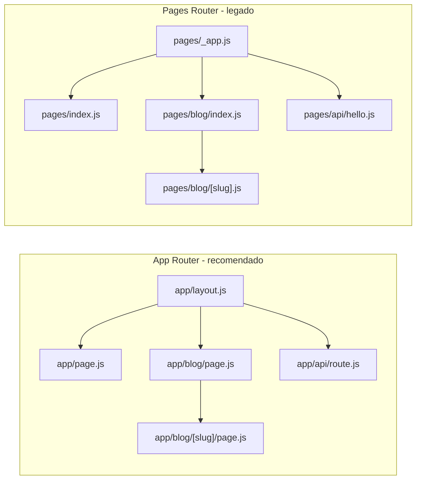
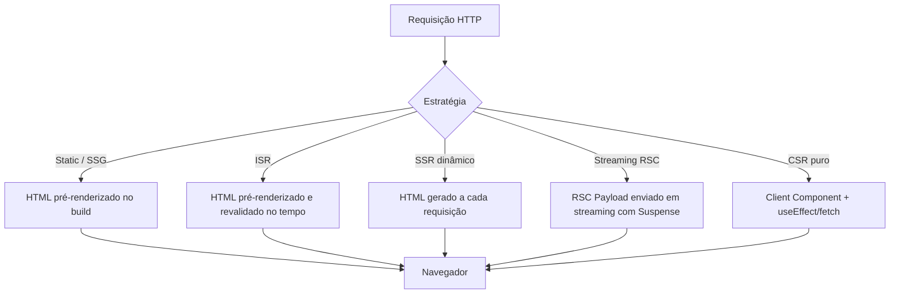
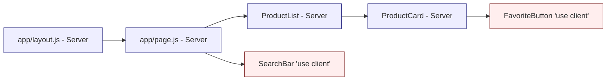

## Introdução ao Next.js 16

> **Versão de referência deste material: `next@16.2.4`** (publicada em 2025/2026). Este tutorial fixa a versão do Next.js em todos os comandos `npm` para garantir que os exemplos não quebrem quando novas versões forem lançadas.

**Next.js** é um framework React full-stack mantido pela **Vercel**. Ele automatiza a configuração de ferramentas de baixo nível (bundler, compilador, roteamento, cache, otimização de imagens, fontes, metadata, etc.) para que você possa focar no produto. A partir da versão 13, o Next.js passou a oferecer o **App Router**, baseado em **React Server Components (RSC)**, que se tornou a abordagem recomendada — e continua evoluindo nas versões 14, 15 e 16.

### O que há de novo no Next.js 16

As mudanças mais importantes em relação às aulas anteriores:

| Novidade                       | Descrição                                                                                                                     |
| ------------------------------ | ----------------------------------------------------------------------------------------------------------------------------- |
| **App Router é o padrão**      | Pastas dentro de `app/` definem rotas. O `pages/` ainda existe como **Pages Router** (legado), mas não é recomendado para projetos novos. |
| **Turbopack padrão**           | O `next dev` e o `next build` usam Turbopack por padrão. Use `--webpack` somente se precisar do bundler antigo.                |
| **React 19 nativo**            | O App Router usa React 19 (canary) embutido. No `package.json` aparecem `react@19.2.x` e `react-dom@19.2.x`.                  |
| **Proxy (ex-Middleware)**      | O arquivo `middleware.ts` foi renomeado para `proxy.ts`. A API continua equivalente (`NextResponse`, `NextRequest`).           |
| **Dynamic APIs assíncronas**   | `cookies()`, `headers()`, `params` e `searchParams` são **Promises** e precisam de `await`.                                   |
| **React Compiler habilitado**  | O `next.config.mjs` já vem com `reactCompiler: true`. Memoização automática, sem `useMemo`/`useCallback` manuais em muitos casos. |
| **`next build` sem lint**      | A partir do 16, `next build` não executa mais o linter. Rode `eslint` (ou `biome`) em script separado.                         |
| **Node.js >= 20.9**            | Requisito mínimo. macOS, Linux e Windows (incluindo WSL).                                                                     |
| **AGENTS.md no template**      | O `create-next-app` gera um `AGENTS.md` com dicas para assistentes de código.                                                 |

### Motivação para usar Next.js

Embora o React seja excelente para UIs dinâmicas, sozinho ele não resolve:

- **Renderização inicial rápida** (performance em redes móveis).
- **SEO** — HTML pronto para crawlers.
- **Roteamento** — o React não tem roteador nativo.
- **Streaming e Suspense no servidor** — orquestrar o RSC Payload.
- **Cache e revalidação de dados** — com granularidade por rota, função ou tag.
- **Otimização automática** de imagens, fontes, scripts e pacotes.

O Next.js entrega tudo isso e mantém a flexibilidade do React.

### Os dois routers: App Router vs. Pages Router



| Característica         | App Router (`app/`)                                 | Pages Router (`pages/`)                     |
| ---------------------- | --------------------------------------------------- | ------------------------------------------- |
| Versão do React        | Canary (React 19 + features novas)                  | Versão do seu `package.json`                |
| Server Components      | ✅ Padrão                                           | ❌                                          |
| Server Actions         | ✅ (`'use server'`)                                 | ❌                                          |
| Streaming / Suspense   | ✅ Nativo                                           | ⚠️ Limitado                                  |
| Data fetching          | `fetch` no próprio componente + `cache`/`use cache` | `getStaticProps` / `getServerSideProps`     |
| Rotas de API           | `app/.../route.js`                                  | `pages/api/*.js`                            |
| Arquivo de middleware  | `proxy.ts`                                          | `proxy.ts` (Next 16) ou `middleware.ts` ant.|
| Recomendado para novos projetos | **Sim**                                    | Somente para manutenção de código legado    |

Este material usa **App Router** em todos os exemplos.

### Estratégias de renderização



- **SSG (Static Site Generation)**: HTML gerado no `next build`. Ideal para conteúdo que muda raramente (páginas institucionais, documentação).
- **ISR (Incremental Static Regeneration)**: SSG + revalidação periódica (`export const revalidate = 60`).
- **SSR dinâmico**: gerado a cada request (quando você lê `cookies()`, `headers()` ou `searchParams`).
- **Streaming com RSC**: o servidor envia partes da UI assim que ficam prontas, usando `<Suspense>` e o RSC Payload.
- **CSR (Client-Side Rendering)**: componentes com `'use client'` hidratam no navegador; útil para interatividade.

No Next.js 16, a estratégia é decidida por rota, de forma automática, a partir das APIs que você usa. Você pode forçar o comportamento com configurações por segmento (`export const dynamic = 'force-dynamic'`, `export const revalidate = 3600`, etc.).

### Server Components vs. Client Components

Esta é provavelmente a decisão mais importante (e mais nova) que você toma ao escrever um componente no App Router. Antes de ver a sintaxe, vale entender **por que esses dois conceitos existem** e **que problemas eles resolvem** — só assim a escolha entre um e outro deixa de ser arbitrária.

#### O contexto histórico: que problema os RSC resolvem?

Antes do React Server Components (RSC), havia basicamente dois modelos para entregar uma UI React:

1. **SPA puro (CSR — Client-Side Rendering)**: o servidor envia um HTML quase vazio e um bundle JavaScript. O navegador baixa o JS, executa o React, faz `fetch` para buscar os dados e só então renderiza a UI.
   - Tela em branco até o JS carregar — ruim em redes lentas.
   - SEO fraco — crawlers veem HTML vazio.
   - Tudo o que o componente usa (lodash, date-fns, SDK de banco) acaba indo para o navegador.

2. **SSR clássico (Pages Router, `getServerSideProps`)**: o servidor renderiza o HTML completo, manda para o cliente, e o React **hidrata** a página inteira no navegador.
   - HTML inicial pronto, bom para SEO.
   - Mas o **mesmo** componente precisa rodar no servidor **e** no cliente — então o JS dele continua sendo enviado.
   - O bundle continua grande, e toda a árvore precisa ser hidratada de uma vez.
   - Difícil separar "o que precisa de interatividade" de "o que é só conteúdo".

Os **React Server Components**, introduzidos no React 18 e adotados como padrão pelo App Router, quebram essa dicotomia: passam a existir **dois tipos diferentes de componentes**, com responsabilidades distintas, que podem coexistir na **mesma árvore de renderização**.

#### Server Components (padrão no App Router)

São componentes que **rodam exclusivamente no servidor**, durante a renderização da requisição (ou no `next build`, dependendo da estratégia).

```jsx
// app/products/page.js — Server Component (sem 'use client')
import { db } from '@/lib/db';

export default async function ProductsPage() {
  const products = await db.product.findMany();
  return <ProductList products={products} />;
}
```

**O que eles permitem:**

- Funções `async`/`await` direto no corpo do componente.
- Acesso a banco de dados, filesystem, variáveis de ambiente privadas e SDKs de servidor (`stripe`, `@aws-sdk/*`, drivers SQL, etc.).
- Renderização de HTML no servidor com **streaming** via `<Suspense>`.

**Vantagens (problemas que resolvem):**

- **Zero JavaScript no cliente** — a lógica e as dependências do componente ficam só no servidor. Bibliotecas pesadas (`marked`, `prismjs`, `mongodb`) não vão para o bundle.
- **Segurança por padrão** — chaves de API, tokens e queries SQL nunca vazam para o navegador.
- **Latência baixa para dados** — o componente está "ao lado" do banco, sem round-trip pelo cliente.
- **SEO completo** — o HTML é entregue pronto, com streaming progressivo.

**Limitações:**

- Não pode usar `useState`, `useEffect`, `useRef` ou qualquer hook que dependa de estado entre renders.
- Não pode registrar event handlers (`onClick`, `onChange`, `onSubmit`) — eles não existem no servidor.
- Não acessa `window`, `document`, `localStorage`, geolocalização, etc.
- Só re-renderiza em nova requisição/navegação ou em `revalidatePath`/`revalidateTag` — **não** a cada interação do usuário.

#### Client Components (`'use client'`)

São os componentes "tradicionais" do React — os mesmos que você já conhece de SPAs. No App Router eles precisam ser **explicitamente declarados** com a diretiva `'use client'` no topo do arquivo.

```jsx
// app/_components/SearchBar.js
'use client';
import { useState } from 'react';

export default function SearchBar({ onSearch }) {
  const [q, setQ] = useState('');
  return (
    <input
      value={q}
      onChange={(e) => setQ(e.target.value)}
      onKeyDown={(e) => e.key === 'Enter' && onSearch(q)}
    />
  );
}
```

**O que eles permitem:**

- Hooks de estado e ciclo de vida (`useState`, `useEffect`, `useReducer`, `useContext`, `useRef`, …).
- Event handlers (`onClick`, `onChange`, `onSubmit`).
- APIs do navegador (`window`, `document`, `localStorage`, `IntersectionObserver`, Web APIs em geral).
- Bibliotecas que dependem do DOM — gráficos (Chart.js), mapas (Leaflet), editores de texto, drag-and-drop.

**Vantagens (problemas que resolvem):**

- Interatividade rica e imediata, sem ida ao servidor para cada clique.
- Re-render local no navegador conforme o estado muda.
- Compatibilidade total com o ecossistema React clássico.

**Limitações:**

- **Aumentam o bundle** — o componente e suas dependências são enviadas ao cliente.
- **Não podem ser `async`** — não dá para usar `await` no corpo da função.
- Não acessam segredos nem o banco diretamente — precisam buscar dados via `fetch` em uma rota pública ou via `Server Action`.
- Têm custo de **hidratação**: o React precisa "anexar" os event handlers no DOM já entregue pelo servidor.

#### Como decidir entre um e outro?

A regra de ouro do App Router é: **comece como Server Component e só promova para Client quando precisar de algo que o servidor não consegue fazer**. As perguntas-guia:

| Pergunta                                                                | Resposta "sim" indica → |
| ----------------------------------------------------------------------- | ----------------------- |
| Precisa de `useState`, `useEffect` ou outro hook do React?              | Client                  |
| Tem `onClick`, `onChange`, `onSubmit` ou outro event handler?           | Client                  |
| Acessa `window`, `document`, `localStorage`, `navigator`?               | Client                  |
| Usa biblioteca que depende do DOM (Chart.js, Leaflet, Quill, …)?        | Client                  |
| Apenas exibe dados vindos de banco/API, sem interação interna?          | Server                  |
| Precisa de `await` para buscar dados?                                   | Server                  |
| Usa segredos (API keys, tokens, conexão de banco)?                      | Server                  |

#### O padrão "ilhas de interatividade"

Aplicando essa regra, a árvore típica de uma página App Router é majoritariamente **Server**, com pequenas **ilhas Client** onde há interação:



Quanto **menores** e **mais localizadas** as ilhas client, **menor** o bundle JS e melhor a performance percebida.

#### Regras de fronteira (Server ↔ Client)

1. Tudo dentro de `app/` começa como **Server Component**. A diretiva `'use client'` cria uma **fronteira**: o arquivo marcado **e tudo o que ele importa** vai para o bundle do cliente.
2. Coloque `'use client'` no **menor componente interativo** possível — não marque a página inteira só porque um botão precisa de `onClick`.
3. **Server pode importar Client** livremente — o Next.js cuida da serialização das props.
4. **Client não pode importar Server diretamente**, mas **pode receber Server Components como `children` ou prop**. Esse é o padrão para "embrulhar" conteúdo server dentro de um wrapper client (ex.: `<ThemeProvider>{children}</ThemeProvider>` no `layout.js`).
5. As props que cruzam a fronteira Server → Client devem ser **serializáveis**: strings, números, booleanos, `null`, arrays e objetos planos. Funções, instâncias de classe, `Map` e `Set` não passam (`Date` vira string).
6. Para estado global via Context, crie um Provider Client e renderize-o no `app/layout.js`; o `children` continua sendo Server.

> O detalhamento de sintaxe, Server Actions, Context API e exemplos completos está em `2.componentes.md`. Aqui o objetivo foi dar a base conceitual para você decidir, em cada novo arquivo, se ele deve ser Server ou Client.

### Requisitos de ambiente

- **Node.js** `>= 20.9.0` — confira com `node -v`.
- **npm** `>= 10` (ou `pnpm`, `yarn`, `bun`).
- Navegadores suportados sem polyfills: Chrome 111+, Edge 111+, Firefox 111+, Safari 16.4+.

### Estrutura de um projeto App Router

```
my-next-app/
├── app/                     # Rotas, layouts e UI (App Router)
│   ├── layout.js            # Root layout (obrigatório; contém <html> e <body>)
│   ├── page.js              # Rota "/"
│   ├── globals.css          # CSS global
│   ├── favicon.ico
│   ├── loading.js           # UI de loading (opcional, por rota)
│   ├── error.js             # Error boundary (opcional, por rota)
│   ├── not-found.js         # UI 404 (opcional, por rota)
│   ├── blog/
│   │   ├── page.js          # Rota "/blog"
│   │   └── [slug]/
│   │       └── page.js      # Rota "/blog/:slug" (dinâmica)
│   └── api/
│       └── hello/
│           └── route.js     # API "/api/hello"
├── public/                  # Assets estáticos servidos em "/"
├── proxy.js                 # Ex-middleware (Next 16+)
├── next.config.mjs          # Configuração do Next
├── jsconfig.json            # Aliases "@/*"
├── package.json
└── AGENTS.md                # Dicas para LLMs/agentes
```

> **Observação**: o `pages/` **não é usado** em projetos novos criados com o `create-next-app`. Ele só aparece se você optar pelo Pages Router.

### Tutorial: criando seu primeiro projeto com `next@16.2.4`

Todos os comandos abaixo fixam a versão para garantir reprodutibilidade.

#### 1. Criar o projeto

```bash
npx create-next-app@16.2.4 my-next-app \
  --javascript \
  --no-tailwind \
  --no-eslint \
  --no-src-dir \
  --app \
  --turbopack \
  --import-alias "@/*" \
  --use-npm
```

Flags explicadas:

- `@16.2.4`: fixa a versão do template.
- `--javascript`: sem TypeScript (nesta introdução).
- `--no-tailwind`: Tailwind será tratado no material dedicado a estilização.
- `--no-eslint`: ESLint é opcional (veremos no material de estilização).
- `--no-src-dir`: código na raiz (sem pasta `src/`).
- `--app`: usa **App Router**.
- `--turbopack`: usa Turbopack para `next dev`.
- `--import-alias "@/*"`: aliases absolutos.
- `--use-npm`: força o uso do npm.

Você pode alternativamente rodar `npx create-next-app@16.2.4 my-next-app` e responder `Yes, use recommended defaults` para obter os mesmos resultados com TypeScript, Tailwind e ESLint.

#### 2. Instalar dependências e iniciar o dev server

```bash
cd my-next-app
npm install
npm run dev
```

O terminal mostrará `Local: http://localhost:3000`. Abra no navegador.

Scripts gerados no `package.json`:

```json
{
  "scripts": {
    "dev": "next dev",
    "build": "next build",
    "start": "next start"
  }
}
```

> **Good to know**: a partir do 16, `next build` **não roda mais** o linter. Adicione um script `"lint": "eslint"` se instalar o ESLint (veja `7.estilizacao.md`).

#### 3. Conferir o `package.json` esperado

Ao criar com `create-next-app@16.2.4`, o `package.json` sai com:

```json
{
  "name": "my-next-app",
  "version": "0.1.0",
  "private": true,
  "scripts": {
    "dev": "next dev",
    "build": "next build",
    "start": "next start"
  },
  "dependencies": {
    "next": "16.2.4",
    "react": "19.2.4",
    "react-dom": "19.2.4"
  },
  "devDependencies": {
    "babel-plugin-react-compiler": "1.0.0"
  }
}
```

#### 4. Editar o root layout

Abra `app/layout.js` e substitua por uma versão mínima (o template gerado inclui fontes Geist — mantenha se preferir):

```jsx
// app/layout.js
import './globals.css';

export const metadata = {
  title: 'Meu app Next.js',
  description: 'Projeto introdutório com Next.js 16',
};

export default function RootLayout({ children }) {
  return (
    <html lang="pt-BR">
      <body>{children}</body>
    </html>
  );
}
```

#### 5. Editar a página inicial

```jsx
// app/page.js
export default function Home() {
  return (
    <main style={{ padding: 24 }}>
      <h1>Bem-vindo ao meu site Next.js!</h1>
      <p>Este é um Server Component renderizado no servidor.</p>
    </main>
  );
}
```

#### 6. Criar uma nova rota `/about`

No App Router, cada rota é uma **pasta** com um arquivo `page.js` dentro:

```bash
mkdir -p app/about
```

```jsx
// app/about/page.js
export default function AboutPage() {
  return (
    <main style={{ padding: 24 }}>
      <h1>Sobre nós</h1>
      <p>Página /about servida pelo App Router.</p>
    </main>
  );
}
```

Acesse `http://localhost:3000/about`.

#### 7. Criar um componente reutilizável

Componentes ficam em qualquer lugar — convenção comum é `app/components/` ou `components/` na raiz. Crie:

```bash
mkdir -p app/components
```

```jsx
// app/components/Header.js
export default function Header({ title }) {
  return (
    <header style={{ padding: 16, background: '#111', color: '#fff' }}>
      <h1>{title}</h1>
    </header>
  );
}
```

E use em `app/page.js`:

```jsx
// app/page.js
import Header from './components/Header';

export default function Home() {
  return (
    <>
      <Header title="Bem-vindo ao meu site!" />
      <main style={{ padding: 24 }}>
        <p>Conteúdo da home.</p>
      </main>
    </>
  );
}
```

#### 8. Navegar entre páginas com `<Link>`

```jsx
// app/page.js
import Link from 'next/link';
import Header from './components/Header';

export default function Home() {
  return (
    <>
      <Header title="Bem-vindo!" />
      <main style={{ padding: 24 }}>
        <p>Conteúdo da home.</p>
        <Link href="/about">Ir para Sobre</Link>
      </main>
    </>
  );
}
```

O `<Link>` faz **client-side transition** com prefetch automático.

### Vantagens do Next.js

- **Desempenho**: RSC reduz o JS enviado ao cliente; Turbopack acelera dev/build.
- **SEO**: HTML pronto via streaming; suporte a metadata, OG images e sitemap por arquivo.
- **DX**: roteamento por arquivo, hot reload, TypeScript nativo, React Compiler.
- **Escalabilidade**: edge runtime, cache granular, revalidação sob demanda.
- **Ecossistema**: integração com Vercel, adapters para outros hosts, e grande comunidade.

### Desvantagens

- **Curva de aprendizado**: Server vs. Client Components, Server Actions, cache — são muitos conceitos novos.
- **Breaking changes frequentes**: a cada major (14, 15, 16) há migrações via codemods.
- **Overhead para projetos simples**: um site de uma página pode não se beneficiar de toda a stack.

### Conclusão

O Next.js 16.2.4 consolida o **App Router** como padrão, entrega **Turbopack** estável e adota **React 19** embutido. Nos próximos materiais vamos explorar:

- `2.componentes.md` — Server Components, Client Components, `'use client'`, Context API.
- `3.rotas.md` — `page.js`, `layout.js`, rotas dinâmicas com `await params`, `<Link>` e `useRouter`.
- `4.crud.md` — CRUD integrado a uma API externa (crudcrud), usando Client Components e Server Actions.
- `5.autenticacao_autorizacao.md` — login com JWT, `proxy.js` e cookies `HttpOnly` assíncronos.
- `6.ecommerce.md` — uma home de e-commerce completa com `next/image` e `next/font`.
- `7.estilizacao.md` — Tailwind CSS v4, Bootstrap e boas práticas de CSS no App Router.
