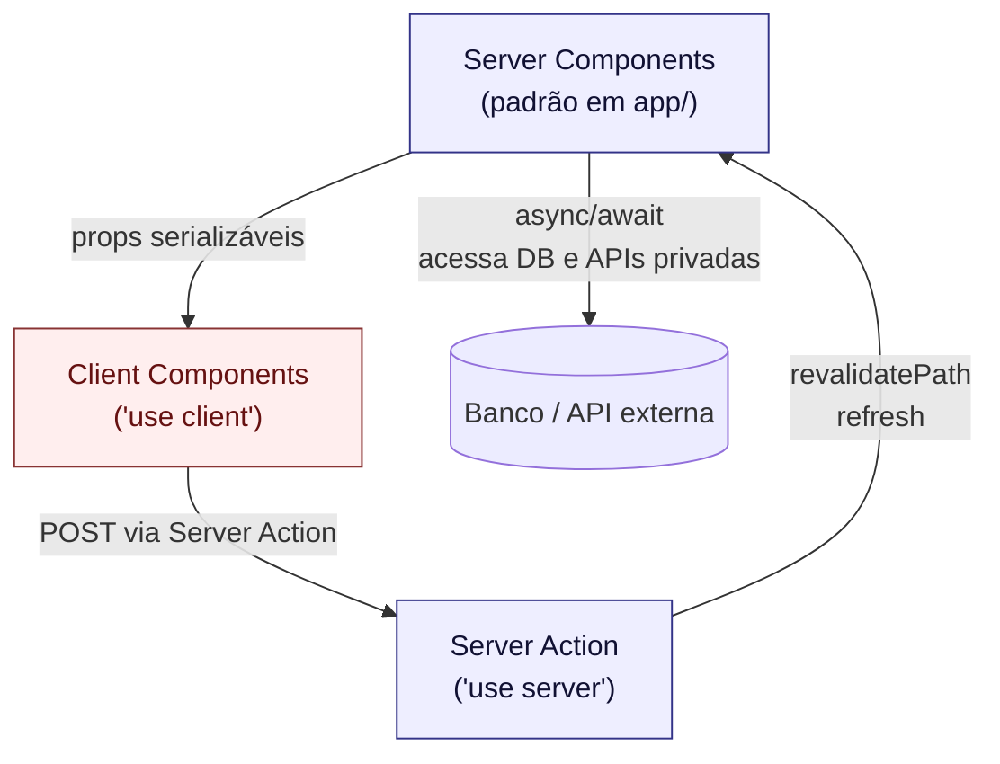
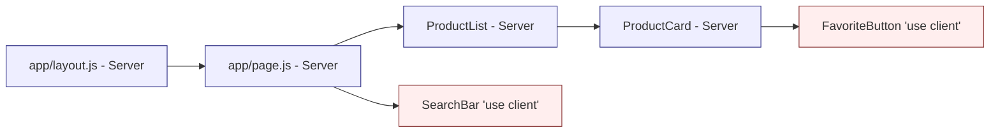
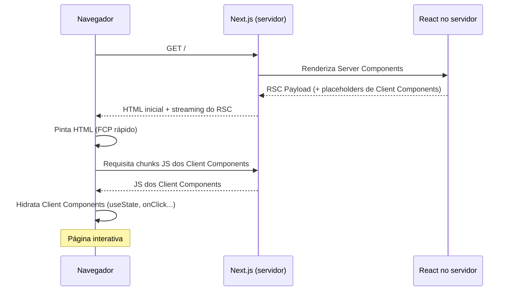

## Criando componentes com Next.js 16 (App Router)

> **Versão de referência: `next@16.2.4`, `react@19.2.4`.**

Este material tem duas partes. Primeiro (seções conceituais) explicamos **por que** existem dois tipos de componentes no App Router, seus trade-offs e como decidir entre um e outro. Depois, nas seções numeradas, partimos para **exemplos práticos** — Server Components assíncronos, `useState`, `useEffect`, Context API e Server Actions.

### Por que dois tipos de componentes?

Antes do React Server Components (RSC), havia basicamente dois modelos para entregar uma UI React:

1. **SPA puro (CSR — Client-Side Rendering)**: o servidor envia um HTML quase vazio e um bundle JavaScript. O navegador baixa o JS, executa o React, faz `fetch` para buscar os dados e só então renderiza a UI.
   - Tela em branco até o JS carregar — ruim em redes lentas.
   - SEO fraco — crawlers veem HTML vazio.
   - Tudo o que o componente usa (lodash, date-fns, SDK de banco) acaba indo para o navegador.

2. **SSR clássico (Pages Router, `getServerSideProps`)**: o servidor renderiza o HTML completo, manda para o cliente, e o React **hidrata** a página inteira no navegador.
   - HTML inicial pronto, bom para SEO.
   - Mas o **mesmo** componente precisa rodar no servidor **e** no cliente — então o JS dele continua sendo enviado.
   - O bundle continua grande, e toda a árvore precisa ser hidratada de uma vez.
   - Difícil separar "o que precisa de interatividade" de "o que é só conteúdo".

Os **React Server Components**, introduzidos no React 18 e adotados como padrão pelo App Router, quebram essa dicotomia: passam a existir **dois tipos diferentes de componentes**, com responsabilidades distintas, que convivem na **mesma árvore de renderização**.



### Server Components (padrão no App Router)

São componentes que **rodam exclusivamente no servidor**, durante a renderização da requisição (ou no `next build`, dependendo da estratégia).

```jsx
// app/products/page.js — Server Component (sem 'use client')
import { db } from '@/lib/db';

export default async function ProductsPage() {
  const products = await db.product.findMany();
  return <ProductList products={products} />;
}
```

**O que eles permitem:**

- Funções `async`/`await` direto no corpo do componente.
- Acesso a banco de dados, filesystem, variáveis de ambiente privadas e SDKs de servidor (`stripe`, `@aws-sdk/*`, drivers SQL, etc.).
- Renderização de HTML no servidor com **streaming** via `<Suspense>`.

**Vantagens (problemas que resolvem):**

- **Zero JavaScript no cliente** — a lógica e as dependências do componente ficam só no servidor. Bibliotecas pesadas (`marked`, `prismjs`, `mongodb`) não vão para o bundle.
- **Segurança por padrão** — chaves de API, tokens e queries SQL nunca vazam para o navegador.
- **Latência baixa para dados** — o componente está "ao lado" do banco, sem round-trip pelo cliente.
- **SEO completo** — o HTML é entregue pronto, com streaming progressivo.

**Limitações:**

- Não pode usar `useState`, `useEffect`, `useRef` ou qualquer hook que dependa de estado entre renders.
- Não pode registrar event handlers (`onClick`, `onChange`, `onSubmit`) — eles não existem no servidor.
- Não acessa `window`, `document`, `localStorage`, geolocalização, etc.
- Só re-renderiza em nova requisição/navegação ou em `revalidatePath`/`revalidateTag` — **não** a cada interação do usuário.

### Client Components (`'use client'`)

São os componentes "tradicionais" do React — os mesmos que você já conhece de SPAs. No App Router eles precisam ser **explicitamente declarados** com a diretiva `'use client'` no topo do arquivo.

```jsx
// app/_components/SearchBar.js
'use client';
import { useState } from 'react';

export default function SearchBar({ onSearch }) {
  const [q, setQ] = useState('');
  return (
    <input
      value={q}
      onChange={(e) => setQ(e.target.value)}
      onKeyDown={(e) => e.key === 'Enter' && onSearch(q)}
    />
  );
}
```

**O que eles permitem:**

- Hooks de estado e ciclo de vida (`useState`, `useEffect`, `useReducer`, `useContext`, `useRef`, …).
- Event handlers (`onClick`, `onChange`, `onSubmit`).
- APIs do navegador (`window`, `document`, `localStorage`, `IntersectionObserver`, Web APIs em geral).
- Bibliotecas que dependem do DOM — gráficos (Chart.js), mapas (Leaflet), editores de texto, drag-and-drop.

**Vantagens (problemas que resolvem):**

- Interatividade rica e imediata, sem ida ao servidor para cada clique.
- Re-render local no navegador conforme o estado muda.
- Compatibilidade total com o ecossistema React clássico.

**Limitações:**

- **Aumentam o bundle** — o componente e suas dependências são enviadas ao cliente.
- **Não podem ser `async`** — não dá para usar `await` no corpo da função.
- Não acessam segredos nem o banco diretamente — precisam buscar dados via `fetch` em uma rota pública ou via `Server Action`.
- Têm custo de **hidratação**: o React precisa "anexar" os event handlers no DOM já entregue pelo servidor.

### Como decidir entre um e outro?

A regra de ouro do App Router é: **comece como Server Component e só promova para Client quando precisar de algo que o servidor não consegue fazer**. As perguntas-guia:

| Pergunta                                                                | Resposta "sim" indica → |
| ----------------------------------------------------------------------- | ----------------------- |
| Precisa de `useState`, `useEffect` ou outro hook do React?              | Client                  |
| Tem `onClick`, `onChange`, `onSubmit` ou outro event handler?           | Client                  |
| Acessa `window`, `document`, `localStorage`, `navigator`?               | Client                  |
| Usa biblioteca que depende do DOM (Chart.js, Leaflet, Quill, …)?        | Client                  |
| Apenas exibe dados vindos de banco/API, sem interação interna?          | Server                  |
| Precisa de `await` para buscar dados?                                   | Server                  |
| Usa segredos (API keys, tokens, conexão de banco)?                      | Server                  |

### O padrão "ilhas de interatividade"

Aplicando essa regra, a árvore típica de uma página App Router é majoritariamente **Server**, com pequenas **ilhas Client** onde há interação:



Quanto **menores** e **mais localizadas** as ilhas client, **menor** o bundle JS e melhor a performance percebida.

### Regras de fronteira (Server ↔ Client)

1. Tudo dentro de `app/` começa como **Server Component**. `page.js`, `layout.js`, `not-found.js`, `error.js`, `loading.js` são Server por padrão — não coloque `'use client'` neles se não precisar.
2. A diretiva `'use client'` cria uma **fronteira**: o arquivo marcado **e tudo o que ele importa** vai para o bundle do cliente. Marque o **menor componente interativo possível**.
3. **Server pode importar Client** livremente — o Next.js cuida da serialização das props.
4. **Client não pode importar Server diretamente**, mas **pode receber Server Components como `children` ou prop**. Esse é o padrão para "embrulhar" conteúdo server dentro de um wrapper client (ex.: `<ThemeProvider>{children}</ThemeProvider>` no `layout.js`).
5. As props que cruzam a fronteira Server → Client devem ser **serializáveis**: strings, números, booleanos, `null`, arrays e objetos planos. Funções, instâncias de classe, `Map` e `Set` não passam (`Date` vira string).
6. Para fazer mutações, prefira **Server Actions** (seção 6 adiante) em vez de `useEffect + fetch`.

A seguir, vamos colocar essas regras em prática com exemplos incrementais.

### 1. Componente Simples (Server Component)

No App Router você pode colocar componentes reutilizáveis em qualquer lugar. Convenções comuns:

- `app/_components/` — privado ao App Router (o `_` impede routing).
- `components/` na raiz — compartilhado entre App Router e outros usos.

Vamos usar `app/_components/`.

```bash
mkdir -p app/_components
```

```jsx
// app/_components/Header.js
export default function Header({ title = 'Meu site' }) {
  return (
    <header style={{ padding: 16, background: '#111', color: '#fff' }}>
      <h1>{title}</h1>
    </header>
  );
}
```

Uso em uma página:

```jsx
// app/page.js
import Header from './_components/Header';

export default function Home() {
  return (
    <>
      <Header title="Bem-vindo ao meu site Next.js!" />
      <main style={{ padding: 24 }}>Conteúdo da página inicial.</main>
    </>
  );
}
```

> Este `Header` **não envia nenhum JavaScript para o cliente** — ele é renderizado no servidor e o HTML resultante vai junto com a página.

### 2. Server Component assíncrono (data fetching no servidor)

Uma das grandes vantagens do App Router é permitir `async` diretamente na função do componente.

```jsx
// app/_components/PostList.js
export default async function PostList() {
  const res = await fetch('https://jsonplaceholder.typicode.com/posts?_limit=5', {
    // Cache Components: no Next 16, fetch NÃO é cacheado por padrão.
    // Use 'force-cache' ou next.revalidate para habilitar.
    next: { revalidate: 60 }, // ISR: revalida a cada 60s
  });
  const posts = await res.json();

  return (
    <ul>
      {posts.map((p) => (
        <li key={p.id}>
          <strong>{p.title}</strong>
        </li>
      ))}
    </ul>
  );
}
```

Uso na página (também Server Component):

```jsx
// app/page.js
import Header from './_components/Header';
import PostList from './_components/PostList';

export default function Home() {
  return (
    <>
      <Header title="Posts" />
      <main style={{ padding: 24 }}>
        <PostList />
      </main>
    </>
  );
}
```

- **Zero JS enviado ao cliente** para buscar e renderizar a lista.
- **Streaming**: envolva em `<Suspense fallback={<p>Carregando...</p>}><PostList /></Suspense>` ou crie um `app/loading.js` para UI de carregamento automática.

### 3. Client Component com estado (`useState`)

Sempre que precisar de **estado**, **eventos** ou **hooks do React** (`useState`, `useEffect`, `useContext`, hooks customizados), use `'use client'`.

```jsx
// app/_components/Counter.js
'use client';

import { useState } from 'react';

export default function Counter() {
  const [count, setCount] = useState(0);

  return (
    <div>
      <p>Contagem: {count}</p>
      <button onClick={() => setCount(count + 1)}>Incrementar</button>
      <button onClick={() => setCount(count - 1)}>Decrementar</button>
    </div>
  );
}
```

Uso dentro de um Server Component (composição Server → Client):

```jsx
// app/page.js
import Header from './_components/Header';
import Counter from './_components/Counter';

export default function Home() {
  return (
    <>
      <Header title="Contador" />
      <main style={{ padding: 24 }}>
        <Counter />
      </main>
    </>
  );
}
```

> **Importante**: `page.js` e `Header` continuam sendo Server Components. Apenas `Counter.js` vai para o bundle do cliente, porque tem `'use client'`.

### 4. Client Component com efeito colateral (HTTP)

Quando a busca depende de estado do cliente (por exemplo, filtro digitado), use `useEffect`. Se os dados vêm de uma API pública no carregamento inicial, prefira um **Server Component assíncrono** (seção 2) — é mais rápido e não envia JS.

```jsx
// app/_components/ClientItemList.js
'use client';

import { useEffect, useState } from 'react';

export default function ClientItemList() {
  const [items, setItems] = useState([]);
  const [loading, setLoading] = useState(true);
  const [error, setError] = useState(null);

  useEffect(() => {
    const controller = new AbortController();

    async function fetchItems() {
      try {
        const res = await fetch(
          'https://jsonplaceholder.typicode.com/todos?_limit=5',
          { signal: controller.signal }
        );
        if (!res.ok) throw new Error(`HTTP ${res.status}`);
        const data = await res.json();
        setItems(data);
      } catch (err) {
        if (err.name !== 'AbortError') setError(err.message);
      } finally {
        setLoading(false);
      }
    }

    fetchItems();
    return () => controller.abort();
  }, []);

  if (loading) return <p>Carregando...</p>;
  if (error) return <p style={{ color: 'red' }}>Erro: {error}</p>;

  return (
    <ul>
      {items.map((item) => (
        <li key={item.id}>{item.title}</li>
      ))}
    </ul>
  );
}
```

### 5. Context API em Server Components (padrão Provider)

React context **não funciona diretamente em Server Components**. A prática recomendada é criar um **Provider como Client Component** e renderizá-lo no `layout.js` raiz (que continua Server Component).

```jsx
// app/_components/ThemeContext.js
'use client';

import { createContext, useContext, useState } from 'react';

const ThemeContext = createContext(null);

export function ThemeProvider({ children }) {
  const [theme, setTheme] = useState('light');
  const toggleTheme = () =>
    setTheme((t) => (t === 'light' ? 'dark' : 'light'));

  return (
    <ThemeContext.Provider value={{ theme, toggleTheme }}>
      {children}
    </ThemeContext.Provider>
  );
}

export function useTheme() {
  const ctx = useContext(ThemeContext);
  if (!ctx) throw new Error('useTheme deve ser usado dentro de ThemeProvider');
  return ctx;
}
```

Consumidor (Client Component):

```jsx
// app/_components/ThemeToggler.js
'use client';

import { useTheme } from './ThemeContext';

export default function ThemeToggler() {
  const { theme, toggleTheme } = useTheme();

  return (
    <div>
      <p>Tema atual: {theme}</p>
      <button onClick={toggleTheme}>Trocar tema</button>
    </div>
  );
}
```

Root layout renderizando o Provider:

```jsx
// app/layout.js
import './globals.css';
import { ThemeProvider } from './_components/ThemeContext';

export const metadata = {
  title: 'Demo Context',
};

export default function RootLayout({ children }) {
  return (
    <html lang="pt-BR">
      <body>
        <ThemeProvider>{children}</ThemeProvider>
      </body>
    </html>
  );
}
```

Usando na página:

```jsx
// app/page.js
import ThemeToggler from './_components/ThemeToggler';

export default function Home() {
  return (
    <main style={{ padding: 24 }}>
      <h1>Tema global via Context</h1>
      <ThemeToggler />
    </main>
  );
}
```

> Dica: posicione o `ThemeProvider` o mais **fundo possível** na árvore. Se apenas `/app/settings/*` precisa do tema, coloque-o no `app/settings/layout.js`, não no layout raiz.

### 6. Server Actions: mutando dados sem API route

No Next 16, o jeito idiomático de enviar dados ao servidor é via **Server Actions** — funções assíncronas marcadas com `'use server'`. Você não precisa de `fetch` manual.

Arquivo de ações:

```js
// app/_actions/saveNote.js
'use server';

export async function saveNote(formData) {
  const title = formData.get('title');
  const content = formData.get('content');

  // Aqui você gravaria em um banco de dados.
  console.log('Nota recebida no servidor:', { title, content });

  return { ok: true };
}
```

Formulário (pode ser Server Component!) usando a action:

```jsx
// app/notas/page.js
import { saveNote } from '../_actions/saveNote';

export default function NotasPage() {
  return (
    <main style={{ padding: 24 }}>
      <h1>Nova nota</h1>
      <form action={saveNote} style={{ display: 'grid', gap: 8, maxWidth: 400 }}>
        <input name="title" placeholder="Título" required />
        <textarea name="content" placeholder="Conteúdo" required />
        <button type="submit">Salvar</button>
      </form>
    </main>
  );
}
```

Vantagens:

- Nenhuma API route manual.
- Progressive enhancement: funciona até sem JS no cliente.
- `FormData` chega tipado e validável no servidor.
- Pode chamar `revalidatePath`, `revalidateTag` ou `redirect` depois de salvar.

### 7. Recap: quando usar cada tipo (por situação)

A tabela de perguntas-guia no início do material ajuda a decidir a partir das **features** que o componente precisa. O recap a seguir traduz isso em **situações concretas** que você vai encontrar no dia a dia:

| Situação                                                      | Tipo recomendado            |
| ------------------------------------------------------------- | --------------------------- |
| Buscar dados de API/banco no carregamento inicial da página   | **Server Component async**  |
| Exibir HTML estático (header, footer, texto)                  | **Server Component**        |
| Formulário que envia dados para o servidor                    | **Server Action** (+ form)  |
| Botão que muda estado local (abrir menu, contador)            | **Client Component**        |
| Filtro, input controlado, máscara de entrada                  | **Client Component**        |
| Acessar `window`, `localStorage`, `navigator`                 | **Client Component**        |
| Context Provider (tema, auth do lado do cliente)              | **Client Component**        |
| Componente que consome esse Context                           | **Client Component**        |

### 8. Como o Next.js monta a árvore de renderização



### 9. Boas práticas para performance

- **Evite tornar um layout inteiro um Client Component.** Coloque `'use client'` só na "folha" interativa.
- Em vez de `useEffect + fetch` para dados iniciais, **busque no Server Component** e passe via props.
- **Streaming com Suspense**: quebra de UI em partes; o usuário vê algo enquanto dados carregam.
- **`loading.js`**: crie um `app/.../loading.js` e o Next.js mostra esse UI automaticamente enquanto o Server Component carrega.
- **React Compiler** (habilitado por padrão no 16) memoiza automaticamente; evite `useMemo`/`useCallback` desnecessários.

### Conclusão

Neste material você viu:

- **A motivação por trás dos React Server Components**: os problemas de CSR puro e SSR clássico, e como a divisão Server/Client resolve os dois ao mesmo tempo.
- **Vantagens, limitações e critérios de escolha** entre Server Components e Client Components, com tabela de perguntas-guia e o padrão "ilhas de interatividade".
- **Regras de fronteira** (`'use client'`, props serializáveis, Server como `children` em Client).
- Como escrever Server Components **assíncronos** para buscar dados no servidor sem enviar JS ao cliente.
- Quando usar `useState`, `useEffect` e `useContext` — sempre no lado do cliente.
- Como criar um **Context Provider** compatível com o App Router.
- Como usar **Server Actions** com formulários nativos do React 19.

No próximo material (`3.rotas.md`), vamos aprofundar o sistema de rotas do App Router: `layout.js`, `page.js`, rotas dinâmicas com `[slug]`, `await params`, rotas paralelas e Route Handlers (`route.js`).
