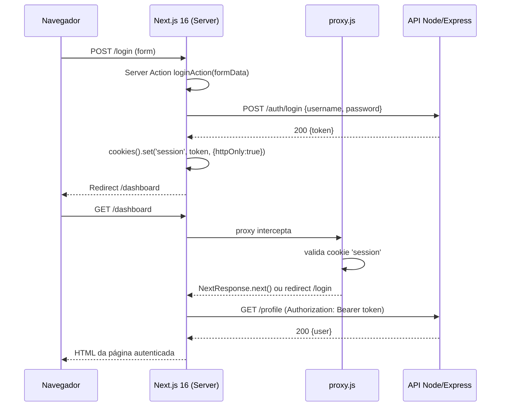

## Autenticação e Autorização com Next.js 16

> **Versões fixadas:** `next@16.2.4`, `react@19.2.4`, `express@5.1.0`, `jsonwebtoken@9.0.2`, `bcryptjs@2.4.3`, `dotenv@16.4.5`, `cors@2.8.5`.

Neste material vamos implementar um fluxo completo de **autenticação** (provar quem você é) e **autorização** (o que você pode fazer) em um app Next.js 16 com **App Router**. Usaremos **JWT (JSON Web Token)** armazenado em um **cookie HttpOnly** — a abordagem mais segura para evitar ataques XSS.



### Responsabilidades

| Camada       | Responsabilidades                                                                                                 |
| ------------ | ----------------------------------------------------------------------------------------------------------------- |
| **Backend**  | Registrar usuários, validar credenciais, emitir JWT, validar JWT em rotas protegidas, aplicar RBAC (roles).       |
| **Next.js**  | Enviar credenciais via Server Action, armazenar token em cookie HttpOnly, anexar token ao fazer chamadas à API, redirecionar usuários não autenticados com `proxy.js`. |

### 1. Backend simples em Node.js (Express 5 + JWT)

> Esta parte fica em um projeto **separado** (ex.: `backend/`). Em produção use um banco de dados real, rate limiting, etc.

#### 1.1. Criar o projeto

```bash
mkdir backend
cd backend
npm init -y
npm install express@5.1.0 jsonwebtoken@9.0.2 bcryptjs@2.4.3 dotenv@16.4.5 cors@2.8.5
```

Edite o `package.json` adicionando `"type": "module"` e um script de start:

```json
{
  "type": "module",
  "scripts": {
    "start": "node server.js"
  }
}
```

#### 1.2. Variável de ambiente

```env
# backend/.env
JWT_SECRET=troque-por-uma-string-aleatoria-longa
PORT=5000
```

#### 1.3. Código do servidor

```js
// backend/server.js
import express from 'express';
import jwt from 'jsonwebtoken';
import bcrypt from 'bcryptjs';
import cors from 'cors';
import 'dotenv/config';

const app = express();
app.use(express.json());
app.use(cors({ origin: 'http://localhost:3000', credentials: true }));

const users = []; // ⚠️ Apenas para demonstração. Use um DB em produção.

function auth(req, res, next) {
  const header = req.headers.authorization ?? '';
  const token = header.startsWith('Bearer ') ? header.slice(7) : null;
  if (!token) return res.status(401).json({ message: 'Token ausente' });

  try {
    req.user = jwt.verify(token, process.env.JWT_SECRET);
    next();
  } catch {
    res.status(401).json({ message: 'Token inválido' });
  }
}

app.post('/auth/register', async (req, res) => {
  const { username, password } = req.body ?? {};
  if (!username || !password) {
    return res.status(400).json({ message: 'Dados insuficientes' });
  }
  if (users.some((u) => u.username === username)) {
    return res.status(409).json({ message: 'Usuário já existe' });
  }
  const hashed = await bcrypt.hash(password, 10);
  users.push({ username, password: hashed, role: 'user' });
  res.status(201).json({ message: 'Usuário criado' });
});

app.post('/auth/login', async (req, res) => {
  const { username, password } = req.body ?? {};
  const user = users.find((u) => u.username === username);
  if (!user) return res.status(401).json({ message: 'Credenciais inválidas' });

  const ok = await bcrypt.compare(password, user.password);
  if (!ok) return res.status(401).json({ message: 'Credenciais inválidas' });

  const token = jwt.sign(
    { sub: user.username, role: user.role },
    process.env.JWT_SECRET,
    { expiresIn: '1h' }
  );
  res.json({ token });
});

app.get('/profile', auth, (req, res) => {
  res.json({ user: req.user });
});

const port = Number(process.env.PORT) || 5000;
app.listen(port, () => console.log(`API on http://localhost:${port}`));
```

Rode com:

```bash
npm start
```

Teste rapidamente:

```bash
curl -X POST http://localhost:5000/auth/register \
  -H 'Content-Type: application/json' \
  -d '{"username":"maria","password":"123456"}'

curl -X POST http://localhost:5000/auth/login \
  -H 'Content-Type: application/json' \
  -d '{"username":"maria","password":"123456"}'
# -> {"token": "eyJhbGciOi..."}
```

### 2. Frontend Next.js 16 (App Router)

#### 2.1. Criar o projeto

```bash
npx create-next-app@16.2.4 web \
  --javascript --tailwind --eslint --src-dir --app --turbopack \
  --import-alias "@/*" --use-npm
cd web
```

#### 2.2. Variáveis de ambiente

```env
# web/.env.local
API_BASE_URL=http://localhost:5000
JWT_SECRET=troque-por-uma-string-aleatoria-longa
```

> - `API_BASE_URL` **sem** `NEXT_PUBLIC_`: só é lida no servidor — perfeito para Server Actions.
> - O `JWT_SECRET` aqui é o **mesmo** do backend, usado apenas no `proxy.js` para validar rapidamente o token sem bater no backend.

#### 2.3. Biblioteca para verificar o JWT no Edge (proxy)

O `proxy.js` roda no **Edge Runtime**, que não tem `node:crypto` completo. Use [`jose`](https://www.npmjs.com/package/jose), uma biblioteca JWT 100% Web Crypto:

```bash
npm install jose@5.9.6
```

#### 2.4. Helpers: `src/lib/session.js`

```js
// src/lib/session.js
import 'server-only';
import { cookies } from 'next/headers';

const COOKIE_NAME = 'session';

export async function setSessionCookie(token) {
  const jar = await cookies();
  jar.set(COOKIE_NAME, token, {
    httpOnly: true,
    secure: process.env.NODE_ENV === 'production',
    sameSite: 'lax',
    path: '/',
    maxAge: 60 * 60, // 1h — alinhado com expiresIn do backend
  });
}

export async function clearSessionCookie() {
  const jar = await cookies();
  jar.delete(COOKIE_NAME);
}

export async function getSessionToken() {
  const jar = await cookies();
  return jar.get(COOKIE_NAME)?.value ?? null;
}
```

> No Next 16, `cookies()`, `headers()` e `draftMode()` são **assíncronos**. Sempre use `await`.

#### 2.5. Chamadas à API autenticadas

```js
// src/lib/api.js
import 'server-only';
import { getSessionToken } from './session';

export async function apiFetch(path, init = {}) {
  const token = await getSessionToken();
  const headers = new Headers(init.headers);
  headers.set('Content-Type', 'application/json');
  if (token) headers.set('Authorization', `Bearer ${token}`);

  const res = await fetch(`${process.env.API_BASE_URL}${path}`, {
    ...init,
    headers,
    cache: 'no-store',
  });
  return res;
}
```

#### 2.6. Server Actions de login/logout/register

```js
// src/actions/auth.js
'use server';

import { redirect } from 'next/navigation';
import { setSessionCookie, clearSessionCookie } from '@/lib/session';

export async function loginAction(prevState, formData) {
  const username = String(formData.get('username') ?? '');
  const password = String(formData.get('password') ?? '');

  const res = await fetch(`${process.env.API_BASE_URL}/auth/login`, {
    method: 'POST',
    headers: { 'Content-Type': 'application/json' },
    body: JSON.stringify({ username, password }),
    cache: 'no-store',
  });

  if (!res.ok) {
    return { error: 'Credenciais inválidas' };
  }

  const { token } = await res.json();
  await setSessionCookie(token);
  redirect('/profile');
}

export async function registerAction(prevState, formData) {
  const username = String(formData.get('username') ?? '');
  const password = String(formData.get('password') ?? '');

  const res = await fetch(`${process.env.API_BASE_URL}/auth/register`, {
    method: 'POST',
    headers: { 'Content-Type': 'application/json' },
    body: JSON.stringify({ username, password }),
    cache: 'no-store',
  });

  if (!res.ok) {
    const { message } = await res.json().catch(() => ({ message: 'Erro' }));
    return { error: message };
  }

  redirect('/login');
}

export async function logoutAction() {
  await clearSessionCookie();
  redirect('/login');
}
```

#### 2.7. Página de login (usa `useActionState`)

```jsx
// src/app/login/page.js
import LoginForm from './login-form';

export default function LoginPage() {
  return (
    <main className="mx-auto max-w-sm p-6">
      <h1 className="mb-4 text-2xl font-bold">Entrar</h1>
      <LoginForm />
    </main>
  );
}
```

```jsx
// src/app/login/login-form.js
'use client';

import { useActionState } from 'react';
import { loginAction } from '@/actions/auth';

export default function LoginForm() {
  const [state, formAction, pending] = useActionState(loginAction, { error: null });

  return (
    <form action={formAction} className="flex flex-col gap-3">
      <input
        name="username"
        placeholder="Usuário"
        required
        className="border p-2 rounded"
      />
      <input
        name="password"
        type="password"
        placeholder="Senha"
        required
        className="border p-2 rounded"
      />
      <button
        type="submit"
        disabled={pending}
        className="bg-blue-600 text-white rounded px-4 py-2 disabled:opacity-50"
      >
        {pending ? 'Entrando…' : 'Entrar'}
      </button>
      {state?.error && <p className="text-red-600">{state.error}</p>}
    </form>
  );
}
```

#### 2.8. Página de registro (análoga ao login)

```jsx
// src/app/register/page.js
'use client';

import { useActionState } from 'react';
import { registerAction } from '@/actions/auth';

export default function RegisterPage() {
  const [state, formAction, pending] = useActionState(registerAction, { error: null });

  return (
    <main className="mx-auto max-w-sm p-6">
      <h1 className="mb-4 text-2xl font-bold">Cadastro</h1>
      <form action={formAction} className="flex flex-col gap-3">
        <input name="username" placeholder="Usuário" required className="border p-2 rounded" />
        <input name="password" type="password" placeholder="Senha" required className="border p-2 rounded" />
        <button
          type="submit"
          disabled={pending}
          className="bg-green-600 text-white rounded px-4 py-2 disabled:opacity-50"
        >
          {pending ? 'Enviando…' : 'Cadastrar'}
        </button>
        {state?.error && <p className="text-red-600">{state.error}</p>}
      </form>
    </main>
  );
}
```

#### 2.9. Página de perfil (Server Component protegido)

```jsx
// src/app/profile/page.js
import { redirect } from 'next/navigation';
import { apiFetch } from '@/lib/api';
import { logoutAction } from '@/actions/auth';

export default async function ProfilePage() {
  const res = await apiFetch('/profile');

  if (res.status === 401) {
    redirect('/login');
  }

  if (!res.ok) {
    throw new Error(`Falha ao carregar perfil: ${res.status}`);
  }

  const data = await res.json();

  return (
    <main className="mx-auto max-w-sm p-6">
      <h1 className="mb-4 text-2xl font-bold">Perfil</h1>
      <pre className="bg-gray-100 p-3 rounded text-sm">
        {JSON.stringify(data.user, null, 2)}
      </pre>

      <form action={logoutAction} className="mt-4">
        <button
          type="submit"
          className="bg-gray-700 text-white rounded px-4 py-2"
        >
          Sair
        </button>
      </form>
    </main>
  );
}
```

#### 2.10. Proteção global de rotas com `proxy.js`

O `proxy.js` (ex-middleware) intercepta requisições **antes** de chegar à rota. É o melhor lugar para redirecionar usuários não autenticados.

```js
// proxy.js (na raiz, mesmo nível do app/)
import { NextResponse } from 'next/server';
import { jwtVerify } from 'jose';

const protectedPaths = ['/profile', '/admin'];
const secret = new TextEncoder().encode(process.env.JWT_SECRET);

export async function proxy(request) {
  const { pathname } = request.nextUrl;
  const needsAuth = protectedPaths.some((p) => pathname === p || pathname.startsWith(p + '/'));
  if (!needsAuth) return NextResponse.next();

  const token = request.cookies.get('session')?.value;
  if (!token) {
    return NextResponse.redirect(new URL('/login', request.url));
  }

  try {
    const { payload } = await jwtVerify(token, secret);

    // Exemplo de autorização por role:
    if (pathname.startsWith('/admin') && payload.role !== 'admin') {
      return NextResponse.redirect(new URL('/profile', request.url));
    }

    return NextResponse.next();
  } catch {
    // Token inválido/expirado — manda para o login limpando o cookie.
    const res = NextResponse.redirect(new URL('/login', request.url));
    res.cookies.delete('session');
    return res;
  }
}

export const config = {
  matcher: ['/profile/:path*', '/admin/:path*'],
};
```

> **Nota:** o `proxy.js` roda no Edge Runtime, que **não suporta `jsonwebtoken`**. Por isso usamos `jose`.

### 3. Por que cookies HttpOnly e não `localStorage`?

| Critério              | `localStorage`                          | Cookie `HttpOnly`                                 |
| --------------------- | --------------------------------------- | ------------------------------------------------- |
| Acessível via JS      | ✅ (→ vulnerável a XSS)                 | ❌ (inacessível ao JS do cliente)                 |
| Enviado automaticamente em fetch | ❌ (precisa `Authorization` manual) | ✅ (em requisições ao mesmo host)            |
| CSRF                  | N/A                                    | ⚠️ Precisa `SameSite=Lax/Strict` + CSRF token em forms clássicos |
| Compatível com Server Components | ❌ (só no cliente)              | ✅ (`cookies()` no servidor)                      |

Para apps Next.js com **App Router + Server Components**, cookies HttpOnly são a única opção que deixa o token disponível **tanto** no servidor (Server Components, Server Actions, Route Handlers, `proxy.js`) quanto no navegador automaticamente. Usamos `SameSite=Lax` para mitigar CSRF; para formulários com mutação via Server Actions, o React já envia um token interno que ajuda a mitigar CSRF.

### 4. Estrutura final do projeto Next

```
web/
├── proxy.js
├── src/
│   ├── actions/
│   │   └── auth.js
│   ├── lib/
│   │   ├── api.js
│   │   └── session.js
│   └── app/
│       ├── layout.js
│       ├── page.js
│       ├── login/
│       │   ├── page.js
│       │   └── login-form.js
│       ├── register/
│       │   └── page.js
│       └── profile/
│           └── page.js
├── .env.local
└── package.json
```

### 5. Testando o fluxo completo

1. Suba o backend: `cd backend && npm start` (porta 5000).
2. Suba o Next.js: `cd web && npm run dev` (porta 3000).
3. Acesse `http://localhost:3000/register` e crie um usuário.
4. Você será redirecionado a `/login`. Autentique-se.
5. Deve cair em `/profile` com os dados do token.
6. Tente abrir `/profile` em uma janela anônima — o `proxy.js` deve redirecionar para `/login`.
7. Clique em **Sair** — o cookie é removido e você volta a `/login`.

### 6. Considerações finais

- **Refresh tokens**: para sessões longas, emita um refresh token separado em outro cookie HttpOnly de maior duração.
- **RBAC**: amplie o `proxy.js` lendo `payload.role` e bloqueando rotas específicas.
- **Auditoria**: logue tentativas de acesso não autorizado no backend.
- **Bibliotecas prontas**: [Auth.js](https://authjs.dev/) (antigo NextAuth) integra com dezenas de provedores e já trata CSRF, refresh tokens e sessões persistentes. Use-a em produção.
- **Data Security**: leia o guia oficial [Next.js Data Security](https://nextjs.org/docs/app/guides/data-security) — sempre re-valide permissões **dentro de cada Server Action** (elas são reachable por POST direto).
