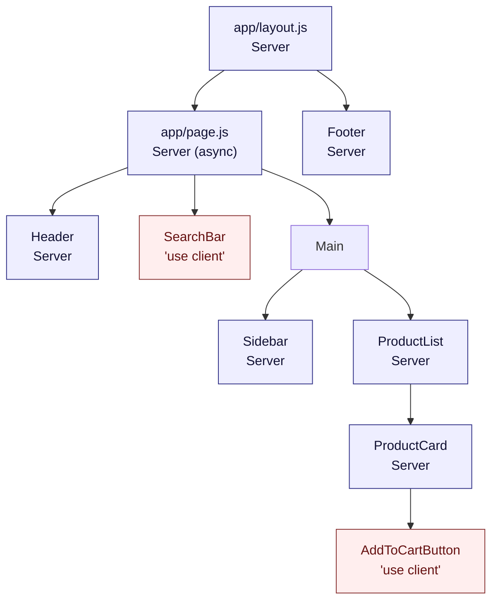

## Home de E-commerce com Next.js 16 (App Router)

> **Versões fixadas:** `next@16.2.4`, `react@19.2.4`, `tailwindcss@4.2.4`, `@tailwindcss/postcss@4.2.4`.

Neste tutorial vamos montar a **tela inicial de um e-commerce** aproveitando ao máximo o Next.js 16:

- **Cabeçalho (Header)** com informações do usuário logado e avatar — otimizado com `next/image`.
- **Rodapé (Footer)** fixo.
- **Menu lateral** de categorias.
- **Barra de busca** (Client Component).
- **Listagem de produtos** em grid — Server Component com filtro por categoria/busca via `searchParams`.

A página principal é um **Server Component** (melhor SEO, zero JS para a parte estática). Apenas os pedaços interativos recebem `'use client'`.



### Passo 1 — Criar o projeto com Tailwind

```bash
npx create-next-app@16.2.4 ecommerce-next \
  --javascript --tailwind --eslint --src-dir --app --turbopack \
  --import-alias "@/*" --use-npm
cd ecommerce-next
```

O template já vem com:

- `tailwindcss@4.x` e `@tailwindcss/postcss@4.x` configurados;
- `postcss.config.mjs` pronto;
- `src/app/globals.css` com `@import "tailwindcss";`.

Não é mais necessário editar `tailwind.config.js` na v4 (o detection de arquivos é automático).

### Passo 2 — Estrutura de arquivos

```
ecommerce-next/
├── public/
│   ├── default-avatar.svg
│   └── images/
│       ├── product-smartphone.jpg
│       ├── product-camisa.jpg
│       └── product-perfume.jpg
├── src/
│   └── app/
│       ├── layout.js
│       ├── page.js
│       ├── globals.css
│       └── _components/
│           ├── Header.js           # Server Component
│           ├── Footer.js           # Server Component
│           ├── Sidebar.js          # Server Component
│           ├── ProductList.js      # Server Component
│           ├── ProductCard.js      # Server Component
│           ├── SearchBar.js        # 'use client'
│           └── AddToCartButton.js  # 'use client'
└── next.config.mjs
```

### Passo 3 — `next.config.mjs`

Se for usar imagens remotas (ex.: Unsplash), libere o host:

```js
// next.config.mjs
/** @type {import('next').NextConfig} */
const nextConfig = {
  images: {
    remotePatterns: [
      { protocol: 'https', hostname: 'images.unsplash.com' },
    ],
  },
};

export default nextConfig;
```

> Dica: se quiser habilitar o **React Compiler** (opcional, ainda experimental), instale `babel-plugin-react-compiler` e adicione `experimental: { reactCompiler: true }` ao config. Não é necessário para este tutorial.

### Passo 4 — Root layout com `next/font`

```jsx
// src/app/layout.js
import './globals.css';
import { Geist } from 'next/font/google';

const geist = Geist({ subsets: ['latin'], variable: '--font-geist' });

export const metadata = {
  title: 'E-commerce Next.js 16',
  description: 'Home de e-commerce com App Router',
};

export default function RootLayout({ children }) {
  return (
    <html lang="pt-BR" className={geist.variable}>
      <body className="min-h-screen flex flex-col bg-gray-50 text-gray-900 font-sans">
        {children}
      </body>
    </html>
  );
}
```

### Passo 5 — Header (Server Component)

`next/image` é ideal aqui: otimização automática, suporte a AVIF/WebP, lazy-load.

```jsx
// src/app/_components/Header.js
import Image from 'next/image';
import Link from 'next/link';

export default function Header({ user }) {
  return (
    <header className="flex items-center justify-between bg-slate-900 px-6 py-4 text-white">
      <Link href="/" className="text-xl font-bold">
        E-commerce
      </Link>

      <div className="flex items-center gap-3">
        <Image
          src={user?.avatar ?? '/default-avatar.svg'}
          alt="Avatar"
          width={40}
          height={40}
          className="rounded-full object-cover"
        />
        <span className="text-sm font-medium">{user?.name ?? 'Visitante'}</span>
      </div>
    </header>
  );
}
```

Crie o avatar padrão em `public/default-avatar.svg`:

```xml
<!-- public/default-avatar.svg -->
<svg xmlns="http://www.w3.org/2000/svg" viewBox="0 0 40 40">
  <circle cx="20" cy="20" r="20" fill="#94a3b8"/>
  <circle cx="20" cy="16" r="7" fill="#f8fafc"/>
  <path d="M6 36c2-7 8-10 14-10s12 3 14 10z" fill="#f8fafc"/>
</svg>
```

### Passo 6 — Sidebar (Server Component)

```jsx
// src/app/_components/Sidebar.js
import Link from 'next/link';

export default function Sidebar({ categories, activeCategory }) {
  return (
    <aside className="w-56 shrink-0 rounded-lg bg-white p-4 shadow-sm">
      <h3 className="mb-3 text-lg font-semibold">Categorias</h3>
      <ul className="flex flex-col gap-1">
        <li>
          <Link
            href="/"
            className={`block rounded px-3 py-2 text-sm hover:bg-slate-100 ${
              !activeCategory ? 'bg-slate-900 text-white hover:bg-slate-800' : ''
            }`}
          >
            Todas
          </Link>
        </li>
        {categories.map((cat) => (
          <li key={cat.slug}>
            <Link
              href={`/?category=${cat.slug}`}
              className={`block rounded px-3 py-2 text-sm hover:bg-slate-100 ${
                activeCategory === cat.slug ? 'bg-slate-900 text-white hover:bg-slate-800' : ''
              }`}
            >
              {cat.name}
            </Link>
          </li>
        ))}
      </ul>
    </aside>
  );
}
```

### Passo 7 — Barra de busca (Client Component)

A busca usa `useRouter` de `next/navigation` para atualizar `?q=...` sem recarregar a página.

```jsx
// src/app/_components/SearchBar.js
'use client';

import { useRouter, useSearchParams } from 'next/navigation';
import { useState, useTransition } from 'react';

export default function SearchBar() {
  const router = useRouter();
  const params = useSearchParams();
  const [query, setQuery] = useState(params.get('q') ?? '');
  const [isPending, startTransition] = useTransition();

  const handleSubmit = (e) => {
    e.preventDefault();
    const nextParams = new URLSearchParams(params);
    if (query) nextParams.set('q', query);
    else nextParams.delete('q');
    startTransition(() => {
      router.push(`/?${nextParams.toString()}`);
    });
  };

  return (
    <form onSubmit={handleSubmit} className="flex items-center gap-2 px-6 py-4">
      <input
        type="text"
        value={query}
        onChange={(e) => setQuery(e.target.value)}
        placeholder="Buscar produtos..."
        className="flex-1 rounded-md border border-gray-300 bg-white px-3 py-2 text-sm"
      />
      <button
        type="submit"
        disabled={isPending}
        className="rounded-md bg-slate-900 px-4 py-2 text-sm font-medium text-white hover:bg-slate-800 disabled:opacity-60"
      >
        {isPending ? 'Buscando…' : 'Buscar'}
      </button>
    </form>
  );
}
```

### Passo 8 — Botão "Adicionar ao carrinho" (Client Component)

Pequeno Client Component só para a interatividade:

```jsx
// src/app/_components/AddToCartButton.js
'use client';

import { useState } from 'react';

export default function AddToCartButton({ productId }) {
  const [added, setAdded] = useState(false);

  return (
    <button
      onClick={() => setAdded(true)}
      className={`mt-2 rounded px-3 py-2 text-sm font-medium text-white transition ${
        added ? 'bg-emerald-600' : 'bg-slate-900 hover:bg-slate-800'
      }`}
      aria-label={`Adicionar produto ${productId} ao carrinho`}
    >
      {added ? 'Adicionado ✓' : 'Adicionar ao carrinho'}
    </button>
  );
}
```

### Passo 9 — Card e lista de produtos (Server Components)

```jsx
// src/app/_components/ProductCard.js
import Image from 'next/image';
import AddToCartButton from './AddToCartButton';

export default function ProductCard({ product }) {
  return (
    <article className="flex flex-col rounded-lg bg-white p-4 shadow-sm">
      <div className="relative mb-3 aspect-[4/3] w-full overflow-hidden rounded-md bg-slate-100">
        <Image
          src={product.image}
          alt={product.name}
          fill
          sizes="(max-width: 768px) 100vw, 33vw"
          className="object-cover"
        />
      </div>
      <h3 className="text-base font-semibold">{product.name}</h3>
      <p className="mb-2 text-sm text-gray-600">
        {product.price.toLocaleString('pt-BR', {
          style: 'currency',
          currency: 'BRL',
        })}
      </p>
      <AddToCartButton productId={product.id} />
    </article>
  );
}
```

```jsx
// src/app/_components/ProductList.js
import ProductCard from './ProductCard';

export default function ProductList({ products }) {
  if (products.length === 0) {
    return <p className="text-gray-600">Nenhum produto encontrado.</p>;
  }

  return (
    <section>
      <h2 className="mb-3 text-xl font-semibold">Produtos</h2>
      <div className="grid grid-cols-1 gap-4 sm:grid-cols-2 lg:grid-cols-3">
        {products.map((product) => (
          <ProductCard key={product.id} product={product} />
        ))}
      </div>
    </section>
  );
}
```

### Passo 10 — Footer (Server Component)

```jsx
// src/app/_components/Footer.js
export default function Footer() {
  return (
    <footer className="mt-auto bg-slate-900 py-4 text-center text-sm text-white">
      &copy; {new Date().getFullYear()} E-commerce. Todos os direitos reservados.
    </footer>
  );
}
```

### Passo 11 — Dados mock + página `/` (Server Component)

Em um app real você buscaria os produtos de uma API/banco. Para o tutorial, usamos um array em memória.

```jsx
// src/app/page.js
import Header from './_components/Header';
import Footer from './_components/Footer';
import Sidebar from './_components/Sidebar';
import SearchBar from './_components/SearchBar';
import ProductList from './_components/ProductList';

const CATEGORIES = [
  { slug: 'eletronicos', name: 'Eletrônicos' },
  { slug: 'roupas', name: 'Roupas' },
  { slug: 'beleza', name: 'Beleza' },
  { slug: 'alimentos', name: 'Alimentos' },
];

const PRODUCTS = [
  {
    id: 1,
    name: 'Smartphone',
    price: 1500,
    category: 'eletronicos',
    image: '/images/product-smartphone.jpg',
  },
  {
    id: 2,
    name: 'Camisa Polo',
    price: 100,
    category: 'roupas',
    image: '/images/product-camisa.jpg',
  },
  {
    id: 3,
    name: 'Perfume',
    price: 200,
    category: 'beleza',
    image: '/images/product-perfume.jpg',
  },
];

// Simulação de busca no servidor — em produção: banco/API.
async function fetchProducts({ category, q }) {
  return PRODUCTS.filter((p) => {
    if (category && p.category !== category) return false;
    if (q && !p.name.toLowerCase().includes(q.toLowerCase())) return false;
    return true;
  });
}

// Simulação de usuário autenticado — em produção: cookies/session.
async function getCurrentUser() {
  return { name: 'João Silva', avatar: null };
}

export default async function Home({ searchParams }) {
  const sp = await searchParams; // Next 15/16: searchParams é Promise.
  const category = typeof sp.category === 'string' ? sp.category : undefined;
  const q = typeof sp.q === 'string' ? sp.q : undefined;

  const [user, products] = await Promise.all([
    getCurrentUser(),
    fetchProducts({ category, q }),
  ]);

  return (
    <>
      <Header user={user} />
      <SearchBar />

      <div className="mx-auto flex max-w-6xl flex-1 gap-6 px-6 pb-8">
        <Sidebar categories={CATEGORIES} activeCategory={category} />
        <div className="flex-1">
          <ProductList products={products} />
        </div>
      </div>

      <Footer />
    </>
  );
}
```

### Passo 12 — Imagens estáticas

Coloque placeholders em `public/images/` (por exemplo, baixe imagens livres ou gere com IA). Qualquer arquivo dentro de `public/` fica acessível pelo caminho a partir da raiz:

```
public/images/product-smartphone.jpg  ->  /images/product-smartphone.jpg
```

Se preferir imagens remotas, use URLs absolutas e o `remotePatterns` configurado no passo 3.

### Passo 13 — Rodar o projeto

```bash
npm run dev
```

Abra `http://localhost:3000`. Teste:

- **Filtrar por categoria**: clique em "Eletrônicos" — a URL vira `/?category=eletronicos` e a lista filtra (tudo no servidor!).
- **Buscar**: digite "cami" e clique em Buscar — a URL vira `/?q=cami` e o Server Component re-renderiza.
- **Adicionar ao carrinho**: clique no botão — o estado local do Client Component muda para "Adicionado ✓".

### Passo 14 — Por que essa arquitetura é mais eficiente?

- **Zero JavaScript para o layout estático** (`Header`, `Sidebar`, `Footer`, `ProductList`, `ProductCard`).
- **O bundle do cliente contém apenas** `SearchBar` e `AddToCartButton`.
- A lista é renderizada no **servidor** — SEO perfeito, FCP rápido.
- Filtros e busca aproveitam `searchParams` → os Server Components re-renderizam com novos dados, mantendo tudo cacheado quando possível.
- `next/image` serve AVIF/WebP automaticamente e evita layout shift (`width/height` ou `fill + sizes`).

### Próximos passos

- **Carrinho compartilhado**: transforme em um Context Client Component ou use Server Actions + cookies.
- **Paginação**: use `searchParams.page` no `fetchProducts`.
- **Detalhe do produto**: crie `src/app/products/[id]/page.js` com `params` assíncrono (ver `3.rotas.md`).
- **Backend real**: troque `fetchProducts` por uma chamada `fetch` cacheada com `next: { revalidate: 60 }` ou `{ tags: ['products'] }`, e revalide em mutações com `revalidateTag`.
- **Checkout**: combine com a autenticação de `5.autenticacao_autorizacao.md`.

### Conclusão

Neste material você viu como montar uma home de e-commerce com:

- **Server Components** para o grosso da UI,
- **Client Components** pequenos e focados,
- **`next/image` e `next/font`** para otimização,
- **`searchParams` assíncrono** para filtros que re-renderizam no servidor,
- **Tailwind CSS v4** para estilização produtiva.

Essa é a arquitetura recomendada pela equipe do Next.js 16 e pela Vercel: entregar rápido, com JS mínimo no cliente.
