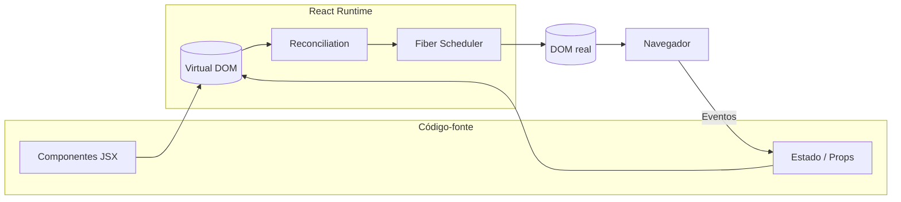
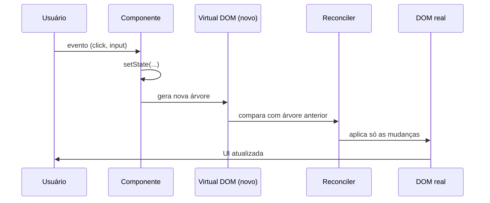

# Conceitos de React (19.x)

## Introdução

React é uma biblioteca JavaScript criada pelo Facebook (atualmente Meta) para construção de interfaces de usuário. Foi lançada em 2013 e tornou-se uma das ferramentas mais usadas no desenvolvimento frontend. Diferente de um framework completo, o React foca na camada de visualização: você define como a interface deve parecer em cada estado da aplicação, e o React cuida da atualização eficiente do DOM.

Com React, você trabalha com **componentes** reutilizáveis e declarativos. Em vez de manipular o DOM diretamente, você descreve a UI em função dos dados (estado e props), e o React atualiza a tela quando esses dados mudam.

A versão estável mais recente é o **React 19**, que trouxe *Actions*, o novo hook `use`, simplificou `ref` (agora é uma prop comum) e introduziu o **React Compiler**, um otimizador que memoriza componentes e valores automaticamente em tempo de build.

---

## Arquitetura em alto nível



O ciclo acima é contínuo: eventos do usuário atualizam estado, o React gera uma nova árvore virtual, compara com a anterior (*reconciliation*) e aplica apenas as diferenças no DOM real.

---

## Por que React?

- **Componentização**: a interface é dividida em blocos independentes e reutilizáveis.
- **Declarativo**: você descreve *o que* deve ser exibido, não *como* alterar o DOM.
- **Ecossistema**: grande comunidade, bibliotecas e ferramentas.
- **Virtual DOM + Fiber**: atualizações eficientes e interrompíveis (o Fiber permite priorizar o que renderizar primeiro).
- **React Compiler (19)**: memorização automática, menos `useMemo`/`useCallback` manuais.
- **Aprendizado progressivo**: comece com HTML/CSS/JS e vá incorporando rotas, estado global, Actions, etc.

---

## Virtual DOM

O React mantém uma representação em memória da árvore do DOM, chamada **Virtual DOM**. Quando o estado ou as props mudam:

1. React gera uma nova árvore virtual.
2. Compara com a árvore anterior (*reconciliation*).
3. Calcula o conjunto mínimo de alterações no DOM real.
4. Aplica apenas essas alterações.



Isso reduz operações custosas no DOM e mantém a interface fluida mesmo com muitas atualizações.

---

## JSX

JSX é uma extensão de sintaxe que permite escrever estruturas parecidas com HTML dentro de JavaScript. O React usa JSX para descrever a interface.

```jsx
const elemento = <h1>Olá, mundo!</h1>;
```

- **Não é HTML**: é transformado em chamadas a `React.createElement` (ou pelo novo JSX runtime). Por isso usamos `className` em vez de `class`, e `htmlFor` em vez de `for`.
- **JavaScript dentro do JSX**: use `{ }` para expressões (variáveis, funções, condicionais).
- **Um elemento raiz**: o retorno de um componente deve ter um único elemento pai (ou um Fragment `<>...</>`).
- **Não é mais necessário `import React from 'react'`** para usar JSX em React 17+ (o Vite configura o *automatic runtime*).

---

## React Compiler

O **React Compiler** (estável desde o React 19) é uma ferramenta opt-in que analisa seus componentes em tempo de build e aplica memorização automática das funções e valores. Isso significa que, na maior parte dos casos, você **não precisa mais usar `useMemo` e `useCallback` manualmente** para evitar re-renderizações desnecessárias.

Para habilitar, adicione o plugin ao Vite/Babel após instalar `babel-plugin-react-compiler`. O curso foca no React "cru" para que você entenda a semântica; o Compiler é uma otimização de mercado, não uma troca conceitual.

---

## Ecossistema atual

- **Vite 8**: ferramenta recomendada para criar e rodar projetos React (rápida, com recarga instantânea).
- **React Router v7**: padrão de fato para roteamento em SPAs.
- **Context API + hooks**: compartilhamento de estado sem bibliotecas externas.
- **Bibliotecas de UI**: Material-UI (MUI), Chakra UI, Ant Design, shadcn/ui.
- **Estado avançado**: Zustand, Jotai, Redux Toolkit.
- **Dados de API**: TanStack Query (React Query), SWR.
- **Frameworks "full-stack" sobre React**: Next.js, Remix (agora integrado ao React Router v7).

---

## Conclusão

React 19 mantém os fundamentos (componentes, props, Virtual DOM e hooks) e adiciona ferramentas modernas: **Actions**, novos hooks (`useActionState`, `useFormStatus`, `useOptimistic`, `use`), simplificação de `ref` e do Provider de Context, além do **React Compiler** para otimização automática. Nos próximos módulos você vai ver cada um desses recursos na prática.
