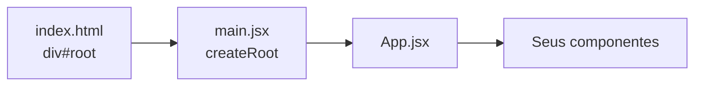

# Tutorial: Primeiro projeto React (19 + Vite 8)

Neste tutorial você vai criar seu primeiro projeto React com **Vite** (ferramenta moderna e rápida recomendada pela documentação oficial), entender a estrutura de pastas e rodar a aplicação no navegador. O projeto usa **React 19**.

> Pré-requisito: Node.js 20.19+ instalado (`node -v`).

## Passo 1: Criar o projeto

No terminal, navegue até a pasta onde deseja criar o projeto e execute:

```bash
npm create vite@latest meu-primeiro-react -- --template react
cd meu-primeiro-react
npm install
```

- `npm create vite@latest` cria um novo projeto Vite (v8).
- `--template react` usa o template oficial com React 19.
- `npm install` instala as dependências.

Verifique, em `package.json`, que `react` e `react-dom` estão na faixa `^19.x`.

## Passo 2: Estrutura de pastas

Após a criação, você terá algo como:

```
meu-primeiro-react/
├── node_modules/    # Dependências (não editar)
├── public/          # Arquivos estáticos (favicon)
├── src/             # Código fonte da aplicação
│   ├── App.jsx      # Componente principal
│   ├── App.css      # Estilos do App
│   ├── main.jsx     # Ponto de entrada (monta o App no DOM)
│   └── index.css    # Estilos globais
├── index.html       # HTML raiz (na raiz do projeto)
├── package.json     # Scripts e dependências do projeto
└── vite.config.js   # Configuração do Vite
```

- **index.html** (na raiz): contém o `<div id="root">` onde o React será montado; o Vite injeta o script de `src/main.jsx`.
- **src/main.jsx**: importa o componente `App` e o renderiza com `createRoot` (API do React 18+/19).
- **src/App.jsx**: componente raiz da aplicação; é aqui que você começa a editar.



## Passo 3: Editar o App.jsx

Abra `src/App.jsx` e substitua o conteúdo por algo simples:

```jsx
function App() {
  return (
    <div className="App">
      <h1>Meu primeiro React 19</h1>
      <p>Se você vê esta mensagem, o projeto está funcionando!</p>
    </div>
  );
}

export default App;
```

- **function App()**: define um componente funcional chamado `App`.
- **return**: retorna JSX (o "HTML" que o React vai exibir).
- **export default App**: permite que outros arquivos importem este componente.

No React 19 não é necessário importar `React` no topo para usar JSX; o *automatic JSX runtime* do Vite cuida disso.

## Passo 4: Executar a aplicação

No terminal, dentro da pasta do projeto:

```bash
npm run dev
```

O servidor de desenvolvimento sobe e o navegador pode ser aberto em `http://localhost:5173` (a URL aparece no terminal). Você verá o título e o parágrafo que colocou no `App.jsx`.

Para gerar o build de produção (vale deixar essa etapa preparada para os próximos tutoriais):

```bash
npm run build
npm run preview
```

## Explicação dos principais elementos

- **Vite**: ferramenta de build moderna que usa ES modules nativos no desenvolvimento; é rápida e a recomendação atual para novos projetos React.
- **npm run dev**: inicia o servidor de desenvolvimento do Vite, com Hot Module Replacement (HMR).
- **React**: a biblioteca que interpreta os componentes e o JSX.
- **createRoot**: em `src/main.jsx`, `createRoot(document.getElementById('root')).render(<App />)` "monta" o React no `<div id="root">` de `index.html`. É a API moderna (substitui o antigo `ReactDOM.render`, que foi removido no React 19).
- **StrictMode**: o `main.jsx` envolve o `App` em `<StrictMode>`; isso ativa verificações e renderiza efeitos duas vezes em desenvolvimento para ajudar a detectar bugs. Em produção é um no-op.

## Próximos passos

No módulo [02 - Componentes](../02-componentes/) você aprenderá a criar e reutilizar componentes, usar props e aplicar **CSS Modules** para estilização seguindo boas práticas.
