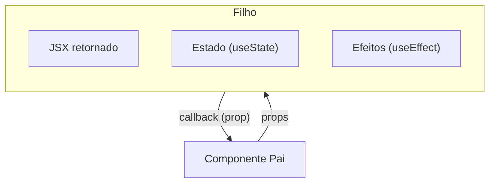
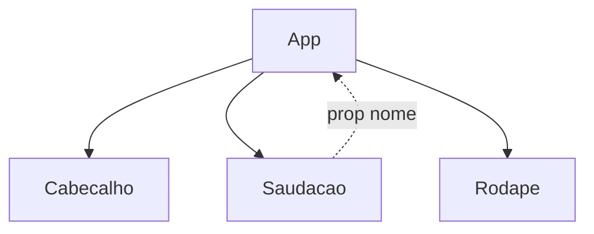

# Conceitos de Componentes

## Introdução

No React, a interface é construída a partir de **componentes**: blocos de código que encapsulam estrutura (JSX), estilo e comportamento. Um componente pode ser reutilizado em vários lugares e composto com outros componentes, formando uma árvore que representa a página.

Componentes podem ser escritos como **funções** (recomendado) ou como **classes**. Neste curso usamos componentes funcionais, que retornam JSX e podem usar hooks para estado e efeitos. Em React 19, componentes funcionais cobrem 100% dos casos de uso — componentes de classe são considerados legado.

---

## O que é um componente?

Um componente é uma função que:

- Recebe dados opcionais via **props** (propriedades) — incluindo agora `ref`, no React 19.
- Retorna elementos React (em geral JSX) que descrevem o que deve aparecer na tela.
- Pode ter estado interno (com `useState` ou outros hooks) e efeitos colaterais (com `useEffect`).

Exemplo:

```jsx
function Saudacao({ nome }) {
  return <p>Olá, {nome}!</p>;
}
```

Aqui `Saudacao` é um componente que recebe a prop `nome` e exibe uma mensagem.

---

## Anatomia de um componente



O componente é uma função pura em relação aos seus inputs (props + estado): para os mesmos inputs, deve retornar o mesmo JSX. O estado e os efeitos permitem que ele reaja a interações do usuário e sincronize com o mundo externo.

---

## Props (propriedades)

**Props** são argumentos passados do componente pai para o filho. São somente leitura: o componente filho não deve alterá-las.

- Passar props: `<Saudacao nome="Maria" />`.
- Receber props: na função, use um parâmetro (objeto) com o nome da prop: `function Saudacao({ nome })`.
- Props podem ser strings, números, arrays, objetos ou até funções (callbacks).

Props permitem que o mesmo componente se comporte de forma diferente em cada uso, tornando-o reutilizável.

### `ref` como prop (novidade do React 19)

Até o React 18, para receber uma `ref` num componente funcional era necessário usar `forwardRef`:

```jsx
// React 18 (ainda funciona, mas não é mais necessário em 19)
const Input = React.forwardRef(function Input(props, ref) {
  return <input ref={ref} {...props} />;
});
```

No **React 19**, `ref` é uma prop comum — você a recebe junto com as demais:

```jsx
// React 19
function Input({ ref, ...props }) {
  return <input ref={ref} {...props} />;
}

// Uso no pai
const inputRef = useRef(null);
<Input ref={inputRef} placeholder="Digite..." />;
```

Isso elimina a camada extra do `forwardRef` e deixa o código mais direto.

---

## Composição

**Composição** é o uso de um componente dentro de outro. Assim você monta a interface como blocos:

```jsx
function App() {
  return (
    <div>
      <Cabecalho />
      <Saudacao nome="João" />
      <Rodape />
    </div>
  );
}
```



- Componentes podem ter **children**: conteúdo colocado entre as tags de abertura e fechamento, acessível pela prop `children`.
- Exemplo: `<Card>Conteúdo aqui</Card>` — dentro de `Card` você usa `props.children`.

Composição evita componentes gigantes e facilita manutenção e testes.

---

## Vantagens de componentizar

1. **Reutilização**: escreva uma vez, use em vários lugares.
2. **Organização**: cada componente com uma responsabilidade clara.
3. **Manutenção**: alterações localizadas em um arquivo.
4. **Testes**: componentes pequenos são mais fáceis de testar.

---

## Estilização em React: boas práticas

No mercado, a estilização em React costuma seguir estas práticas:

- **CSS Modules**: cada componente pode ter um arquivo `.module.css` com o mesmo nome (ex.: `Cabecalho.module.css`). As classes são **escopadas** ao componente: não vazam para outros e não há conflito de nomes. No componente você importa `import styles from './Cabecalho.module.css'` e usa `className={styles.nomeDaClasse}`. O Vite suporta CSS Modules por padrão.
- **Um arquivo de estilo por componente**: mantém a manutenção próxima do JSX.
- **Variáveis CSS (custom properties)**: para cores, espaçamentos e temas, use variáveis em `:root` (ex.: em `index.css`) e referencie com `var(--cor-primaria)`. Assim o tema fica centralizado.
- **Inline styles apenas para valores dinâmicos**: use `style={{ }}` quando o valor vem de estado ou props (ex.: largura de uma barra de progresso). Para layout e aparência fixa, prefira CSS ou CSS Modules.
- **Evitar `!important`**: resolva especificidade com classes mais específicas.
- **Stylesheets com precedência (React 19)**: você pode renderizar `<link rel="stylesheet" href="..." precedence="default" />` dentro de qualquer componente, e o React garante ordem e deduplicação. Útil para libraries que dependem de CSS externo.

No tutorial a seguir você aplicará **CSS Modules** nos componentes.

---

## Conclusão

Componentes e props são a base do React. Você constrói a UI definindo componentes que recebem dados via props e se compõem uns nos outros. Em React 19, `ref` virou uma prop comum e a composição ganhou ainda mais ergonomia. No próximo tutorial você criará vários componentes e praticará props e composição.
