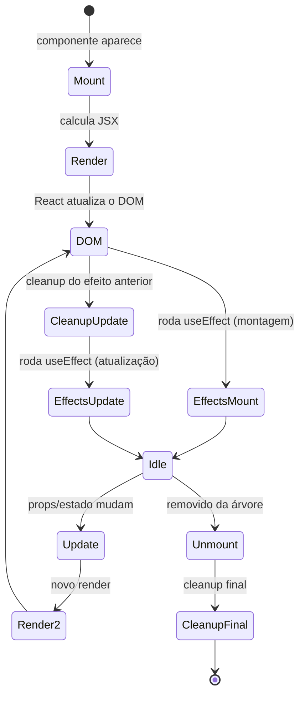

# Ciclo de vida dos componentes React

## Introdução

Todo componente React passa por fases desde o momento em que é exibido na tela até ser removido. Esse fluxo é chamado de **ciclo de vida**. Entender essas fases ajuda a saber quando buscar dados, inscrever-se em eventos ou limpar recursos (timers, listeners, requisições).

Em componentes de **classe**, o ciclo de vida era tratado por métodos como `componentDidMount`, `componentDidUpdate` e `componentWillUnmount`. Em componentes **funcionais** — o padrão no React 19 — o ciclo de vida é trabalhado principalmente através do hook **`useEffect`**, que unifica montagem, atualização e desmontagem em uma API declarativa.

---

## Diagrama das fases



---

## As três fases principais

### 1. Montagem (Mount)

O componente é criado e inserido no DOM pela primeira vez.

- **O que acontece**: React chama sua função, calcula o JSX e atualiza o DOM.
- **Quando usar**: inicializar estado que depende do DOM, fazer requisições à API, registrar listeners (resize, scroll), iniciar timers.
- **No `useEffect`**: use um array de dependências vazio `[]` para rodar apenas na montagem.

```jsx
useEffect(() => {
  fetchDados();
  return () => { /* limpeza ao desmontar */ };
}, []);
```

### 2. Atualização (Update)

O componente já está na tela e algo mudou: **props** ou **estado**.

- **O que acontece**: React re-renderiza o componente (chama a função de novo) e atualiza o DOM conforme necessário.
- **Quando usar**: sincronizar com props/estado (ex.: atualizar título da página quando um contador muda), refazer uma requisição quando um ID muda.
- **No `useEffect`**: inclua no array de dependências as props ou variáveis de estado que devem "disparar" o efeito.

```jsx
useEffect(() => {
  document.title = `Contador: ${count}`;
}, [count]);
```

### 3. Desmontagem (Unmount)

O componente é removido do DOM (ex.: troca de rota, condicional que deixa de renderizá-lo).

- **O que acontece**: React remove o nó do DOM e "desmonta" o componente.
- **Quando usar**: cancelar requisições, remover event listeners, parar timers para evitar vazamento de memória.
- **No `useEffect`**: retorne uma função de **limpeza** (cleanup). O React chama essa função na desmontagem (e, dependendo das dependências, antes de rodar o efeito de novo).

```jsx
useEffect(() => {
  const id = setInterval(() => setCount(c => c + 1), 1000);
  return () => clearInterval(id);
}, []);
```

---

## Resumo: `useEffect` e as fases

| Objetivo | Array de dependências | Função de limpeza |
|----------|------------------------|-------------------|
| Só na montagem | `[]` | Opcional (ideal para subscriptions/timers) |
| Em toda re-renderização | omitido | Opcional |
| Quando X muda | `[x]` | Opcional |

- **Sem array**: o efeito roda após cada render.
- **Array vazio `[]`**: roda uma vez após a primeira render (comportamento de "montagem").
- **Array com valores `[a, b]`**: roda quando `a` ou `b` mudam.
- **Função retornada**: é a "limpeza", usada para desmontagem (e antes da próxima execução do efeito).

### StrictMode no React 19

Em desenvolvimento, o `<StrictMode>` do React **monta, desmonta e remonta cada componente uma vez** para ajudar a detectar efeitos sem cleanup adequado. Se seu `useEffect` se comportar estranho no dev e não em produção, provavelmente falta uma função de limpeza.

---

## Boas práticas

1. **Sempre limpar** quando o efeito registrar listeners, timers ou subscriptions, para evitar memory leaks.
2. **Incluir no array de dependências** todas as variáveis do efeito que vêm do componente (props, estado), a não ser que você tenha certeza de que não quer reexecutar. O ESLint `react-hooks/exhaustive-deps` ajuda.
3. **Evitar efeitos desnecessários**: se o cálculo puder ser feito durante o render, faça no render. Consulte ["You Might Not Need an Effect"](https://react.dev/learn/you-might-not-need-an-effect).
4. **Para buscar dados em componentes compartilhados entre várias telas**, considere bibliotecas como **TanStack Query** (React Query), que gerenciam cache, refetch e estados de loading/error para você.
5. **Novidade React 19**: para ler Promises dentro do render, use o hook `use()` (veja `04-hooks/use.md`) em vez de `useEffect + useState`.

---

## Conclusão

O ciclo de vida em React funcional resume-se a: **montagem** (componente entra em cena), **atualização** (props/estado mudam) e **desmontagem** (componente sai de cena). O **`useEffect`** é a ferramenta para reagir a essas fases e para fazer limpeza. No React 19 surgiram alternativas mais específicas (`use`, Actions) que reduzem o uso de `useEffect` para casos comuns como fetch e submissão de formulários. No módulo [04 - Hooks](../04-hooks/) você verá em detalhe cada hook.
