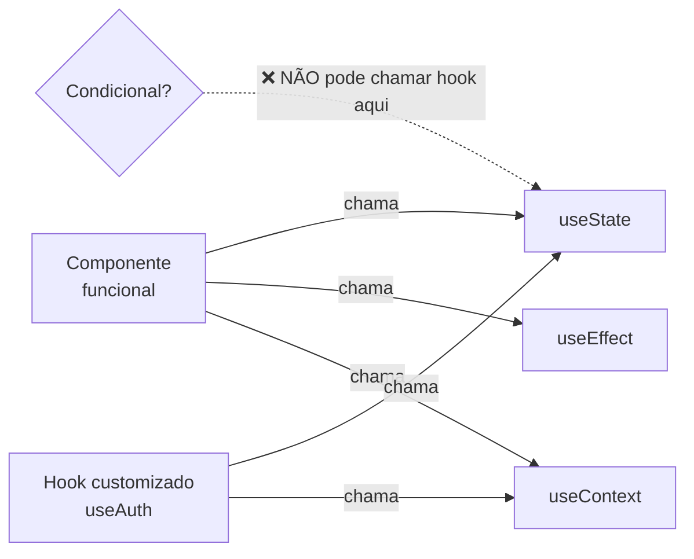
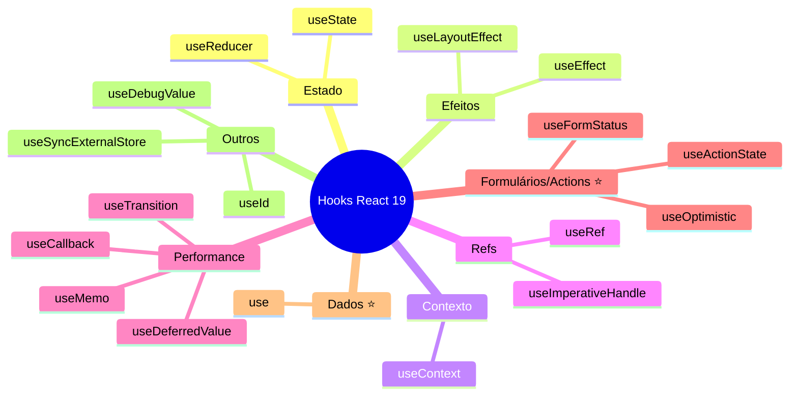

# Introdução aos Hooks (React 19)

## O que são Hooks?

**Hooks** são funções especiais do React que permitem "conectar" recursos como estado, ciclo de vida e contexto a componentes funcionais. Eles foram introduzidos na versão 16.8 (2019) e, no React 19, já cobrem todos os cenários que antes exigiam componentes de classe.

Com os hooks, você continua usando funções e ganha estado, efeitos colaterais, refs, memorização, integração com formulários/Actions e muito mais — tudo de forma consistente e reutilizável.

---

## Por que Hooks?

- **Reutilização de lógica**: lógica de estado ou efeitos pode ser extraída em **hooks customizados** (ex.: `useAuth`, `useFetch`) e reaproveitada em vários componentes.
- **Organização**: em vez de espalhar lógica em `componentDidMount`, `componentDidUpdate` etc., você agrupa por responsabilidade em um ou mais `useEffect`.
- **Menos boilerplate**: sem `this`, sem `bind`, sem classes.
- **Adoção da comunidade**: a documentação oficial e a maioria das bibliotecas assumem componentes funcionais e hooks.

---

## Regras dos Hooks

O React exige que os hooks sejam usados de forma previsível. Duas regras fundamentais:

1. **Chame hooks apenas no nível superior** do componente (fora de loops, condicionais, funções aninhadas). Assim, a ordem das chamadas é a mesma a cada renderização.
2. **Chame hooks apenas em componentes React ou em hooks customizados** (funções que começam com `use` e chamam outros hooks).

> **Exceção**: o novo hook **`use`** (React 19) **pode** ser chamado dentro de `if/else` e loops. Ele é o único hook que se permite esse uso.

Respeitar essas regras garante que o React associe corretamente cada chamada ao estado interno do componente. O ESLint com `eslint-plugin-react-hooks` fiscaliza isso automaticamente.

---

## Mapa dos hooks do React 19

⭐ = novidades do React 19.

---

## Hooks principais

| Hook | Uso principal | Módulo |
|------|----------------|--------|
| `useState` | Estado local (valor + setter) | [useState.md](useState.md) |
| `useEffect` | Efeitos colaterais: fetch, subscriptions, timers, limpeza | [useEffect.md](useEffect.md) |
| `useReducer` | Estado mais complexo com lógica centralizada | [useReducer.md](useReducer.md) |
| `useMemo` | Memorizar um valor calculado | [useMemo.md](useMemo.md) |
| `useCallback` | Memorizar uma função | [useCallback.md](useCallback.md) |
| `useContext` | Consumir um contexto | [useContext.md](useContext.md) |
| **`useActionState`** ⭐ | Estado derivado de uma Action (formulários) | [useActionState.md](useActionState.md) |
| **`useFormStatus`** ⭐ | Ler status do `<form>` pai num componente filho | [useFormStatus.md](useFormStatus.md) |
| **`useOptimistic`** ⭐ | UI otimista durante uma Action assíncrona | [useOptimistic.md](useOptimistic.md) |
| **`use`** ⭐ | Lê Promise ou Context dentro do render | [use.md](use.md) |

Outros hooks úteis: `useRef`, `useImperativeHandle`, `useLayoutEffect`, `useId`, `useTransition`, `useDeferredValue`, `useSyncExternalStore`. Hooks customizados são funções que usam um ou mais desses hooks e encapsulam lógica reutilizável.

---

## Conclusão

Hooks são a base do React moderno. Entender as regras de uso e o papel de cada hook principal permite escrever componentes funcionais poderosos e fáceis de manter. Nos arquivos seguintes você verá a teoria e os casos de uso de cada hook; no [tutorial-hooks.md](tutorial-hooks.md) colocará vários deles em prática em um único exemplo.
