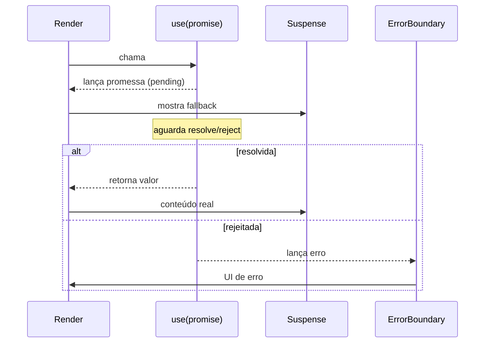

# `use` (React 19)

## Introdução

`use` é uma **API** (tratada como hook, mas tecnicamente mais flexível) introduzida no React 19 para ler o valor de uma **Promise** ou de um **Context** durante a renderização. Diferentemente dos outros hooks, **`use` pode ser chamado dentro de condicionais e loops**.

Assinatura:

```jsx
const value = use(promiseOuContext);
```

- Se recebe uma **Promise**: o React **suspende** o componente até que a promise resolva (integrando com `<Suspense>` e error boundaries).
- Se recebe um **Context**: funciona parecido com `useContext`, mas com a liberdade de ser chamado condicionalmente.

---

## Lendo uma Promise (com Suspense)

```jsx
import { use, Suspense } from 'react';

function Usuario({ usuarioPromise }) {
  const usuario = use(usuarioPromise); // suspende até resolver
  return <h1>Olá, {usuario.nome}!</h1>;
}

function App() {
  const promise = fetch('/api/eu').then((r) => r.json());

  return (
    <Suspense fallback={<p>Carregando usuário…</p>}>
      <Usuario usuarioPromise={promise} />
    </Suspense>
  );
}
```

Pontos importantes:

- A **Promise** deve ser criada **fora** do render (ou em um componente pai "server" / cached), senão o render cria uma nova a cada execução e entra em loop. Em apps cliente puros, use `useMemo` para estabilizar:

  ```jsx
  const promise = useMemo(() => fetch('/api/eu').then((r) => r.json()), []);
  ```

- Se a promise **rejeitar**, o erro propaga para o **ErrorBoundary** mais próximo.
- O `use` combina **naturalmente** com **Server Components** em frameworks como Next.js, onde a promise é criada no servidor e consumida no cliente com `Suspense`.

### Fluxo com Suspense



---

## Lendo um Context

```jsx
import { use, createContext } from 'react';

const TemaCtx = createContext('claro');

function Botao({ importante }) {
  // pode estar dentro de um if — useContext não pode!
  if (importante) {
    const tema = use(TemaCtx);
    return <button data-tema={tema}>Ação</button>;
  }
  return <button>Ação</button>;
}
```

Esta é a grande vantagem sobre `useContext`: `use` respeita a ordem de chamadas **apenas dentro do caminho ativo de render**, permitindo uso condicional.

---

## `use` vs `useContext`

| Cenário | `useContext` | `use` |
|---------|--------------|-------|
| Leitura incondicional de contexto | ✅ Recomendado (mais idiomático) | ✅ Funciona |
| Leitura condicional (if/loop) | ❌ Não pode | ✅ Pode |
| Leitura de Promise | ❌ | ✅ |

Regra prática: use `useContext` sempre que ler incondicionalmente; use `use` quando precisar ler em um ramo condicional ou quando consumir Promises.

---

## Boas práticas

1. **Promises estáveis**: não recrie a cada render. Cache com `useMemo`, em Server Components, ou via libs de dados (TanStack Query, SWR) — que em muitos casos são preferíveis para apps cliente.
2. **Sempre envolva em `<Suspense>`** quando usar com Promise.
3. **Tenha um `ErrorBoundary`** por perto para tratar rejeições.
4. Em apps puramente cliente, para dados de API, **TanStack Query** continua sendo a escolha prática; `use` brilha de verdade em frameworks com Server Components.

---

## Conclusão

`use` é a peça que faltava para integrar Promises e Contexts de forma declarativa no render, aproveitando Suspense e ErrorBoundary. É fundamental para o padrão de Server Components, mas também oferece ganhos em apps cliente quando usado com cuidado.
