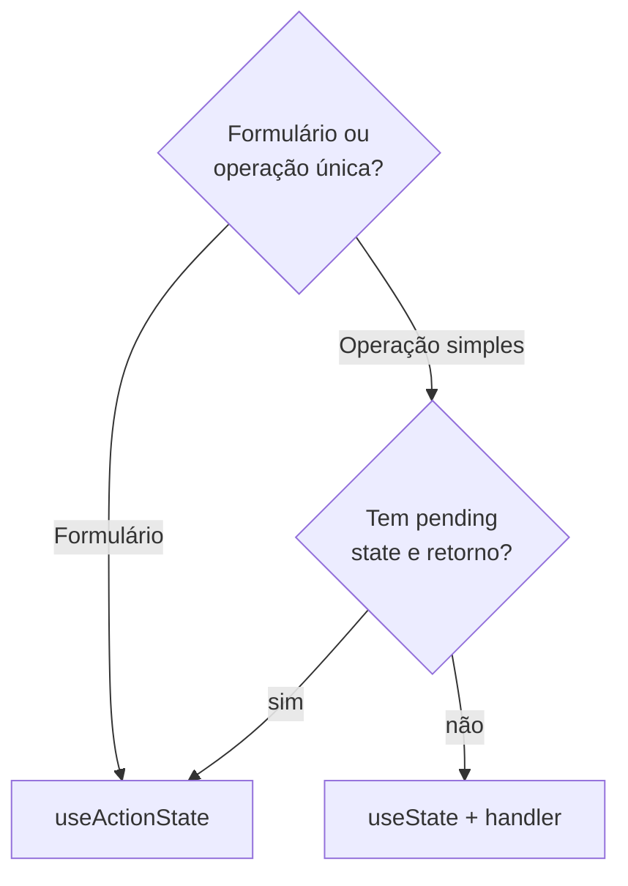

# `useActionState` (React 19)

## Introdução

`useActionState` é um hook do React 19 que conecta uma **Action** (função síncrona ou assíncrona) ao **estado** derivado dela. É a forma moderna de lidar com submissão de formulários, substituindo combinações de `useState` + `useEffect` + `try/catch`.

Assinatura:

```jsx
const [state, formAction, isPending] = useActionState(action, initialState, permalink?);
```

- **`action(previousState, formData)`**: função que recebe o estado anterior e o `FormData` do formulário (ou os argumentos passados ao `formAction`), e retorna o **novo estado**.
- **`initialState`**: valor inicial do estado.
- **`state`**: o valor retornado pela última execução de `action` (ou `initialState` se ainda não houve execução).
- **`formAction`**: função que você passa para `<form action={formAction}>` ou para `<button formAction>`.
- **`isPending`**: `true` enquanto a action está em execução.

---

## Fluxo

```mermaid
sequenceDiagram
    participant User as Usuário
    participant Form as &lt;form action={formAction}&gt;
    participant React as React
    participant Action as action(prev, formData)

    User->>Form: submit
    Form->>React: chama formAction(formData)
    React->>React: isPending = true
    React->>Action: action(previousState, formData)
    Action-->>React: retorna novoState
    React->>React: state = novoState<br/>isPending = false
    React->>User: re-render com novo estado
```

---

## Exemplo: formulário de contato

```jsx
import { useActionState } from 'react';

async function enviar(prevState, formData) {
  const nome = formData.get('nome');
  const email = formData.get('email');

  if (!nome || !email) {
    return { ok: false, erro: 'Preencha todos os campos.' };
  }

  try {
    const res = await fetch('/api/contato', {
      method: 'POST',
      body: JSON.stringify({ nome, email }),
      headers: { 'Content-Type': 'application/json' },
    });
    if (!res.ok) throw new Error('Falha no envio');
    return { ok: true, erro: null };
  } catch (e) {
    return { ok: false, erro: e.message };
  }
}

export default function Contato() {
  const [state, formAction, isPending] = useActionState(enviar, { ok: false, erro: null });

  return (
    <form action={formAction}>
      <input name="nome" placeholder="Nome" />
      <input name="email" type="email" placeholder="Email" />
      <button type="submit" disabled={isPending}>
        {isPending ? 'Enviando…' : 'Enviar'}
      </button>
      {state.erro && <p style={{ color: 'red' }}>{state.erro}</p>}
      {state.ok && <p style={{ color: 'green' }}>Enviado!</p>}
    </form>
  );
}
```

Repare:

- Não usamos `onSubmit` — passamos a ação em `action={formAction}`.
- Não declaramos `useState` para "enviando", "erro" nem para os campos.
- O form é **progressively enhanced**: funciona mesmo antes do JS carregar em frameworks como Next/Remix.

---

## Vantagens

1. **Menos código** em formulários.
2. `isPending` **gratuito**, sem precisar orquestrar com `useState`.
3. Integra-se com Server Actions em frameworks full-stack.
4. Combina com `useFormStatus` (filhos leem o mesmo pending).
5. Combina com `useOptimistic` para UI otimista.

## Limitações

- A action precisa ser **retornadora de estado** (não pode ser `void`). Se retornar `undefined`, o `state` fica `undefined` no próximo render.
- O `formData` é o modo natural; se quiser passar argumentos, chame `formAction(valor)` programaticamente.

---

## Uso sem formulário

Você também pode disparar a action manualmente, passando o argumento direto:

```jsx
const [state, acao, isPending] = useActionState(async (prev, id) => {
  const res = await fetch(`/api/favoritar/${id}`, { method: 'POST' });
  return { favoritos: await res.json() };
}, { favoritos: [] });

return (
  <button onClick={() => acao(42)} disabled={isPending}>
    Favoritar
  </button>
);
```

---

## Quando escolher `useActionState`



Em resumo: sempre que você escreveria `useState` para *loading/error/data* de uma ação específica, troque por `useActionState`.

---

## Conclusão

`useActionState` é a nova forma idiomática de lidar com submissão de formulários no React 19. Ele reduz drasticamente o boilerplate e casa perfeitamente com `<form action>`, `useFormStatus` e `useOptimistic`.
