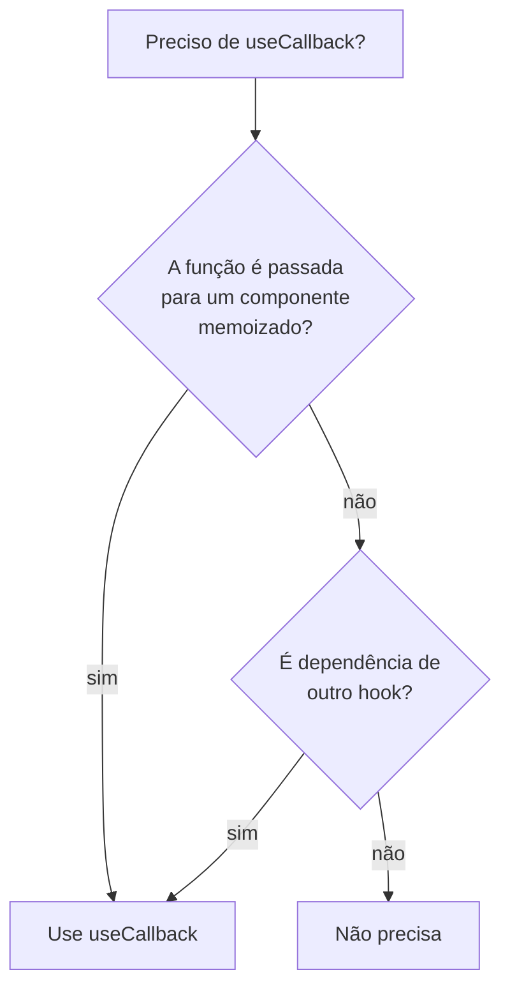

# `useCallback`

## Introdução

`useCallback` memoriza uma **função** entre renderizações, retornando a mesma referência enquanto as dependências não mudarem. Isso é útil quando:

- você passa a função como prop a um filho otimizado com `React.memo`;
- a função é dependência de outro hook (ex.: `useEffect`).

```jsx
import { useCallback, useState } from 'react';

function Pai() {
  const [count, setCount] = useState(0);

  const incrementar = useCallback(() => setCount((c) => c + 1), []);

  return <Filho onClick={incrementar} />;
}

const Filho = React.memo(function Filho({ onClick }) {
  return <button onClick={onClick}>+1</button>;
});
```

Assinatura: `const fn = useCallback((args) => {...}, [deps])`.

Equivale a `useMemo(() => (args) => {...}, [deps])`, com sintaxe mais direta.

---

## Quando usar



Sem um desses dois motivos, **não adicione `useCallback`**: você só está memorizando sem benefício.

---

## Vantagens

1. **Evita recriação** de funções quando as dependências não mudaram.
2. **Mantém filhos memoizados** estáveis (evita re-renders desnecessários).
3. **Estabiliza dependências** em `useEffect`/`useMemo`.

## Desvantagens

1. **Overhead de memorização**: em casos simples, o custo supera o benefício.
2. **Dependências erradas** geram bugs sutis (closure com valor "velho").
3. **Não é otimização mágica**: se o pai re-renderiza por qualquer motivo e o filho **não** é `React.memo`, `useCallback` não ajuda.

---

## React Compiler: a mesma observação de `useMemo`

Com o **React Compiler** ligado (React 19+), a memorização de funções passa a ser automática. A necessidade de `useCallback` manual cai drasticamente. Em bases de código que usam o Compiler, remova `useCallback` cosméticos e mantenha-os apenas quando o profiler apontar ganho.

---

## Casos de uso

### 1. Função passada para `React.memo`

```jsx
const Item = React.memo(function Item({ onRemove, nome }) {
  return (
    <li>
      {nome}
      <button onClick={onRemove}>X</button>
    </li>
  );
});

function Lista({ itens, setItens }) {
  const remover = useCallback((id) => {
    setItens((atual) => atual.filter((i) => i.id !== id));
  }, [setItens]);

  return (
    <ul>
      {itens.map((i) => (
        <Item key={i.id} nome={i.nome} onRemove={() => remover(i.id)} />
      ))}
    </ul>
  );
}
```

> Observação: quando você cria `() => remover(i.id)` no map, a função externa **muda a cada render**. Para ganhar `React.memo` de verdade, passe `remover` direto e deixe o `Item` receber o `id`:

```jsx
<Item key={i.id} item={i} onRemove={remover} />
```

### 2. Dependência estável em `useEffect`

```jsx
const buscar = useCallback(async () => {
  const res = await fetch(`/api/usuarios/${id}`);
  setUsuario(await res.json());
}, [id]);

useEffect(() => {
  buscar();
}, [buscar]);
```

Sem `useCallback`, `buscar` seria uma função nova a cada render e o efeito rodaria em loop.

### 3. Handler em lista grande

Em componentes com muitos filhos memoizados (grids, tabelas), estabilizar handlers costuma trazer ganhos mensuráveis.

---

## `useCallback` vs função inline

Para a maioria dos componentes, `onClick={() => algo()}` é **perfeitamente aceitável** — criar uma função é barato. `useCallback` só compensa quando há memorização do destinatário da função.

---

## Conclusão

`useCallback` é uma ferramenta de otimização pontual: use-a para estabilizar funções passadas a componentes memoizados ou a outros hooks. Sem um desses motivos, deixe as funções inline. Com React Compiler, a necessidade diminui ainda mais.
