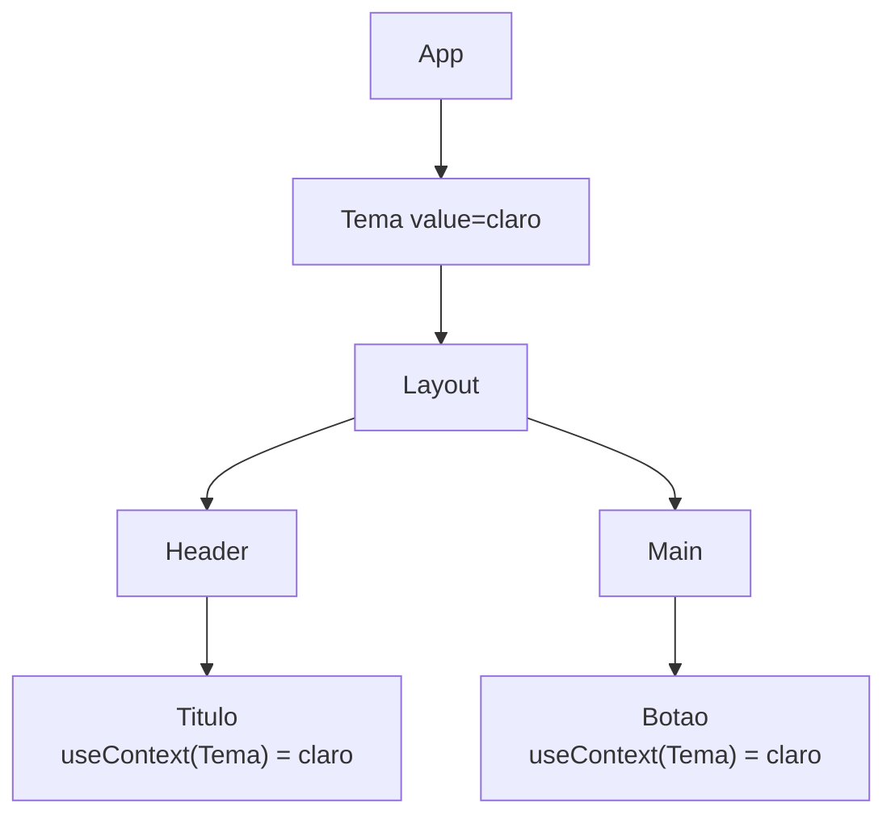

# `useContext`

## Introdução

`useContext` lê o valor de um **Context** no componente atual. Context é a forma nativa do React para compartilhar dados (tema, usuário logado, idioma, etc.) com toda uma subárvore, sem precisar passar props por vários níveis — o chamado **prop drilling**.

```jsx
import { createContext, useContext, useState } from 'react';

const TemaContext = createContext('claro');

function App() {
  const [tema, setTema] = useState('claro');

  return (
    <TemaContext value={tema}>
      <Botao onClick={() => setTema((t) => (t === 'claro' ? 'escuro' : 'claro'))} />
    </TemaContext>
  );
}

function Botao(props) {
  const tema = useContext(TemaContext);
  return <button style={{ color: tema === 'claro' ? '#000' : '#fff' }} {...props}>Tema: {tema}</button>;
}
```

> **Novidade React 19:** você usa `<TemaContext value={...}>` diretamente — sem `.Provider`. O código antigo `<TemaContext.Provider value={...}>` ainda funciona, mas a forma curta é a recomendada.

---

## Como o Context funciona



Quando o `value` do `<TemaContext>` muda, **todos** os componentes que consomem aquele contexto re-renderizam.

---

## Vantagens

1. **Elimina prop drilling**: consumidores acessam o valor diretamente.
2. **Nativo**: não precisa instalar nada.
3. **Combina com `useState`/`useReducer`** para estado global pequeno/médio.
4. **Hooks customizados** (`useAuth`, `useTheme`) tornam o uso ainda mais ergonômico.

## Desvantagens

1. **Re-render em cascata**: mudar o valor re-renderiza todos os consumidores. Separe contextos por domínio (tema, auth, carrinho) para limitar o escopo.
2. **Difícil para estado muito dinâmico** ou grande — considere Zustand, Redux Toolkit ou Jotai.
3. **Dependência do Provider**: usar `useContext` fora do Provider devolve o `defaultValue` — defina um default útil ou verifique com um custom hook.

---

## Padrão recomendado: custom hook + Provider

```jsx
// contexts/AuthContext.jsx
import { createContext, useContext, useState } from 'react';

const AuthContext = createContext(null);

export function AuthProvider({ children }) {
  const [user, setUser] = useState(null);

  const login = (nome) => setUser({ nome });
  const logout = () => setUser(null);

  return (
    <AuthContext value={{ user, login, logout }}>
      {children}
    </AuthContext>
  );
}

export function useAuth() {
  const ctx = useContext(AuthContext);
  if (!ctx) throw new Error('useAuth deve ser usado dentro de <AuthProvider>');
  return ctx;
}
```

```jsx
// Uso
function Header() {
  const { user, logout } = useAuth();
  return user ? (
    <button onClick={logout}>Sair ({user.nome})</button>
  ) : (
    <Link to="/login">Entrar</Link>
  );
}
```

Este padrão:

- centraliza a criação e o consumo;
- impede usar o hook fora do Provider (erro explícito);
- facilita mocks em testes.

---

## Hook `use` (React 19) — alternativa

O novo hook **`use(Context)`** também lê um contexto, mas pode ser chamado **dentro de condicionais e loops**, diferente de `useContext`. Útil quando o acesso ao contexto é opcional:

```jsx
import { use } from 'react';

function Preco({ mostrarImpostos }) {
  if (mostrarImpostos) {
    const { taxa } = use(ImpostosContext); // válido dentro de if!
    // ...
  }
}
```

Veja mais em [use.md](use.md).

---

## Casos de uso comuns

- **Tema (claro/escuro)**
- **Autenticação (usuário + token)**
- **Carrinho de compras**
- **Configurações globais** (idioma, moeda, unidade)
- **Notificações / Toasts**
- **Controle de rotas protegidas** (combinado com React Router)

---

## Exemplo: tema com `<Context>` (React 19)

```jsx
import { createContext, useContext, useState } from 'react';

const TemaCtx = createContext({ tema: 'claro', alternar: () => {} });

export function TemaProvider({ children }) {
  const [tema, setTema] = useState('claro');
  const alternar = () => setTema((t) => (t === 'claro' ? 'escuro' : 'claro'));

  return (
    <TemaCtx value={{ tema, alternar }}>
      {children}
    </TemaCtx>
  );
}

export function useTema() {
  return useContext(TemaCtx);
}
```

```jsx
function BotaoTema() {
  const { tema, alternar } = useTema();
  return <button onClick={alternar}>Mudar (atual: {tema})</button>;
}
```

---

## Conclusão

`useContext` é a ferramenta nativa para compartilhar dados em árvores de componentes. No React 19, a sintaxe ficou mais curta (`<Context value=...>`) e ganhou o hook `use` como alternativa condicional. Para estado global mais complexo, combine com `useReducer` ou migre para uma biblioteca dedicada quando escalar.
