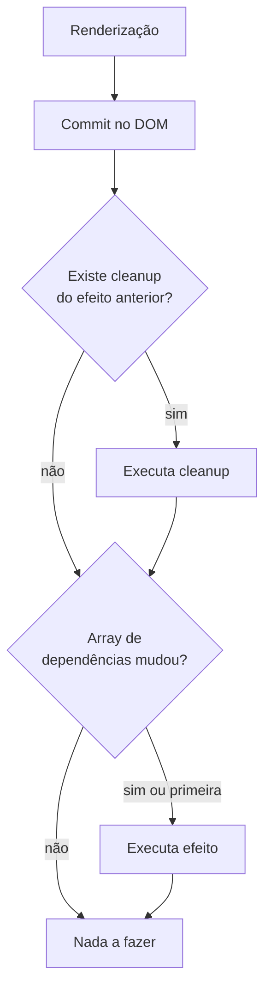

# `useEffect`

## Introdução

O `useEffect` permite rodar **efeitos colaterais** (side effects) em componentes funcionais: sincronizar com APIs externas, ajustar o DOM, assinar eventos, iniciar/parar timers, etc. A documentação oficial deixa claro: `useEffect` é para sincronizar o componente com **sistemas externos** ao React.

```jsx
import { useEffect, useState } from 'react';

function DocTitulo({ contador }) {
  useEffect(() => {
    document.title = `Contador: ${contador}`;
  }, [contador]);

  return <p>Veja a aba do navegador.</p>;
}
```

---

## Anatomia e fluxo



Assinatura: `useEffect(setup, dependencies?)`

- **`setup`**: função que roda após o commit. Pode retornar **outra função** (cleanup) que o React chamará antes do próximo `setup` ou ao desmontar.
- **`dependencies`**:
  - `undefined` (sem array): roda a cada render.
  - `[]`: roda uma vez (na montagem).
  - `[a, b]`: roda quando `a` ou `b` mudam (comparação `Object.is`).

---

## Quando **não** usar `useEffect`

Na [documentação oficial](https://react.dev/learn/you-might-not-need-an-effect) há uma lista de antipadrões comuns:

- **Transformar dados para render** → calcule direto no corpo do componente ou com `useMemo`.
- **Resetar estado quando a prop muda** → use uma `key` no componente.
- **Comunicar com o pai** → chame a callback recebida via props.
- **Buscar dados** em apps maiores → prefira bibliotecas (TanStack Query) ou, no React 19, o hook `use` (no caso de Server Components/frameworks).

`useEffect` deve ser a **última escolha**, reservada para sincronização com algo fora do React (navegador, timers, APIs externas, WebSockets).

---

## Vantagens e desvantagens

**Vantagens:**

1. API unificada para montagem, atualização e desmontagem.
2. Múltiplos efeitos no mesmo componente (separe por responsabilidade).
3. Cleanup previne vazamentos de memória.
4. Declarativo: dependências tornam reexecuções previsíveis.

**Desvantagens / armadilhas:**

1. **Dependências mal declaradas** geram loops ou bugs sutis (use `eslint-plugin-react-hooks`).
2. **Corridas (race conditions)** em fetch exigem flag `ignore` ou `AbortController`.
3. **StrictMode** roda efeitos duas vezes em dev (montar → desmontar → remontar) — você *precisa* ter cleanup.

---

## Padrão recomendado para fetch com cleanup

```jsx
import { useEffect, useState } from 'react';

function Pokemons() {
  const [lista, setLista] = useState([]);
  const [loading, setLoading] = useState(true);
  const [erro, setErro] = useState(null);

  useEffect(() => {
    const controller = new AbortController();

    async function carregar() {
      setLoading(true);
      setErro(null);
      try {
        const res = await fetch('https://pokeapi.co/api/v2/pokemon', {
          signal: controller.signal,
        });
        if (!res.ok) throw new Error(`HTTP ${res.status}`);
        const data = await res.json();
        setLista(data.results);
      } catch (e) {
        if (e.name !== 'AbortError') setErro(e.message);
      } finally {
        setLoading(false);
      }
    }

    carregar();
    return () => controller.abort();
  }, []);

  if (loading) return <p>Carregando…</p>;
  if (erro) return <p>Erro: {erro}</p>;
  return (
    <ul>
      {lista.map((p) => <li key={p.name}>{p.name}</li>)}
    </ul>
  );
}
```

`AbortController.abort()` cancela a requisição pendente se o componente desmontar antes da resposta.

---

## Outros casos de uso

### 1. Atualizar título da página

```jsx
useEffect(() => {
  document.title = `Você tem ${count} notificações`;
}, [count]);
```

> Em React 19, você também pode renderizar `<title>{`Contagem: ${count}`}</title>` diretamente no JSX — o React hoista para o `<head>`.

### 2. Listener global (resize)

```jsx
useEffect(() => {
  const onResize = () => setLargura(window.innerWidth);
  window.addEventListener('resize', onResize);
  return () => window.removeEventListener('resize', onResize);
}, []);
```

### 3. Timer

```jsx
useEffect(() => {
  const id = setInterval(() => setSegundos(s => s + 1), 1000);
  return () => clearInterval(id);
}, []);
```

### 4. Sincronizar `localStorage`

```jsx
useEffect(() => {
  localStorage.setItem('nome', nome);
}, [nome]);
```

### 5. Integração com biblioteca externa (ex.: mapa)

```jsx
useEffect(() => {
  const map = new Mapa(containerRef.current, { center: [0, 0] });
  return () => map.destroy();
}, []);
```

---

## `useEffect` vs `useLayoutEffect`

- **`useEffect`** roda **depois** que o navegador pinta a tela (não bloqueia). Use sempre que possível.
- **`useLayoutEffect`** roda **antes da pintura**, síncrono após o commit. Use apenas quando você precisar medir o DOM e ajustar algo sem flicker.

---

## Conclusão

O `useEffect` é a ferramenta para sincronizar seu componente com o mundo externo. Declare dependências corretamente, limpe recursos no retorno do efeito e evite usá-lo para lógica que pode ser feita no render. Em React 19, muitas situações que antes exigiam `useEffect` (fetch em formulários, status de submissão) são melhor resolvidas por **Actions**, `useActionState` e `use`.
