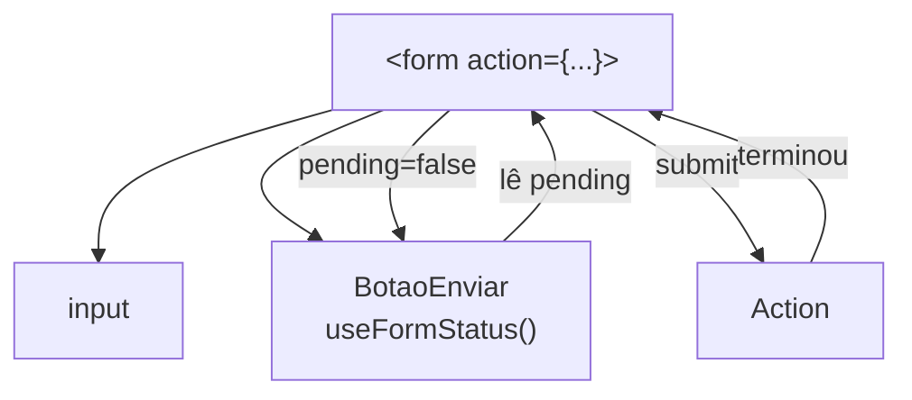

# `useFormStatus` (React 19)

## Introdução

`useFormStatus` é um hook do React 19 — disponível em `react-dom` — que permite que um componente **filho** de um `<form>` leia o status de submissão sem precisar passar props. Ideal para botões de envio, indicadores de progresso e toasts que precisam reagir ao estado do formulário pai.

```jsx
import { useFormStatus } from 'react-dom';

function BotaoEnviar() {
  const { pending, data, method, action } = useFormStatus();
  return (
    <button type="submit" disabled={pending}>
      {pending ? 'Enviando…' : 'Enviar'}
    </button>
  );
}
```

Uso:

```jsx
<form action={minhaAction}>
  <input name="email" />
  <BotaoEnviar />
</form>
```

---

## API

`useFormStatus()` retorna um objeto com:

- **`pending`** (`boolean`): `true` enquanto o form está submetendo.
- **`data`** (`FormData | null`): os dados submetidos na última requisição.
- **`method`** (`'get' | 'post' | null`): método HTTP usado.
- **`action`** (`Function | string | null`): a action executada.

> Importante: chame `useFormStatus` **dentro de um componente filho** do `<form>`. Chamar no mesmo componente que renderiza o `<form>` sempre devolve `pending: false` — o hook só enxerga o form pai mais próximo.

---

## Fluxo



---

## Vantagens

1. **Sem prop drilling** de `isPending` até o botão ou indicador.
2. Funciona em componentes **reutilizáveis** (um `<BotaoEnviar />` genérico).
3. Combina naturalmente com `useActionState`.

## Cuidado

- Exige que o componente esteja dentro de `<form>` com uma `action` — caso contrário, `pending` sempre será `false`.
- É do pacote **`react-dom`** (não de `react`): importe de `'react-dom'`.

---

## Exemplo completo: botão genérico e indicador

```jsx
// components/BotaoEnviar.jsx
import { useFormStatus } from 'react-dom';

export default function BotaoEnviar({ children = 'Enviar' }) {
  const { pending } = useFormStatus();
  return (
    <button type="submit" disabled={pending}>
      {pending ? 'Processando…' : children}
    </button>
  );
}
```

```jsx
// components/BarraProgresso.jsx
import { useFormStatus } from 'react-dom';

export default function BarraProgresso() {
  const { pending } = useFormStatus();
  if (!pending) return null;
  return <progress aria-label="enviando" />;
}
```

```jsx
// pages/Novo.jsx
import { useActionState } from 'react';
import BotaoEnviar from '../components/BotaoEnviar';
import BarraProgresso from '../components/BarraProgresso';

async function criar(prev, formData) {
  await new Promise((r) => setTimeout(r, 800)); // simula rede
  return { ok: true, nome: formData.get('nome') };
}

export default function Novo() {
  const [state, formAction] = useActionState(criar, { ok: false, nome: '' });

  return (
    <form action={formAction}>
      <input name="nome" placeholder="Nome" required />
      <BotaoEnviar>Cadastrar</BotaoEnviar>
      <BarraProgresso />
      {state.ok && <p>Cadastrado: {state.nome}</p>}
    </form>
  );
}
```

---

## Conclusão

`useFormStatus` é o companheiro natural do `useActionState` e do `<form action>`: permite criar componentes filhos reutilizáveis que reagem ao status de envio, sem precisar passar `pending` manualmente como prop.
