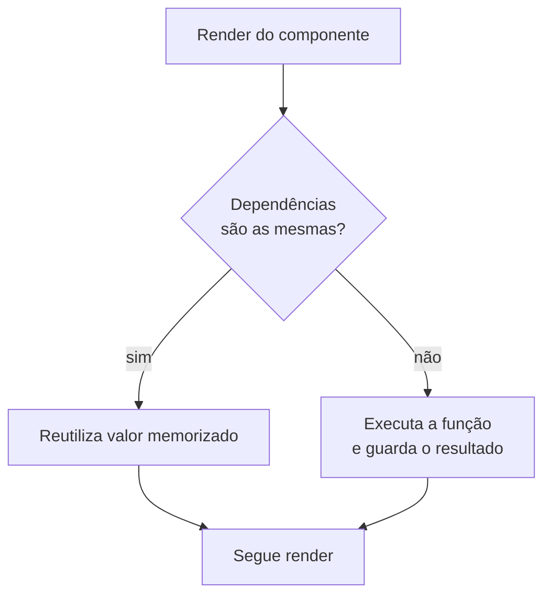

# `useMemo`

## Introdução

`useMemo` memoriza o **resultado de um cálculo** entre renderizações, recalculando apenas quando as dependências mudam. Use quando você tem uma operação cara no render (filtragem/ordenação de listas grandes, transformações pesadas) ou quando precisa estabilizar a identidade de um objeto/array passado como prop.

```jsx
import { useMemo, useState } from 'react';

function Lista({ itens }) {
  const [filtro, setFiltro] = useState('');

  const filtrados = useMemo(() => {
    return itens.filter((i) =>
      i.nome.toLowerCase().includes(filtro.toLowerCase())
    );
  }, [itens, filtro]);

  return (
    <>
      <input value={filtro} onChange={(e) => setFiltro(e.target.value)} />
      <ul>{filtrados.map((i) => <li key={i.id}>{i.nome}</li>)}</ul>
    </>
  );
}
```

Assinatura: `const valor = useMemo(() => calcula(), [dep1, dep2])`.

---

## Fluxo de decisão



---

## Vantagens

1. **Evita recomputação** de cálculos caros.
2. **Estabiliza referências**: um objeto memorizado não é recriado a cada render, o que evita re-render de filhos com `React.memo`.
3. **Composição fácil** com `useCallback` e hooks customizados.

## Desvantagens

1. **Custo de memorização**: guardar o resultado também consome memória/CPU. Para cálculos triviais, não memorize.
2. **Depende de dependências corretas**: esquecer uma dependência gera bugs; incluir demais invalida o cache.
3. **Complexidade**: memorizar tudo tornou-se um mau hábito; meça antes de otimizar.

---

## React Compiler: o jogo mudou

O **React Compiler** (estável no React 19, opt-in via `babel-plugin-react-compiler`) memoriza automaticamente cálculos e valores em seus componentes. Quando ativo, **grande parte dos `useMemo` manuais se tornam desnecessários** — o compilador insere a memorização equivalente em tempo de build.

Recomendação prática:

- Em projetos com Compiler ativo: **não** use `useMemo` proativamente. Use apenas quando um profiler indicar um gargalo específico que o Compiler não resolveu.
- Em projetos sem Compiler: use `useMemo` em cálculos demonstradamente caros ou para estabilizar referências passadas a `React.memo`.

---

## Casos de uso

### 1. Filtragem/ordenação de listas grandes

```jsx
const ordenados = useMemo(
  () => [...itens].sort((a, b) => a.nome.localeCompare(b.nome)),
  [itens]
);
```

### 2. Cálculos matemáticos pesados

```jsx
const primos = useMemo(() => calcularPrimos(n), [n]);
```

### 3. Estabilizar objeto/array para `React.memo` ou dependência de hook

```jsx
const opcoes = useMemo(() => ({ locale: 'pt-BR', currency: 'BRL' }), []);

useEffect(() => {
  formatarMoeda(valor, opcoes);
}, [valor, opcoes]);
```

Sem o `useMemo`, `opcoes` seria um objeto novo a cada render e o efeito rodaria infinitamente.

### 4. Derivar valor do estado

Prefira **calcular direto no render** para valores leves:

```jsx
// ❌ Desnecessário para algo trivial
const dobro = useMemo(() => valor * 2, [valor]);

// ✅ Simples e suficiente
const dobro = valor * 2;
```

---

## `useMemo` vs `useCallback`

- `useMemo(fn, deps)` retorna o **valor** que `fn()` produz.
- `useCallback(fn, deps)` retorna a **própria função** `fn` memorizada (equivale a `useMemo(() => fn, deps)`).

Use `useCallback` quando precisa passar uma função estável para um filho memorizado ou como dependência de outro hook.

---

## Conclusão

`useMemo` é útil para estabilizar referências e evitar cálculos caros. Com o React Compiler, a maior parte desses usos é automatizada — reserve o hook para otimizações medidas. Sempre declare dependências corretamente e evite memorizar o que não precisa.
