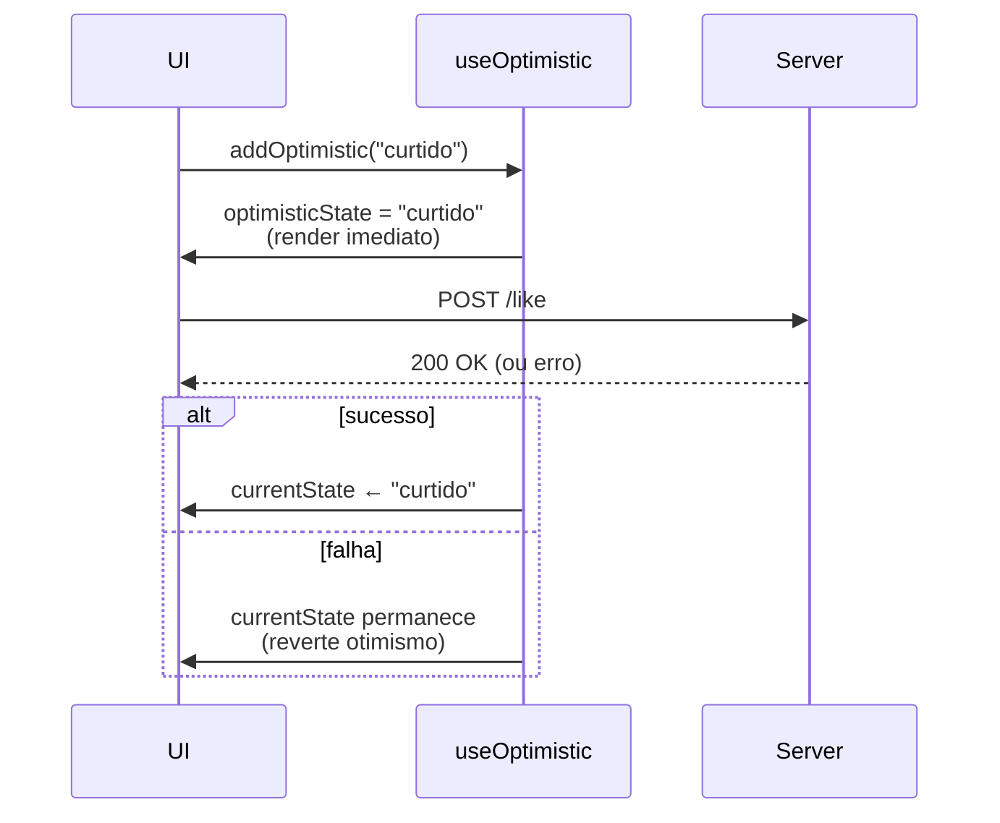

# `useOptimistic` (React 19)

## Introdução

`useOptimistic` é um hook do React 19 que permite exibir um **estado otimista** durante uma Action assíncrona: a UI "finge" que a operação já terminou, e o React reverte automaticamente ao estado real quando a Action retorna (ou falha).

```jsx
const [optimisticState, addOptimistic] = useOptimistic(currentState, updateFn);
```

- **`currentState`**: o estado "real" (ex.: vindo de uma prop ou do retorno de `useActionState`).
- **`updateFn(currentState, optimisticValue) => newState`**: função pura que produz o estado otimista.
- **`optimisticState`**: o estado que você renderiza enquanto a Action está em andamento.
- **`addOptimistic(value)`**: dispara o estado otimista com `value`.

Só pode ser chamado **dentro de uma Action** (função passada a `<form action>` ou chamada dentro de `startTransition`).

---

## Por que otimismo?

Sem otimismo, o usuário clica em "Curtir" e espera o servidor responder para ver o coração vermelho. Com otimismo, o coração muda **instantaneamente**; se o servidor falhar, o React reverte sozinho.



---

## Exemplo: lista de mensagens

```jsx
import { useOptimistic, useState, useRef } from 'react';

async function enviarMensagem(texto) {
  await new Promise((r) => setTimeout(r, 800));
  return { id: crypto.randomUUID(), texto };
}

export default function Chat() {
  const [mensagens, setMensagens] = useState([]);
  const [otimistas, addOptimistic] = useOptimistic(
    mensagens,
    (current, nova) => [...current, { ...nova, enviando: true }]
  );
  const formRef = useRef(null);

  async function acao(formData) {
    const texto = formData.get('texto');
    addOptimistic({ id: 'temp-' + Date.now(), texto });
    formRef.current?.reset();
    const salva = await enviarMensagem(texto);
    setMensagens((m) => [...m, salva]);
  }

  return (
    <>
      <ul>
        {otimistas.map((m) => (
          <li key={m.id} style={{ opacity: m.enviando ? 0.5 : 1 }}>
            {m.texto} {m.enviando && <small>(enviando…)</small>}
          </li>
        ))}
      </ul>

      <form ref={formRef} action={acao}>
        <input name="texto" required />
        <button type="submit">Enviar</button>
      </form>
    </>
  );
}
```

O item aparece imediatamente na lista com opacidade reduzida; quando `setMensagens` atualiza com a mensagem real, o estado otimista é descartado e o item passa a ser renderizado "de verdade".

---

## Quando usar

- Curtir/favoritar (toggle instantâneo).
- Adicionar item a uma lista (chat, todos, comentários).
- Marcar tarefa como concluída.
- Qualquer operação em que a latência percebida é o gargalo da experiência.

## Quando **não** usar

- Operações que precisam do retorno do servidor para exibir algo (ex.: ID gerado, link de pagamento).
- Fluxos em que a falha requer ação imediata do usuário (ex.: pagamento) — prefira deixar claro que está processando.

---

## Conclusão

`useOptimistic` torna a UI mais ágil sem esforço: você descreve como o estado "parecerá" enquanto a Action roda, e o React reverte se algo der errado. Combine com `useActionState`, `useFormStatus` e Server Actions para formulários que parecem instantâneos.
