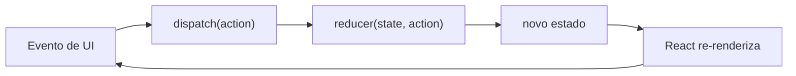

# `useReducer`

## Introdução

`useReducer` é um hook para gerenciar **estados complexos** ou com **muitas ações** em componentes funcionais. A ideia vem do padrão *reducer* popularizado pelo Redux: uma função pura `(state, action) => novoState` concentra toda a lógica de atualização.

```jsx
import { useReducer } from 'react';

const initial = { count: 0 };

function reducer(state, action) {
  switch (action.type) {
    case 'incrementar':
      return { count: state.count + 1 };
    case 'decrementar':
      return { count: state.count - 1 };
    case 'reset':
      return initial;
    default:
      throw new Error(`Ação desconhecida: ${action.type}`);
  }
}

function Contador() {
  const [state, dispatch] = useReducer(reducer, initial);

  return (
    <div>
      <p>{state.count}</p>
      <button onClick={() => dispatch({ type: 'incrementar' })}>+</button>
      <button onClick={() => dispatch({ type: 'decrementar' })}>-</button>
      <button onClick={() => dispatch({ type: 'reset' })}>Reset</button>
    </div>
  );
}
```

---

## Fluxo



O **reducer deve ser puro**: mesma entrada produz mesma saída, sem efeitos colaterais.

---

## Quando usar

Prefira `useReducer` (em vez de `useState`) quando:

1. O estado tem **muitos campos relacionados** (ex.: formulário grande).
2. As atualizações seguem **várias regras** ou dependem do estado anterior de forma complexa.
3. Você quer **testar** a lógica de atualização isoladamente (a função `reducer` é testável sem React).
4. Faz sentido expor o `dispatch` via Context para que componentes distantes disparem ações, sem "prop drilling" de vários setters.

### Combinando com Context

```jsx
const DispatchCtx = createContext(null);

function Provider({ children }) {
  const [state, dispatch] = useReducer(reducer, initial);
  return (
    <StateCtx value={state}>
      <DispatchCtx value={dispatch}>
        {children}
      </DispatchCtx>
    </StateCtx>
  );
}
```

> No React 19 você usa `<StateCtx value={...}>` diretamente, sem `.Provider`.

---

## Vantagens e desvantagens

**Vantagens:**

- Lógica **centralizada** e explícita.
- **Testabilidade**: a função `reducer` é pura.
- **Semelhança com Redux** (se você já conhece, a curva é curta).
- **Dispatch estável**: a referência nunca muda, ótimo para passar como prop.

**Desvantagens:**

- **Mais verboso** para estados simples.
- Pode ser overkill em componentes pequenos.
- Requer disciplina para manter a função pura.

---

## Casos de uso comuns

### 1. Formulário com muitos campos

```jsx
const initial = { nome: '', email: '', aceitou: false };

function formReducer(state, action) {
  switch (action.type) {
    case 'campo':
      return { ...state, [action.campo]: action.valor };
    case 'reset':
      return initial;
    default:
      return state;
  }
}

function Form() {
  const [form, dispatch] = useReducer(formReducer, initial);

  const onChange = (e) =>
    dispatch({
      type: 'campo',
      campo: e.target.name,
      valor: e.target.type === 'checkbox' ? e.target.checked : e.target.value,
    });

  return (
    <form>
      <input name="nome" value={form.nome} onChange={onChange} />
      <input name="email" value={form.email} onChange={onChange} />
      <label>
        <input name="aceitou" type="checkbox" checked={form.aceitou} onChange={onChange} />
        Aceito os termos
      </label>
      <button type="button" onClick={() => dispatch({ type: 'reset' })}>Reset</button>
    </form>
  );
}
```

### 2. Estados de requisição (loading/success/error)

```jsx
const initial = { loading: false, data: null, error: null };

function fetchReducer(state, action) {
  switch (action.type) {
    case 'start':   return { ...state, loading: true, error: null };
    case 'success': return { loading: false, data: action.payload, error: null };
    case 'error':   return { loading: false, data: null, error: action.error };
    default:        return state;
  }
}
```

### 3. Carrinho de compras, listas com múltiplas operações, máquinas de estado simples.

---

## `useReducer` vs `useActionState` (React 19)

Se o seu reducer existe **apenas para gerenciar o estado resultante de uma submissão de formulário**, avalie o **`useActionState`** (veja [useActionState.md](useActionState.md)). Ele já integra *pending state*, funciona com `<form action={...}>` e reduz código.

Para lógica de estado geral (não ligada a formulários), `useReducer` continua sendo a escolha certa.

---

## Conclusão

`useReducer` brilha em estados complexos com muitas ações ou lógica centralizada. Mantenha o reducer puro, use `dispatch` via Context quando precisar disparar ações em vários lugares, e combine com `useActionState` nos formulários do React 19.
