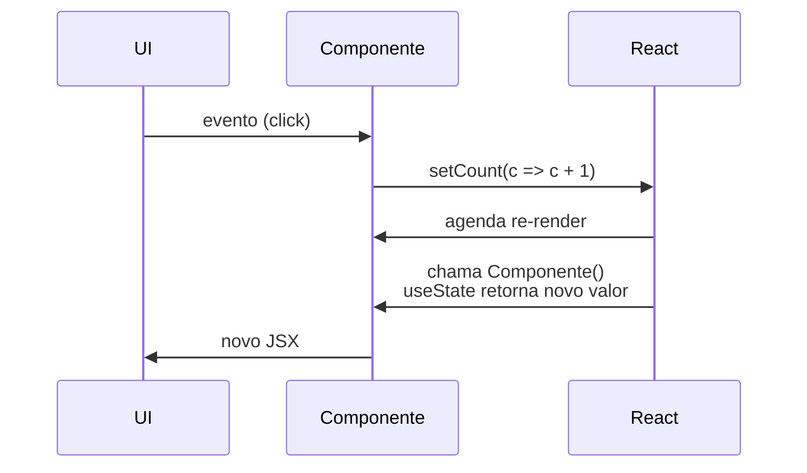

# `useState`

## Introdução

O `useState` é um dos hooks fundamentais do React: ele permite declarar **estado local** em um componente funcional. Antes da sua introdução (React 16.8), estado era privilégio dos componentes de classe, que usavam `this.setState`.

```jsx
import { useState } from 'react';

function Contador() {
  const [count, setCount] = useState(0);

  return (
    <button onClick={() => setCount(c => c + 1)}>
      Cliques: {count}
    </button>
  );
}
```

`useState(valorInicial)` devolve um array com **dois elementos**: o valor atual e uma função para atualizá-lo.

---

## Como funciona



Observações importantes:

- O **valor retornado é imutável dentro daquele render**. `setCount(5)` não altera `count` imediatamente; apenas agenda uma re-renderização com o novo valor.
- Passe uma **função** para o setter quando o novo valor depender do anterior: `setCount(c => c + 1)`. Isso evita bugs em atualizações em série.
- Se o valor inicial for caro de calcular, passe uma função: `useState(() => calcularPesado())`. Assim ele só roda na primeira render.

---

## Vantagens

1. **Sintaxe simples e declarativa** — o estado fica junto do componente.
2. **Isolado por componente**: cada componente tem seu próprio estado.
3. **Combina com outros hooks** (`useEffect`, `useContext`, custom hooks).
4. **Estado imutável**: você substitui, não muta — facilita depuração e compatibilidade com `React.memo`/Compiler.

## Desvantagens / limites

1. **Estados complexos**: com muitos campos relacionados, considere `useReducer`.
2. **Re-renderizações**: toda atualização re-renderiza o componente. Para objetos grandes, divida em pedaços ou memorize com seletores.
3. **Escopo local**: para compartilhar entre componentes, use `useContext`, Zustand, Redux etc.

---

## Casos de uso

- **Inputs de formulário** (controlled components).
- **Flags booleanas**: modal aberto, accordion expandido, carregando.
- **Contadores e indicadores simples.**
- **Estado temporário** de UI: mensagens de erro, confirmações.

### Exemplo com objeto

Para objetos, lembre-se de **substituir** (não mutar):

```jsx
const [form, setForm] = useState({ nome: '', email: '' });

const onChange = (e) => {
  const { name, value } = e.target;
  setForm(prev => ({ ...prev, [name]: value })); // espalhe o anterior
};
```

### Lazy initializer

```jsx
const [itens, setItens] = useState(() => {
  const salvo = localStorage.getItem('itens');
  return salvo ? JSON.parse(salvo) : [];
});
```

A função só roda na primeira render, evitando ler `localStorage` em toda re-renderização.

---

## `useState` vs `useReducer`

| Use `useState` quando... | Use `useReducer` quando... |
|--------------------------|-----------------------------|
| Estado é simples (número, booleano, string) | Estado tem vários campos relacionados |
| Poucas formas de atualizar | Muitas ações diferentes |
| Lógica de atualização trivial | Lógica centralizada, útil para testes |

---

## Conclusão

O `useState` é a ferramenta primária para estado local em componentes funcionais. É simples, previsível e compõe bem com os demais hooks. Para estado com muitas ações ou lógica centralizada, avalie o `useReducer`; para estado compartilhado, passe para Context ou uma lib de estado global.
