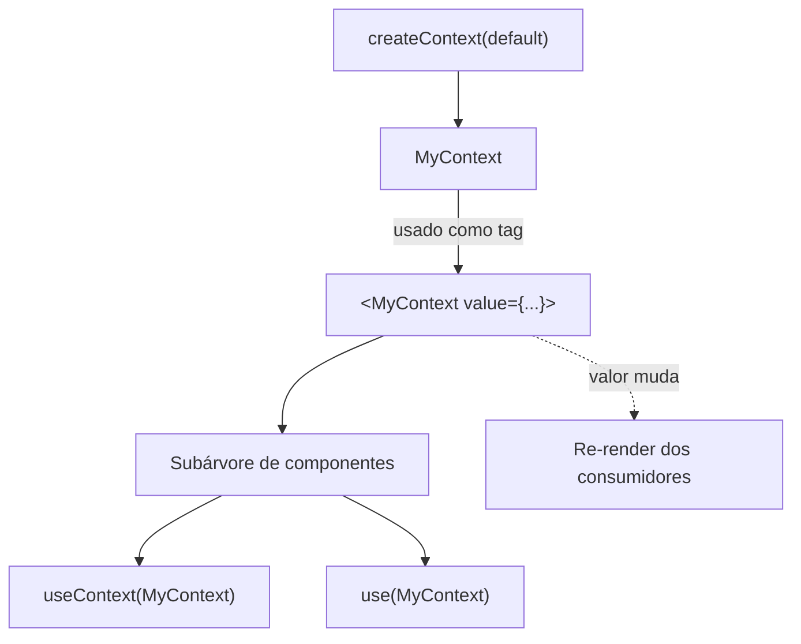
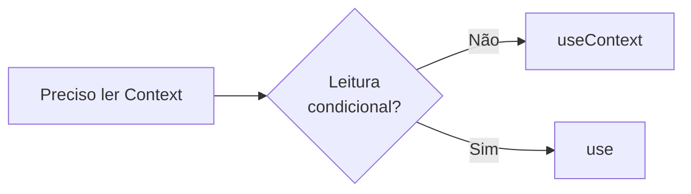

# Context API e padrões de estado (React 19)

## Introdução

A **Context API** do React permite fornecer dados (e funções) para toda uma subárvore de componentes sem precisar passar props manualmente em cada nível. Junto com o hook `useContext` (ou o novo `use`), ela é a ferramenta nativa mais usada para estado "global" em aplicações React de tamanho pequeno a médio.

No **React 19**, a sintaxe do Provider foi simplificada: `<MyContext value={...}>` substitui `<MyContext.Provider value={...}>`.

---

## Como funciona



1. **`createContext(defaultValue)`**: cria o contexto com um valor padrão (usado quando não há Provider acima).
2. **Provider**: `<MyContext value={...}>` envolve a subárvore.
3. **Consumir**: `useContext(MyContext)` retorna o valor atual. `use(MyContext)` faz o mesmo, mas pode ser chamado em condicionais.

Qualquer mudança no `value` do Provider faz com que **todos** os componentes que consomem aquele contexto re-renderizem. Por isso não misture, no mesmo contexto, dados que mudam em frequências muito diferentes.

---

## Padrões de uso

### 1. Contexto com `useState` no Provider

O Provider mantém o estado com `useState` (ou `useReducer`) e passa valor + funções de atualização no `value`. Os consumidores usam `useContext`/`use` para ler e atualizar.

```jsx
const TemaCtx = createContext({ tema: 'claro', alternar: () => {} });

export function TemaProvider({ children }) {
  const [tema, setTema] = useState('claro');
  const alternar = () => setTema((t) => (t === 'claro' ? 'escuro' : 'claro'));
  return (
    <TemaCtx value={{ tema, alternar }}>
      {children}
    </TemaCtx>
  );
}
```

### 2. Múltiplos contextos

Em vez de um único contexto gigante, use vários contextos menores (`ThemeContext`, `AuthContext`, `CartContext`). Assim, uma mudança de tema não re-renderiza quem só consome o carrinho.

### 3. Custom hook para o contexto

Em vez de expor o contexto diretamente, crie um hook `useTema()` que chama `useContext(TemaCtx)` e valida que o Provider existe.

```jsx
export function useTema() {
  const ctx = useContext(TemaCtx);
  if (!ctx) throw new Error('useTema deve ser usado dentro de <TemaProvider>');
  return ctx;
}
```

Esse padrão:

- centraliza o consumo;
- impede uso fora do Provider (erro explícito);
- facilita mocks em testes e refatorações.

### 4. Separar estado e dispatch

Para estado complexo, separe estado (leitura) e dispatch (ações) em dois contextos. Componentes que só disparam ações não re-renderizam quando só o estado muda.

```jsx
const StateCtx = createContext(null);
const DispatchCtx = createContext(null);

export function Provider({ children }) {
  const [state, dispatch] = useReducer(reducer, initial);
  return (
    <StateCtx value={state}>
      <DispatchCtx value={dispatch}>
        {children}
      </DispatchCtx>
    </StateCtx>
  );
}
```

---

## Vantagens e limitações

**Vantagens:**

- Vem com o React; não precisa de bibliotecas.
- Sintaxe simples com hooks (e ainda mais curta no React 19).
- Excelente para tema, auth, idioma, preferências.

**Limitações:**

- Todos os consumidores re-renderizam quando `value` muda. Para estado muito grande ou que muda muito, considere **Zustand** ou **Redux Toolkit**.
- Context **não é um substituto** para cache de dados de API — para isso, use **TanStack Query**.

---

## `useContext` vs `use`



- `useContext`: forma clássica, aceita apenas no nível superior.
- `use`: aceita em `if`/`for`; também lê Promises. Novidade do React 19.

---

## Conclusão

A Context API com `useContext` (ou `use`) é a base para gerenciamento de estado compartilhado em React sem dependências externas. Usar múltiplos contextos, custom hooks e (quando preciso) separar estado/dispatch mantém o código organizado. No [tutorial-estado.md](tutorial-estado.md) você implementará um tema e um estado de "usuário logado" com a nova sintaxe do React 19.
