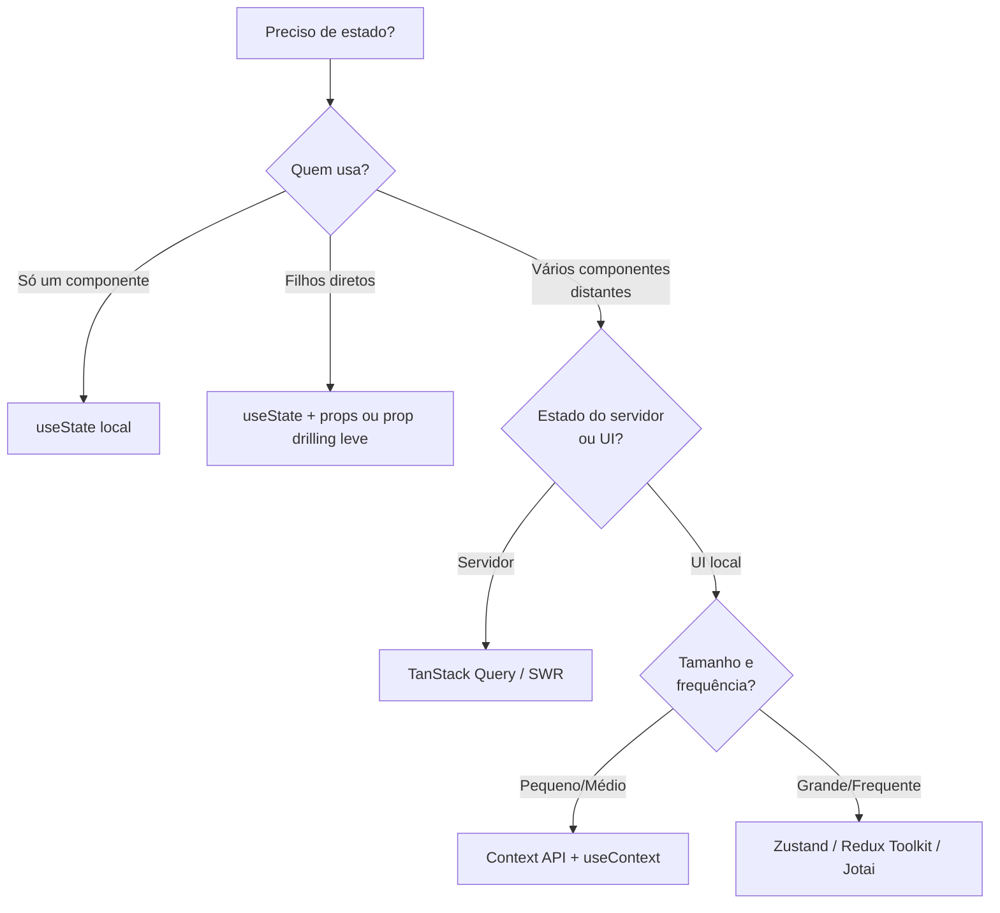

# Estado local vs estado global

## Introdução

Em toda aplicação React, dados que mudam ao longo do tempo são representados por **estado**. Decidir onde esse estado deve viver — em um único componente (local) ou compartilhado por vários (global) — é fundamental para manter o código previsível e fácil de manter.

---

## Estado local

**Estado local** é aquele que pertence a um único componente e é usado apenas por ele (e eventualmente por seus filhos via props).

- **Onde usar**: inputs de formulário, modais abertos/fechados, accordion expandido, dados carregados que só uma tela usa.
- **Como implementar**: `useState` (ou `useReducer`) dentro do componente. Em formulários com Actions (React 19), prefira `useActionState`.
- **Vantagens**: isolamento, sem risco de efeitos colaterais em outras partes da árvore, fácil de entender.

Exemplo: o valor de um campo de busca usado só na mesma página deve ser estado local.

---

## Estado global (compartilhado)

**Estado global** é aquele que precisa ser acessado por vários componentes em níveis diferentes da árvore, sem passar props por muitos níveis (prop drilling).

- **Onde usar**: usuário logado, tema (claro/escuro), idioma, carrinho de compras, notificações globais.
- **Como implementar**:
  - **Context API** (`createContext` + `<Context value={...}>` + `useContext`) — ótimo para casos simples/médios.
  - **Zustand**, **Jotai**, **Redux Toolkit** — para cenários maiores, com muitas ações, DevTools, middlewares.
  - **TanStack Query** (para estado **do servidor**, como listas que vêm da API) — ele gerencia cache, revalidação e estados de loading/error por você.
- **Cuidados**: quando o contexto muda, todos os consumidores re-renderizam; para estado que muda com muita frequência ou é muito grande, considere dividir contextos ou usar uma lib de estado.

---

## Árvore de decisão

Regra prática: **comece com estado local**; só promova para global quando mais de um ramo da árvore precisar do mesmo dado ou quando prop drilling ficar incômodo.

---

## Quando usar cada um

| Situação | Recomendação |
|----------|--------------|
| Dado usado só no componente ou nos filhos diretos | Estado local (`useState`/`useReducer`) |
| Formulário com Actions no React 19 | `useActionState` + `useFormStatus` |
| Dado usado em várias telas | Estado global (Context ou lib) |
| Formulário com muitos campos e lógica complexa | Local com `useReducer` ou React Hook Form |
| Usuário autenticado, tema, preferências | Global (Context é suficiente na maioria) |
| Lista/detalhe vindos de API e usados em várias telas | **TanStack Query** (estado de servidor) |
| Estado que muda muito ou é muito grande | Zustand, Jotai ou Redux Toolkit |

---

## Estado do servidor vs estado do cliente

Um erro comum é guardar dados de API em `useState` + `useEffect` e depois tentar sincronizar manualmente. Ferramentas como **TanStack Query** distinguem **estado do servidor** (cache, refetch, invalidação) do **estado do cliente** (UI, formulários). Em aplicações reais, essa separação reduz muito o código.

---

## Conclusão

Estado local resolve a maioria dos casos; estado global deve ser usado com critério para evitar complexidade e re-renders desnecessários. No próximo arquivo veremos a Context API e padrões de uso no React 19 — incluindo a nova sintaxe `<Context value={...}>`.
